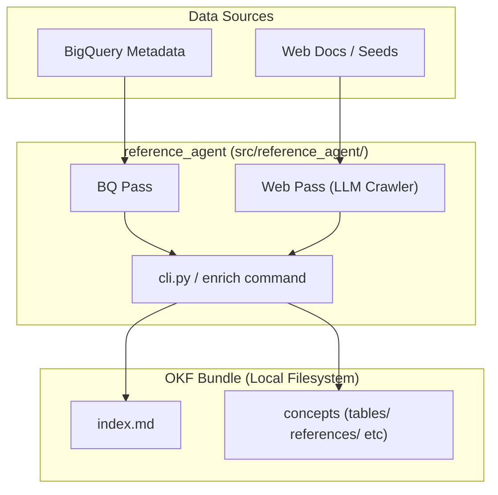
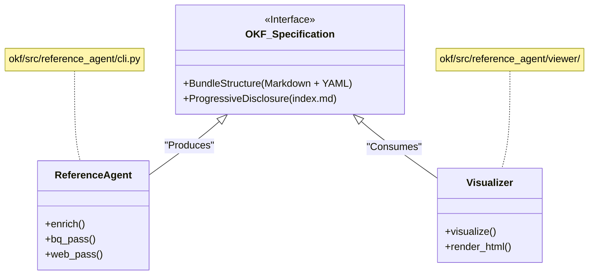

<!-- DeepWiki TOC/H1 drift: TOC title "OKF Specification" matched original payload H1 "4.1. OKF Specification" from raw/pages/4.1-okf-specification.html. External baseline only; verify against repos/knowledge-catalog/. -->

# 4.1. OKF Specification

<details>
<summary>Relevant source files</summary>

The following files were used as context for generating this wiki page:

- [okf/README.md](okf/README.md)
- [okf/bundles/ga4/index.md](okf/bundles/ga4/index.md)
- [okf/bundles/stackoverflow/index.md](okf/bundles/stackoverflow/index.md)
- [okf/pyproject.toml](okf/pyproject.toml)

</details>


The **Open Knowledge Format (OKF)** v0.1 is a universal, vendor-neutral specification for representing knowledge as plain Markdown files with YAML frontmatter. It is designed to be machine-readable for AI agents while remaining fully accessible to humans. OKF bridges the gap between raw technical metadata (e.g., table schemas) and human-centric business context (e.g., project goals, data lineage, and usage policies).

The primary goal of OKF is to enable "Metadata as Code" (MaC) workflows where documentation is treated as a version-controlled artifact, allowing for automated enrichment, validation, and synchronization across different catalog providers [okf/README.md:8-14]().

### 1. Bundle Structure and Design Rationale

An OKF bundle is a directory-based structure that encapsulates a cohesive set of knowledge. The format favors Markdown for content and YAML for structured metadata (frontmatter), ensuring that the files remain human-readable and easily editable in standard IDEs while being parsable by automated tools [okf/README.md:39-45]().

#### Bundle Layout
A standard OKF bundle follows a hierarchical directory structure to allow for progressive disclosure [okf/README.md:65-67]():
*   `index.md`: The entry point and navigation hub for the bundle [okf/bundles/ga4/index.md:1-6]().
*   `log.md`: (Optional) A historical record of changes and agentic operations.
*   `datasets/`: Directory containing documentation for dataset-level containers [okf/bundles/ga4/index.md:3-3]().
*   `tables/`: Directory containing individual documentation files for data tables [okf/bundles/ga4/index.md:5-5]().
*   `references/`: Directory for cross-cutting documentation, enumerated types, or external definitions [okf/bundles/stackoverflow/index.md:4-4]().

#### Design Rationale
*   **Vendor Neutrality**: OKF is not tied to any particular agent framework (Google ADK, LangChain) or serving system (Dataplex, Collibra) [okf/README.md:8-11]().
*   **Version Control**: Bundles live in Git, enabling pull requests, line-by-line diffs, and review workflows for knowledge curation [okf/README.md:46-48]().
*   **Portability**: A bundle is just a directory of files that can be shipped as a tarball or hosted on any static file server [okf/README.md:49-52]().
*   **Graph-Shaped**: Concepts link to each other via standard Markdown links, expressing relationships richer than simple parent/child hierarchies [okf/README.md:68-70]().

**Sources:**
* [okf/README.md:8-74]()
* [okf/bundles/ga4/index.md:1-6]()
* [okf/bundles/stackoverflow/index.md:1-6]()

### 2. Concept Documents and Required Frontmatter

Every Markdown file within the subdirectories (e.g., `tables/`) is a "Concept Document." These documents provide the semantic "flesh" to the "bones" of technical metadata.

#### Required Frontmatter Fields
Each Concept Document includes a YAML frontmatter block. This structured data allows for querying and indexing while the Markdown body remains for prose [okf/README.md:53-56]().

| Field | Description |
| :--- | :--- |
| `type` | The entry type (e.g., `table`, `dataset`, `reference`). |
| `resource` | The physical resource path (e.g., BigQuery table ID). |
| `tags` | A list of labels for filtering. |
| `timestamp` | The last updated time of the documentation. |

#### Markdown Body
The body of the document contains detailed prose, schemas, and example queries. Because it is standard Markdown, it can be rendered by tools like Obsidian, MkDocs, or the built-in OKF visualizer [okf/README.md:61-64]().

**Sources:**
* [okf/README.md:53-64]()

### 3. Index and Navigation Conventions

#### index.md
The `index.md` file serves as a directory index. It uses a specific format to list subdirectories and files, providing a summary for each to help agents navigate without loading the entire bundle into context [okf/README.md:65-67]().

Example structure from `okf/bundles/ga4/index.md`:
```markdown
# Subdirectories

* [datasets](datasets/index.md) - A sample of obfuscated Google Analytics...
* [references](references/index.md) - This directory contains specifications...
* [tables](tables/index.md) - Contains Google Analytics event export data...
```

**Sources:**
* [okf/bundles/ga4/index.md:1-6]()
* [okf/README.md:65-67]()

### 4. Link and Citation Semantics

OKF implements a strict linking syntax to maintain a navigable knowledge graph.

*   **Internal Links**: Links between concepts use standard Markdown syntax pointing to relative paths: `[Table Name](../tables/table_id.md)`.
*   **External Citations**: Documentation generated by agents (like the `reference_agent`) can cite web sources. The agent fetches URLs and enriches concepts based on authoritative documentation [okf/README.md:96-102]().

**Sources:**
* [okf/README.md:68-70]()
* [okf/README.md:96-102]()

### 5. Data Flow: From Source to OKF Bundle

The following diagram illustrates how the `reference_agent` (the proof-of-concept producer) transforms raw data sources into a structured OKF bundle.

**OKF Synthesis Pipeline**

**Sources:**
* [okf/README.md:92-105]() (Agent passes and web crawler logic)
* [okf/pyproject.toml:21-22]() (CLI entry point)

### 6. Mapping OKF to Code Entities

The OKF specification is implemented by the `reference_agent` and consumed by the `visualize` tool.

**Specification to Implementation Mapping**

**Sources:**
* [okf/README.md:22-25]() (Agent and Visualizer roles)
* [okf/README.md:149-155]() (Visualize subcommand)
* [okf/pyproject.toml:27-28]() (Package data for templates)

### 7. Design Rationale: Portability and Collaboration

By maintaining a format independent of proprietary APIs, OKF ensures:
1.  **Human-and-Agent Collaboration**: Humans and LLMs collaborate on the same artifacts (Markdown) using the same tools (Git) [okf/README.md:72-74]().
2.  **Zero Lock-in**: No proprietary SDK is required to read a bundle; `cat` or any text editor suffices [okf/README.md:43-45]().
3.  **Extensibility**: Bundles can carry arbitrary extra frontmatter keys or body sections without breaking standard consumers [okf/README.md:57-60]().

**Sources:**
* [okf/README.md:37-74]() (Why OKF section)