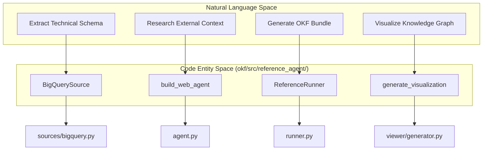
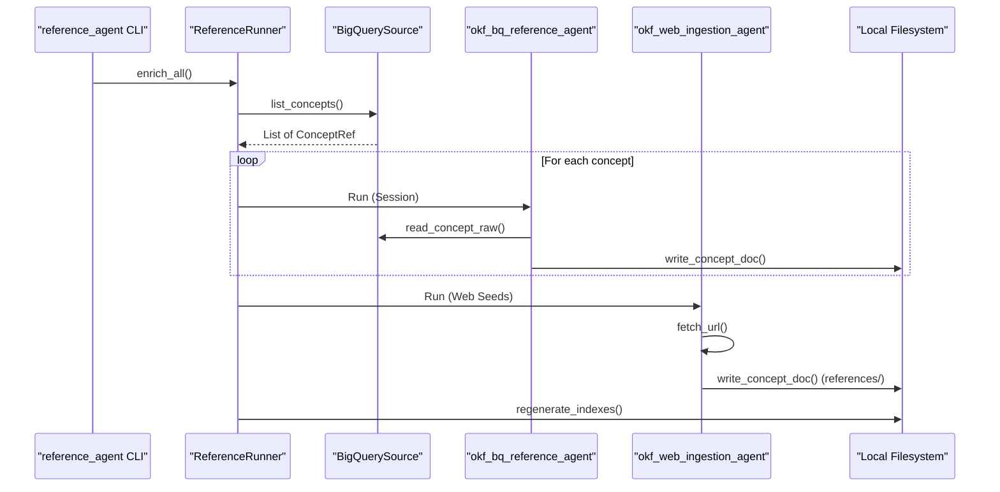

# OKF Reference Enrichment Agent

<details>
<summary>Relevant source files</summary>

The following files were used as context for generating this wiki page:

- [okf/src/reference_agent/__init__.py](okf/src/reference_agent/__init__.py)
- [okf/src/reference_agent/__main__.py](okf/src/reference_agent/__main__.py)
- [okf/src/reference_agent/agent.py](okf/src/reference_agent/agent.py)
- [okf/src/reference_agent/bundle/synthesizer.py](okf/src/reference_agent/bundle/synthesizer.py)
- [okf/src/reference_agent/cli.py](okf/src/reference_agent/cli.py)
- [okf/src/reference_agent/runner.py](okf/src/reference_agent/runner.py)
- [okf/src/reference_agent/sources/bigquery.py](okf/src/reference_agent/sources/bigquery.py)
- [okf/src/reference_agent/viewer/generator.py](okf/src/reference_agent/viewer/generator.py)

</details>


The OKF Reference Enrichment Agent is a Python-based implementation designed to automate the creation of Open Knowledge Format (OKF) bundles. It bridges the gap between raw technical metadata (from sources like BigQuery) and rich, human-readable documentation by orchestrating a multi-stage pipeline that includes data extraction, web-based research, and LLM-driven synthesis using the Google ADK (Agent Development Kit).

## Pipeline Architecture

The agent operates through a structured pipeline that transitions from data extraction to knowledge synthesis. It is designed to process specific "bundles" of information, such as the Google Analytics 4 (GA4) sample, Stack Overflow datasets, or Bitcoin blockchain data.

### Data Flow and Components

The enrichment process follows a two-pass architecture managed by the `ReferenceRunner` [okf/src/reference_agent/runner.py:155-168]():

1.  **The BigQuery Pass**: The `BigQuerySource` extracts schema information, table previews, and technical metadata from BigQuery datasets [okf/src/reference_agent/sources/bigquery.py:29-57](). The `okf_bq_reference_agent` uses tools like `list_concepts`, `read_concept_raw`, and `sample_rows` to gather technical context [okf/src/reference_agent/agent.py:27-39]().
2.  **The Web Pass**: The `okf_web_ingestion_agent` uses the `fetch_url` tool to crawl external documentation, blog posts, or official guides [okf/src/reference_agent/agent.py:42-54](). It adheres to strict limits on hop depth and allowed hosts [okf/src/reference_agent/runner.py:123-152]().
3.  **Bundle Synthesis**: As the agents run, they invoke `write_concept_doc` to commit Markdown files to the local filesystem [okf/src/reference_agent/tools/bundle_tools.py:24-40](). Finally, the agent regenerates directory indexes and summarizes contents [okf/src/reference_agent/bundle/index.py:11-25]().

### System Mapping: Natural Language to Code

The following diagram maps high-level enrichment concepts to the specific Python classes and modules in the `okf/src/reference_agent/` directory.

**Enrichment Agent Component Map**


**Sources:**
- [okf/src/reference_agent/agent.py:27-54]() (Agent factory functions)
- [okf/src/reference_agent/runner.py:155-215]() (Orchestration logic)
- [okf/src/reference_agent/sources/bigquery.py:29-45]() (BigQuery source implementation)
- [okf/src/reference_agent/viewer/generator.py:139-150]() (Visualization entry point)

---

## Core Components

### BigQuerySource
The `BigQuerySource` is responsible for "grounding" the agent in the actual data [okf/src/reference_agent/sources/bigquery.py:29-31]().
*   **Schema Inspection**: Retrieves column names, types, and descriptions using the BigQuery Python client [okf/src/reference_agent/sources/bigquery.py:121-153]().
*   **Shard Detection**: Automatically groups sharded tables (e.g., `events_20230101`) into a single "family" concept using regex [okf/src/reference_agent/sources/bigquery.py:10-11](), [okf/src/reference_agent/sources/bigquery.py:75-101]().
*   **Data Sampling**: Fetches representative rows to provide the LLM with concrete examples of the values stored in the tables [okf/src/reference_agent/sources/bigquery.py:181-185]().

### Bundle Synthesizer
The `synthesize_description` function acts as a utility to summarize directory contents [okf/src/reference_agent/bundle/synthesizer.py:26-31](). It takes a list of child titles and descriptions and uses a Gemini model to produce a concise, one-sentence summary for the OKF `index.md` files [okf/src/reference_agent/bundle/synthesizer.py:7-18]().

### Visualize Subcommand
The agent includes a `visualize` command [okf/src/reference_agent/cli.py:145-148]() that parses a local OKF bundle and generates a self-contained HTML graph view [okf/src/reference_agent/viewer/generator.py:139-144]().
*   **Link Extraction**: It uses regex to find Markdown links (`.md`) within document bodies to build the graph edges [okf/src/reference_agent/viewer/generator.py:48-66]().
*   **Type Palette**: Assigns specific colors to nodes based on their OKF `type` (e.g., BigQuery Table vs. Reference) [okf/src/reference_agent/viewer/generator.py:13-17]().

**Execution Flow: Research to Synthesis**


**Sources:**
- [okf/src/reference_agent/runner.py:211-215]() (Runner entry point)
- [okf/src/reference_agent/sources/bigquery.py:58-73]() (Concept listing)
- [okf/src/reference_agent/agent.py:27-54]() (Agent definitions)
- [okf/src/reference_agent/bundle/index.py:11-25]() (Index regeneration)

---

## Running the Agent against Sample Bundles

The agent is designed to run against specific BigQuery datasets to generate OKF documentation.

### Supported Samples
| Sample Bundle | Source Data Type | CLI Source Argument |
| :--- | :--- | :--- |
| **GA4** | BigQuery (Export) | `--source bq --dataset <project>.<dataset>` |
| **Stack Overflow** | BigQuery (Public) | `--source bq --dataset bigquery-public-data.stackoverflow` |
| **Bitcoin** | BigQuery (Public) | `--source bq --dataset bigquery-public-data.crypto_bitcoin` |

### Execution Workflow

1.  **Run Enrichment**:
    Execute the agent by specifying the source, dataset, and output directory.
    ```bash
    python3 -m reference_agent enrich \
      --source bq \
      --dataset my-project.my_ga4_dataset \
      --out ./my-ga4-bundle \
      --web-seed https://support.google.com/analytics/answer/7029846
    ```
    [okf/src/reference_agent/cli.py:63-143]()

2.  **Visualization**:
    Generate the interactive HTML graph for the resulting bundle.
    ```bash
    python3 -m reference_agent visualize --bundle ./my-ga4-bundle
    ```
    [okf/src/reference_agent/cli.py:145-161]()

**Sources:**
- [okf/src/reference_agent/cli.py:63-143]() (Enrich command flags)
- [okf/src/reference_agent/cli.py:145-161]() (Visualize command flags)
- [okf/src/reference_agent/runner.py:123-152]() (Web pass parameterization)
