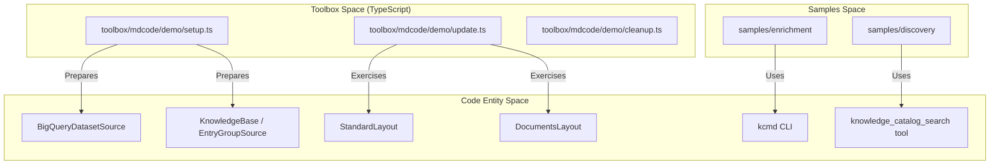
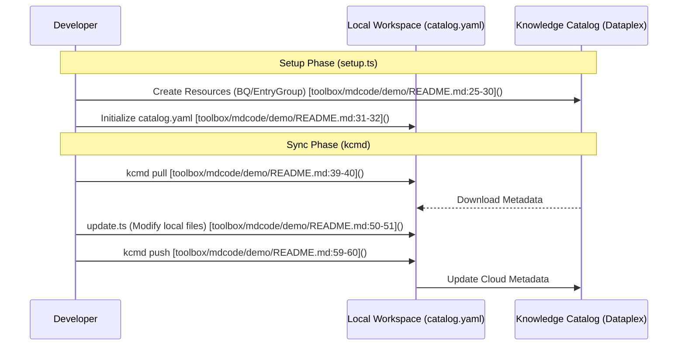

# Samples and Demos

Relevant source files

The following files were used as context for generating this wiki page:

- [samples/enrichment/README.md](samples/enrichment/README.md)
- [toolbox/mdcode/demo/README.md](toolbox/mdcode/demo/README.md)

This section provides an overview of the practical applications, demonstration scripts, and sample workflows available in the Knowledge Catalog repository. These resources are designed to showcase the "Metadata as Code" (MaC) philosophy and the capabilities of the enrichment agents.

The repository organizes these resources into four primary areas:
1.  **Python Enrichment Samples**: End-to-end workflows for data asset augmentation using Python.
2.  **Discovery Agent Sample**: A semantic search agent implementation over Knowledge Catalog.
3.  **Toolbox Demos**: Scripted scenarios for the TypeScript-based `kcmd` tool.
4.  **Agent Demos**: Specialized scenarios for agent-integrated metadata management.

## Repository Demo Landscape

The following diagram maps the high-level demo components to their respective directories and the core `kcmd` functionality they exercise.

### Demo to Code Entity Mapping

**Sources:** [toolbox/mdcode/demo/README.md:1-172](), [samples/enrichment/README.md:1-90]()

---

## Python Enrichment Sample
The `samples/enrichment` directory contains a complete demonstration of how an agentic approach can be used to augment Knowledge Catalog metadata [samples/enrichment/README.md:8-12](). This sample focuses on BigQuery data assets and utilizes a multi-step workflow:

1.  **Environment Setup**: Configuration of GCP projects and Python virtual environments [samples/enrichment/README.md:21-45]().
2.  **Data Creation**: Scripted generation of sample BigQuery datasets using `create_data.py` [samples/enrichment/README.md:47-54]().
3.  **Lifecycle**: Execution of the `enrichment.download`, `enrichment.enrich`, and `enrichment.publish` modules to move metadata between the cloud and local YAML snapshots [samples/enrichment/README.md:56-89]().

For details, see [samples/enrichment: Python Enrichment Sample](#5.1).

**Sources:** [samples/enrichment/README.md:1-90]()

---

## Knowledge Catalog Discovery Agent
The `samples/discovery` agent demonstrates how to build a semantic search interface over Knowledge Catalog. It uses a specialized `knowledge_catalog_search` tool to query entries and predicates. This sample illustrates how to configure an agent with a `SKILL.md` file to interpret natural language queries about data governance and cataloged assets.

For details, see [samples/discovery: Knowledge Catalog Discovery Agent](#5.2).

---

## Toolbox kcmd Demos
Located in `toolbox/mdcode/demo/`, these scripts demonstrate the core functionality of the `kcmd` CLI tool [toolbox/mdcode/demo/README.md:1-2](). They provide a "batteries-included" way to test the Metadata as Code workflow across different resource types.

| Demo Scenario | Key Components Tested | Description |
| :--- | :--- | :--- |
| **BigQuery Dataset** | `StandardLayout`, `BigQueryDatasetSource` | Syncing BigQuery table metadata to local YAML files [toolbox/mdcode/demo/README.md:19-22](). |
| **Knowledge Base** | `DocumentsLayout`, `EntryGroupSource` | Managing Dataplex EntryGroups as a collection of Markdown files [toolbox/mdcode/demo/README.md:70-73](). |
| **OKF Wiki** | `DocumentsLayout`, `okf/catalog/` | Publishing an Open Knowledge Format bundle into a Knowledge Catalog [toolbox/mdcode/demo/README.md:121-130](). |

### kcmd Demo Workflow

**Sources:** [toolbox/mdcode/demo/README.md:1-172]()

For details, see [toolbox/mdcode Demos: BigQuery and Knowledge Base](#5.3).

---

## Agent mdcode Demos
The `agents/mdcode/demo/` directory contains demos specifically tailored for use with the agent-integrated build of the metadata tools. These demos highlight the interaction between the `kcmd` core and the enrichment agents, often showcasing how agents can automatically generate the updates that are then pushed via the CLI. These differ from toolbox demos by utilizing the Python-based agent runner environment.

For details, see [agents/mdcode Demos](#5.4).

**Sources:** [toolbox/mdcode/demo/README.md:1-172]()
