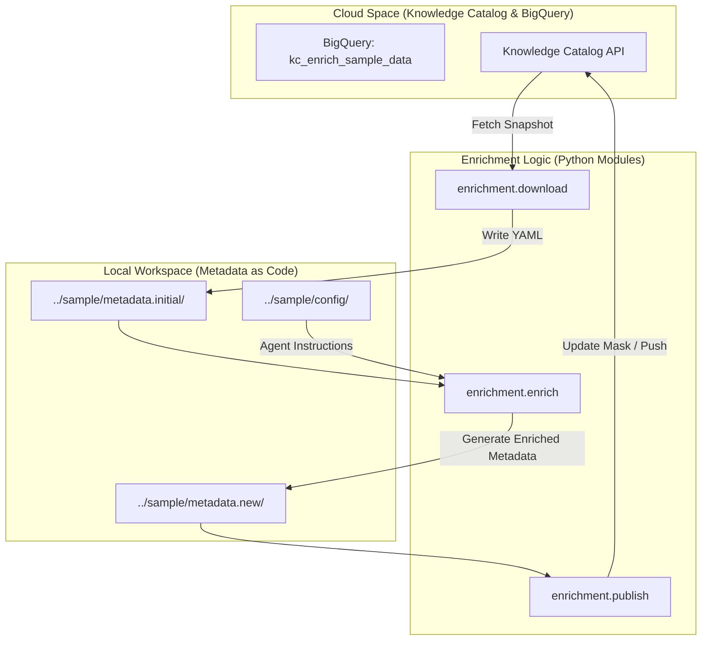
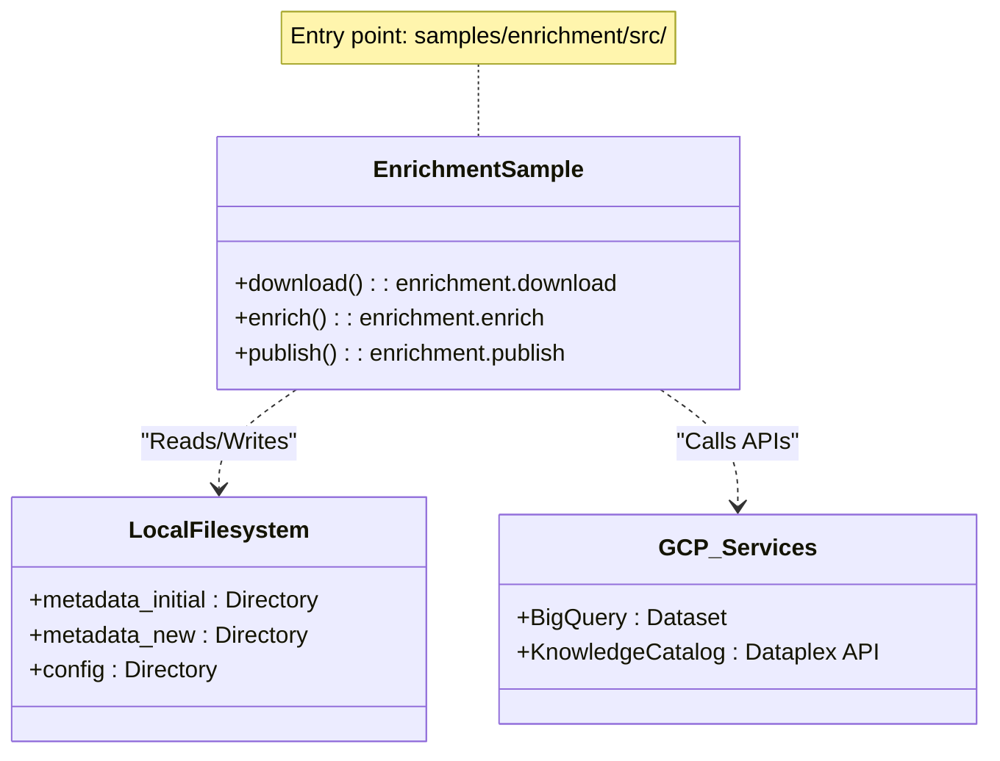

# samples/enrichment: Python Enrichment Sample

Relevant source files

The following files were used as context for generating this wiki page:

- [samples/enrichment/README.md](samples/enrichment/README.md)

## Overview

The **Python Enrichment Sample** provides an end-to-end demonstration of using agentic workflows to augment Knowledge Catalog metadata. It showcases how to leverage external information sources to generate rich documentation for data assets (such as BigQuery tables) and publish that documentation back to the Knowledge Catalog (formerly Dataplex) using a "Metadata as Code" (MaC) approach [samples/enrichment/README.md:3-12]().

The sample implements a multi-stage pipeline:
1.  **Environment Setup**: Configuration of GCP credentials and Python virtual environments.
2.  **Data Seeding**: Creation of a synthetic BigQuery dataset to serve as the target for enrichment.
3.  **Download**: Fetching current metadata into a local workspace.
4.  **Enrichment**: Running the AI agent to generate new metadata based on available context.
5.  **Review**: Using standard developer tools (like `git diff`) to inspect proposed changes.
6.  **Publish**: Synchronizing the enriched local state back to the cloud catalog.

---

## Environment Setup and Data Seeding

Before running the enrichment workflow, the environment must be authenticated and the necessary Python dependencies installed. The sample relies on the `gcloud` CLI for application-default credentials [samples/enrichment/README.md:31-39]().

### 1. Initialization
The sample uses a helper script `env.sh` to automate the creation of a Python virtual environment and the installation of required packages [samples/enrichment/README.md:41-45]().

### 2. Sample Data Creation
To provide a concrete target for the agent, the sample includes a data generator script. This script creates a BigQuery dataset named `kc_enrich_sample_data` within the configured project [samples/enrichment/README.md:47-55]().

**Sources:**
- [samples/enrichment/README.md:20-55]()

---

## The Enrichment Workflow

The workflow follows a cycle of downloading, augmenting, and uploading metadata. This process treats metadata as a local filesystem artifact that can be versioned and reviewed.

### Data Flow Diagram: Enrichment Lifecycle

The following diagram illustrates the transition from the "Natural Language Space" (where the LLM operates) to the "Code/Metadata Space" (where the catalog resides).

**Sources:**
- [samples/enrichment/README.md:60-89]()

---

## Workflow Implementation Details

### 1. Metadata Download
The `enrichment.download` module initializes the local workspace. It targets a specific BigQuery dataset and serializes its current metadata (Entries and Aspects) into a directory structure [samples/enrichment/README.md:60-66]().

### 2. Enrichment Engine
The core of the sample is the `enrichment.enrich` module. It takes the initial metadata and a configuration directory as input. The configuration directory typically contains custom instructions and tool definitions that the agent uses to understand the business context of the data [samples/enrichment/README.md:68-75]().

| Argument | Description |
| :--- | :--- |
| `--dir` | The source directory containing the initial metadata snapshot. |
| `--output-dir` | The destination for the generated (enriched) metadata. |
| `--config-dir` | Contains agent instructions, tool schemas, and skills. |

### 3. Review and Diffing
Because the metadata is stored as local YAML files, users can review the agent's output using standard tools. The sample recommends using `git diff` with the `--no-index` flag to compare the initial snapshot against the enriched output [samples/enrichment/README.md:77-82]().

### 4. Publishing
Once the changes are reviewed, the `enrichment.publish` module synchronizes the local `metadata.new` directory back to the Knowledge Catalog. This step uses the underlying logic to perform incremental updates (using update masks) to ensure only the enriched fields are modified [samples/enrichment/README.md:84-89]().

---

## System Components Mapping

This diagram maps the logical steps to the specific Python modules and filesystem locations used in the sample.

**Sources:**
- [samples/enrichment/README.md:1-90]()
