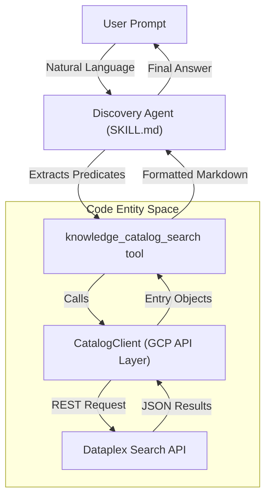
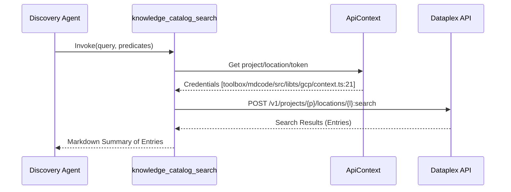

# samples/discovery: Knowledge Catalog Discovery Agent

Relevant source files

The following files were used as context for generating this wiki page:

- [CODE_OF_CONDUCT.md](CODE_OF_CONDUCT.md)
- [CONTRIBUTING.md](CONTRIBUTING.md)
- [LICENSE.md](LICENSE.md)
- [README.md](README.md)
- [samples/README.md](samples/README.md)
- [toolbox/README.md](toolbox/README.md)
- [toolbox/mdcode/src/libts/gcp/context.ts](toolbox/mdcode/src/libts/gcp/context.ts)
- [toolbox/mdcode/src/libts/tsconfig.json](toolbox/mdcode/src/libts/tsconfig.json)

The Discovery Agent is a sample implementation demonstrating how to build a search and discovery interface on top of the Knowledge Catalog Search APIs [samples/README.md:8-9](). It allows users to perform semantic and predicate-based searches over managed metadata using natural language.

## Overview and Purpose

The primary goal of the Discovery Agent is to provide a conversational interface for exploring the "Knowledge Graph" of data assets [README.md:3-5](). It bridges the gap between a user's natural language intent (e.g., "Find all tables related to marketing in the US region") and the structured search queries required by the Dataplex/Knowledge Catalog API.

### Key Capabilities
*   **Semantic Search**: Leverages LLM understanding to interpret user queries.
*   **Predicate Extraction**: Automatically identifies filters such as project IDs, locations, and entry types from user prompts.
*   **Tool-Based Retrieval**: Uses a specialized tool to interface with the `CatalogClient`.

## System Architecture

The agent operates as a specialized loop that processes user input, determines search parameters, executes the search via a tool, and summarizes the results.

### Natural Language to Code Entity Space

The following diagram illustrates how a natural language request is transformed into a technical search operation within the system.

**Search Execution Flow**

Sources: [samples/README.md:8-9](), [README.md:3-5](), [toolbox/README.md:3-7]()

## The `knowledge_catalog_search` Tool

The core of the discovery agent's functionality is the `knowledge_catalog_search` tool. This tool acts as the interface between the LLM and the Knowledge Catalog backend.

### Implementation Details
The tool utilizes the `CatalogClient` to execute searches against the Google Cloud Dataplex service. It typically supports:
1.  **Query String**: The main text search component.
2.  **Scope**: Restricting the search to specific GCP projects or locations [toolbox/mdcode/src/libts/gcp/context.ts:11-12]().
3.  **Filters**: Applying predicates based on metadata aspects or system-defined fields.

### Data Flow for Search
The search process relies on the `ApiContext` to provide necessary authentication and project configuration [toolbox/mdcode/src/libts/gcp/context.ts:10-13]().

**Search Data Flow**

Sources: [toolbox/mdcode/src/libts/gcp/context.ts:6-23](), [samples/README.md:8-9]()

## SKILL.md: Agent Instructions

The behavior of the agent is governed by a `SKILL.md` file (standard for agents in this repository). This file defines the system prompt and instructions for the LLM.

### Predicate Extraction Logic
The `SKILL.md` instructs the LLM on how to map user concepts to Knowledge Catalog predicates. For example:
*   **Time-based queries**: Mapping "recent" to specific date filters.
*   **Ownership**: Mapping "my tables" to specific creator or owner aspects.
*   **Data Quality**: Mapping "high quality" to filters on data quality aspects.

## Execution Modes

The Discovery Agent can be deployed in two primary ways:

### 1. Standalone Mode
In this mode, the agent functions as a dedicated search assistant. Users interact with it directly to find assets. It is often used to verify that metadata enriched by the **Enrichment Agent** is correctly indexed and discoverable [toolbox/README.md:9-12]().

### 2. Sub-Agent Mode
The Discovery Agent can be integrated into a larger agentic workflow (e.g., a "Data Scientist Agent"). In this scenario:
1.  The parent agent receives a complex task (e.g., "Analyze the impact of the last marketing campaign").
2.  The parent agent calls the **Discovery Agent** as a tool to find the relevant BigQuery tables or documentation.
3.  The Discovery Agent returns the metadata, which the parent agent then uses to write SQL or generate reports.

## Integration with Metadata as Code (MaC)

The discovery agent's effectiveness is directly tied to the quality of metadata managed via `kcmd`. When metadata is pushed to the catalog using `kcmd push`, it becomes available for the Discovery Agent to find [toolbox/README.md:5-7]().

| Feature | Description |
| :--- | :--- |
| **Indexing** | `kcmd` ensures that `catalog.yaml` structures are reflected in Dataplex. |
| **Searchability** | Aspect values defined in local YAML files are indexed for semantic search. |
| **Context** | The Discovery Agent uses the descriptions and tags provided by the Enrichment Agent to improve result relevance [samples/README.md:11-14](). |

Sources: [toolbox/README.md:5-12](), [samples/README.md:1-15]()
