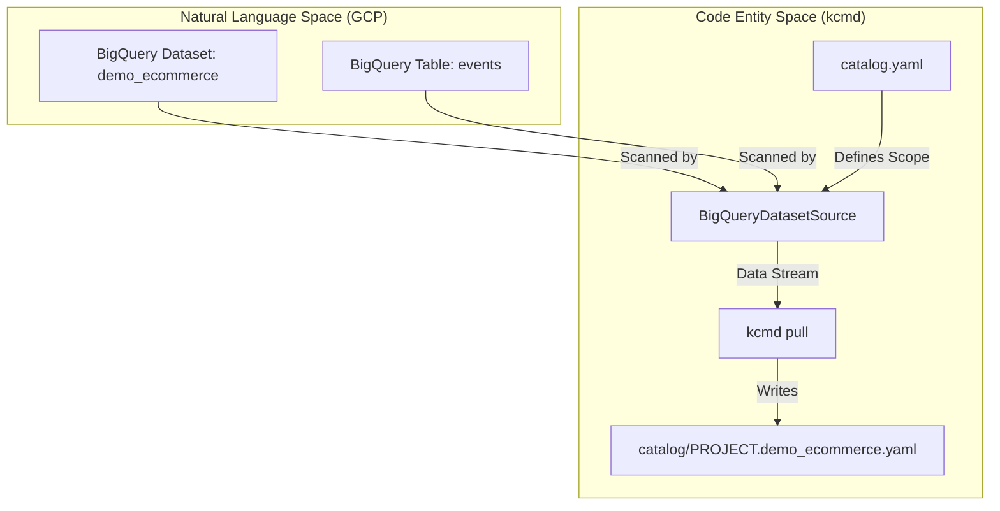
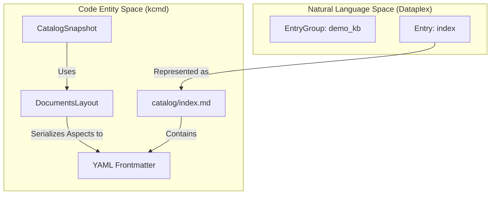

# agents/mdcode Demos

<details>
<summary>Relevant source files</summary>

The following files were used as context for generating this wiki page:

- [toolbox/mdcode/demo/README.md](toolbox/mdcode/demo/README.md)

</details>


The `agents/mdcode/demo/` directory contains demonstration scripts designed to showcase the "Metadata as Code" (MaC) workflow using the `kcmd` library and CLI. These demos are distinct from the `toolbox/mdcode` demos in that they are optimized for the `agents/mdcode` build environment (using the Bun runtime) and provide examples of BigQuery metadata management, Knowledge Base (Dataplex EntryGroup) management, and OKF Wiki publishing.

## Overview and Configuration

The demos demonstrate the full lifecycle of metadata management:
1.  **Setup**: Provisioning GCP resources and generating a `catalog.yaml` manifest [toolbox/mdcode/demo/README.md:23-32]().
2.  **Pull**: Synchronizing remote metadata to a local filesystem snapshot [toolbox/mdcode/demo/README.md:34-42]().
3.  **Update**: Modifying the local metadata (either via direct file manipulation or the `kcmd` library) [toolbox/mdcode/demo/README.md:44-52]().
4.  **Push**: Publishing local changes back to Google Cloud Dataplex [toolbox/mdcode/demo/README.md:54-60]().
5.  **Cleanup**: Removing demo resources [toolbox/mdcode/demo/README.md:62-68]().

### Prerequisites
To run these demos, you must have a Google Cloud project with the BigQuery and Dataplex (Knowledge Catalog) APIs enabled [toolbox/mdcode/demo/README.md:3-6]().

```bash
export DEMO_CLOUD_PROJECT=<GCP_PROJECT_ID>
gcloud auth application-default login
gcloud config set project $DEMO_CLOUD_PROJECT
```
Sources: [toolbox/mdcode/demo/README.md:3-17]()

---

## BigQuery Dataset Demo

This demo focuses on managing metadata for BigQuery resources, specifically datasets and tables. It uses the `StandardLayout` where each BigQuery entity is represented by a YAML file [toolbox/mdcode/demo/README.md:19-21]().

### Implementation Details
The setup script creates a BigQuery dataset named `demo_ecommerce` and a table `events` based on BigQuery sample data in the specified cloud project [toolbox/mdcode/demo/README.md:25-26](). It then generates a `catalog.yaml` manifest to specify the local catalog snapshot [toolbox/mdcode/demo/README.md:27]().

### Data Flow: BigQuery Metadata to Code
The following diagram illustrates how the setup and `kcmd` bridge the gap between BigQuery resources and the local YAML representation.

**BigQuery to YAML Entity Mapping**

Sources: [toolbox/mdcode/demo/README.md:23-42]()

### Operations
*   **Setup**: `bun setup.ts` initializes the GCP environment [toolbox/mdcode/demo/README.md:30]().
*   **Update**: `bun update.ts <file>` adds a dummy `overview` aspect to the local YAML [toolbox/mdcode/demo/README.md:49-50]().
*   **Cleanup**: `bun cleanup.ts` deletes the BigQuery resources [toolbox/mdcode/demo/README.md:67]().

Sources: [toolbox/mdcode/demo/README.md:30-67]()

---

## Knowledge Base Demo

This demo illustrates the `DocumentsLayout`, where Dataplex Entries are represented as Markdown files with YAML frontmatter. This is the preferred format for "Knowledge Bases" managed within the catalog [toolbox/mdcode/demo/README.md:70-72]().

### Implementation Details
The Knowledge Base demo creates a Dataplex `EntryGroup` named `demo_kb` and a set of document entries within it [toolbox/mdcode/demo/README.md:76]().

### Data Flow: Dataplex Entry to Markdown
Unlike the BigQuery demo which modifies YAML directly, the Knowledge Base update script uses the `kcmd` library to create placeholder updates to the `index.md` file [toolbox/mdcode/demo/README.md:96-98]().

**Dataplex Entry to Markdown Entity Mapping**

Sources: [toolbox/mdcode/demo/README.md:74-103]()

### Operations
*   **Pull**: Metadata is pulled into `catalog/index.md` [toolbox/mdcode/demo/README.md:89-91]().
*   **Update**: `bun update.ts` uses the `kcmd` library to programmatically modify the `index` entry content [toolbox/mdcode/demo/README.md:101]().
*   **Cleanup**: `bun cleanup.ts` deletes the `EntryGroup` [toolbox/mdcode/demo/README.md:118]().

Sources: [toolbox/mdcode/demo/README.md:89-118]()

---

## OKF Wiki Demo

This demo demonstrates publishing an Open Knowledge Format (OKF) wiki bundle into a Knowledge Catalog `EntryGroup` via the `DocumentsLayout` [toolbox/mdcode/demo/README.md:121-125]().

### Implementation Details
The bundle in `okf/catalog/` contains a GA4 sample with 17 markdown files including indexes, references, and data asset descriptions [toolbox/mdcode/demo/README.md:125-127](). The `DocumentsLayout` maps each `.md` file to an entry whose name is derived from the file path (e.g., `references/metrics/event_count.md` becomes entry `references/metrics/event_count`) [toolbox/mdcode/demo/README.md:128-129, 145-147]().

### Key Features
*   **Overview Aspect**: The markdown body is stored in the `dataplex-types.global.overview` aspect [toolbox/mdcode/demo/README.md:129-130]().
*   **Frontmatter Mapping**: Fields like `title`, `description`, and `tags` are mapped from YAML frontmatter to Dataplex aspects [toolbox/mdcode/demo/README.md:157-159]().
*   **Type Fallback**: Custom `type:` values in frontmatter that are not valid Dataplex type references fall back to `dataplex-types.global.generic` [toolbox/mdcode/demo/README.md:147-149]().

Sources: [toolbox/mdcode/demo/README.md:121-172]()

---

## Comparison with toolbox/mdcode Demos

While both `agents/mdcode` and `toolbox/mdcode` provide demo scripts, there are key differences in implementation and runtime:

| Feature | agents/mdcode/demo | toolbox/mdcode/demo |
| :--- | :--- | :--- |
| **Runtime** | Bun | Node.js / TypeScript |
| **Library Reference** | Imports `kcmd` from local build | Typically uses compiled JS |
| **Update Logic** | Mix of manual YAML edits and library usage | Primarily focuses on CLI interactions |
| **OKF Support** | Includes OKF Wiki bundle publishing | Standard catalog operations |

Sources: [toolbox/mdcode/demo/README.md:30-152]()
