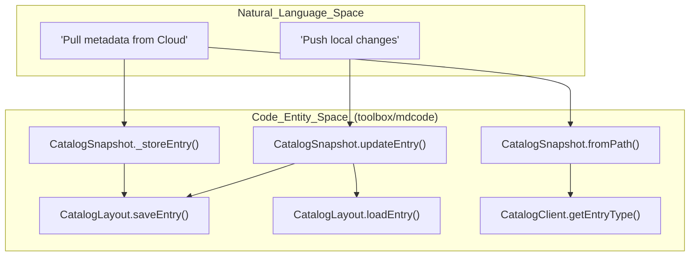
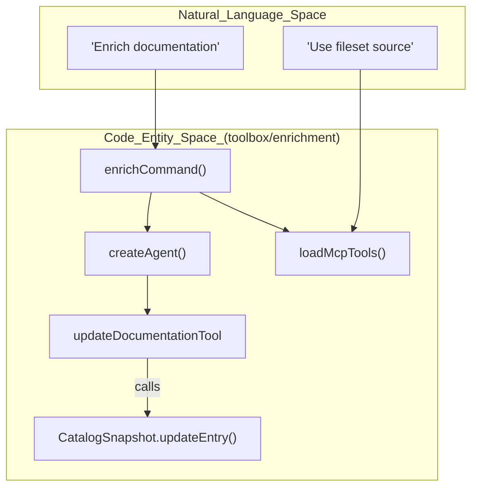

# Glossary

Relevant source files

The following files were used as context for generating this wiki page:

- [CODE_OF_CONDUCT.md](CODE_OF_CONDUCT.md)
- [CONTRIBUTING.md](CONTRIBUTING.md)
- [LICENSE.md](LICENSE.md)
- [README.md](README.md)
- [okf/README.md](okf/README.md)
- [okf/pyproject.toml](okf/pyproject.toml)
- [toolbox/enrichment/README.md](toolbox/enrichment/README.md)
- [toolbox/enrichment/src/agent/enrich/agent.ts](toolbox/enrichment/src/agent/enrich/agent.ts)
- [toolbox/enrichment/src/agent/enrich/command.ts](toolbox/enrichment/src/agent/enrich/command.ts)
- [toolbox/enrichment/src/agent/tools.ts](toolbox/enrichment/src/agent/tools.ts)
- [toolbox/mdcode/README.md](toolbox/mdcode/README.md)
- [toolbox/mdcode/package-lock.json](toolbox/mdcode/package-lock.json)
- [toolbox/mdcode/package.json](toolbox/mdcode/package.json)
- [toolbox/mdcode/src/libts/snapshot.ts](toolbox/mdcode/src/libts/snapshot.ts)

This page provides definitions for codebase-specific terms, abbreviations, and domain concepts used throughout the Knowledge Catalog repository. It serves as a technical reference for onboarding engineers to understand the mapping between conceptual terminology and the underlying implementation.

## Core Concepts

### Metadata as Code (MaC)
The paradigm of managing data catalog metadata using software engineering practices. Metadata is treated as source code artifacts (YAML and Markdown), enabling version control, peer reviews, and automated CI/CD pipelines for data governance.
*   **Implementation:** Managed primarily by the `kcmd` tool in `toolbox/mdcode`.
*   **Sources:** [toolbox/mdcode/README.md:1-7](), [toolbox/mdcode/README.md:11-15]()

### Knowledge Catalog (Dataplex)
A Google Cloud service (formerly Dataplex) that provides an AI-powered data catalog and metadata management platform. It provides a dynamic knowledge graph of structured and unstructured data to provide business context to AI agents.
*   **Code Pointer:** Wrapper logic for the Dataplex API is found in the `CatalogClient` class.
*   **Sources:** [README.md:1-5](), [toolbox/mdcode/src/libts/snapshot.ts:138-138]()

### Open Knowledge Format (OKF)
A universal, vendor-neutral format for representing knowledge as plain markdown files with YAML frontmatter. It is designed to be human-readable, version-controllable, and portable across different agent frameworks and catalogs.
*   **Implementation:** Specification and reference agent located in the `okf/` directory.
*   **Sources:** [okf/README.md:3-12](), [okf/README.md:39-45]()

---

## Data Model Terms

### Entry
The primary unit of metadata in Knowledge Catalog, representing a specific data asset (e.g., a BigQuery table, a file set, or a logical "Knowledge Base" document).
*   **Implementation:** Represented by the `md.Entry` interface in the TypeScript library.
*   **Sources:** [toolbox/mdcode/src/libts/snapshot.ts:9-9](), [toolbox/mdcode/src/libts/snapshot.ts:60-62]()

### Aspect
A modular piece of metadata attached to an **Entry**. Aspects are typed (e.g., `overview`, `schema`, `descriptions`) and allow for extending the metadata of an asset.
*   **Implementation:** Stored in the `aspects` map within an `Entry` object.
*   **Sources:** [toolbox/mdcode/src/libts/snapshot.ts:94-103](), [toolbox/mdcode/README.md:82-92]()

### EntryType / AspectType
The definitions (schemas) for Entries and Aspects. These define what fields are required or allowed.
*   **Implementation:** Managed by `CatalogSnapshot` which caches these types during initialization from the manifest configuration.
*   **Sources:** [toolbox/mdcode/src/libts/snapshot.ts:19-20](), [toolbox/mdcode/src/libts/snapshot.ts:135-176]()

---

## Workspace & Synchronization

### Catalog Manifest (`catalog.yaml`)
A configuration file at the root of a metadata workspace that defines the **Scope**, **SnapshotConfig** (entries and aspects to track), and **PublishingConfig**.
*   **Implementation:** `CatalogManifest` class.
*   **Sources:** [toolbox/mdcode/src/libts/snapshot.ts:10-10](), [toolbox/mdcode/src/libts/snapshot.ts:38-38](), [toolbox/mdcode/README.md:34-58]()

### Scope
The definition of which cloud resources are managed by a specific workspace. It is usually formatted as a resource URI or a specific shorthand (e.g., `bq-dataset.project.dataset`).
*   **Implementation:** Defined in the `catalog.yaml` and used to initialize the catalog.
*   **Sources:** [toolbox/mdcode/README.md:37-37](), [toolbox/enrichment/README.md:92-92]()

### Pull
The process of fetching metadata from the Dataplex service and transforming it into local YAML/Markdown files.
*   **Implementation:** Handled by the synchronization logic (e.g., `kcmd pull` command).
*   **Sources:** [toolbox/mdcode/README.md:152-156](), [toolbox/mdcode/src/libts/snapshot.ts:180-184]()

### Push
The process of taking local modifications and publishing them back to the Dataplex service.
*   **Implementation:** Handled by the synchronization logic (e.g., `kcmd push` command).
*   **Sources:** [toolbox/mdcode/README.md:161-166](), [toolbox/mdcode/src/libts/snapshot.ts:186-187]()

---

## Architecture Diagrams

### From Natural Language to Code Entities: Synchronization
This diagram shows how conceptual synchronization actions relate to specific classes and methods in the TypeScript implementation.

Title: Synchronization Data Flow

**Sources:** [toolbox/mdcode/src/libts/snapshot.ts:32-44](), [toolbox/mdcode/src/libts/snapshot.ts:68-107](), [toolbox/mdcode/src/libts/snapshot.ts:181-184]()

### From Natural Language to Code Entities: Enrichment
This diagram illustrates how the enrichment process bridges user prompts and tools to metadata updates.

Title: Enrichment Agent Logic

**Sources:** [toolbox/enrichment/src/agent/enrich/command.ts:16-113](), [toolbox/enrichment/src/agent/enrich/agent.ts:89-108]()

---

## Technical Terms Table

| Term | Definition | Code Pointer |
| :--- | :--- | :--- |
| **Sidecar File** | A Markdown file (e.g., `.overview.md`) that contains the content for a specific aspect, associated with a primary YAML entry. | [toolbox/mdcode/README.md:82-92]() |
| **Ingested Entries** | Metadata entries automatically synchronized from a source system (like BigQuery) into Dataplex. These are usually read-only for certain fields. | [toolbox/mdcode/src/libts/snapshot.ts:87-92]() |
| **MCP Server** | Model Context Protocol server that allows AI agents to call `kcmd` functions (pull, push, lookup) as tools. | [toolbox/mdcode/README.md:170-195]() |
| **Skill** | A high-level agent capability defined in Markdown, providing instructions and tool descriptions to an LLM. | [toolbox/enrichment/src/agent/enrich/command.ts:37-37](), [toolbox/enrichment/README.md:129-136]() |
| **Fileset** | A directory of local Markdown files used as a knowledge source for enrichment, often exposed via the `md-fileset` MCP server. | [toolbox/enrichment/README.md:119-124](), [toolbox/enrichment/README.md:157-158]() |
| **ADK** | Agent Development Kit. A library used to build the enrichment agent and manage tool executions. | [toolbox/enrichment/src/agent/enrich/command.ts:5-5](), [toolbox/enrichment/src/agent/enrich/agent.ts:4-4]() |

**Sources:** [toolbox/mdcode/src/libts/snapshot.ts:87-92](), [toolbox/mdcode/README.md:170-195](), [toolbox/enrichment/src/agent/enrich/command.ts:37-37](), [toolbox/enrichment/README.md:119-124]()
