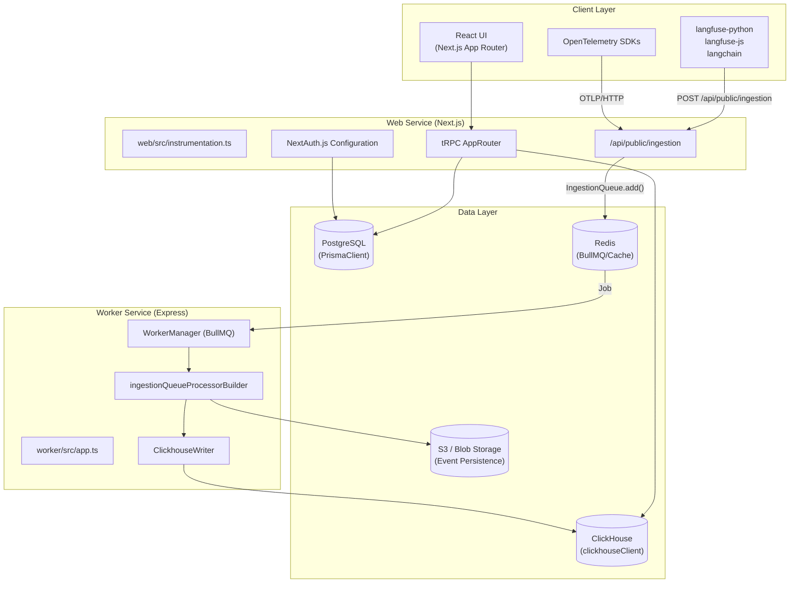
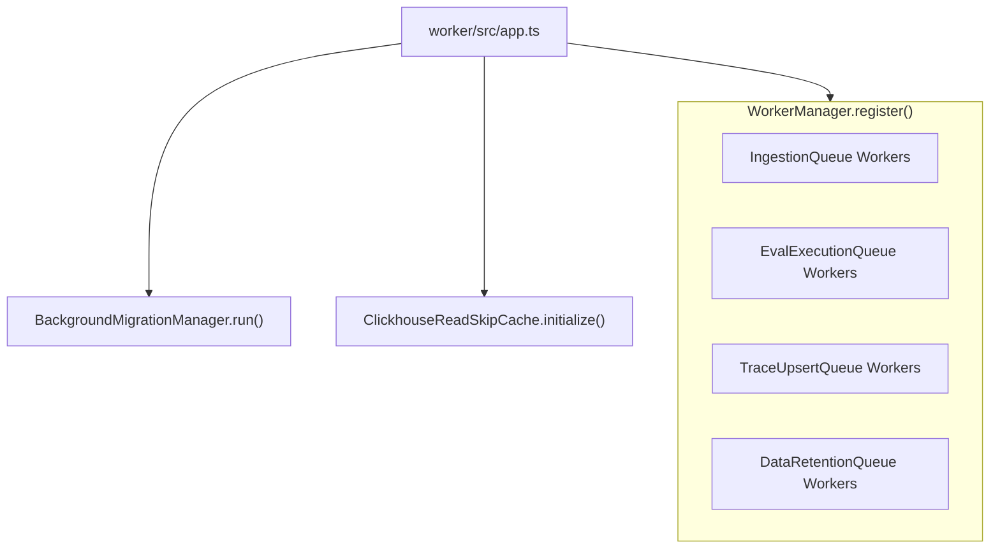

# System Architecture

Relevant source files

The following files were used as context for generating this wiki page:

- [.env.dev-azure.example](.env.dev-azure.example)
- [.env.dev-redis-cluster.example](.env.dev-redis-cluster.example)
- [.env.dev.example](.env.dev.example)
- [.env.prod.example](.env.prod.example)
- [.vscode/launch.json](.vscode/launch.json)
- [docker-compose.build.yml](docker-compose.build.yml)
- [docker-compose.dev-azure.yml](docker-compose.dev-azure.yml)
- [docker-compose.dev-redis-cluster.yml](docker-compose.dev-redis-cluster.yml)
- [docker-compose.dev.yml](docker-compose.dev.yml)
- [docker-compose.yml](docker-compose.yml)
- [packages/shared/src/env.ts](packages/shared/src/env.ts)
- [packages/shared/src/server/auth/jumpcloudProvider.ts](packages/shared/src/server/auth/jumpcloudProvider.ts)
- [packages/shared/src/server/index.ts](packages/shared/src/server/index.ts)
- [packages/shared/src/server/queues.ts](packages/shared/src/server/queues.ts)
- [packages/shared/src/server/redis/getQueue.ts](packages/shared/src/server/redis/getQueue.ts)
- [web/src/components/layouts/app-layout/utils/pathClassification.ts](web/src/components/layouts/app-layout/utils/pathClassification.ts)
- [web/src/ee/features/multi-tenant-sso/types.ts](web/src/ee/features/multi-tenant-sso/types.ts)
- [web/src/ee/features/multi-tenant-sso/utils.ts](web/src/ee/features/multi-tenant-sso/utils.ts)
- [web/src/env.mjs](web/src/env.mjs)
- [web/src/features/auth-credentials/components/ResetPasswordButton.tsx](web/src/features/auth-credentials/components/ResetPasswordButton.tsx)
- [web/src/features/auth-credentials/components/ResetPasswordPage.tsx](web/src/features/auth-credentials/components/ResetPasswordPage.tsx)
- [web/src/features/auth-credentials/lib/credentialsUtils.ts](web/src/features/auth-credentials/lib/credentialsUtils.ts)
- [web/src/features/auth-credentials/server/signupApiHandler.ts](web/src/features/auth-credentials/server/signupApiHandler.ts)
- [web/src/features/posthog-analytics/usePostHogClientCapture.ts](web/src/features/posthog-analytics/usePostHogClientCapture.ts)
- [web/src/pages/api/admin/bullmq/index.ts](web/src/pages/api/admin/bullmq/index.ts)
- [web/src/pages/api/auth/signup-verify.ts](web/src/pages/api/auth/signup-verify.ts)
- [web/src/pages/auth/setup-password.tsx](web/src/pages/auth/setup-password.tsx)
- [web/src/pages/auth/sign-in.tsx](web/src/pages/auth/sign-in.tsx)
- [web/src/pages/auth/sign-up.tsx](web/src/pages/auth/sign-up.tsx)
- [web/src/server/auth.ts](web/src/server/auth.ts)
- [web/types/next-auth.d.ts](web/types/next-auth.d.ts)
- [worker/src/app.ts](worker/src/app.ts)
- [worker/src/env.ts](worker/src/env.ts)
- [worker/src/features/tokenisation/usage.ts](worker/src/features/tokenisation/usage.ts)
- [worker/src/queues/ingestionQueue.ts](worker/src/queues/ingestionQueue.ts)
- [worker/src/queues/workerManager.ts](worker/src/queues/workerManager.ts)
- [worker/src/utils/shutdown.ts](worker/src/utils/shutdown.ts)

This document describes the overall system architecture of Langfuse, including the core services, data layer, communication patterns, and deployment architecture.

## Architecture Overview

Langfuse implements a **dual-service monorepo architecture** separating synchronous user-facing operations from intensive asynchronous processing. The **Web Service** (`web/`) is a Next.js application that handles the React UI and API ingestion, while the **Worker Service** (`worker/`) is an Express-based service dedicated to background job processing via BullMQ. Both services leverage a shared core logic layer in `packages/shared/`.

**High-Level System Diagram**

**Key Architectural Decisions:**

| Decision | Rationale | Implementation |
|----------|-----------|----------------|
| **Service Separation** | Isolate resource-intensive background tasks (evals, trace reconstruction) from user requests. | `web/` and `worker/` services [worker/src/app.ts:96-107]() |
| **Shared Package** | Centralize DB schemas, environment validation, and core logic. | `@langfuse/shared` workspace [packages/shared/package.json:2-3]() |
| **Dual Database** | PostgreSQL for relational metadata; ClickHouse for high-throughput OLAP tracing data. | Prisma + ClickHouse Client [packages/shared/src/env.ts:81-87]() |
| **S3-First Ingestion** | Ensure durability of raw events before processing and allow for replay. | `LANGFUSE_S3_EVENT_UPLOAD_BUCKET` usage [worker/src/env.ts:41-43]() |
| **Queue Sharding** | Enable horizontal scaling of workers by sharding BullMQ queues. | `LANGFUSE_INGESTION_QUEUE_SHARD_COUNT` [packages/shared/src/env.ts:129]() |

**Sources:**
- [worker/src/app.ts:96-107]()
- [packages/shared/src/env.ts:1-174]()
- [worker/src/env.ts:41-43]()

## Core Services

### Web Service

The Web Service handles the frontend UI, authentication, and the initial ingestion of tracing data. It is built with Next.js [web/package.json:133]() and uses `tRPC` for type-safe communication between the client and server [web/package.json:102-105](). It manages complex authentication flows via NextAuth.js, supporting multiple providers like Google, GitHub, and enterprise SSO [web/src/server/auth.ts:24-38]().

**Web Runtime Components:**

| Component | Code Entity | Purpose |
|-----------|-------------|---------|
| **API Ingestion** | `/api/public/ingestion` | High-throughput endpoint for receiving tracing data from SDKs. |
| **Internal API** | `tRPC AppRouter` | Type-safe backend for the React frontend. |
| **Auth System** | `NextAuth.js` | Handles user authentication and multi-tenant project access [web/src/server/auth.ts:101-159](). |
| **Instrumentation** | `dd-trace` / `OpenTelemetry` | Observability for the web service itself [web/package.json:118](). |

### Worker Service

The Worker Service is a long-running Express process [worker/src/app.ts:96]() that initializes queue consumers. It handles complex logic such as calculating LLM costs, running automated evaluations, and propagating events to ClickHouse.

**Service Initialization Flow**

**Critical Service Components:**

| Component | Code Entity | Purpose |
|-----------|-------------|---------|
| **Worker Manager** | `WorkerManager` | Central registry for BullMQ workers with standardized metrics [worker/src/app.ts:24]() |
| **Background Migrations** | `BackgroundMigrationManager` | Manages long-running data migrations without blocking the main process [worker/src/app.ts:112-117]() |
| **Clickhouse Cache** | `ClickhouseReadSkipCache` | Caches project metadata to skip redundant ClickHouse reads during ingestion [worker/src/app.ts:120-124]() |
| **Queue Sharding** | `TraceUpsertQueue.getShardNames()` | Dynamically registers workers for all configured queue shards [worker/src/app.ts:128-137]() |

**Sources:**
- [worker/src/app.ts:1-197]()
- [worker/package.json:50-68]()
- [worker/src/env.ts:111-145]()

## Data Layer

Langfuse utilizes a specialized stack to balance transactional integrity with analytical performance.

### PostgreSQL (Metadata)
PostgreSQL serves as the source of truth for all relational data.
- **ORM:** Prisma [packages/shared/package.json:104]().
- **Entities:** Organizations, Projects, Users, API Keys, Dataset items, and Prompt versions.
- **Environment:** Configured via `DATABASE_URL` [worker/src/env.ts:9]().

### ClickHouse (Analytics & Traces)
ClickHouse is the primary store for high-volume observability data.
- **Connectivity:** Managed via `CLICKHOUSE_URL` and credentials [packages/shared/src/env.ts:81-87]().
- **Optimization:** Supports `ASYNC_INSERT` settings to handle high write pressure [packages/shared/src/env.ts:91-97]().
- **Deletion:** Implements lightweight deletes for data management [packages/shared/src/env.ts:98-101]().

### Redis (Queues & Caching)
Redis acts as the backbone for service coordination.
- **BullMQ:** Manages all job state and concurrency via `ioredis` [packages/shared/src/env.ts:20-57]().
- **Key Prefixing:** Supports multi-tenant Redis via `REDIS_KEY_PREFIX` [packages/shared/src/env.ts:32]().
- **Availability:** Supports Redis Cluster and Sentinel modes [packages/shared/src/env.ts:46-57]().

### S3 / Blob Storage (Durability)
Langfuse uses blob storage (AWS S3, Azure Blob, or Google Cloud Storage) for:
- **Event Persistence:** Raw ingestion batches are saved to S3 before processing [worker/src/env.ts:41-43]().
- **Batch Exports:** Large CSV/JSONL exports are staged here for user download [worker/src/env.ts:27-32]().
- **Storage Strategy:** Supports AWS KMS SSE and forced path style for Minio compatibility [worker/src/env.ts:49-53]().

**Sources:**
- [packages/shared/src/env.ts:20-163]()
- [worker/src/env.ts:9-110]()
- [packages/shared/src/server/index.ts:1-132]()

## Communication & Ingestion Pipeline

### The Ingestion Flow
1. **Receipt:** The Web service receives a POST request at `/api/public/ingestion`.
2. **Authentication:** `ApiAuthService` validates the `Basic` or `Bearer` auth header against PostgreSQL.
3. **Durability:** The raw payload is uploaded to S3 via `StorageService` [packages/shared/src/server/index.ts:1]().
4. **Queueing:** A job is added to the `IngestionQueue` using `IngestionEvent` schema [packages/shared/src/server/queues.ts:14-28]().
5. **Processing:** A Worker picks up the job using `ingestionQueueProcessorBuilder` and propagates data to ClickHouse [worker/src/app.ts:48]().

### Queue Definitions
The system uses a variety of queues to manage background work:

| Queue Name | Code Entity | Purpose |
|------------|-------------|---------|
| **Ingestion** | `IngestionQueue` | Processes raw tracing events into ClickHouse [worker/src/app.ts:35]() |
| **OTel Ingestion** | `OtelIngestionQueue` | Specifically handles OpenTelemetry formatted spans [worker/src/app.ts:37]() |
| **Eval Execution** | `EvalExecutionQueue` | Executes LLM-as-judge or programmatic evaluations [worker/src/app.ts:43]() |
| **Trace Upsert** | `TraceUpsertQueue` | Handles asynchronous updates to trace metadata [worker/src/app.ts:39]() |
| **Cloud Metering** | `CloudUsageMeteringQueue` | Tracks usage for billing in Langfuse Cloud [worker/src/app.ts:41]() |

**Sources:**
- [worker/src/app.ts:25-81]()
- [packages/shared/src/server/index.ts:59-93]()
- [packages/shared/src/env.ts:125-159]()
- [packages/shared/src/server/queues.ts:14-107]()
