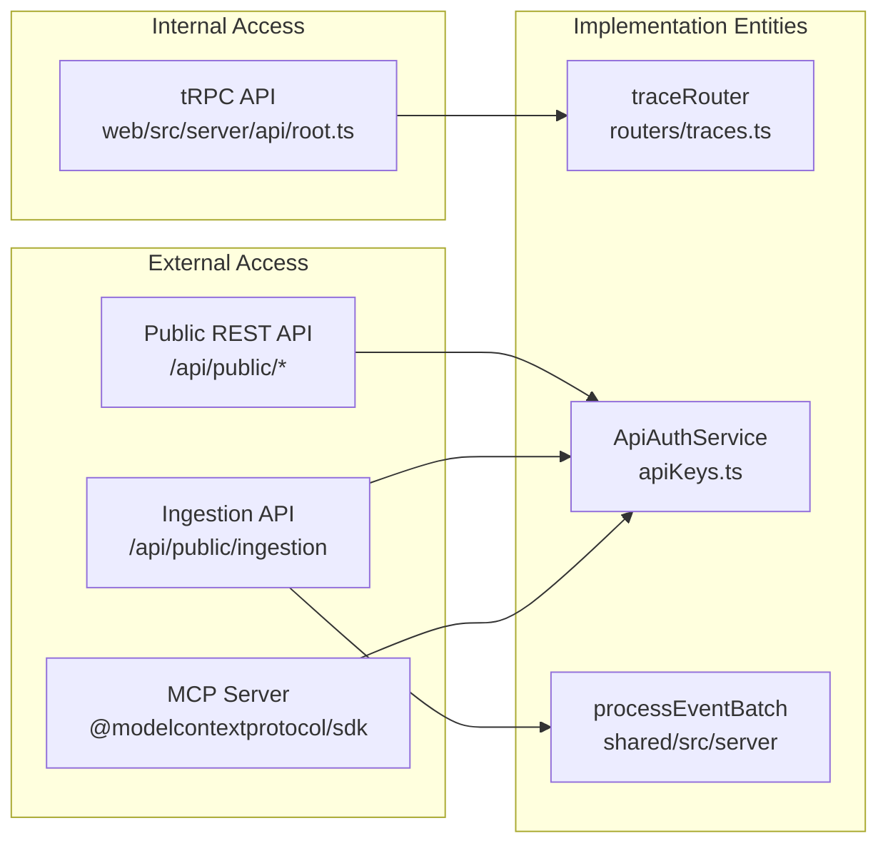

# Technology Stack

Relevant source files

The following files were used as context for generating this wiki page:

- [ee/package.json](ee/package.json)
- [package.json](package.json)
- [packages/config-eslint/package.json](packages/config-eslint/package.json)
- [packages/shared/package.json](packages/shared/package.json)
- [packages/shared/src/constants/VERSION.ts](packages/shared/src/constants/VERSION.ts)
- [pnpm-lock.yaml](pnpm-lock.yaml)
- [pnpm-workspace.yaml](pnpm-workspace.yaml)
- [web/Dockerfile](web/Dockerfile)
- [web/instrumentation-client.ts](web/instrumentation-client.ts)
- [web/next.config.mjs](web/next.config.mjs)
- [web/package.json](web/package.json)
- [web/playwright.config.ts](web/playwright.config.ts)
- [web/src/__e2e__/auth.spec.ts](web/src/__e2e__/auth.spec.ts)
- [web/src/__tests__/redirect.clienttest.ts](web/src/__tests__/redirect.clienttest.ts)
- [web/src/components/error-page.tsx](web/src/components/error-page.tsx)
- [web/src/components/layouts/app-layout/hooks/useAuthGuard.ts](web/src/components/layouts/app-layout/hooks/useAuthGuard.ts)
- [web/src/components/layouts/app-layout/hooks/useAuthSession.ts](web/src/components/layouts/app-layout/hooks/useAuthSession.ts)
- [web/src/components/layouts/app-layout/hooks/useFilteredNavigation.ts](web/src/components/layouts/app-layout/hooks/useFilteredNavigation.ts)
- [web/src/components/layouts/app-layout/hooks/useLayoutConfiguration.ts](web/src/components/layouts/app-layout/hooks/useLayoutConfiguration.ts)
- [web/src/components/layouts/app-layout/hooks/useLayoutMetadata.ts](web/src/components/layouts/app-layout/hooks/useLayoutMetadata.ts)
- [web/src/components/layouts/app-layout/hooks/useProjectAccess.ts](web/src/components/layouts/app-layout/hooks/useProjectAccess.ts)
- [web/src/components/layouts/app-layout/index.tsx](web/src/components/layouts/app-layout/index.tsx)
- [web/src/components/layouts/app-layout/utils/navigationFilters.types.ts](web/src/components/layouts/app-layout/utils/navigationFilters.types.ts)
- [web/src/constants/VERSION.ts](web/src/constants/VERSION.ts)
- [web/src/hooks/useTrpcError.tsx](web/src/hooks/useTrpcError.tsx)
- [web/src/instrumentation.ts](web/src/instrumentation.ts)
- [web/src/observability.config.ts](web/src/observability.config.ts)
- [web/src/pages/_app.tsx](web/src/pages/_app.tsx)
- [web/src/pages/api/trpc/[trpc].ts](web/src/pages/api/trpc/[trpc].ts)
- [web/src/pages/auth/error.tsx](web/src/pages/auth/error.tsx)
- [web/src/utils/api.ts](web/src/utils/api.ts)
- [web/src/utils/redirect.ts](web/src/utils/redirect.ts)
- [worker/Dockerfile](worker/Dockerfile)
- [worker/package.json](worker/package.json)
- [worker/src/constants/VERSION.ts](worker/src/constants/VERSION.ts)
- [worker/src/index.ts](worker/src/index.ts)
- [worker/src/instrumentation.ts](worker/src/instrumentation.ts)

This document provides a comprehensive reference of the core technologies, frameworks, and libraries used throughout the Langfuse codebase. For information about how these components interact architecturally, see [1.1 System Architecture](). For details on the monorepo organization, see [1.2 Monorepo Structure]().

---

## Overview of Technology Layers

The Langfuse technology stack is organized into distinct layers, each using specialized technologies optimized for their specific responsibilities.

### System Components and Code Entities
The following diagram maps high-level system components to their respective implementation technologies and code entities.

```mermaid
graph TB
    subgraph "Frontend Layer"
        NextJS["Next.js 16.2.6<br/>App Router + Pages"]
        React["React 19.2.4<br/>UI Components"]
        TypeScript["TypeScript 5.9.2<br/>Type Safety"]
        TailwindCSS["Tailwind CSS<br/>Styling"]
        RadixUI["Radix UI<br/>Accessible Components"]
    end
    
    subgraph "API Layer"
        TRPC["tRPC 11.13.4<br/>Type-safe Internal API"]
        NextAuth["NextAuth.js 4.24.13<br/>Authentication"]
        PublicAPI["Public REST API<br/>Next.js Pages/API"]
        Zod["Zod 4.3.6<br/>Schema Validation"]
        MCP["@modelcontextprotocol/sdk 1.29.0<br/>MCP Server"]
    end
    
    subgraph "Backend Services"
        Express["Express 5.2.1<br/>Worker HTTP Server"]
        BullMQ["BullMQ 5.76.3<br/>Queue Processing"]
        Node24["Node.js 24<br/>Runtime"]
    end
    
    subgraph "Data Access"
        Prisma["Prisma 6.19.3<br/>PostgreSQL ORM"]
        ClickHouseClient["@clickhouse/client 1.18.5<br/>ClickHouse Driver"]
        IORedis["ioredis 5.10.1<br/>Redis Client"]
        AWSSDK["AWS SDK v3<br/>S3 Storage"]
    end
    
    subgraph "Observability"
        OpenTelemetry["OpenTelemetry SDK 2.7.1<br/>Distributed Tracing"]
        DDTrace["dd-trace 5.97.0<br/>Datadog APM"]
        Sentry["@sentry/nextjs 10.46.0<br/>Error Tracking"]
    end
    
    subgraph "LLM Integration"
        Langchain["langchain 1.3.0<br/>LLM Framework"]
        LCAnthropic["@langchain/anthropic 1.3.26"]
        LCOpenAI["@langchain/openai 1.4.2"]
        LCAWS["@langchain/aws 1.3.4"]
        LCGoogle["@langchain/google-* 2.1.26"]
    end
    
    subgraph "Build Tools"
        pnpm["pnpm 11.1.3<br/>Package Manager"]
        Turbo["Turbo 2.9.14<br/>Monorepo Build"]
        Docker["Docker<br/>Containerization"]
        Prettier["Prettier 3.8.3<br/>Code Formatting"]
        ESLint["ESLint 9.39.4<br/>Linting"]
    end
    
    NextJS --> TRPC
    NextJS --> NextAuth
    React --> RadixUI
    React --> TailwindCSS
    TRPC --> Zod
    Express --> BullMQ
    BullMQ --> IORedis
    NextJS --> Prisma
    Express --> Prisma
    NextJS --> ClickHouseClient
    Express --> ClickHouseClient
    Express --> AWSSDK
    NextJS --> OpenTelemetry
    Express --> OpenTelemetry
    OpenTelemetry --> DDTrace
    Express --> Langchain
    Langchain --> LCAnthropic
    Langchain --> LCOpenAI
    
    pnpm -.manages.-> NextJS
    pnpm -.manages.-> Express
    Turbo -.builds.-> NextJS
    Turbo -.builds.-> Express
```

**Sources:** `package.json`, `web/package.json`, `worker/package.json`, `packages/shared/package.json`, `pnpm-lock.yaml`

---

## Runtime Environment

### Node.js Version

Langfuse requires **Node.js 24** as specified across all package configurations and containerization.

The Node version is enforced through:
- **Package Management**: All `package.json` files declare `"engines": { "node": "24" }` [package.json:8-9](), [web/package.json:7-8](), [worker/package.json:12](), [packages/shared/package.json:15]().
- **Production**: Docker images use `node:24-alpine` as the base image [web/Dockerfile:2](), [worker/Dockerfile:2]().

**Sources:** [package.json:8-9](), [web/package.json:7-8](), [worker/package.json:12](), [packages/shared/package.json:15](), [web/Dockerfile:2](), [worker/Dockerfile:2]().

### Package Manager

**pnpm 11.1.3** is the required package manager, enforced through:
- Preinstall hook using `npx only-allow pnpm` [package.json:14]().
- Explicit version pinning in the `packageManager` field [package.json:100]().
- Corepack preparation in Docker builds [web/Dockerfile:14](), [worker/Dockerfile:14]().

**Sources:** [package.json:14](), [package.json:100](), [web/Dockerfile:14](), [worker/Dockerfile:14]().

---

## Web Service Technology Stack (Next.js)

The web service provides the UI, internal tRPC API, and public REST API.

### Core Framework

| Technology | Version | Purpose |
|------------|---------|---------|
| Next.js | 16.2.6 | Full-stack React framework with App Router and Pages Router |
| React | 19.2.4 | UI library for component-based interfaces |
| TypeScript | 5.9.2 | Static type checking |

**Configuration:** Next.js is configured in `web/next.config.mjs`:
- **Output mode**: `"standalone"` for optimized production builds [web/next.config.mjs:100]().
- **Server externals**: Excludes observability and queue packages from bundling, including `dd-trace`, `bullmq`, and `@opentelemetry/api` [web/next.config.mjs:63-70]().
- **Transpile packages**: Processes `@langfuse/shared` and `vis-network/standalone` [web/next.config.mjs:61]().
- **Base path**: Configurable via `env.NEXT_PUBLIC_BASE_PATH` [web/next.config.mjs:72]().

**Sources:** [web/package.json:133-146](), [web/next.config.mjs:61-100]().

### UI Component Libraries

| Library | Version | Purpose |
|---------|---------|---------|
| Tailwind CSS | - | Utility-first CSS framework (configured in workspace) |
| Radix UI | - | Primitive components for accessibility (Accordion, Dialog, Popover, etc.) |
| TanStack Table | 8.20.5 | Headless UI for building powerful tables |
| TanStack Virtual | 3.13.12 | Virtualization for large lists/tables |
| Recharts | 3.8.0 | Composable charting library |

**Sources:** [web/package.json:72-100](), [web/package.json:156]().

### Data Fetching & State Management

| Technology | Version | Purpose |
|------------|---------|---------|
| tRPC | 11.13.4 | Type-safe API layer |
| React Query | 5.85.1 | Hooks for fetching, caching, and updating asynchronous data |
| SuperJSON | 2.2.2 | JSON serialization with type preservation |

tRPC is initialized with `superjson` as the transformer. The client-side entrypoint `web/src/utils/api.ts` creates the `api` object for type-safe React Query hooks.

**Sources:** [web/package.json:102-105](), [web/package.json:161]().

---

## Worker Service Technology Stack (Express)

The worker service handles background tasks and queue processing.

| Technology | Version | Purpose |
|------------|---------|---------|
| Express | 5.2.1 | Minimalist web framework for health checks and internal endpoints |
| BullMQ | 5.76.3 | Message queue for asynchronous job processing |
| ioredis | 5.10.1 | Redis client for BullMQ state and caching |

**Sources:** [worker/package.json:50-59]().

---

## Database & Storage Technologies

### PostgreSQL with Prisma

| Technology | Version | Purpose |
|------------|---------|---------|
| Prisma Client | 6.19.3 | Type-safe PostgreSQL ORM |

Prisma manages the PostgreSQL schema. In production, the `web` container installs the Prisma CLI to run migrations and generate the client [web/Dockerfile:140]().

**Sources:** [web/package.json:141](), [packages/shared/package.json:104](), [web/Dockerfile:140]().

### ClickHouse

ClickHouse is used for high-volume observability data (traces, observations, scores). The application uses the `@clickhouse/client` (v1.18.5) to interface with the database [packages/shared/package.json:95]().

**Sources:** [packages/shared/package.json:95]().

### Blob Storage (S3 / Azure / GCP)

Langfuse supports multiple blob storage providers for large event bodies and exports:
- **AWS S3**: `@aws-sdk/client-s3` [packages/shared/package.json:90]()
- **Azure Blob**: `@azure/storage-blob` [packages/shared/package.json:94]()
- **GCP Storage**: `@google-cloud/storage` [packages/shared/package.json:96]()

**Sources:** [packages/shared/package.json:90-96]().

---

## API Layer Architecture

The following diagram bridges the logical API structure to the code routers and handlers.

**Sources:** [web/package.json:54](), [packages/shared/package.json:34-37](), [web/src/pages/api/trpc/\[trpc\].ts:1-20]().

---

## Observability & Monitoring Stack

### OpenTelemetry Instrumentation

Langfuse uses OpenTelemetry for distributed tracing. Instrumentation is initialized via the `register` function in `web/src/instrumentation.ts` and `worker/src/instrumentation.ts`.

**Sources:** [web/src/instrumentation.ts:1-20](), [worker/src/instrumentation.ts:1-10]().

### Error Tracking & Analytics

| Technology | Purpose |
|------------|---------|
| Sentry | Client and server-side error tracking and reporting [web/package.json:95]() |
| Datadog (dd-trace) | APM and infrastructure monitoring [web/package.json:118]() |
| PostHog | Product analytics and feature flags [web/package.json:137-138]() |

**Sources:** [web/package.json:95-138]().

---

## Authentication & Authorization

| Technology | Purpose |
|------------|---------|
| NextAuth.js | Core authentication framework for UI and SSO [web/package.json:134]() |
| ApiAuthService | Custom service for Public API Key verification [packages/shared/package.json:34-37]() |

NextAuth.js handles sessions and provider configurations. The `SessionProvider` is wrapped around the application in `_app.tsx`. Public API authentication is handled by `ApiAuthService` which verifies hashed keys against the PostgreSQL database.

**Sources:** [web/package.json:134](), [packages/shared/package.json:34-37](), [web/src/pages/_app.tsx:1-200]().
