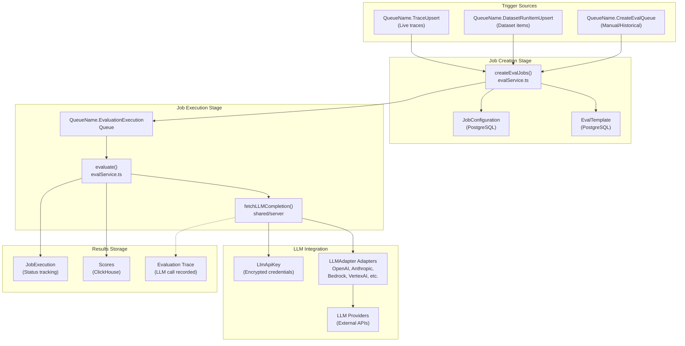
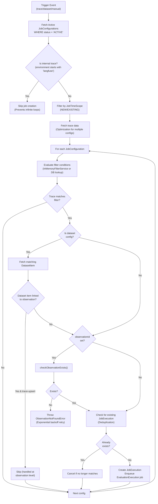
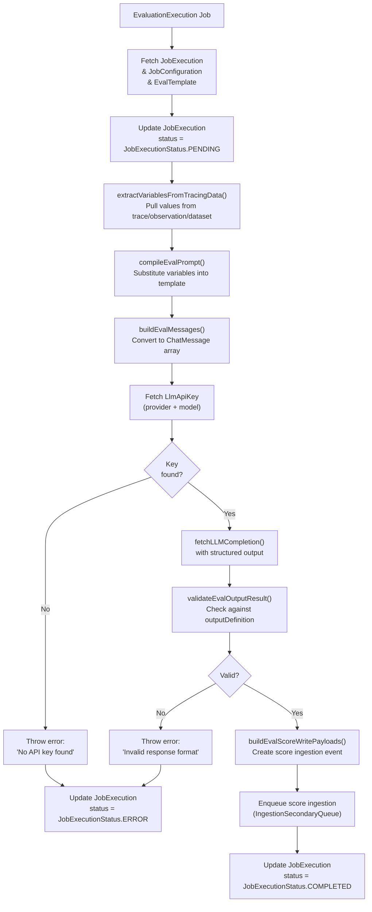

# Evaluation System

Relevant source files

The following files were used as context for generating this wiki page:

- [packages/shared/src/features/evals/types.ts](packages/shared/src/features/evals/types.ts)
- [web/src/features/evals/components/evaluator-table.tsx](web/src/features/evals/components/evaluator-table.tsx)
- [web/src/features/evals/components/inner-evaluator-form.tsx](web/src/features/evals/components/inner-evaluator-form.tsx)
- [web/src/features/evals/components/template-selector.tsx](web/src/features/evals/components/template-selector.tsx)
- [web/src/features/evals/hooks/useEvaluationModel.ts](web/src/features/evals/hooks/useEvaluationModel.ts)
- [web/src/features/evals/server/router.ts](web/src/features/evals/server/router.ts)
- [web/src/features/experiments/components/MultiStepExperimentForm.tsx](web/src/features/experiments/components/MultiStepExperimentForm.tsx)
- [web/src/features/experiments/components/steps/EvaluatorsStep.tsx](web/src/features/experiments/components/steps/EvaluatorsStep.tsx)
- [web/src/features/experiments/components/steps/PromptModelStep.tsx](web/src/features/experiments/components/steps/PromptModelStep.tsx)
- [web/src/features/experiments/hooks/useEvaluatorDefaults.ts](web/src/features/experiments/hooks/useEvaluatorDefaults.ts)
- [web/src/features/experiments/hooks/useExperimentEvaluatorData.ts](web/src/features/experiments/hooks/useExperimentEvaluatorData.ts)
- [web/src/features/experiments/hooks/useExperimentPromptData.ts](web/src/features/experiments/hooks/useExperimentPromptData.ts)
- [web/src/features/experiments/types/stepProps.ts](web/src/features/experiments/types/stepProps.ts)
- [web/src/features/experiments/utils/evaluatorMappingUtils.ts](web/src/features/experiments/utils/evaluatorMappingUtils.ts)
- [web/src/features/playground/page/hooks/useModelParams.ts](web/src/features/playground/page/hooks/useModelParams.ts)
- [web/src/utils/getFinalModelParams.tsx](web/src/utils/getFinalModelParams.tsx)
- [worker/src/__tests__/evalService.filtering.test.ts](worker/src/__tests__/evalService.filtering.test.ts)
- [worker/src/__tests__/evalService.test.ts](worker/src/__tests__/evalService.test.ts)
- [worker/src/ee/cloudUsageMetering/handleCloudUsageMeteringJob.ts](worker/src/ee/cloudUsageMetering/handleCloudUsageMeteringJob.ts)
- [worker/src/features/evaluation/evalService.ts](worker/src/features/evaluation/evalService.ts)
- [worker/src/queues/batchExportQueue.ts](worker/src/queues/batchExportQueue.ts)
- [worker/src/queues/cloudUsageMeteringQueue.ts](worker/src/queues/cloudUsageMeteringQueue.ts)
- [worker/src/queues/evalQueue.ts](worker/src/queues/evalQueue.ts)

## Purpose and Scope

This document describes the evaluation system in Langfuse, which implements automated LLM-as-a-Judge evaluations for traces, observations, and dataset items. The system enables users to configure evaluation jobs that automatically score incoming data using LLM models.

For information about dataset management and experimentation workflows, see [Datasets & Experiments](#9.4). For details about the scoring data model and score configurations, see [Scores & Scoring](#9.2). For queue infrastructure and background job processing, see [Queue & Worker System](#7).

---

## System Overview

The evaluation system follows a three-stage pipeline: **Configuration → Job Creation → Job Execution**. Jobs are triggered by trace creation, dataset run item creation, or manual execution from the UI. The system uses BullMQ queues for asynchronous processing and supports multiple LLM providers through a unified adapter interface.

### Evaluation System Architecture

**Sources:** [worker/src/features/evaluation/evalService.ts:94-144](), [worker/src/queues/evalQueue.ts:25-116](), [worker/src/queues/evalQueue.ts:16-17]()

---

## Job Configuration Entities

Evaluation jobs are defined by two PostgreSQL entities: `JobConfiguration` and `EvalTemplate`.

### JobConfiguration

The `JobConfiguration` entity defines when and how evaluation jobs should be created. It supports various target objects including `TRACE`, `DATASET`, `EVENT`, and `EXPERIMENT` [web/src/features/evals/server/router.ts:83-83]().

| Field | Type | Purpose |
|-------|------|---------|
| `id` | string | Unique identifier |
| `projectId` | string | Project scope |
| `evalTemplateId` | string | References `EvalTemplate` |
| `status` | `JobConfigState` | ACTIVE/PAUSED/INACTIVE [web/src/features/evals/server/router.ts:92-92]() |
| `targetObject` | `EvalTargetObject` | TRACE/DATASET/EVENT/EXPERIMENT [packages/shared/src/features/evals/types.ts:3-8]() |
| `filter` | `singleFilter[]` | Filtering conditions (traces/dataset items) |
| `variableMapping` | JSON | Maps template variables to data sources [packages/shared/src/features/evals/types.ts:63-82]() |
| `timeScope` | `JobTimeScope[]` | NEW/EXISTING - controls historical execution [packages/shared/src/features/evals/types.ts:199-202]() |
| `sampling` | `Decimal` | Percentage of matching items to evaluate |
| `delay` | number | Milliseconds to wait before job execution |

**Sources:** [worker/src/features/evaluation/evalService.ts:3-9](), [web/src/features/evals/server/router.ts:78-117](), [packages/shared/src/features/evals/types.ts:3-202]()

### EvalTemplate

The `EvalTemplate` entity defines the LLM evaluation prompt and scoring schema.

| Field | Type | Purpose |
|-------|------|---------|
| `id` | string | Unique identifier |
| `name` | string | Template name |
| `prompt` | string | Mustache template with variables |
| `outputDefinition` | JSON | `PersistedEvalOutputDefinitionSchema` [web/src/features/evals/server/router.ts:150-150]() |
| `provider` | string | LLM provider |
| `model` | string | Model name |
| `modelParams` | JSON | Model configuration (temperature, etc.) |

The `prompt` field uses Mustache syntax for variable substitution (e.g., `{{input}}`, `{{output}}`). The `outputDefinition` defines the expected structure of the LLM response, typically containing reasoning and score fields [worker/src/__tests__/evalService.test.ts:76-83]().

**Sources:** [worker/src/features/evaluation/evalService.ts:3-9](), [web/src/features/evals/server/router.ts:100-116](), [worker/src/__tests__/evalService.test.ts:75-83]()

---

## Job Creation Pipeline

Job creation is triggered by three sources: trace upserts, dataset run item upserts, and manual execution from the UI. The `createEvalJobs` function handles all cases, including live data (TraceQueue, DatasetRunItemUpsert) and historical batch data (CreateEvalQueue) [worker/src/features/evaluation/evalService.ts:83-107]().

### Job Creation Flow

**Sources:** [worker/src/features/evaluation/evalService.ts:83-146](), [worker/src/queues/evalQueue.ts:25-116]()

---

## Job Execution Pipeline

Job execution is handled by the `evaluate()` function, which processes `EvaluationExecution` queue jobs. It manages the full lifecycle from variable extraction to scoring [worker/src/features/evaluation/evalService.ts:16-16]().

### Execution Flow

**Sources:** [worker/src/features/evaluation/evalService.ts:16-16](), [worker/src/features/evaluation/evalService.ts:71-77](), [worker/src/queues/evalQueue.ts:176-176]()

---

## LLM Integration Layer

The evaluation system integrates with LLM providers through a unified abstraction, supporting encryption and structured outputs via `fetchLLMCompletion` [worker/src/features/evaluation/evalService.ts:34-34]().

### LLM API Key Management

LLM credentials are stored in the `LlmApiKey` table with encryption. The system validates model configurations before job execution. If an LLM call fails with a non-retryable error, `blockEvaluatorConfigs` is used to prevent further executions of that configuration to save costs [worker/src/features/evaluation/evalService.ts:34-36]().

---

## Queue Architecture

The evaluation system uses sharded and secondary queues to handle high volumes of evaluations and project-specific redirection [worker/src/queues/evalQueue.ts:118-157]().

| Queue Name | Processor | Purpose |
|------------|-----------|---------|
| `QueueName.TraceUpsert` | `evalJobTraceCreatorQueueProcessor` | Triggers evals for live traces [worker/src/queues/evalQueue.ts:25-44]() |
| `QueueName.DatasetRunItemUpsert` | `evalJobDatasetCreatorQueueProcessor` | Triggers evals for dataset items [worker/src/queues/evalQueue.ts:46-96]() |
| `QueueName.CreateEvalQueue` | `evalJobCreatorQueueProcessor` | Triggers evals for historical data [worker/src/queues/evalQueue.ts:98-116]() |
| `QueueName.EvaluationExecution` | `evalJobExecutorQueueProcessorBuilder` | Executes LLM calls [worker/src/queues/evalQueue.ts:118-177]() |
| `QueueName.EvaluationExecutionSecondaryQueue` | Same as above | Secondary queue for high-load projects [worker/src/queues/evalQueue.ts:142-154]() |

---

## Error Handling and Retries

The system implements sophisticated retry logic, distinguishing between rate limits, missing data, and unrecoverable configuration errors [worker/src/queues/evalQueue.ts:178-202]().

- **LLM Rate Limits**: If a 429 or 5xx error occurs, the system reschedules the job with a manual delay if the job is less than 24 hours old [worker/src/queues/evalQueue.ts:184-200]().
- **Observation Not Found**: If an observation isn't yet available (eventual consistency), `retryObservationNotFound` implements an exponential backoff [worker/src/queues/evalQueue.ts:59-86]().
- **Unrecoverable Errors**: Errors like invalid schemas or missing API keys mark the `JobExecution` as `ERROR` and stop retries [worker/src/queues/evalQueue.ts:195-200]().

---

## Child Pages

- [Evaluation Overview](#10.1) — Detailed workflow from configuration to scoring.
- [Job Configuration](#10.2) — Documenting the `JobConfiguration` model and filters.
- [Job Creation Pipeline](#10.3) — The `createEvalJobs` function and filter matching logic.
- [Job Execution](#10.4) — `JobExecution` lifecycle and prompt compilation.
- [LLM Integration](#10.5) — `fetchLLMCompletion` and LLM-as-Judge structured outputs.
- [Annotation Queues](#10.6) — Human-in-the-loop workflows and `AnnotationQueueItem`.
- [LLM API Key Management](#10.7) — Secure storage and provider adapters.
- [LLM Playground](#10.8) — Model parameter tuning and testing interface.
