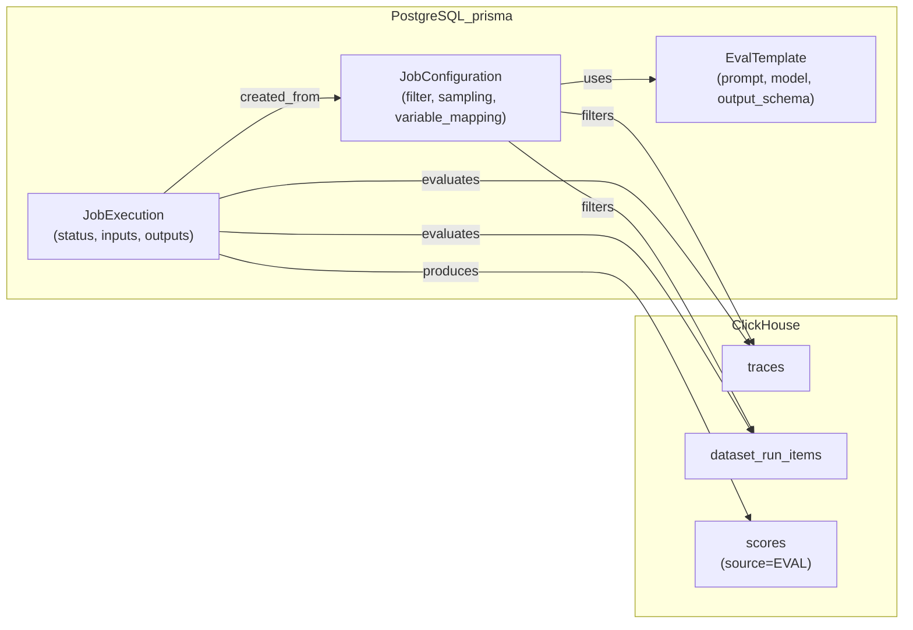
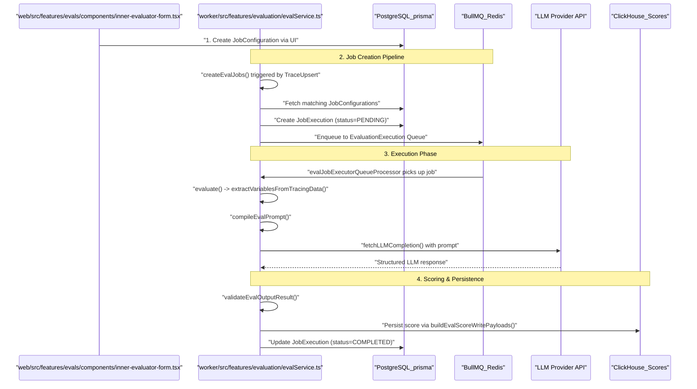

# Evaluation Overview

Relevant source files

The following files were used as context for generating this wiki page:

- [fern/apis/server/definition/unstable/commons.yml](fern/apis/server/definition/unstable/commons.yml)
- [fern/apis/server/definition/unstable/evaluation-rules.yml](fern/apis/server/definition/unstable/evaluation-rules.yml)
- [packages/shared/src/features/evals/observationForEval.ts](packages/shared/src/features/evals/observationForEval.ts)
- [packages/shared/src/features/evals/utilities.ts](packages/shared/src/features/evals/utilities.ts)
- [web/src/__tests__/server/event-query-builder.servertest.ts](web/src/__tests__/server/event-query-builder.servertest.ts)
- [web/src/features/evals/components/evaluator-table.tsx](web/src/features/evals/components/evaluator-table.tsx)
- [web/src/features/evals/components/inner-evaluator-form.tsx](web/src/features/evals/components/inner-evaluator-form.tsx)
- [web/src/features/evals/components/variable-mapping-card.tsx](web/src/features/evals/components/variable-mapping-card.tsx)
- [web/src/features/evals/hooks/useEvalCapabilities.ts](web/src/features/evals/hooks/useEvalCapabilities.ts)
- [web/src/features/evals/hooks/useEvaluatorTarget.ts](web/src/features/evals/hooks/useEvaluatorTarget.ts)
- [web/src/features/evals/server/router.ts](web/src/features/evals/server/router.ts)
- [web/src/features/evals/server/unstable-public-api/adapters.ts](web/src/features/evals/server/unstable-public-api/adapters.ts)
- [web/src/features/evals/server/unstable-public-api/validation.ts](web/src/features/evals/server/unstable-public-api/validation.ts)
- [web/src/features/evals/utils/evaluator-form-utils.ts](web/src/features/evals/utils/evaluator-form-utils.ts)
- [web/src/features/public-api/types/unstable-public-evals-contract.ts](web/src/features/public-api/types/unstable-public-evals-contract.ts)
- [worker/src/__tests__/evalService.filtering.test.ts](worker/src/__tests__/evalService.filtering.test.ts)
- [worker/src/__tests__/evalService.test.ts](worker/src/__tests__/evalService.test.ts)
- [worker/src/ee/cloudUsageMetering/handleCloudUsageMeteringJob.ts](worker/src/ee/cloudUsageMetering/handleCloudUsageMeteringJob.ts)
- [worker/src/features/evaluation/__tests__/extractValueFromObject.test.ts](worker/src/features/evaluation/__tests__/extractValueFromObject.test.ts)
- [worker/src/features/evaluation/evalService.ts](worker/src/features/evaluation/evalService.ts)
- [worker/src/features/evaluation/observationEval/__tests__/extractObservationVariables.test.ts](worker/src/features/evaluation/observationEval/__tests__/extractObservationVariables.test.ts)
- [worker/src/features/evaluation/observationEval/extractObservationVariables.ts](worker/src/features/evaluation/observationEval/extractObservationVariables.ts)
- [worker/src/queues/batchExportQueue.ts](worker/src/queues/batchExportQueue.ts)
- [worker/src/queues/cloudUsageMeteringQueue.ts](worker/src/queues/cloudUsageMeteringQueue.ts)
- [worker/src/queues/evalQueue.ts](worker/src/queues/evalQueue.ts)

The Langfuse evaluation system enables automated assessment of LLM outputs using the LLM-as-Judge pattern. The system allows users to define evaluation criteria, configure when evaluations run, and automatically execute evaluations against traces, observations, and dataset experiments.

This page provides a high-level overview of the evaluation workflow. For detailed information on specific components:
- Configuration settings and filters: see page 10.2 Job Configuration
- Job creation pipeline and deduplication: see page 10.3 Job Creation Pipeline
- Job execution lifecycle and error handling: see page 10.4 Job Execution
- LLM provider integration and calling logic: see page 10.5 LLM Integration
- Human-in-the-loop annotation workflows: see page 10.6 Annotation Queues
- LLM API key management and encryption: see page 10.7 LLM API Key Management
- Playground UI for testing evaluations: see page 10.8 LLM Playground

**Sources:** [worker/src/features/evaluation/evalService.ts:83-107](), [web/src/features/evals/server/router.ts:158-173]()

---

## Core Components

The evaluation system operates through three primary database entities defined in the Prisma schema and synchronized with ClickHouse for analytical scoring.

**Diagram: Database Entity Relationships**

**Sources:** [worker/src/features/evaluation/evalService.ts:3-9](), [web/src/features/evals/server/router.ts:78-117]()

| Component | Purpose | Key Code Symbols |
|-----------|---------|------------|
| `EvalTemplate` | Defines the evaluation logic (LLM prompt, model parameters, and output schema) | `EvalTemplate` [worker/src/features/evaluation/evalService.ts:8]() |
| `JobConfiguration` | Defines when and how evaluations run (filters, sampling, mapping) | `JobConfiguration` [worker/src/features/evaluation/evalService.ts:7]() |
| `JobExecution` | Tracks individual evaluation instances and their status | `JobExecution` [worker/src/features/evaluation/evalService.ts:6]() |

The template defines *what* to evaluate, the configuration defines *when* and *where* to evaluate, and the execution tracks each evaluation run.

**Sources:** [worker/src/features/evaluation/evalService.ts:3-9](), [web/src/features/evals/server/router.ts:78-117]()

---

## Evaluation Workflow

The evaluation system follows a four-stage workflow: configuration → job creation → execution → scoring.

**Diagram: End-to-End Evaluation Workflow**

**Sources:** [worker/src/features/evaluation/evalService.ts:98-145](), [worker/src/queues/evalQueue.ts:127-177](), [web/src/features/evals/components/inner-evaluator-form.tsx:50-58]()

### Stage 1: Configuration

Users create a `JobConfiguration` which includes:
- **Target**: Whether to evaluate a `TRACE`, `DATASET`, `EVENT`, or `EXPERIMENT` [web/src/features/evals/server/router.ts:28-30]().
- **Filters**: Criteria matching specific traces or observations [web/src/features/evals/components/inner-evaluator-form.tsx:163-168]().
- **Variable Mapping**: Mapping trace/observation fields to prompt variables using `variableMapping` or `observationVariableMapping` [web/src/features/evals/server/router.ts:85-89]().
- **Sampling**: A value between 0 and 1 for randomized evaluation [web/src/features/evals/server/router.ts:169]().

**Sources:** [web/src/features/evals/server/router.ts:158-173](), [web/src/features/evals/utils/evaluator-form-utils.ts:16-25]()

### Stage 2: Job Creation

The `createEvalJobs` function [worker/src/features/evaluation/evalService.ts:16]() is the entry point for the pipeline. It is triggered by three main queue processors:
1. `evalJobTraceCreatorQueueProcessor`: Handles live trace ingestion (`QueueName.TraceUpsert`) [worker/src/queues/evalQueue.ts:25-34]().
2. `evalJobDatasetCreatorQueueProcessor`: Handles dataset run items (`QueueName.DatasetRunItemUpsert`) [worker/src/queues/evalQueue.ts:46-55]().
3. `evalJobCreatorQueueProcessor`: Handles manual/historical batch creation from the UI (`QueueName.CreateEvalQueue`) [worker/src/queues/evalQueue.ts:98-106]().

The pipeline performs filter matching and creates `JobExecution` records in PostgreSQL before enqueuing to the `EvaluationExecution` queue [worker/src/queues/evalQueue.ts:151-154]().

**Sources:** [worker/src/queues/evalQueue.ts:25-154](), [worker/src/features/evaluation/evalService.ts:83-145]()

### Stage 3: Job Execution

The `evalJobExecutorQueueProcessorBuilder` [worker/src/queues/evalQueue.ts:118]() generates processors for execution jobs. The core logic resides in the `evaluate` function [worker/src/features/evaluation/evalService.ts:176]():
1. **Data Extraction**: `extractVariablesFromTracingData` [worker/src/__tests__/evalService.test.ts:33]() retrieves the necessary inputs from tracing data.
2. **Prompt Compilation**: `compileEvalPrompt` [worker/src/features/evaluation/evalService.ts:71]() injects variables into the `EvalTemplate`.
3. **LLM Call**: Uses `fetchLLMCompletion` [worker/src/__tests__/evalService.test.ts:49]() to get a response from configured providers.
4. **Validation**: `validateEvalOutputResult` [worker/src/features/evaluation/evalService.ts:61]() ensures the LLM output conforms to the expected `ScoreDataTypeEnum` [worker/src/features/evaluation/evalService.ts:60]().

**Sources:** [worker/src/features/evaluation/evalService.ts:60-75](), [worker/src/queues/evalQueue.ts:118-177]()

### Stage 4: Scoring

Once evaluated, the system creates score payloads using `buildEvalScoreWritePayloads` [worker/src/features/evaluation/evalService.ts:76](). These scores are written to the database to be associated with the target trace or observation.

**Sources:** [worker/src/features/evaluation/evalService.ts:76]()

---

## Integration with Traces and Datasets

The evaluation system supports multiple `EvalTargetObject` types to allow granular assessment:

| Target | Description | Code Constant |
|--------|-------------|---------------|
| `TRACE` | Evaluates an entire trace context | `EvalTargetObject.TRACE` [worker/src/features/evaluation/evalService.ts:54]() |
| `DATASET` | Evaluates a single `dataset_item` | `EvalTargetObject.DATASET` [worker/src/features/evaluation/evalService.ts:54]() |
| `EVENT` | Evaluates individual spans/generations | `EvalTargetObject.EVENT` [worker/src/features/evaluation/evalService.ts:54]() |
| `EXPERIMENT` | Evaluates dataset runs/experiments | `EvalTargetObject.EXPERIMENT` [worker/src/features/evaluation/evalService.ts:54]() |

### Live vs Historical Evaluation

The `timeScope` parameter determines the execution timing:
- **NEW**: Triggered immediately upon ingestion of new data (live evaluation) [worker/src/queues/evalQueue.ts:33]().
- **EXISTING**: Triggered manually via the UI for historical backfills [worker/src/queues/evalQueue.ts:103]().

**Sources:** [worker/src/queues/evalQueue.ts:33-103](), [web/src/features/evals/utils/evaluator-form-utils.ts:23]()

---

## Error Handling & Reliability

The system implements robust error handling for LLM calls:
- **Retryable Errors**: `isLLMCompletionError` [worker/src/features/evaluation/evalService.ts:34]() identifies 429 (Rate Limit) and 5xx (Server Error) to trigger re-enqueuing with exponential backoff [worker/src/queues/evalQueue.ts:185-201]().
- **Unrecoverable Errors**: `UnrecoverableError` [worker/src/features/evaluation/evalService.ts:68]() marks the `JobExecution` as `ERROR` and stops retries.
- **Config Blocking**: If an evaluator consistently fails (e.g., due to invalid model parameters), it is blocked using `blockEvaluatorConfigs` [worker/src/features/evaluation/evalService.ts:35]() with a specific `EvaluatorBlockReason` [worker/src/features/evaluation/evalService.ts:55]().

**Sources:** [worker/src/queues/evalQueue.ts:178-201](), [worker/src/features/evaluation/evalService.ts:34-36](), [worker/src/features/evaluation/evalService.ts:55-57]()
