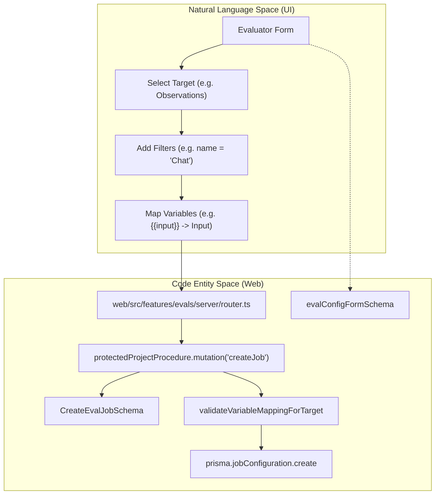
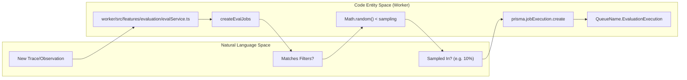

# Job Configuration

Relevant source files

The following files were used as context for generating this wiki page:

- [fern/apis/server/definition/unstable/commons.yml](fern/apis/server/definition/unstable/commons.yml)
- [fern/apis/server/definition/unstable/evaluation-rules.yml](fern/apis/server/definition/unstable/evaluation-rules.yml)
- [packages/shared/src/features/evals/observationForEval.ts](packages/shared/src/features/evals/observationForEval.ts)
- [packages/shared/src/features/evals/types.ts](packages/shared/src/features/evals/types.ts)
- [packages/shared/src/features/evals/utilities.ts](packages/shared/src/features/evals/utilities.ts)
- [web/src/__tests__/server/event-query-builder.servertest.ts](web/src/__tests__/server/event-query-builder.servertest.ts)
- [web/src/features/evals/components/evaluator-table.tsx](web/src/features/evals/components/evaluator-table.tsx)
- [web/src/features/evals/components/inner-evaluator-form.tsx](web/src/features/evals/components/inner-evaluator-form.tsx)
- [web/src/features/evals/components/template-selector.tsx](web/src/features/evals/components/template-selector.tsx)
- [web/src/features/evals/components/variable-mapping-card.tsx](web/src/features/evals/components/variable-mapping-card.tsx)
- [web/src/features/evals/hooks/useEvalCapabilities.ts](web/src/features/evals/hooks/useEvalCapabilities.ts)
- [web/src/features/evals/hooks/useEvaluationModel.ts](web/src/features/evals/hooks/useEvaluationModel.ts)
- [web/src/features/evals/hooks/useEvaluatorTarget.ts](web/src/features/evals/hooks/useEvaluatorTarget.ts)
- [web/src/features/evals/server/router.ts](web/src/features/evals/server/router.ts)
- [web/src/features/evals/server/unstable-public-api/adapters.ts](web/src/features/evals/server/unstable-public-api/adapters.ts)
- [web/src/features/evals/server/unstable-public-api/validation.ts](web/src/features/evals/server/unstable-public-api/validation.ts)
- [web/src/features/evals/utils/evaluator-form-utils.ts](web/src/features/evals/utils/evaluator-form-utils.ts)
- [web/src/features/experiments/components/MultiStepExperimentForm.tsx](web/src/features/experiments/components/MultiStepExperimentForm.tsx)
- [web/src/features/experiments/components/steps/EvaluatorsStep.tsx](web/src/features/experiments/components/steps/EvaluatorsStep.tsx)
- [web/src/features/experiments/components/steps/PromptModelStep.tsx](web/src/features/experiments/components/steps/PromptModelStep.tsx)
- [web/src/features/experiments/hooks/useEvaluatorDefaults.ts](web/src/features/experiments/hooks/useEvaluatorDefaults.ts)
- [web/src/features/experiments/hooks/useExperimentEvaluatorData.ts](web/src/features/experiments/hooks/useExperimentEvaluatorData.ts)
- [web/src/features/experiments/hooks/useExperimentPromptData.ts](web/src/features/experiments/hooks/useExperimentPromptData.ts)
- [web/src/features/experiments/types/stepProps.ts](web/src/features/experiments/types/stepProps.ts)
- [web/src/features/experiments/utils/evaluatorMappingUtils.ts](web/src/features/experiments/utils/evaluatorMappingUtils.ts)
- [web/src/features/playground/page/hooks/useModelParams.ts](web/src/features/playground/page/hooks/useModelParams.ts)
- [web/src/features/public-api/types/unstable-public-evals-contract.ts](web/src/features/public-api/types/unstable-public-evals-contract.ts)
- [web/src/utils/getFinalModelParams.tsx](web/src/utils/getFinalModelParams.tsx)
- [worker/src/__tests__/evalService.filtering.test.ts](worker/src/__tests__/evalService.filtering.test.ts)
- [worker/src/__tests__/evalService.test.ts](worker/src/__tests__/evalService.test.ts)
- [worker/src/ee/cloudUsageMetering/handleCloudUsageMeteringJob.ts](worker/src/ee/cloudUsageMetering/handleCloudUsageMeteringJob.ts)
- [worker/src/features/evaluation/__tests__/extractValueFromObject.test.ts](worker/src/features/evaluation/__tests__/extractValueFromObject.test.ts)
- [worker/src/features/evaluation/evalService.ts](worker/src/features/evaluation/evalService.ts)
- [worker/src/features/evaluation/observationEval/__tests__/extractObservationVariables.test.ts](worker/src/features/evaluation/observationEval/__tests__/extractObservationVariables.test.ts)
- [worker/src/features/evaluation/observationEval/extractObservationVariables.ts](worker/src/features/evaluation/observationEval/extractObservationVariables.ts)
- [worker/src/queues/batchExportQueue.ts](worker/src/queues/batchExportQueue.ts)
- [worker/src/queues/cloudUsageMeteringQueue.ts](worker/src/queues/cloudUsageMeteringQueue.ts)
- [worker/src/queues/evalQueue.ts](worker/src/queues/evalQueue.ts)

## Purpose and Scope

Job configurations define when and how LLM-as-a-judge evaluations are triggered in response to traces, observations, and dataset runs. A job configuration acts as a persistent trigger that specifies filtering criteria, variable mapping, sampling rates, execution delays, and target objects for automated evaluation.

The system uses a dual-service architecture where the Web service manages configuration via a tRPC API, and the Worker service orchestrates job creation and execution via BullMQ queues.

---

## Database Schema

### JobConfiguration Table

The `JobConfiguration` model in Prisma defines the structure for evaluation triggers. Configurations are validated against the `ConfigWithTemplateSchema` when fetched from the database to ensure type safety [web/src/features/evals/server/router.ts:78-117]().

| Field | Type | Description |
|-------|------|-------------|
| `id` | String | Unique identifier (cuid) |
| `projectId` | String | Project this config belongs to |
| `jobType` | JobType | Currently always `EVAL` [web/src/features/evals/server/router.ts:96]() |
| `status` | JobConfigState | `ACTIVE`, `PAUSED`, or `INACTIVE` [web/src/features/evals/server/router.ts:92]() |
| `evalTemplateId` | String | References the LLM prompt template [web/src/features/evals/server/router.ts:81]() |
| `scoreName` | String | Name of the resulting score in Langfuse [web/src/features/evals/server/router.ts:82]() |
| `filter` | Json | Array of `singleFilter` objects [web/src/features/evals/server/router.ts:84]() |
| `targetObject` | EvalTargetObject | Entity to evaluate (e.g., "trace", "event") [web/src/features/evals/server/router.ts:83]() |
| `variableMapping` | Json | Maps trace data to template variables [web/src/features/evals/server/router.ts:86-89]() |
| `sampling` | Decimal | Probability (0.0 to 1.0) [web/src/features/evals/server/router.ts:90]() |
| `delay` | Int | Seconds to wait before execution [web/src/features/evals/server/router.ts:91]() |
| `timeScope` | TimeScopeSchema | `NEW` (live) or `EXISTING` (backfill) [web/src/features/evals/server/router.ts:99]() |
| `blockedAt` | DateTime | Timestamp when the evaluator was blocked due to errors [web/src/features/evals/server/router.ts:93]() |
| `blockReason` | EvaluatorBlockReason | Reason for blocking (e.g., `EVAL_MODEL_CONFIG_INVALID`) [web/src/features/evals/server/router.ts:94]() |

**Sources:** [web/src/features/evals/server/router.ts:78-117](), [packages/shared/src/features/evals/types.ts:1-203]()

---

## Target Objects

Job configurations specify which entity type to evaluate via the `EvalTargetObject` schema [packages/shared/src/features/evals/types.ts:3-13]().

| Target | Display Name | Code Entity |
|--------|-------------|-------------|
| `trace` | "traces" | `EvalTargetObject.TRACE` [packages/shared/src/features/evals/types.ts:4]() |
| `dataset` | "dataset run items" | `EvalTargetObject.DATASET` [packages/shared/src/features/evals/types.ts:5]() |
| `event` | "observations" | `EvalTargetObject.EVENT` [packages/shared/src/features/evals/types.ts:6]() |
| `experiment` | "experiments" | `EvalTargetObject.EXPERIMENT` [packages/shared/src/features/evals/types.ts:7]() |

The `getEvalTargetObjectFromSourceTable` function handles mapping between UI source tables and these internal target types [packages/shared/src/features/evals/types.ts:36-42]().

**Sources:** [packages/shared/src/features/evals/types.ts:3-42](), [web/src/features/evals/utils/evaluator-form-utils.ts:54-67]()

---

## Configuration Lifecycle

The following diagram maps the UI interaction in the "Natural Language Space" to the underlying "Code Entity Space" in the Web application.

Title: Evaluator Configuration Data Flow

**Sources:** [web/src/features/evals/server/router.ts:158-173](), [web/src/features/evals/server/router.ts:188-207](), [web/src/features/evals/utils/evaluator-form-utils.ts:50-55]()

---

## Variable Mapping

Variable mapping bridges Langfuse's internal data and the input variables required by an `EvalTemplate`.

### Mapping Types
1.  **Standard Mapping (`variableMapping`):** Used for Traces and Datasets. It requires `langfuseObject` (e.g., "span", "generation") and `objectName` to identify which specific observation to extract from [packages/shared/src/features/evals/types.ts:63-82]().
2.  **Observation Mapping (`observationVariableMapping`):** Simplified for `EVENT` and `EXPERIMENT` targets. Since the observation is already targeted directly, the mapping is flattened and omits `objectName` [packages/shared/src/features/evals/types.ts:207-211]().

### Available Columns
Variables are extracted from fields like `input`, `output`, and `metadata`. For traces, these are mapped to `t."input"` or `t."metadata"`, while for observations they are mapped to `o."input"` [packages/shared/src/features/evals/types.ts:97-173]().

**Sources:** [packages/shared/src/features/evals/types.ts:63-211](), [web/src/features/evals/server/router.ts:188-207]()

---

## Filtering and Sampling

### Filter Implementation
Filters are defined using the `singleFilter` schema and applied to the target object [web/src/features/evals/server/router.ts:84](). In the UI, `InlineFilterBuilder` manages these [web/src/features/evals/components/inner-evaluator-form.tsx:34](). The system uses `validateEvaluatorFiltersForTarget` to ensure filters are compatible with the selected target [worker/src/features/evaluation/evalService.ts:63]().

### Job Creation Pipeline
When events occur, the worker processes them via `createEvalJobs`. It determines which configurations match based on the `sourceEventType` and filters [worker/src/features/evaluation/evalService.ts:84-141]().

Title: Evaluation Job Creation and Sampling

**Sources:** [worker/src/features/evaluation/evalService.ts:84-141](), [worker/src/queues/evalQueue.ts:25-44](), [web/src/features/evals/components/inner-evaluator-form.tsx:113-147]()

---

## Operational Controls

### Status and Blocking
Evaluators can be `ACTIVE`, `PAUSED`, or `INACTIVE` [web/src/features/evals/server/router.ts:92]().
- **Blocking:** If an evaluator fails due to invalid model configurations, it is moved to a blocked state via `blockEvaluatorConfigs` [worker/src/features/evaluation/evalService.ts:35](). Reasons include `EVAL_MODEL_CONFIG_INVALID` [worker/src/features/evaluation/evalService.ts:57]().
- **State Reset:** Block fields are reset when a configuration is manually updated or reactivated via `resetEvalConfigBlockFields` [web/src/features/evals/server/router.ts:62]().

### Time Scope
The `timeScope` determines if the job runs for live data or historical backfills [packages/shared/src/features/evals/types.ts:199-202]().
- `NEW`: Triggered by `TraceUpsert` or `DatasetRunItemUpsert` events [worker/src/queues/evalQueue.ts:33, 54]().
- `EXISTING`: Used for historical batch processing via the UI [worker/src/queues/evalQueue.ts:102-106]().

**Sources:** [worker/src/features/evaluation/evalService.ts:35-57](), [worker/src/queues/evalQueue.ts:25-116](), [web/src/features/evals/server/router.ts:92-95]()
