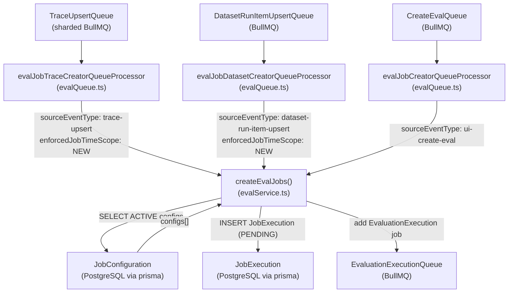
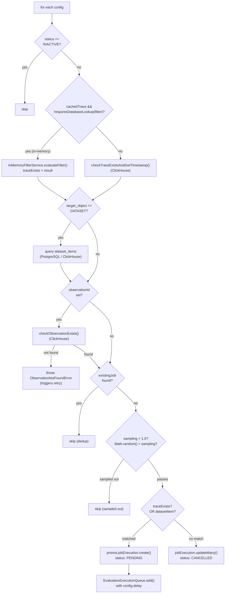
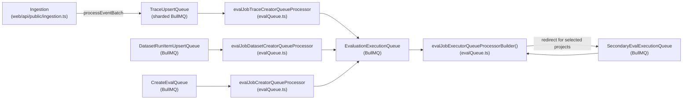

# Job Creation Pipeline

<details>
<summary>Relevant source files</summary>

The following files were used as context for generating this wiki page:

- [fern/apis/server/definition/unstable/commons.yml](fern/apis/server/definition/unstable/commons.yml)
- [fern/apis/server/definition/unstable/evaluation-rules.yml](fern/apis/server/definition/unstable/evaluation-rules.yml)
- [packages/shared/src/features/evals/observationForEval.ts](packages/shared/src/features/evals/observationForEval.ts)
- [packages/shared/src/features/evals/utilities.ts](packages/shared/src/features/evals/utilities.ts)
- [web/src/__tests__/server/event-query-builder.servertest.ts](web/src/__tests__/server/event-query-builder.servertest.ts)
- [web/src/features/evals/components/evaluator-table.tsx](web/src/features/evals/components/evaluator-table.tsx)
- [web/src/features/evals/components/inner-evaluator-form.tsx](web/src/features/evals/components/inner-evaluator-form.tsx)
- [web/src/features/evals/components/variable-mapping-card.tsx](web/src/features/evals/components/variable-mapping-card.tsx)
- [web/src/features/evals/hooks/useEvalCapabilities.ts](web/src/features/evals/hooks/useEvalCapabilities.ts)
- [web/src/features/evals/hooks/useEvaluatorTarget.ts](web/src/features/evals/hooks/useEvaluatorTarget.ts)
- [web/src/features/evals/server/router.ts](web/src/features/evals/server/router.ts)
- [web/src/features/evals/server/unstable-public-api/adapters.ts](web/src/features/evals/server/unstable-public-api/adapters.ts)
- [web/src/features/evals/server/unstable-public-api/validation.ts](web/src/features/evals/server/unstable-public-api/validation.ts)
- [web/src/features/evals/utils/evaluator-form-utils.ts](web/src/features/evals/utils/evaluator-form-utils.ts)
- [web/src/features/public-api/types/unstable-public-evals-contract.ts](web/src/features/public-api/types/unstable-public-evals-contract.ts)
- [worker/src/__tests__/evalService.filtering.test.ts](worker/src/__tests__/evalService.filtering.test.ts)
- [worker/src/__tests__/evalService.test.ts](worker/src/__tests__/evalService.test.ts)
- [worker/src/ee/cloudUsageMetering/handleCloudUsageMeteringJob.ts](worker/src/ee/cloudUsageMetering/handleCloudUsageMeteringJob.ts)
- [worker/src/features/evaluation/__tests__/extractValueFromObject.test.ts](worker/src/features/evaluation/__tests__/extractValueFromObject.test.ts)
- [worker/src/features/evaluation/evalService.ts](worker/src/features/evaluation/evalService.ts)
- [worker/src/features/evaluation/observationEval/__tests__/extractObservationVariables.test.ts](worker/src/features/evaluation/observationEval/__tests__/extractObservationVariables.test.ts)
- [worker/src/features/evaluation/observationEval/extractObservationVariables.ts](worker/src/features/evaluation/observationEval/extractObservationVariables.ts)
- [worker/src/queues/batchExportQueue.ts](worker/src/queues/batchExportQueue.ts)
- [worker/src/queues/cloudUsageMeteringQueue.ts](worker/src/queues/cloudUsageMeteringQueue.ts)
- [worker/src/queues/evalQueue.ts](worker/src/queues/evalQueue.ts)

</details>


This page documents how evaluation jobs are created when traces, observations, or dataset run items are ingested. It covers the queue processors that receive trigger events, the `createEvalJobs` function that determines which evaluators apply, the filtering and validation logic, and how `JobExecution` records are created and handed off to the execution queue.

For how evaluators are configured in the first place, see [Job Configuration](10.2). For how the created `JobExecution` records are actually run (LLM calls, score writing), see [Job Execution](10.4).

---

## Overview

The evaluation job creation pipeline activates whenever a new trace, observation, or dataset run item is processed. It answers the question: *given this new data, which active evaluator configurations should produce a job execution?*

The pipeline is fully asynchronous. It runs inside the worker process, driven by BullMQ queues. The main entry point is the `createEvalJobs` function in `worker/src/features/evaluation/evalService.ts` [[worker/src/features/evaluation/evalService.ts:83-95]]().

**Trigger sources**

| Source Queue | Event Type | Processor Function | Enforced Time Scope |
|---|---|---|---|
| `TraceUpsert` | `TraceQueueEventType` | `evalJobTraceCreatorQueueProcessor` | `NEW` [[worker/src/queues/evalQueue.ts:33]]() |
| `DatasetRunItemUpsert` | `DatasetRunItemUpsertEventType` | `evalJobDatasetCreatorQueueProcessor` | `NEW` [[worker/src/queues/evalQueue.ts:54]]() |
| `CreateEvalQueue` | `CreateEvalQueueEventType` | `evalJobCreatorQueueProcessor` | none [[worker/src/queues/evalQueue.ts:102]]() |

The `CreateEvalQueue` is used when a user configures a new evaluator via the UI and selects "run on existing data" or triggers a batch action — this bypasses the `NEW`-only restriction [[worker/src/queues/evalQueue.ts:98-116]]().

Sources: `worker/src/queues/evalQueue.ts`, `worker/src/features/evaluation/evalService.ts`

---

## End-to-End Flow

**Diagram: Job Creation Pipeline — Queue to Database**



Sources: `worker/src/queues/evalQueue.ts`, `worker/src/features/evaluation/evalService.ts`

---

## Queue Processors

Three processors in `worker/src/queues/evalQueue.ts` bridge the BullMQ jobs to the `createEvalJobs` function.

### `evalJobTraceCreatorQueueProcessor`

Consumes jobs from the `TraceUpsert` queue. Passes `enforcedJobTimeScope: "NEW"` so that evaluator configurations restricted to historical data (`EXISTING` only) are skipped [[worker/src/queues/evalQueue.ts:25-35]](). Any error is logged and re-thrown so BullMQ can retry [[worker/src/queues/evalQueue.ts:36-43]]().

### `evalJobDatasetCreatorQueueProcessor`

Consumes jobs from the `DatasetRunItemUpsert` queue. Also enforces `NEW` time scope [[worker/src/queues/evalQueue.ts:46-56]](). Includes special handling for `ObservationNotFoundError`: when an observation linked to a dataset item has not yet propagated to ClickHouse, the processor schedules a manual delayed retry via `retryObservationNotFound` rather than failing [[worker/src/queues/evalQueue.ts:59-86]]().

### `evalJobCreatorQueueProcessor`

Consumes jobs from the `CreateEvalQueue`. Does **not** enforce a time scope, allowing historical evaluations to proceed. This queue is triggered when a user saves a new evaluator configuration via the UI or initiates a batch evaluation action [[worker/src/queues/evalQueue.ts:98-116]]().

Sources: `worker/src/queues/evalQueue.ts`

---

## `createEvalJobs` — Detailed Logic

The function signature accepts a union type covering all three source event types:

```typescript
createEvalJobs({
  event,
  sourceEventType,
  jobTimestamp,
  enforcedJobTimeScope?,
})
```

[[worker/src/features/evaluation/evalService.ts:83-116]]()

### Step 1: Fetch Active Configurations

The service fetches all `ACTIVE` `JobConfiguration` rows for the project with `job_type = 'EVAL'` and `target_object IN ('TRACE', 'DATASET', 'EXPERIMENT', 'EVENT')` [[worker/src/features/evaluation/evalService.ts:179-205]]().

If `configId` is present on the event (UI-triggered path), only that specific configuration is fetched. If `enforcedJobTimeScope` is set, the query adds a filter for `time_scope @> ARRAY['NEW']` [[worker/src/features/evaluation/evalService.ts:218-220]]().

If no active configurations exist, the project ID is written to a Redis no-config cache (`setNoEvalConfigsCache`) to avoid redundant database lookups on subsequent events [[worker/src/features/evaluation/evalService.ts:211-217]]().

### Step 2: Skip Internal Traces

For `trace-upsert` events, any trace whose environment matches the `LangfuseInternalTraceEnvironment` (e.g., traces generated by the evaluation system itself) is skipped [[worker/src/features/evaluation/evalService.ts:240-250]](). This prevents infinite evaluation loops.

### Step 3: Batch Optimization Fetches

Before iterating over configurations, the function performs optional batch fetches to reduce per-config database queries:

| Condition | Fetch | Cache Variable |
|---|---|---|
| More than 1 config total | `getTraceById(traceId, projectId)` | `cachedTrace` [[worker/src/features/evaluation/evalService.ts:257-272]]() |
| More than 1 dataset config | `getDatasetItemIdsByTraceIdCh(traceId)` | `cachedDatasetItemIds` [[worker/src/features/evaluation/evalService.ts:303-317]]() |

It also fetches all existing `job_executions` for the trace across all config IDs in a single query, stored in `allExistingJobs` [[worker/src/features/evaluation/evalService.ts:322-351]]().

### Step 4: Per-Configuration Loop

For each active configuration, the following logic runs:

**Diagram: Per-Config Decision Tree**



Sources: `worker/src/features/evaluation/evalService.ts`

#### 4a. Trace Existence Check

For each config, the function verifies that the referenced trace exists and matches the config's filter conditions.

- **In-memory path**: If `cachedTrace` is available and all filter columns can be evaluated in memory (via `requiresDatabaseLookup()` in `worker/src/features/evaluation/traceFilterUtils.ts` [[worker/src/features/evaluation/traceFilterUtils.ts:35-41]]()), `InMemoryFilterService.evaluateFilter()` is called [[worker/src/features/evaluation/evalService.ts:391-419]]().
- **Database path**: Falls back to `checkTraceExistsAndGetTimestamp()`, a ClickHouse query that applies filter conditions and returns the trace timestamp [[worker/src/features/evaluation/evalService.ts:421-444]]().

#### 4b. Dataset Item Lookup (Dataset Configs Only)

If `target_object === 'DATASET'`:
- When the event contains a `datasetItemId`, the function queries `dataset_items` using filter conditions [[worker/src/features/evaluation/evalService.ts:474-508]]().
- Otherwise, it resolves from `cachedDatasetItemIds` or queries ClickHouse via `getDatasetItemIdsByTraceIdCh` [[worker/src/features/evaluation/evalService.ts:510-532]]().

#### 4c. Observation Existence Check

When an `observationId` is present, `checkObservationExists()` queries ClickHouse. If not found, an `ObservationNotFoundError` is thrown, triggering a delayed retry in the processor [[worker/src/features/evaluation/evalService.ts:551-573]]().

#### 4d. Deduplication

The function checks `allExistingJobs` for a matching `(job_configuration_id, job_input_trace_id, job_input_dataset_item_id, job_input_observation_id)` tuple. If a match exists, the config is skipped to avoid duplicate evaluations [[worker/src/features/evaluation/evalService.ts:576-595]]().

#### 4e. Sampling

If the config's `sampling` value is less than `1.0`, a random number is drawn. If `Math.random() > sampling`, the job is skipped [[worker/src/features/evaluation/evalService.ts:598-607]]().

#### 4f. Job Execution Creation and Enqueueing

When all checks pass:
1. `prisma.jobExecution.create()` inserts a record with `status: "PENDING"` [[worker/src/features/evaluation/evalService.ts:613-633]]().
2. `EvaluationExecutionQueue.getInstance()?.add(...)` enqueues the job with an optional `config.delay` [[worker/src/features/evaluation/evalService.ts:636-655]]().

Sources: `worker/src/features/evaluation/evalService.ts`

---

## Data Model: JobExecution Record

The `JobExecution` record created at the end of the pipeline contains:

| Field | Description |
|---|---|
| `id` | Random UUID [[worker/src/features/evaluation/evalService.ts:614]]() |
| `projectId` | From source event [[worker/src/features/evaluation/evalService.ts:615]]() |
| `jobConfigurationId` | Linked evaluator configuration [[worker/src/features/evaluation/evalService.ts:616]]() |
| `jobInputTraceId` | The trace being evaluated [[worker/src/features/evaluation/evalService.ts:617]]() |
| `status` | Initialized to `PENDING` [[worker/src/features/evaluation/evalService.ts:620]]() |
| `jobInputDatasetItemId` | Dataset item ID (if applicable) [[worker/src/features/evaluation/evalService.ts:626]]() |
| `jobInputObservationId` | Observation ID (if applicable) [[worker/src/features/evaluation/evalService.ts:627]]() |

Sources: `worker/src/features/evaluation/evalService.ts`

---

## Relationship to Other Queues

**Diagram: Queue Topology Around Eval Job Creation**



Sources: `worker/src/queues/evalQueue.ts`, `worker/src/features/evaluation/evalService.ts`

The `EvaluationExecutionQueue` consumer picks up the created `JobExecution` records and runs the actual LLM-as-judge logic. The `SecondaryEvalExecutionQueue` provides throughput isolation for high-volume projects by redirecting selected project IDs from the primary consumer [[worker/src/queues/evalQueue.ts:122-157]]().

---

## Error Handling Summary

| Error Type | Handling |
|---|---|
| No active configs | Cache miss written to Redis; returns early [[worker/src/features/evaluation/evalService.ts:211-217]]() |
| Internal Langfuse trace | Skipped silently [[worker/src/features/evaluation/evalService.ts:240-250]]() |
| Trace not found in ClickHouse | `traceExists = false`; existing job cancelled [[worker/src/features/evaluation/evalService.ts:657-679]]() |
| Observation not found | `ObservationNotFoundError` caught; scheduled for retry [[worker/src/queues/evalQueue.ts:59-86]]() |
| General error | Re-thrown to BullMQ for standard exponential backoff [[worker/src/queues/evalQueue.ts:42]]() |

Sources: `worker/src/queues/evalQueue.ts`, `worker/src/features/evaluation/evalService.ts`
