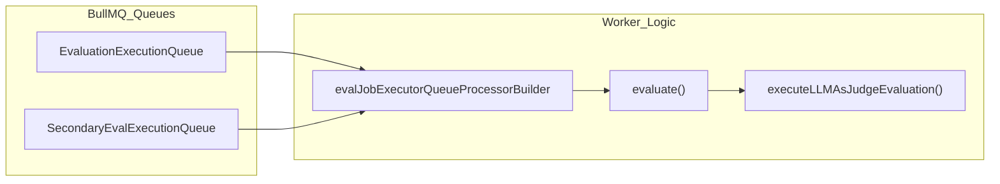
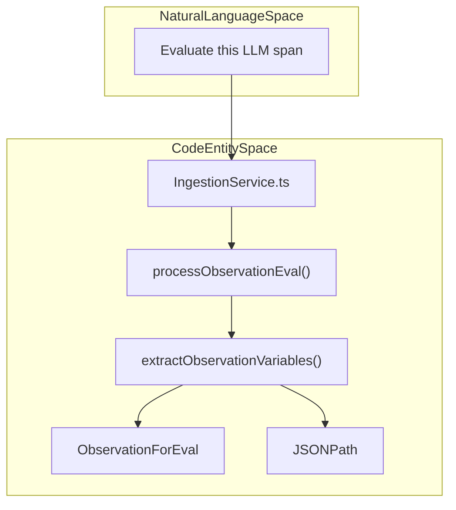
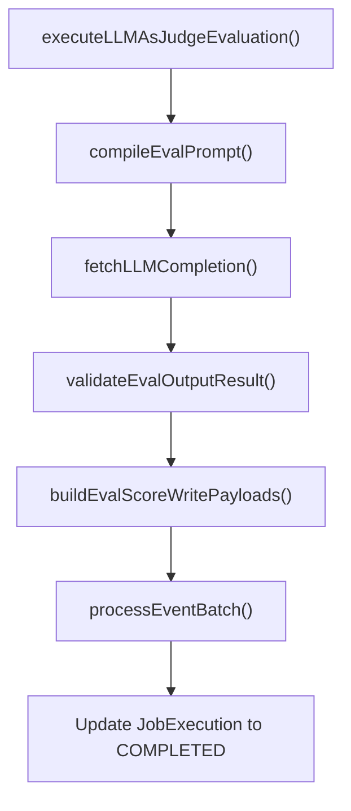

# Job Execution

<details>
<summary>Relevant source files</summary>

The following files were used as context for generating this wiki page:

- [packages/shared/src/server/ingestion/extractToolsBackend.ts](packages/shared/src/server/ingestion/extractToolsBackend.ts)
- [packages/shared/src/utils/chatml/adapters/aisdk.ts](packages/shared/src/utils/chatml/adapters/aisdk.ts)
- [packages/shared/src/utils/chatml/adapters/gemini.ts](packages/shared/src/utils/chatml/adapters/gemini.ts)
- [packages/shared/src/utils/chatml/adapters/langgraph.ts](packages/shared/src/utils/chatml/adapters/langgraph.ts)
- [packages/shared/src/utils/chatml/adapters/microsoft-agent.ts](packages/shared/src/utils/chatml/adapters/microsoft-agent.ts)
- [packages/shared/src/utils/chatml/adapters/openai.ts](packages/shared/src/utils/chatml/adapters/openai.ts)
- [packages/shared/src/utils/chatml/adapters/pydantic-ai.ts](packages/shared/src/utils/chatml/adapters/pydantic-ai.ts)
- [packages/shared/src/utils/chatml/helpers.ts](packages/shared/src/utils/chatml/helpers.ts)
- [web/src/features/evals/components/evaluator-table.tsx](web/src/features/evals/components/evaluator-table.tsx)
- [web/src/features/evals/components/inner-evaluator-form.tsx](web/src/features/evals/components/inner-evaluator-form.tsx)
- [web/src/features/evals/server/router.ts](web/src/features/evals/server/router.ts)
- [web/src/utils/chatml/extractTools.ts](web/src/utils/chatml/extractTools.ts)
- [worker/src/__tests__/evalService.filtering.test.ts](worker/src/__tests__/evalService.filtering.test.ts)
- [worker/src/__tests__/evalService.test.ts](worker/src/__tests__/evalService.test.ts)
- [worker/src/__tests__/extractToolsBackend.test.ts](worker/src/__tests__/extractToolsBackend.test.ts)
- [worker/src/ee/cloudUsageMetering/handleCloudUsageMeteringJob.ts](worker/src/ee/cloudUsageMetering/handleCloudUsageMeteringJob.ts)
- [worker/src/features/evaluation/evalService.ts](worker/src/features/evaluation/evalService.ts)
- [worker/src/queues/__tests__/otelToObservationForEval.test.ts](worker/src/queues/__tests__/otelToObservationForEval.test.ts)
- [worker/src/queues/batchExportQueue.ts](worker/src/queues/batchExportQueue.ts)
- [worker/src/queues/cloudUsageMeteringQueue.ts](worker/src/queues/cloudUsageMeteringQueue.ts)
- [worker/src/queues/evalQueue.ts](worker/src/queues/evalQueue.ts)

</details>


This page documents the execution phase of evaluation jobs in Langfuse's LLM-as-a-judge evaluation system. It covers how queued evaluation jobs are processed, variables are extracted from tracing data, prompts are compiled, LLM calls are made, and errors are handled.

## Job Execution Lifecycle

Evaluation jobs progress through several states during their lifecycle, managed by the `JobExecution` model in PostgreSQL.

Title: Job Execution State Machine
```mermaid
stateDiagram-v2
    [*] --> "PENDING" : "Job created"
    "PENDING" --> "DELAYED" : "LLM rate limit (429/5xx)"
    "DELAYED" --> "PENDING" : "Retry scheduled (exp. backoff)"
    "PENDING" --> "COMPLETED" : "Successful execution"
    "PENDING" --> "ERROR" : "Unrecoverable/Max retries"
    "PENDING" --> "CANCELLED" : "Trace deselected/Deleted"
    "COMPLETED" --> [*]
    "ERROR" --> [*]
    "CANCELLED" --> [*]
```

**Job Execution Lifecycle States**

| State | Description |
|-------|-------------|
| `PENDING` | Job is queued and waiting to be processed by a worker. |
| `DELAYED` | Job encountered a retryable error (e.g., LLM rate limit) and is scheduled for retry. |
| `COMPLETED` | Job executed successfully and the resulting score was persisted. |
| `ERROR` | Job failed with an unrecoverable error or exceeded maximum retry attempts. |
| `CANCELLED` | Job was cancelled, typically because the underlying trace no longer matches filters. |

Sources: `[worker/src/features/evaluation/evalService.ts:4-9]()`, `[worker/src/queues/evalQueue.ts:178-201]()`

## Queue Processors

The worker service uses BullMQ processors to handle the execution of evaluation jobs. The system differentiates between job creation (triggered by ingestion) and job execution (the LLM call).

Title: Evaluation Queue Processing Flow


### Execution Routing
The `evalJobExecutorQueueProcessorBuilder` creates the processor for evaluation execution. It supports a secondary queue for high-volume projects to prevent "noisy neighbor" issues.

- **Redirection Logic**: If `enableRedirectToSecondaryQueue` is true and the `projectId` is in the `LANGFUSE_SECONDARY_EVAL_EXECUTION_QUEUE_ENABLED_PROJECT_IDS` environment variable, the job is moved to the `SecondaryEvalExecutionQueue` via `SecondaryEvalExecutionQueue.getInstance()`. `[worker/src/queues/evalQueue.ts:132-157]()`
- **Instrumentation**: Each job execution is wrapped in OpenTelemetry spans using `instrumentAsync`, capturing `jobExecutionId` and `projectId` as attributes. `[worker/src/queues/evalQueue.ts:159-174]()`, `[worker/src/features/evaluation/evalService.ts:26-26]()`

Sources: `[worker/src/queues/evalQueue.ts:118-157]()`, `[worker/src/queues/evalQueue.ts:176-177]()`, `[worker/src/features/evaluation/evalService.ts:26-26]()`

## Trace-Level Evaluation Execution

The `evaluate()` function in `evalService.ts` is the primary entry point for trace-level evaluations.

1.  **Validation**: It fetches the `JobExecution` and `JobConfiguration`. If the job is already cancelled or the configuration is no longer executable (e.g., missing model config), it stops execution using `isJobConfigExecutable`. `[worker/src/features/evaluation/evalService.ts:58-58]()`
2.  **Variable Extraction**: It calls `extractVariablesFromTracingData()` to resolve all template variables defined in the job configuration. `[worker/src/__tests__/evalService.test.ts:33-34]()`
3.  **Core Execution**: It passes the resolved data to `executeLLMAsJudgeEvaluation()` which manages the LLM interaction. `[worker/src/features/evaluation/evalService.ts:75-75]()`

Sources: `[worker/src/features/evaluation/evalService.ts:16-16]()`, `[worker/src/__tests__/evalService.test.ts:31-34]()`, `[worker/src/features/evaluation/evalService.ts:58-58]()`

## Observation-Level Evaluation (LLM-as-Judge)

In addition to trace-level evaluations, Langfuse supports `observationEval` (LLM-as-Judge on individual spans). This is handled by the `processObservationEval` function.

### Data Flow for Observation Eval
The system extracts variables specifically from observation data (like `input`, `output`, and `metadata`) using `extractObservationVariables`.

Title: Observation Evaluation System Mapping


- **Variable Extraction**: `extractObservationVariables` uses `JSONPath` to pull specific fields from the observation's payload. It supports lazy JSON parsing where fields are only parsed if a `jsonSelector` is present. `[worker/src/features/evaluation/observationEval/extractObservationVariables.ts:40-67]()`, `[packages/shared/src/features/evals/utilities.ts:61-73]()`
- **Mapping**: Variables are extracted based on `ObservationVariableMapping`, which identifies the `selectedColumnId` (e.g., `input`, `output`, `metadata`) and an optional `jsonSelector`. `[worker/src/features/evaluation/observationEval/extractObservationVariables.ts:69-83]()`
- **Schema Validation**: Observations are validated against the `observationForEvalSchema` which includes identifiers, core properties, and trace-level context. `[packages/shared/src/features/evals/observationForEval.ts:15-72]()`
- **OTEL Integration**: Spans ingested via OpenTelemetry are mapped to `ObservationForEval` via `OtelIngestionProcessor` and `convertEventRecordToObservationForEval`. `[worker/src/queues/__tests__/otelToObservationForEval.test.ts:14-19]()`, `[worker/src/queues/__tests__/otelToObservationForEval.test.ts:98-103]()`

Sources: `[worker/src/queues/evalQueue.ts:17-17]()`, `[worker/src/features/evaluation/observationEval/extractObservationVariables.ts:13-53]()`, `[packages/shared/src/features/evals/utilities.ts:76-84]()`, `[packages/shared/src/features/evals/observationForEval.ts:15-72]()`, `[worker/src/queues/__tests__/otelToObservationForEval.test.ts:14-103]()`

## Variable Extraction

The `extractVariablesFromTracingData()` function pulls values from traces, observations, and dataset items based on the `variableMapping` defined in the `JobConfiguration`.

### Supported Object Types

| Target Object | Data Source | Extraction Method |
| :--- | :--- | :--- |
| `trace` | ClickHouse | JSONPath extraction from `input`, `output`, or `metadata`. |
| `observation` | ClickHouse | Matches by `objectName` (e.g., "MyRetriever") and extracts from `input`/`output`. |
| `dataset_item` | PostgreSQL | Direct lookup from the `DatasetItem` table for `input` or `expected_output`. |

### Performance Optimization
The system utilizes `InMemoryFilterService` for efficient matching of target objects. `[worker/src/features/evaluation/evalService.ts:23-23]()`. During extraction, `extractValueFromObject` handles multi-encoded JSON strings to ensure robust data retrieval. `[packages/shared/src/features/evals/utilities.ts:75-113]()`

### Tool Extraction
The system can also extract tool definitions and tool calls from ingestion data using `extractToolsBackend.ts`. This involves flattening various formats (OpenAI, AI SDK, Anthropic) into a normalized `ClickhouseToolDefinition` or `ClickhouseToolArgument` schema. `[packages/shared/src/server/ingestion/extractToolsBackend.ts:11-37]()`, `[packages/shared/src/server/ingestion/extractToolsBackend.ts:169-205]()`

Sources: `[worker/src/features/evaluation/evalService.ts:23-23]()`, `[packages/shared/src/features/evals/utilities.ts:75-113]()`, `[packages/shared/src/server/ingestion/extractToolsBackend.ts:11-205]()`

## Prompt Compilation

Prompts are compiled using a Mustache-style syntax. The `compileEvalPrompt` utility substitutes extracted variables into the `EvalTemplate`.

- **Logic**: The `compileTemplateString` function handles variable replacement. `[worker/src/__tests__/evalService.test.ts:76-83]()`
- **Data Types**: The compilation logic handles various data types via `parseUnknownToString`:
    - `null`/`undefined` are converted to empty strings. `[packages/shared/src/features/evals/utilities.ts:7-10]()`
    - Objects are stringified via `JSON.stringify`. `[packages/shared/src/features/evals/utilities.ts:18-20]()`
    - Arrays are joined by commas. `[worker/src/__tests__/evalService.test.ts:185-191]()`
    - Numbers and Booleans are converted to their string representations. `[packages/shared/src/features/evals/utilities.ts:11-17]()`

Sources: `[worker/src/features/evaluation/evalService.ts:69-73]()`, `[worker/src/__tests__/evalService.test.ts:76-199]()`, `[packages/shared/src/features/evals/utilities.ts:7-26]()`

## Core LLM-as-Judge Pipeline

The `executeLLMAsJudgeEvaluation()` function executes the actual LLM call and processes the output.

Title: LLM Evaluation Execution Pipeline


### LLM Response Validation
The LLM output is validated against the `PersistedEvalOutputDefinitionSchema`. This ensures the LLM returned the expected score type (numeric, categorical, or boolean). Validation is performed by `validateEvalOutputResult`. `[worker/src/features/evaluation/evalService.ts:61-61]()`

Sources: `[worker/src/features/evaluation/evalService.ts:69-74]()`, `[worker/src/features/evaluation/evalService.ts:61-61]()`

## Error Handling and Config Blocking

Langfuse implements a "fail-fast" mechanism for evaluators that consistently fail due to configuration issues to prevent resource waste.

### Automatic Blocking
If an evaluation job fails with a non-retryable error (e.g., invalid model parameters), the system blocks the `JobConfiguration`.
- **Reasoning**: Uses `getBlockReasonForInvalidModelConfig` to identify specific failure causes. `[worker/src/features/evaluation/evalService.ts:57-57]()`
- **Effect**: The `JobConfiguration` state is set to `DISABLED` via `blockEvaluatorConfigs`, preventing further job creation. `[worker/src/features/evaluation/evalService.ts:35-36]()`

### Retry Logic for Rate Limits
For `429` (Rate Limit) or `5xx` (Server Error) from LLM providers, the system implements specialized retry logic:
1. **Check Age**: If the job is < 24 hours old, it is scheduled for retry. `[worker/src/queues/evalQueue.ts:191-192]()`
2. **Backoff**: Uses exponential backoff (e.g., via `delayInMs`). `[worker/src/queues/evalQueue.ts:18-19]()`
3. **State**: Job is set to `DELAYED` or re-queued with a delay. `[worker/src/queues/evalQueue.ts:196-197]()`

Sources: `[worker/src/features/evaluation/evalService.ts:34-36]()`, `[worker/src/queues/evalQueue.ts:185-210]()`, `[worker/src/queues/evalQueue.ts:18-19]()`

## Scheduled Background Jobs

The worker service also handles scheduled maintenance and metering tasks.

- **Cloud Usage Metering**: The `handleCloudUsageMeteringJob` runs periodically to aggregate observation, trace, and score counts by project for billing. It pushes these metrics to Stripe via `stripe.billing.meterEvents.create`. `[worker/src/ee/cloudUsageMetering/handleCloudUsageMeteringJob.ts:27-211]()`. The job state is tracked in the `cronJobs` table. `[worker/src/queues/cloudUsageMeteringQueue.ts:48-56]()`
- **Batch Export**: The `batchExportQueueProcessor` handles long-running data export requests, updating the `BatchExport` status to `FAILED` or `COMPLETED` based on the outcome of `handleBatchExportJob`. `[worker/src/queues/batchExportQueue.ts:14-53]()`

Sources: `[worker/src/ee/cloudUsageMetering/handleCloudUsageMeteringJob.ts:27-211]()`, `[worker/src/queues/cloudUsageMeteringQueue.ts:48-56]()`, `[worker/src/queues/batchExportQueue.ts:14-53]()`
