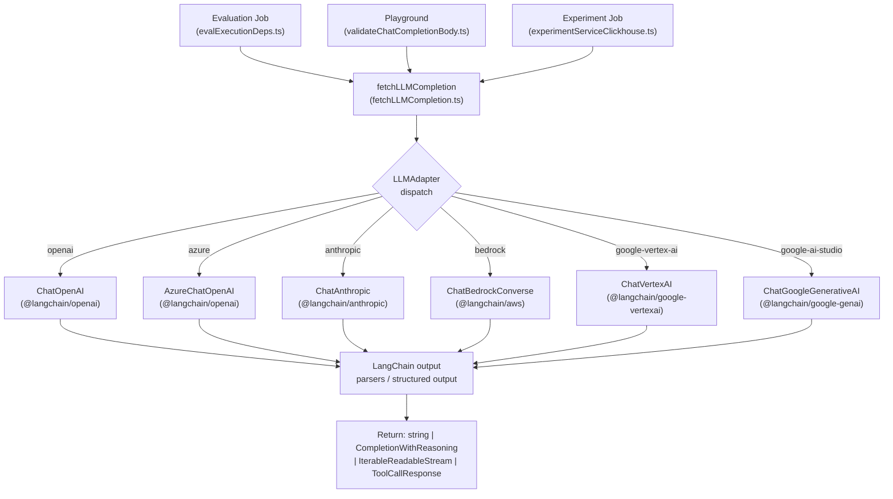
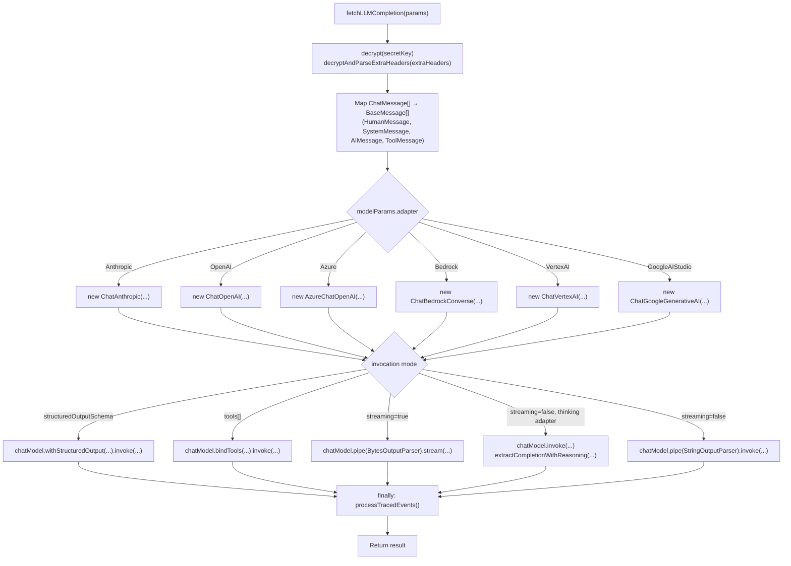

# LLM Integration

<details>
<summary>Relevant source files</summary>

The following files were used as context for generating this wiki page:

- [packages/shared/src/features/experiments/utils.ts](packages/shared/src/features/experiments/utils.ts)
- [packages/shared/src/interfaces/customLLMProviderConfigSchemas.ts](packages/shared/src/interfaces/customLLMProviderConfigSchemas.ts)
- [packages/shared/src/server/llm/fetchLLMCompletion.ts](packages/shared/src/server/llm/fetchLLMCompletion.ts)
- [packages/shared/src/server/llm/getInternalTracingHandler.ts](packages/shared/src/server/llm/getInternalTracingHandler.ts)
- [packages/shared/src/server/llm/testModelCall.ts](packages/shared/src/server/llm/testModelCall.ts)
- [packages/shared/src/server/llm/types.ts](packages/shared/src/server/llm/types.ts)
- [web/src/components/ModelParameters/LLMApiKeyComponent.tsx](web/src/components/ModelParameters/LLMApiKeyComponent.tsx)
- [web/src/components/ModelParameters/index.tsx](web/src/components/ModelParameters/index.tsx)
- [web/src/features/annotation-queues/components/CreateOrEditAnnotationQueueButton.tsx](web/src/features/annotation-queues/components/CreateOrEditAnnotationQueueButton.tsx)
- [web/src/features/annotation-queues/components/DeleteAnnotationQueueButton.tsx](web/src/features/annotation-queues/components/DeleteAnnotationQueueButton.tsx)
- [web/src/features/experiments/server/router.ts](web/src/features/experiments/server/router.ts)
- [web/src/features/experiments/types.ts](web/src/features/experiments/types.ts)
- [web/src/features/llm-api-key/server/router.ts](web/src/features/llm-api-key/server/router.ts)
- [web/src/features/llm-api-key/types.ts](web/src/features/llm-api-key/types.ts)
- [web/src/features/natural-language-filters/server/router.ts](web/src/features/natural-language-filters/server/router.ts)
- [web/src/features/natural-language-filters/server/utils.ts](web/src/features/natural-language-filters/server/utils.ts)
- [web/src/features/playground/page/components/CreateOrEditLLMSchemaDialog.tsx](web/src/features/playground/page/components/CreateOrEditLLMSchemaDialog.tsx)
- [web/src/features/playground/page/components/CreateOrEditLLMToolDialog.tsx](web/src/features/playground/page/components/CreateOrEditLLMToolDialog.tsx)
- [web/src/features/public-api/components/CreateLLMApiKeyDialog.tsx](web/src/features/public-api/components/CreateLLMApiKeyDialog.tsx)
- [web/src/features/public-api/components/CreateLLMApiKeyForm.tsx](web/src/features/public-api/components/CreateLLMApiKeyForm.tsx)
- [web/src/features/public-api/components/LLMApiKeyList.tsx](web/src/features/public-api/components/LLMApiKeyList.tsx)
- [web/src/features/public-api/components/UpdateLLMApiKeyDialog.tsx](web/src/features/public-api/components/UpdateLLMApiKeyDialog.tsx)
- [worker/src/__tests__/experimentsService.test.ts](worker/src/__tests__/experimentsService.test.ts)
- [worker/src/features/experiments/__tests__/scheduleExperimentEvals.test.ts](worker/src/features/experiments/__tests__/scheduleExperimentEvals.test.ts)
- [worker/src/features/experiments/experimentServiceClickhouse.ts](worker/src/features/experiments/experimentServiceClickhouse.ts)
- [worker/src/features/experiments/scheduleExperimentEvals.ts](worker/src/features/experiments/scheduleExperimentEvals.ts)
- [worker/src/features/experiments/utils.ts](worker/src/features/experiments/utils.ts)
- [worker/src/features/utils/utilities.ts](worker/src/features/utils/utilities.ts)

</details>


This page documents the LLM integration layer: the `fetchLLMCompletion` abstraction, the `LLMAdapter` enum and supported providers, the message type system, structured output and tool-call handling, and the internal tracing of evaluation and experiment executions.

- For how LLM-as-judge evaluation jobs *invoke* this layer, see [10.4]().
- For how LLM provider API keys are stored, encrypted, and managed through the UI, see [10.7]().

---

## Overview

All LLM calls within Langfuse (evaluations, playground, experiments) route through a single shared function, `fetchLLMCompletion`, defined in `packages/shared/src/server/llm/fetchLLMCompletion.ts` [packages/shared/src/server/llm/fetchLLMCompletion.ts:179-213](). It selects the appropriate [LangChain](https://js.langchain.com/) chat model class based on the adapter type, builds a normalized message list, and dispatches the call, returning a streaming byte stream, a plain string, a `CompletionWithReasoning`, a structured JSON object, or a `ToolCallResponse` depending on the overload called [packages/shared/src/server/llm/fetchLLMCompletion.ts:179-206]().

The following diagram shows the high-level call path:

**Diagram: LLM Integration Call Path**



Sources: [packages/shared/src/server/llm/fetchLLMCompletion.ts:3-19](), [packages/shared/src/server/llm/fetchLLMCompletion.ts:179-213](), [packages/shared/src/server/llm/types.ts:335-343]()

---

## `LLMAdapter` and Supported Providers

The `LLMAdapter` enum in `packages/shared/src/server/llm/types.ts` is the discriminant used everywhere to select provider-specific behavior [packages/shared/src/server/llm/types.ts:335-343]():

| `LLMAdapter` value | LangChain class | Auth mechanism |
|---|---|---|
| `openai` | `ChatOpenAI` | API key (`secretKey`) |
| `azure` | `AzureChatOpenAI` | API key + deployment base URL |
| `anthropic` | `ChatAnthropic` | API key |
| `bedrock` | `ChatBedrockConverse` | AWS credentials or default provider chain |
| `google-vertex-ai` | `ChatVertexAI` | GCP service account JSON or ADC |
| `google-ai-studio` | `ChatGoogleGenerativeAI` | API key |

Each adapter has a hardcoded list of known model names in `types.ts` [packages/shared/src/server/llm/types.ts:384-550](). These drive the model dropdowns in the UI and the default model selection for connection testing in the `llmApiKeyRouter` [web/src/features/llm-api-key/server/router.ts:104-108](). 

Sources: [packages/shared/src/server/llm/types.ts:335-550](), [packages/shared/src/server/llm/fetchLLMCompletion.ts:3-19](), [web/src/features/llm-api-key/server/router.ts:100-169]()

---

## Type System

### Message Types

**Diagram: Chat Message Type Hierarchy**

```mermaid
classDiagram
    class ChatMessageRole {
        <<enum>>
        "System"
        "Developer"
        "User"
        "Assistant"
        "Tool"
        "Model"
    }
    class ChatMessageType {
        <<enum>>
        "System"
        "Developer"
        "User"
        "AssistantText"
        "AssistantToolCall"
        "ToolResult"
        "ModelText"
        "PublicAPICreated"
        "Placeholder"
    }
    class SystemMessageSchema {
        "type: system"
        "role: system"
        "content: string"
    }
    class UserMessageSchema {
        "type: user"
        "role: user"
        "content: string"
    }
    class AssistantToolCallMessageSchema {
        "type: assistant-tool-call"
        "role: assistant"
        "content: string"
        "toolCalls: LLMToolCall[]"
    }
    class ToolResultMessageSchema {
        "type: tool-result"
        "role: tool"
        "content: string"
        "toolCallId: string"
    }
    class PlaceholderMessageSchema {
        "type: placeholder"
        "name: string"
    }
    "ChatMessageSchema" --> SystemMessageSchema
    "ChatMessageSchema" --> UserMessageSchema
    "ChatMessageSchema" --> AssistantToolCallMessageSchema
    "ChatMessageSchema" --> ToolResultMessageSchema
    "ChatMessageSchema" --> PlaceholderMessageSchema
```

Sources: [packages/shared/src/server/llm/types.ts:126-233]()

The union type `ChatMessage` is the standard input to `fetchLLMCompletion` [packages/shared/src/server/llm/types.ts:214-235](). Messages are mapped to LangChain `BaseMessage` subclasses: `HumanMessage`, `SystemMessage`, `AIMessage`, and `ToolMessage` [packages/shared/src/server/llm/fetchLLMCompletion.ts:8-13]().

### Model Parameters

`ModelParams` is the combination of provider identity plus `ModelConfig` (inference parameters) [packages/shared/src/server/llm/types.ts:366-375]():

```typescript
ModelParams = {
  provider: string   // identifies the LLM API key record in the database
  adapter: LLMAdapter
  model: string
} & ModelConfig
```

`ModelConfig` contains fields like `max_tokens`, `temperature`, `top_p`, and `maxReasoningTokens` [packages/shared/src/server/llm/types.ts:352-364](). `UIModelParams` wraps each field in `{ value: T; enabled: boolean }` for the settings UI [packages/shared/src/server/llm/types.ts:378-382]().

Sources: [packages/shared/src/server/llm/types.ts:352-382](), [web/src/components/ModelParameters/index.tsx:40-55]()

---

## `fetchLLMCompletion` Implementation

The function is declared with several overloads to support different return types based on input parameters [packages/shared/src/server/llm/fetchLLMCompletion.ts:179-203]().

**Parameters:**

| Parameter | Type | Purpose |
|---|---|---|
| `messages` | `ChatMessage[]` | Normalized message list |
| `modelParams` | `ModelParams` | Provider/model/config |
| `llmConnection` | `{ secretKey, extraHeaders?, baseURL?, config? }` | Encrypted connection details |
| `structuredOutputSchema` | `ZodSchema \| LLMJSONSchema` | Forces structured output mode |
| `tools` | `LLMToolDefinition[]` | Tool definitions for function calling |
| `traceSinkParams` | `TraceSinkParams` | Controls internal trace ingestion |

The `secretKey` stored in the database is AES-encrypted. `fetchLLMCompletion` calls `decrypt(llmConnection.secretKey)` internally [packages/shared/src/server/llm/fetchLLMCompletion.ts:227]().

**Diagram: fetchLLMCompletion Dispatch Logic**



Sources: [packages/shared/src/server/llm/fetchLLMCompletion.ts:179-583]()

---

## Reasoning / Thinking Block Extraction

For `Bedrock`, `VertexAI`, and `GoogleAIStudio` adapters, responses may include reasoning/thinking content blocks alongside the primary text [packages/shared/src/server/llm/fetchLLMCompletion.ts:76-80](). `fetchLLMCompletion` identifies these via `THINKING_BLOCK_TYPES` [packages/shared/src/server/llm/fetchLLMCompletion.ts:76-80]().

The return type `CompletionWithReasoning` is `{ text: string; reasoning?: string }` [packages/shared/src/server/llm/fetchLLMCompletion.ts:55](). Extraction is handled by `extractCompletionWithReasoning` which separates thinking blocks (e.g., `reasoning_content` for Bedrock or `reasoning` for Vertex) from standard text blocks in the `AIMessage` [packages/shared/src/server/llm/fetchLLMCompletion.ts:605-631]().

Sources: [packages/shared/src/server/llm/fetchLLMCompletion.ts:55-84](), [packages/shared/src/server/llm/fetchLLMCompletion.ts:605-631]()

---

## Structured Output

When `structuredOutputSchema` is passed (a Zod schema or a raw JSON schema object), the function calls `chatModel.withStructuredOutput(schema, options)` [packages/shared/src/server/llm/fetchLLMCompletion.ts:460-476](). This is the primary path used by the evaluation system — the eval template defines the expected output schema (e.g., `{ score: number, reasoning: string }`), and the result is directly parsed.

Sources: [packages/shared/src/server/llm/fetchLLMCompletion.ts:460-476](), [packages/shared/src/server/llm/types.ts:18-42]()

---

## Tool Calling

When `tools` is non-empty, `fetchLLMCompletion` converts each `LLMToolDefinition` to LangChain format and calls `chatModel.bindTools(langchainTools).invoke(...)` [packages/shared/src/server/llm/fetchLLMCompletion.ts:478-512](). The raw result is parsed with `ToolCallResponseSchema` [packages/shared/src/server/llm/types.ts:117-124]().

Sources: [packages/shared/src/server/llm/fetchLLMCompletion.ts:478-512](), [packages/shared/src/server/llm/types.ts:71-125]()

---

## Internal Tracing of Eval and Experiment Executions

When `traceSinkParams` is provided, `fetchLLMCompletion` calls `getInternalTracingHandler(traceSinkParams)` which returns a LangChain `CallbackHandler` that ingests the LLM call as a Langfuse internal trace [packages/shared/src/server/llm/fetchLLMCompletion.ts:246-250](). 

A safeguard prevents infinite eval loops: the `environment` field in `traceSinkParams` must start with `"langfuse"` [packages/shared/src/server/llm/fetchLLMCompletion.ts:237-244](). This mechanism is used in:
- **Evaluations**: To trace the LLM-as-judge call.
- **Experiments**: In `worker/src/features/experiments/experimentServiceClickhouse.ts`, `processLLMCall` sets the environment to `LangfuseInternalTraceEnvironment.PromptExperiments` to trace experiment runs [worker/src/features/experiments/experimentServiceClickhouse.ts:182-185]().

Sources: [packages/shared/src/server/llm/fetchLLMCompletion.ts:233-251](), [packages/shared/src/server/llm/getInternalTracingHandler.ts:74-85](), [worker/src/features/experiments/experimentServiceClickhouse.ts:181-227]()

---

## LLM API Key Management

API keys for LLM providers are managed via the `llmApiKeyRouter` [web/src/features/llm-api-key/server/router.ts:192](). 

- **Creation**: `create` procedure encrypts the `secretKey` using the system `ENCRYPTION_KEY` before storing it in PostgreSQL [web/src/features/llm-api-key/server/router.ts:193-248]().
- **Testing**: The `testLLMConnection` function attempts a simple completion using `fetchLLMCompletion` to verify the provided credentials before they are saved [web/src/features/llm-api-key/server/router.ts:100-169]().
- **Sentinels**: For self-hosted deployments, sentinel strings like `BEDROCK_USE_DEFAULT_CREDENTIALS` and `VERTEXAI_USE_DEFAULT_CREDENTIALS` allow using environment-based authentication (IAM roles, ADC) instead of explicit keys [packages/shared/src/server/llm/fetchLLMCompletion.ts:26-28]().
- **Base URL Validation**: All custom base URLs are validated via `validateLlmConnectionBaseURL` to prevent SSRF and access to internal hostnames [web/src/features/llm-api-key/server/router.ts:171-190]().

Sources: [web/src/features/llm-api-key/server/router.ts:1-248](), [web/src/features/public-api/components/CreateLLMApiKeyForm.tsx:85-178](), [packages/shared/src/server/llm/utils.ts:33-103]()
