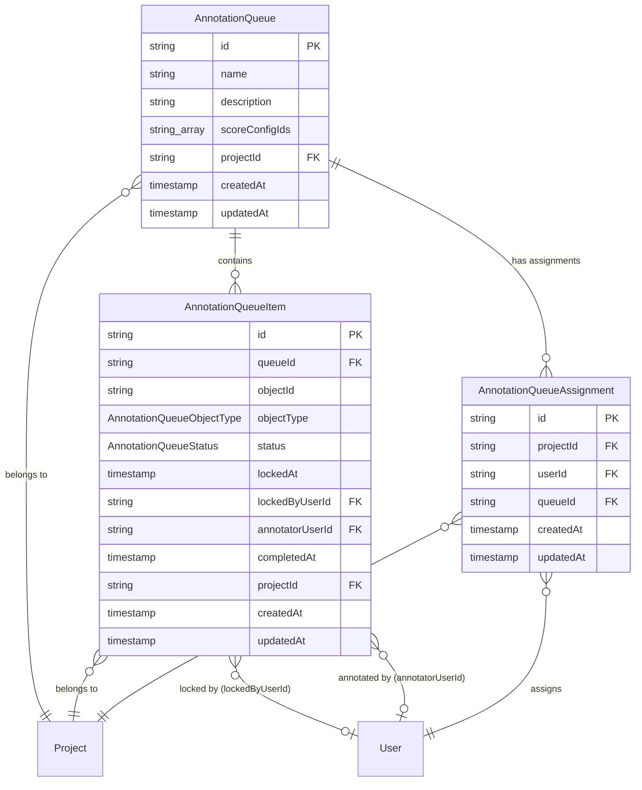
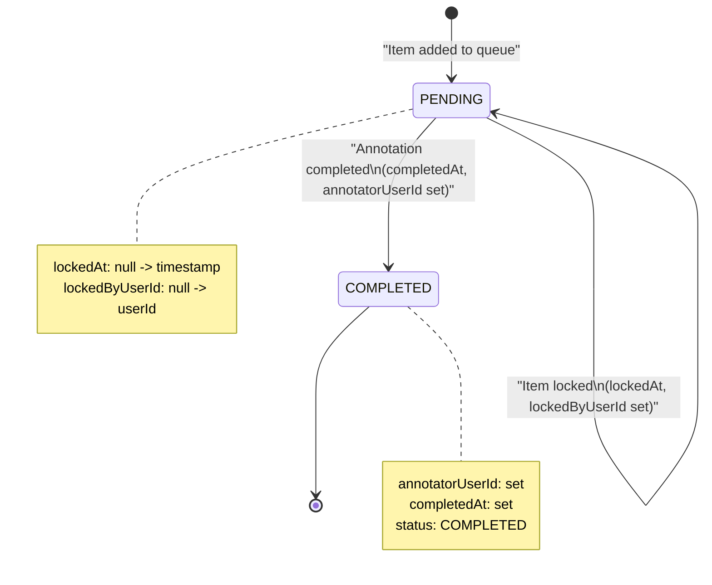
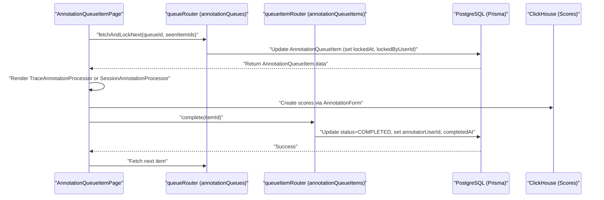

# Annotation Queues

Relevant source files

The following files were used as context for generating this wiki page:

- [packages/shared/src/server/dataset-run-items/addToDeleteQueue.ts](packages/shared/src/server/dataset-run-items/addToDeleteQueue.ts)
- [packages/shared/src/server/redis/datasetDelete.ts](packages/shared/src/server/redis/datasetDelete.ts)
- [web/src/__tests__/server/annotation-queue-items-trpc.servertest.ts](web/src/__tests__/server/annotation-queue-items-trpc.servertest.ts)
- [web/src/components/layouts/doc-popup.tsx](web/src/components/layouts/doc-popup.tsx)
- [web/src/components/session/NewDatasetItemFromTrace.tsx](web/src/components/session/NewDatasetItemFromTrace.tsx)
- [web/src/components/session/TraceEventsRow.tsx](web/src/components/session/TraceEventsRow.tsx)
- [web/src/components/session/TraceRow.tsx](web/src/components/session/TraceRow.tsx)
- [web/src/components/ui/object-not-found-card.tsx](web/src/components/ui/object-not-found-card.tsx)
- [web/src/features/annotation-queues/components/AnnotationQueueItemPage.tsx](web/src/features/annotation-queues/components/AnnotationQueueItemPage.tsx)
- [web/src/features/annotation-queues/components/AnnotationQueueItemsTable.tsx](web/src/features/annotation-queues/components/AnnotationQueueItemsTable.tsx)
- [web/src/features/annotation-queues/components/AnnotationQueuesItem.tsx](web/src/features/annotation-queues/components/AnnotationQueuesItem.tsx)
- [web/src/features/annotation-queues/components/AnnotationQueuesTable.tsx](web/src/features/annotation-queues/components/AnnotationQueuesTable.tsx)
- [web/src/features/annotation-queues/components/processors/SessionAnnotationProcessor.tsx](web/src/features/annotation-queues/components/processors/SessionAnnotationProcessor.tsx)
- [web/src/features/annotation-queues/components/processors/TraceAnnotationProcessor.tsx](web/src/features/annotation-queues/components/processors/TraceAnnotationProcessor.tsx)
- [web/src/features/annotation-queues/components/shared/AnnotationDrawerSection.tsx](web/src/features/annotation-queues/components/shared/AnnotationDrawerSection.tsx)
- [web/src/features/annotation-queues/components/shared/CommentsSection.tsx](web/src/features/annotation-queues/components/shared/CommentsSection.tsx)
- [web/src/features/annotation-queues/components/shared/hooks/useAnnotationObjectData.ts](web/src/features/annotation-queues/components/shared/hooks/useAnnotationObjectData.ts)
- [web/src/features/annotation-queues/server/annotationQueueItemsRouter.ts](web/src/features/annotation-queues/server/annotationQueueItemsRouter.ts)
- [web/src/features/annotation-queues/server/annotationQueuesRouter.ts](web/src/features/annotation-queues/server/annotationQueuesRouter.ts)
- [web/src/features/automations/components/DeleteAutomationButton.tsx](web/src/features/automations/components/DeleteAutomationButton.tsx)
- [web/src/features/datasets/components/DatasetAnalytics.tsx](web/src/features/datasets/components/DatasetAnalytics.tsx)
- [web/src/features/datasets/components/DeleteDatasetRunButton.tsx](web/src/features/datasets/components/DeleteDatasetRunButton.tsx)
- [web/src/features/prompts/components/NewPromptForm/index.tsx](web/src/features/prompts/components/NewPromptForm/index.tsx)
- [web/src/features/prompts/components/NewPromptForm/validation.ts](web/src/features/prompts/components/NewPromptForm/validation.ts)
- [web/src/features/prompts/components/prompt-detail.tsx](web/src/features/prompts/components/prompt-detail.tsx)
- [web/src/features/scores/components/multi-select-key-values.tsx](web/src/features/scores/components/multi-select-key-values.tsx)
- [web/src/pages/project/[projectId]/datasets/[datasetId]/index.tsx](web/src/pages/project/[projectId]/datasets/[datasetId]/index.tsx)
- [web/src/pages/project/[projectId]/datasets/[datasetId]/runs/[runId].tsx](web/src/pages/project/[projectId]/datasets/[datasetId]/runs/[runId].tsx)
- [web/src/pages/project/[projectId]/prompts/[[...folder]].tsx](web/src/pages/project/[projectId]/prompts/[[...folder]].tsx)
- [web/src/pages/project/[projectId]/prompts/metrics.tsx](web/src/pages/project/[projectId]/prompts/metrics.tsx)
- [web/src/utils/string.ts](web/src/utils/string.ts)

## Purpose and Scope

Annotation Queues provide a human-in-the-loop workflow system for manually reviewing and scoring traces, observations, or sessions in Langfuse. This system enables teams to organize items requiring manual review into named queues, assign specific users, and track progress through a structured lifecycle.

Key features include:
- **User Assignments**: Restrict queue access to specific team members via `AnnotationQueueAssignment`. [[packages/shared/prisma/schema.prisma:566-579]]()
- **Locking Mechanism**: Prevent concurrent editing by locking items during active review for a period (typically 5 minutes). [[web/src/features/annotation-queues/server/annotationQueueItemsRouter.ts:32-38]]()
- **Status Tracking**: Monitor progress with `PENDING` and `COMPLETED` states. [[packages/shared/prisma/schema.prisma:556-559]]()
- **Schema Standardization**: Associate `ScoreConfig` definitions with queues to ensure consistent manual evaluation criteria. [[packages/shared/prisma/schema.prisma:517-517]]()
- **Integrated Feedback**: Support for internal comments and mentions during the annotation process. [[web/src/features/annotation-queues/components/processors/SessionAnnotationProcessor.tsx:60-67]]()

**Sources:** [[packages/shared/prisma/schema.prisma:511-579]](), [[web/src/features/annotation-queues/server/annotationQueueItemsRouter.ts:32-38]]()

---

## Core Data Model

The annotation queue system consists of three primary models in PostgreSQL, managed via Prisma.

### Entity Relationship Diagram

**Sources:** [[packages/shared/prisma/schema.prisma:511-579]]()

---

## AnnotationQueue Model

The `AnnotationQueue` table defines a named queue for organizing items that require annotation.

### Schema

| Field | Type | Description |
|-------|------|-------------|
| `id` | string (cuid) | Primary key |
| `name` | string | Queue name (unique per project) |
| `description` | string (nullable) | Optional description |
| `scoreConfigIds` | string[] | Array of `ScoreConfig` IDs defining the annotation schema |
| `projectId` | string | Foreign key to `Project` |
| `createdAt` | timestamp | Creation timestamp |
| `updatedAt` | timestamp | Last update timestamp |

### Key Characteristics

- **Unique Constraint**: `@@unique([projectId, name])` ensures queue names are unique within a project. [[packages/shared/prisma/schema.prisma:526-526]]()
- **Score Configuration**: The `scoreConfigIds` array defines which scores should be created during annotation, standardizing the evaluation process. [[packages/shared/prisma/schema.prisma:517-517]]()

**Sources:** [[packages/shared/prisma/schema.prisma:511-527]]()

---

## AnnotationQueueItem Model

The `AnnotationQueueItem` table represents individual items (traces, observations, or sessions) within a queue.

### Schema [[packages/shared/prisma/schema.prisma:529-553]]()

| Field | Type | Description |
|-------|------|-------------|
| `id` | string (cuid) | Primary key |
| `queueId` | string | Foreign key to `AnnotationQueue` |
| `objectId` | string | ID of the trace/observation/session being annotated |
| `objectType` | enum | Type of object: `TRACE`, `OBSERVATION`, or `SESSION` |
| `status` | enum | `PENDING` or `COMPLETED` (default: `PENDING`) |
| `lockedAt` | timestamp (nullable) | When the item was locked for annotation |
| `lockedByUserId` | string (nullable) | User who currently has the item locked |
| `annotatorUserId` | string (nullable) | User who completed the annotation |
| `completedAt` | timestamp (nullable) | When annotation was completed |
| `projectId` | string | Foreign key to `Project` |

### Status Flow

**Sources:** [[packages/shared/prisma/schema.prisma:529-553]](), [[packages/shared/prisma/schema.prisma:556-559]]()

---

## Annotation Workflow

### Implementation and Data Flow

The frontend implementation uses `AnnotationQueueItemPage` to manage the annotation lifecycle through various tRPC routers.

**Title: Annotation Workflow Code Interaction**

### Step-by-Step Process

1.  **Item Retrieval & Locking**: The UI calls `fetchAndLockNext` via the `queueRouter`. This procedure finds a `PENDING` item and sets the `lockedByUserId`. [[web/src/features/annotation-queues/components/AnnotationQueueItemPage.tsx:48-65]]()
2.  **Object Data Fetching**: The `useAnnotationObjectData` hook resolves the underlying trace, observation, or session data based on the `objectType`. It supports both legacy ClickHouse paths and the V4 Beta `events` table via `getObservationByIdFromEventsTable`. [[web/src/features/annotation-queues/components/shared/hooks/useAnnotationObjectData.ts:15-15]](), [[web/src/features/annotation-queues/server/annotationQueueItemsRouter.ts:140-149]]()
3.  **Annotation UI**: Depending on the type, the system renders a `TraceAnnotationProcessor` or `SessionAnnotationProcessor`. [[web/src/features/annotation-queues/components/AnnotationQueueItemPage.tsx:212-225]]()
4.  **Scoring**: Users provide feedback via the `AnnotationForm`. Scores are persisted and associated with the `queueId` via the `scoreMetadata`. [[web/src/features/annotation-queues/components/shared/AnnotationDrawerSection.tsx:38-51]]()
5.  **Completion**: The `complete` mutation in `queueItemRouter` updates the item status to `COMPLETED` and records the `annotatorUserId`. [[web/src/features/annotation-queues/components/AnnotationQueueItemPage.tsx:79-99]]()

**Sources:** [[web/src/features/annotation-queues/components/AnnotationQueueItemPage.tsx:21-187]](), [[web/src/features/annotation-queues/components/shared/AnnotationDrawerSection.tsx:25-71]](), [[web/src/features/annotation-queues/server/annotationQueueItemsRouter.ts:69-162]]()

---

## Locking Mechanism

The locking mechanism prevents multiple users from annotating the same item concurrently.

### Lock States [[packages/shared/prisma/schema.prisma:529-553]]()

| State | `lockedAt` | `lockedByUserId` | `status` | Description |
| :--- | :--- | :--- | :--- | :--- |
| **Unlocked** | `null` | `null` | `PENDING` | Item is available for annotation |
| **Locked** | `timestamp` | `userId` | `PENDING` | Item is being annotated by a specific user |
| **Completed** | `timestamp` | `userId` | `COMPLETED` | Annotation finished |

A lock is considered valid if it was created within the last 5 minutes. [[web/src/features/annotation-queues/server/annotationQueueItemsRouter.ts:32-38]]() If an item is locked by another user, the `AnnotationDrawerSection` displays a `TriangleAlertIcon` warning identifying the current editor. [[web/src/features/annotation-queues/components/shared/AnnotationDrawerSection.tsx:53-61]]()

**Sources:** [[packages/shared/prisma/schema.prisma:529-553]](), [[web/src/features/annotation-queues/components/shared/AnnotationDrawerSection.tsx:53-61]](), [[web/src/features/annotation-queues/server/annotationQueueItemsRouter.ts:32-38]]()

---

## Integration with Score System

Annotation queues are integrated with the scoring system through the `scoreConfigIds` array and the `queueId` field on scores.

### Score Configuration Linkage

The `AnnotationQueue` defines which `ScoreConfig` objects are relevant. When an annotator submits a score, the `AnnotationForm` uses these configurations to define the UI fields via the `configs` prop. [[web/src/features/annotation-queues/components/shared/AnnotationDrawerSection.tsx:42-42]]()

### Score Fields for Annotation Queues

When creating scores from annotation queues, specific metadata is attached:

| Field | Value | Description |
| :--- | :--- | :--- |
| `source` | `ANNOTATION` | Indicates manual human input. [[packages/shared/prisma/schema.prisma:464-464]]() |
| `queueId` | `AnnotationQueue.id` | Tracks which queue generated the score. [[packages/shared/prisma/schema.prisma:469-469]]() |
| `authorUserId` | Annotator user ID | Identifies the human evaluator. [[packages/shared/prisma/schema.prisma:467-467]]() |

**Sources:** [[packages/shared/prisma/schema.prisma:439-470]](), [[packages/shared/prisma/schema.prisma:511-527]]()

---

## Session Annotation Processor

When `objectType = SESSION`, the system uses `SessionAnnotationProcessor` to handle multi-trace context.

- **Pagination**: To handle large sessions, it paginates trace rendering (default `PAGE_SIZE = 10`). [[web/src/features/annotation-queues/components/processors/SessionAnnotationProcessor.tsx:32-32]]()
- **V4 Beta Support**: It fetches traces separately via `api.sessions.tracesFromEvents` when the V4 events table path is enabled. [[web/src/features/annotation-queues/components/processors/SessionAnnotationProcessor.tsx:45-58]]()
- **Trace Visualization**: Uses `LazyTraceEventsRow` for deferred loading of traces and their associated comments. [[web/src/features/annotation-queues/components/processors/SessionAnnotationProcessor.tsx:159-171]]()
- **Contextual Data**: Displays session-level metadata, environment information, and total trace counts using `totalTracesForBadge`. [[web/src/features/annotation-queues/components/processors/SessionAnnotationProcessor.tsx:116-122]]()

**Sources:** [[web/src/features/annotation-queues/components/processors/SessionAnnotationProcessor.tsx:1-171]]()

---

## Comments and Mentions

During the annotation process, users can collaborate using the comment system integrated into the annotation processors.

- **Trace Comment Counts**: The system fetches comment counts for traces within a session to provide visual indicators of existing discussions. [[web/src/features/annotation-queues/components/processors/SessionAnnotationProcessor.tsx:60-67]]()
- **Contextual Loading**: Comments are loaded and displayed alongside the trace/session data, with specific support for V4 beta paths. [[web/src/features/annotation-queues/components/processors/SessionAnnotationProcessor.tsx:165-165]]()
- **Audit Logging**: Interactions within the queue, including item completion and locking, are logged via `auditLog` in the backend routers. [[web/src/features/annotation-queues/server/annotationQueueItemsRouter.ts:1-1]](), [[web/src/features/annotation-queues/server/annotationQueuesRouter.ts:2-2]]()

**Sources:** [[web/src/features/annotation-queues/components/processors/SessionAnnotationProcessor.tsx:60-67]](), [[web/src/features/annotation-queues/server/annotationQueueItemsRouter.ts:1-1]](), [[web/src/features/annotation-queues/server/annotationQueuesRouter.ts:2-2]]()
