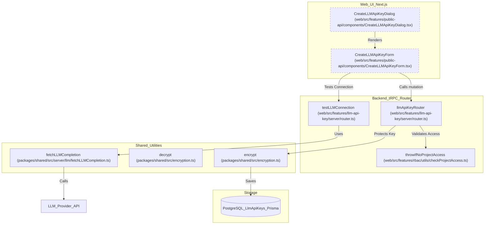
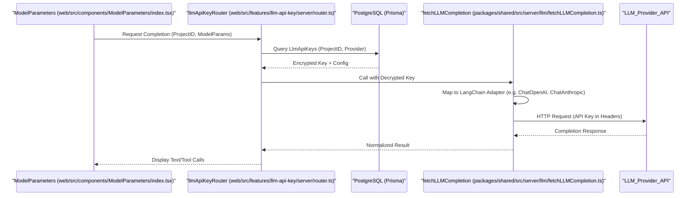

# LLM API Key Management

Relevant source files

The following files were used as context for generating this wiki page:

- [packages/shared/src/domain/webhooks.ts](packages/shared/src/domain/webhooks.ts)
- [packages/shared/src/interfaces/customLLMProviderConfigSchemas.ts](packages/shared/src/interfaces/customLLMProviderConfigSchemas.ts)
- [packages/shared/src/server/llm/baseUrlValidation.ts](packages/shared/src/server/llm/baseUrlValidation.ts)
- [packages/shared/src/server/llm/fetchLLMCompletion.ts](packages/shared/src/server/llm/fetchLLMCompletion.ts)
- [packages/shared/src/server/llm/types.ts](packages/shared/src/server/llm/types.ts)
- [packages/shared/src/server/outbound-url/fetch.ts](packages/shared/src/server/outbound-url/fetch.ts)
- [packages/shared/src/server/outbound-url/validation.ts](packages/shared/src/server/outbound-url/validation.ts)
- [packages/shared/src/server/webhooks/ipBlocking.ts](packages/shared/src/server/webhooks/ipBlocking.ts)
- [packages/shared/src/server/webhooks/validation.ts](packages/shared/src/server/webhooks/validation.ts)
- [web/src/__tests__/server/datasets-trpc.servertest.ts](web/src/__tests__/server/datasets-trpc.servertest.ts)
- [web/src/__tests__/server/llm-api-key.servertest.ts](web/src/__tests__/server/llm-api-key.servertest.ts)
- [web/src/__tests__/server/unit/utilities.servertest.ts](web/src/__tests__/server/unit/utilities.servertest.ts)
- [web/src/components/ModelParameters/LLMApiKeyComponent.tsx](web/src/components/ModelParameters/LLMApiKeyComponent.tsx)
- [web/src/components/ModelParameters/index.tsx](web/src/components/ModelParameters/index.tsx)
- [web/src/features/llm-api-key/server/router.ts](web/src/features/llm-api-key/server/router.ts)
- [web/src/features/llm-api-key/types.ts](web/src/features/llm-api-key/types.ts)
- [web/src/features/public-api/components/CreateLLMApiKeyDialog.tsx](web/src/features/public-api/components/CreateLLMApiKeyDialog.tsx)
- [web/src/features/public-api/components/CreateLLMApiKeyForm.tsx](web/src/features/public-api/components/CreateLLMApiKeyForm.tsx)
- [web/src/features/public-api/components/LLMApiKeyList.tsx](web/src/features/public-api/components/LLMApiKeyList.tsx)
- [web/src/features/public-api/components/UpdateLLMApiKeyDialog.tsx](web/src/features/public-api/components/UpdateLLMApiKeyDialog.tsx)
- [web/src/server/api/routers/utilities.ts](web/src/server/api/routers/utilities.ts)
- [worker/src/__tests__/ip-blocking.test.ts](worker/src/__tests__/ip-blocking.test.ts)
- [worker/src/__tests__/llm-base-url-validation.test.ts](worker/src/__tests__/llm-base-url-validation.test.ts)
- [worker/src/__tests__/outbound-connection-validation.test.ts](worker/src/__tests__/outbound-connection-validation.test.ts)
- [worker/src/__tests__/url-normalization.test.ts](worker/src/__tests__/url-normalization.test.ts)
- [worker/src/__tests__/webhook-redirect-headers.test.ts](worker/src/__tests__/webhook-redirect-headers.test.ts)
- [worker/src/__tests__/webhook-redirect.test.ts](worker/src/__tests__/webhook-redirect.test.ts)
- [worker/src/__tests__/webhook-validation.test.ts](worker/src/__tests__/webhook-validation.test.ts)
- [worker/src/__tests__/webhooks.test.ts](worker/src/__tests__/webhooks.test.ts)
- [worker/src/queues/webhooks.ts](worker/src/queues/webhooks.ts)

## Purpose and Scope

The LLM API key management system in Langfuse allows users to securely store and manage credentials for various Large Language Model (LLM) providers. These keys enable features such as automated evaluations, the LLM Playground, and prompt testing directly within the Langfuse interface. By using their own API keys, projects maintain control over their LLM usage, data privacy, and provider-specific configurations.

The system supports a wide range of adapters including OpenAI, Anthropic, Azure OpenAI, AWS Bedrock, Google Vertex AI, and Google AI Studio.

---

## Data Architecture

The management system relies on the `LlmApiKeys` model in PostgreSQL to store connection metadata and encrypted credentials.

### LlmApiKeys Model

Each record represents a unique connection between a Langfuse project and an LLM provider.

| Field | Type | Purpose |
|-------|------|---------|
| `id` | String | Unique identifier (CUID). |
| `projectId` | String | Foreign key to the Project. [web/src/features/llm-api-key/types.ts:10-10]() |
| `provider` | String | User-defined name for the connection (e.g., "MyOpenRouter"). [web/src/features/llm-api-key/types.ts:11-14]() |
| `adapter` | LLMAdapter | The technical interface used (OpenAI, Anthropic, etc.). [packages/shared/src/server/llm/types.ts:318-326]() |
| `secretKey` | String | The AES-256 encrypted API key or service account JSON. [web/src/features/llm-api-key/server/router.ts:29-30]() |
| `displaySecretKey` | String | A masked version for UI display (e.g., "...a1b2"). [web/src/features/llm-api-key/server/router.ts:44-54]() |
| `baseURL` | String? | Optional override for the API endpoint (e.g., for Azure or local LLMs). [web/src/features/llm-api-key/types.ts:16-16]() |
| `config` | Json? | Adapter-specific settings like AWS Region or GCP Location. [packages/shared/src/server/llm/fetchLLMCompletion.ts:162-165]() |
| `customModels` | String[] | List of model IDs available for this connection. [web/src/features/llm-api-key/types.ts:18-18]() |
| `extraHeaders` | String? | Encrypted JSON of additional HTTP headers to send with requests. [web/src/features/llm-api-key/server/router.ts:29-30]() |

Sources: [web/src/features/llm-api-key/types.ts:9-21](), [web/src/features/llm-api-key/server/router.ts:44-54](), [packages/shared/src/server/llm/types.ts:318-326]()

---

## System Entities and Logic Flow

The following diagram illustrates the relationship between the UI components, the server-side router, and the encryption layer.

### API Key Management Flow

Sources: [web/src/features/llm-api-key/server/router.ts:100-169](), [web/src/features/public-api/components/CreateLLMApiKeyForm.tsx:1-50](), [packages/shared/src/server/llm/fetchLLMCompletion.ts:179-213](), [web/src/features/public-api/components/CreateLLMApiKeyDialog.tsx:15-57]()

---

## Provider Adapters and Configuration

Langfuse uses a repository of adapters to normalize requests across different LLM providers.

### Supported Adapters
The `LLMAdapter` enum defines the supported interfaces:
- `OpenAI`: Standard OpenAI-compatible API.
- `Anthropic`: Anthropic Messages API.
- `Azure`: Azure OpenAI Service.
- `Bedrock`: AWS Bedrock (supports Access Keys, Bearer Tokens, and Default Credentials). [packages/shared/src/server/llm/fetchLLMCompletion.ts:118-154]()
- `VertexAI`: Google Cloud Vertex AI.
- `GoogleAIStudio`: Google AI Studio (Gemini).

Sources: [packages/shared/src/server/llm/types.ts:318-326](), [web/src/features/public-api/components/CreateLLMApiKeyForm.tsx:9-12]()

### Specialized Configuration
Certain adapters require complex configuration objects stored in the `config` field:
- **AWS Bedrock**: Validated via `BedrockConfigSchema`, requiring a `region`. [packages/shared/src/server/llm/fetchLLMCompletion.ts:131-134]()
- **Google Vertex AI**: Validated via `VertexAIConfigSchema`, requiring a `location`. [packages/shared/src/server/llm/fetchLLMCompletion.ts:135-140]()

### Default Credentials (Self-Hosted)
In self-hosted environments, Langfuse supports using the host's environment credentials (e.g., IAM roles or Application Default Credentials) using sentinel values:
- `BEDROCK_USE_DEFAULT_CREDENTIALS`: `__BEDROCK_DEFAULT_CREDENTIALS__` [web/src/features/llm-api-key/server/router.ts:24-25]()
- `VERTEXAI_USE_DEFAULT_CREDENTIALS`: `__VERTEXAI_DEFAULT_CREDENTIALS__` [web/src/features/llm-api-key/server/router.ts:24-25]()

These are strictly prohibited in Langfuse Cloud to ensure multi-tenant isolation. [web/src/features/llm-api-key/server/router.ts:208-234]()

Sources: [web/src/features/llm-api-key/server/router.ts:45-50](), [web/src/features/llm-api-key/server/router.ts:208-234]()

---

## Credential Security and Encryption

### Encryption at Rest
API keys and extra headers are never stored in plaintext. The `llmApiKeyRouter` uses the shared `encrypt` function before persisting data to the database. [web/src/features/llm-api-key/server/router.ts:29-30]()

Sources: [web/src/features/llm-api-key/server/router.ts:29-30]()

### Base URL Validation
To prevent SSRF (Server-Side Request Forgery), Langfuse validates `baseURL` inputs via `validateLlmConnectionBaseURL`. It blocks local hostnames (e.g., `localhost`, `127.0.0.1`). [web/src/features/llm-api-key/server/router.ts:171-190]()

Sources: [web/src/features/llm-api-key/server/router.ts:171-190]()

### Masking in UI
The `getDisplaySecretKey` utility generates a safe string for display by showing only the last few characters of the key. For AWS/GCP default credentials, it returns descriptive labels like "Default AWS credentials". [web/src/features/llm-api-key/server/router.ts:44-54]()

---

## Playground Integration

The managed API keys are utilized by the `fetchLLMCompletion` function, which acts as the central gateway for all LLM interactions within Langfuse, including the Playground.

### Data Flow for LLM Completion

Sources: [packages/shared/src/server/llm/fetchLLMCompletion.ts:179-213](), [web/src/components/ModelParameters/index.tsx:93-110]()

### Implementation Details
- **Decryption**: The `fetchLLMCompletion` function decrypts the `secretKey` and `extraHeaders` immediately before the request is dispatched using `decrypt`. [packages/shared/src/server/llm/fetchLLMCompletion.ts:227-228]()
- **Model Selection**: The UI filters available models based on configured `customModels` and `withDefaultModels`. [web/src/components/ModelParameters/index.tsx:57-89]()
- **Thinking/Reasoning**: The system supports extracting reasoning content separately for supported adapters (Bedrock, VertexAI, GoogleAIStudio) using `THINKING_BLOCK_TYPES`. [packages/shared/src/server/llm/fetchLLMCompletion.ts:76-84]()
- **Structured Output**: The system supports `structuredOutputSchema` to enforce JSON formats via Zod or JSON Schema. [packages/shared/src/server/llm/fetchLLMCompletion.ts:193-196]()
- **Tool Calling**: Supports standard `LLMToolDefinition` and `ToolCallResponse` mapping across different providers. [packages/shared/src/server/llm/types.ts:44-49](), [packages/shared/src/server/llm/types.ts:117-125]()

Sources: [packages/shared/src/server/llm/fetchLLMCompletion.ts:179-228](), [web/src/components/ModelParameters/index.tsx:140-195](), [packages/shared/src/server/llm/types.ts:44-125]()
