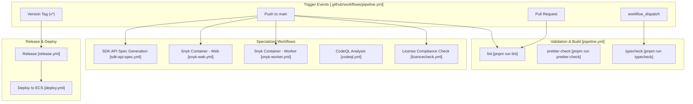
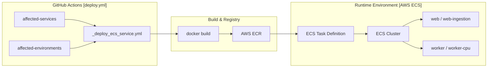

# Development & Operations

Relevant source files

The following files were used as context for generating this wiki page:

- [.devcontainer/Dockerfile](.devcontainer/Dockerfile)
- [.github/dependabot.yml](.github/dependabot.yml)
- [.github/workflows/_deploy_ecs_service.yml](.github/workflows/_deploy_ecs_service.yml)
- [.github/workflows/ci.yml.template](.github/workflows/ci.yml.template)
- [.github/workflows/claude-review-maintainer-prs.yml](.github/workflows/claude-review-maintainer-prs.yml)
- [.github/workflows/codeql.yml](.github/workflows/codeql.yml)
- [.github/workflows/codespell.yml](.github/workflows/codespell.yml)
- [.github/workflows/dependabot-rebase-stale.yml](.github/workflows/dependabot-rebase-stale.yml)
- [.github/workflows/deploy.yml](.github/workflows/deploy.yml)
- [.github/workflows/licencecheck.yml](.github/workflows/licencecheck.yml)
- [.github/workflows/pipeline.yml](.github/workflows/pipeline.yml)
- [.github/workflows/promote-main-to-production.yml](.github/workflows/promote-main-to-production.yml)
- [.github/workflows/release.yml](.github/workflows/release.yml)
- [.github/workflows/sdk-api-spec.yml](.github/workflows/sdk-api-spec.yml)
- [.github/workflows/snyk-web.yml](.github/workflows/snyk-web.yml)
- [.github/workflows/snyk-worker.yml](.github/workflows/snyk-worker.yml)
- [CONTRIBUTING.md](CONTRIBUTING.md)
- [packages/shared/src/features/analytics-integrations/blob-export-gate.ts](packages/shared/src/features/analytics-integrations/blob-export-gate.ts)
- [scripts/codex/maintenance.sh](scripts/codex/maintenance.sh)
- [scripts/codex/setup.sh](scripts/codex/setup.sh)
- [turbo.json](turbo.json)
- [web/src/__tests__/server/unit/assertLegacyBlobExportSourceAllowed.servertest.ts](web/src/__tests__/server/unit/assertLegacyBlobExportSourceAllowed.servertest.ts)

This page documents the development workflows, testing strategies, deployment processes, and operational monitoring for the Langfuse platform. It covers the CI/CD pipeline configuration, Docker containerization, test execution patterns, observability instrumentation, and database migration procedures.

For information about the monorepo structure and package organization, see [Monorepo Structure](#1.2). For technology stack details, see [Technology Stack](#1.3).

---

## CI/CD Pipeline

The CI/CD pipeline is implemented using GitHub Actions and executes comprehensive validation checks. The primary workflow is defined in `pipeline.yml`, which manages a complex matrix of tasks including linting, formatting checks, and service health validation.

### Pipeline Architecture

**Sources:** [.github/workflows/pipeline.yml:1-133](), [.github/workflows/sdk-api-spec.yml:1-9](), [.github/workflows/deploy.yml:1-38](), [.github/workflows/snyk-web.yml:1-4](), [.github/workflows/licencecheck.yml:1-10]()

### Automated SDK Generation
The pipeline includes an automated SDK generation step triggered by changes to the Fern API definitions in the `fern/` directory. The `sdk-api-spec.yml` workflow uses the `fern-api` CLI to generate updated TypeScript and Python SDKs. It automatically clones the `langfuse-python` and `langfuse-js` repositories, updates the generated code, and opens Pull Requests for review.

**Sources:** [.github/workflows/sdk-api-spec.yml:7-8](), [.github/workflows/sdk-api-spec.yml:42-103](), [.github/workflows/sdk-api-spec.yml:123-162]()

For details, see [CI/CD Pipeline](#11.1).

---

## Docker & Deployment

The system utilizes multi-stage Dockerfiles to optimize image size and security. Deployment is primarily targeted at AWS ECS via a reusable workflow architecture.

### Deployment Flow to AWS ECS

**Sources:** [.github/workflows/deploy.yml:38-118](), [.github/workflows/_deploy_ecs_service.yml:1-102]()

### Deployment Configuration
The `deploy.yml` workflow supports multiple environments (staging, prod-eu, prod-us, prod-hipaa, prod-jp) and services (web, worker, web-ingestion, web-iso, worker-cpu). It leverages a reusable `_deploy_ecs_service.yml` workflow that handles AWS authentication, ECR login, and image building with specific arguments for Sentry, PostHog, and Langfuse Cloud regions.

**Sources:** [.github/workflows/deploy.yml:19-28](), [.github/workflows/_deploy_ecs_service.yml:70-87]()

For details, see [Docker & Deployment](#11.2).

---

## Testing Strategy

Langfuse employs a multi-layered testing strategy. The `pipeline.yml` uses a `skip_check` step to avoid redundant testing of identical git trees by comparing the current tree SHA with prior successful runs.

### Test Environment
- **Turbo Cache**: `turbo.json` configures task dependencies and caching for `lint`, `typecheck`, and `test` to optimize CI speed. It ensures `db:generate` runs before building or testing.
- **LLM Connection Tests**: Triggered specifically when `fetchLLMCompletion.ts` or related shared logic changes, identified via a `paths-filter`.
- **Dependency Management**: Dependabot is configured to group updates for core libraries like `prisma`, `next`, `express`, and `observability` packages.

**Sources:** [.github/workflows/pipeline.yml:50-74](), [turbo.json:6-73](), [.github/workflows/pipeline.yml:82-89](), [.github/dependabot.yml:24-52]()

For details, see [Testing Strategy](#11.3).

---

## Observability & Monitoring

The platform is instrumented for deep observability and security monitoring using Snyk, CodeQL, and standard linting tools.

### Security Scanning
- **Snyk**: Scans Docker images for `web` and `worker` for vulnerabilities, outputting SARIF files to GitHub Code Scanning.
- **CodeQL**: Performs static analysis for JavaScript and TypeScript on every push and PR to main and production branches.
- **License Compliance**: A dedicated `license_check` job ensures third-party dependencies do not violate license policies (e.g., checking for Strong Copyleft licenses).

**Sources:** [.github/workflows/snyk-web.yml:11-54](), [.github/workflows/codeql.yml:12-95](), [.github/workflows/licencecheck.yml:17-50]()

For details, see [Observability & Monitoring](#11.4).

---

## Database Migrations

Database management involves dual schemas: PostgreSQL for relational metadata and ClickHouse for high-volume observability data.

### Migration Management
- **PostgreSQL**: Managed via Prisma. `turbo.json` defines tasks for `db:migrate`, `db:deploy`, and `db:generate`. `db:generate` is a prerequisite for most build and test tasks.
- **Promotion Workflow**: Changes are promoted from `main` to `production` branches via `release.yml`, which triggers the deployment of the updated application code and associated schema changes.

**Sources:** [turbo.json:15-20](), [turbo.json:50-54](), [.github/workflows/release.yml:1-25]()

For details, see [Database Migrations](#11.5).

---

## Version Management

Version synchronization is maintained across the monorepo using `pnpm` workspaces. The CI pipeline explicitly enforces specific versions of core tools to ensure reproducibility:
- **Node.js**: Version 24 (specified in CI env and `.nvmrc`)
- **pnpm**: Version 11.1.3 (used in setup actions and codex scripts)

**Sources:** [.github/workflows/pipeline.yml:26](), [.github/workflows/pipeline.yml:102](), [scripts/codex/setup.sh:22](), [CONTRIBUTING.md:113-114]()
