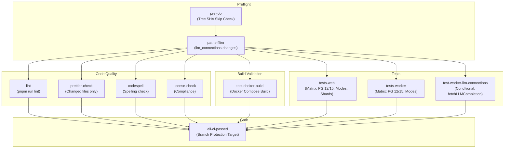
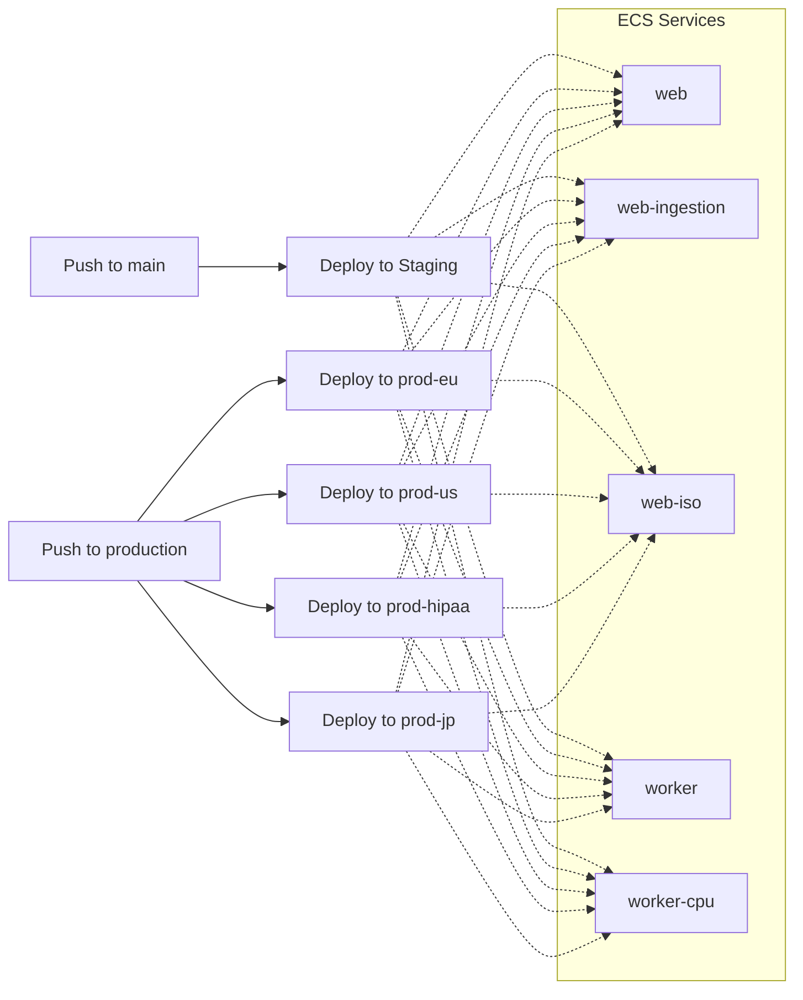
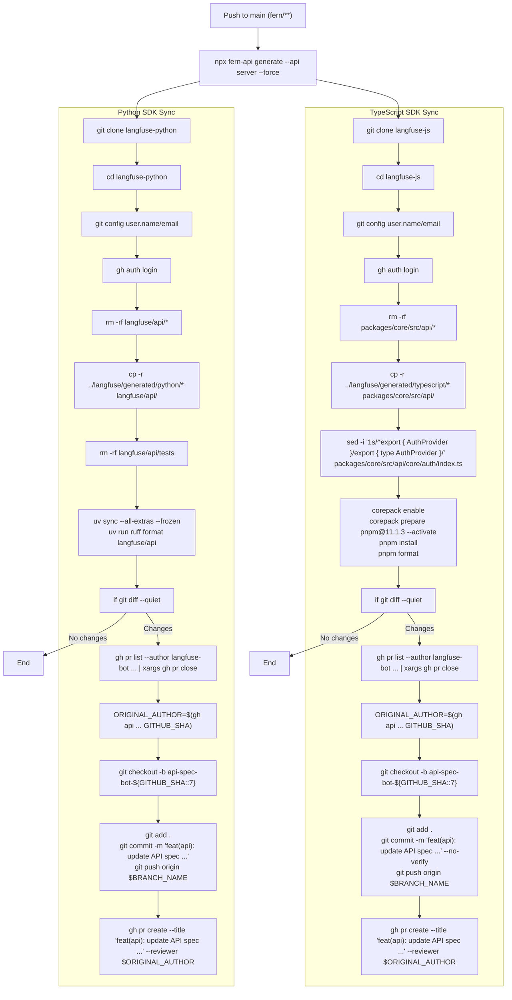

# CI/CD Pipeline

Relevant source files

The following files were used as context for generating this wiki page:

- [.github/dependabot.yml](.github/dependabot.yml)
- [.github/workflows/_deploy_ecs_service.yml](.github/workflows/_deploy_ecs_service.yml)
- [.github/workflows/claude-review-maintainer-prs.yml](.github/workflows/claude-review-maintainer-prs.yml)
- [.github/workflows/codeql.yml](.github/workflows/codeql.yml)
- [.github/workflows/codespell.yml](.github/workflows/codespell.yml)
- [.github/workflows/dependabot-rebase-stale.yml](.github/workflows/dependabot-rebase-stale.yml)
- [.github/workflows/deploy.yml](.github/workflows/deploy.yml)
- [.github/workflows/licencecheck.yml](.github/workflows/licencecheck.yml)
- [.github/workflows/pipeline.yml](.github/workflows/pipeline.yml)
- [.github/workflows/promote-main-to-production.yml](.github/workflows/promote-main-to-production.yml)
- [.github/workflows/release.yml](.github/workflows/release.yml)
- [.github/workflows/sdk-api-spec.yml](.github/workflows/sdk-api-spec.yml)
- [.github/workflows/snyk-web.yml](.github/workflows/snyk-web.yml)
- [.github/workflows/snyk-worker.yml](.github/workflows/snyk-worker.yml)

## Purpose and Scope

This document describes the continuous integration and continuous deployment (CI/CD) pipeline for the Langfuse monorepo. The pipeline is implemented using GitHub Actions and orchestrates building, testing, and releasing the web application, worker service, and associated SDKs.

The relevant workflow files are:

| File | Purpose |
|------|---------|
| `.github/workflows/pipeline.yml` | Main CI/CD pipeline: lint, test, Docker build validation, and image publish [.github/workflows/pipeline.yml:1-15]() |
| `.github/workflows/deploy.yml` | Orchestrates deployment to AWS ECS across staging and production environments [.github/workflows/deploy.yml:1-38]() |
| `.github/workflows/_deploy_ecs_service.yml` | Reusable workflow for building and pushing Docker images to ECR and updating ECS task definitions [.github/workflows/_deploy_ecs_service.yml:1-22]() |
| `.github/workflows/release.yml` | Promotes the `main` branch to `production` upon semantic version tag pushes [.github/workflows/release.yml:1-10]() |
| `.github/workflows/sdk-api-spec.yml` | Automatically generates and updates Python and TypeScript SDKs from Fern API specs [.github/workflows/sdk-api-spec.yml:1-19]() |
| `.github/workflows/codeql.yml` | Semantic code analysis and security scanning [.github/workflows/codeql.yml:12-21]() |
| `.github/workflows/snyk-web.yml` / `snyk-worker.yml` | Container vulnerability scanning for Web and Worker images [.github/workflows/snyk-web.yml:1-10](), [.github/workflows/snyk-worker.yml:1-10]() |

Sources: [.github/workflows/pipeline.yml:1-15](), [.github/workflows/deploy.yml:1-38](), [.github/workflows/sdk-api-spec.yml:1-19]()

---

## Workflow Triggers and Concurrency Control

The main CI/CD workflow (`.github/workflows/pipeline.yml`) triggers on multiple events:

| Trigger Type | Branches/Conditions | Purpose |
|--------------|---------------------|---------|
| `workflow_dispatch` | Manual | On-demand execution |
| `push` | `main` branch, `v*` tags | Automated deployment and release |
| `merge_group` | All | Queue validation for merge queues |
| `pull_request` | All branches | Pre-merge validation |

**Concurrency Strategy:**
- Workflow runs are grouped by `${{ github.workflow }}-${{ github.ref }}` [.github/workflows/pipeline.yml:19]()
- Pull request runs automatically cancel previous runs (`cancel-in-progress: true`) [.github/workflows/pipeline.yml:20]()
- Non-PR runs (e.g., main branch) do not cancel previous runs to ensure deployment completion.

**Tree SHA Skip Check:**
The `pre-job` includes a custom optimization that checks if the current Git tree SHA has already been successfully tested in a prior run of `pipeline.yml`. It uses `gh api` to fetch the tree SHA of the current commit and compares it against recent successful runs [.github/workflows/pipeline.yml:64-68](). If a match is found, the workflow sets `should_skip=true` to save compute resources [.github/workflows/pipeline.yml:71-72]().

Sources: [.github/workflows/pipeline.yml:3-20](), [.github/workflows/pipeline.yml:51-75]()

---

## Pipeline Job Orchestration

The main pipeline is defined in `.github/workflows/pipeline.yml` and consists of multiple jobs that validate code quality, build artifacts, and run the test suite across a matrix of environments.

### Pipeline Job Dependency Graph

**Paths Filter Logic:**
The `filter` step uses `dorny/paths-filter` to detect changes in specific files, such as `packages/shared/src/server/llm/fetchLLMCompletion.ts`, to trigger conditional LLM connection tests [.github/workflows/pipeline.yml:83-89]().

Sources: [.github/workflows/pipeline.yml:38-95](), [.github/workflows/codespell.yml:19-21]()

---

## Deployment Architecture

Langfuse uses a dual-track deployment strategy: internal cloud deployments via AWS ECS and open-source releases via Docker Hub/GHCR.

### Cloud Deployment Flow (AWS ECS)

The deployment is managed by `deploy.yml`, which maps GitHub branches to specific AWS environments. It uses a `workflow_call` to the reusable `_deploy_ecs_service.yml` [.github/workflows/deploy.yml:101-102]().

**Service Matrix:**
The deployment matrix covers specialized instances of the web and worker services [.github/workflows/deploy.yml:112-115]():
- `web`: Standard application server.
- `web-ingestion`: Optimized for high-throughput API ingestion.
- `web-iso`: Isolated environment for specific compliance needs.
- `worker`: Standard background job processor.
- `worker-cpu`: CPU-optimized worker for intensive evaluation tasks.

Sources: [.github/workflows/deploy.yml:8-28](), [.github/workflows/deploy.yml:112-118]()

---

## SDK and API Specification Pipeline

The `sdk-api-spec.yml` workflow ensures that client SDKs remain synchronized with the server's API definitions. It triggers on changes to the `fern/` directory [.github/workflows/sdk-api-spec.yml:7-8]().

### Automated SDK Generation Flow

**Key Code Entities:**
- `fern-api`: Tool used to generate SDKs from OpenAPI/Fern definitions [.github/workflows/sdk-api-spec.yml:47]().
- `uv`: Used for Python dependency management and formatting in the `langfuse-python` repository [.github/workflows/sdk-api-spec.yml:49-79]().
- `corepack`: Enables `pnpm` for TypeScript SDK formatting and installation in `langfuse-js` [.github/workflows/sdk-api-spec.yml:135-138]().
- `ruff`: Python formatter used to ensure code quality in the generated SDK [.github/workflows/sdk-api-spec.yml:79]().
- `fetchLLMCompletion.ts`: Core function monitored for changes to trigger SDK updates and LLM connection tests [.github/workflows/pipeline.yml:89]().

Sources: [.github/workflows/sdk-api-spec.yml:44-47](), [.github/workflows/sdk-api-spec.yml:54-103](), [.github/workflows/sdk-api-spec.yml:109-162]()

---

## Security and Compliance

### Vulnerability Scanning
- **Snyk Container Scanning**: Runs on every push to `main` and `production`. It tests the `web/Dockerfile` and `worker/Dockerfile` for OS-level and dependency vulnerabilities [.github/workflows/snyk-web.yml:32-34](), [.github/workflows/snyk-worker.yml:32-34](). The results are uploaded to GitHub Code Scanning in SARIF format [.github/workflows/snyk-web.yml:50-54](), [.github/workflows/snyk-worker.yml:50-54]().
- **CodeQL**: Performs static analysis for `javascript-typescript` to identify common coding vulnerabilities. It is scheduled to run weekly on Sundays [.github/workflows/codeql.yml:19-20](), [.github/workflows/codeql.yml:46-47]().
- **Codespell**: Checks for spelling errors in the codebase on every push and pull request [.github/workflows/codespell.yml:19-30]().
- **License Compliance Check**: The `licencecheck.yml` workflow uses `license-checker` to generate a CSV of production dependencies and `pilosus/action-pip-license-checker` to check for disallowed licenses (e.g., `WeakCopyleft`, `StrongCopyleft`, `NetworkCopyleft`) [.github/workflows/licencecheck.yml:36-47]().

### Dependabot Configuration
Dependabot is configured for daily updates of `npm` dependencies and weekly updates for `github-actions` [.github/dependabot.yml:12-13](), [.github/dependabot.yml:55-56]().

**Dependency Groups:**
To reduce PR noise, dependencies are grouped [.github/dependabot.yml:24-66]():
- `prisma`: Includes `prisma` and `@prisma/client`.
- `next`: Includes `eslint-config-next` and `next`.
- `observability`: Includes `dd-trace`, `@opentelemetry/*`, and `@sentry/*`.
- `express`: Includes `express` and its types.
- `radix-ui`: Includes `@radix-ui/*` components.

**Auto-Rebase:**
The `dependabot-rebase-stale.yml` workflow automatically rebases open Dependabot PRs when `main` is updated to prevent merge conflicts [.github/workflows/dependabot-rebase-stale.yml:1-21]().

Sources: [.github/workflows/snyk-web.yml:1-10](), [.github/workflows/codeql.yml:12-21](), [.github/dependabot.yml:24-52](), [.github/workflows/dependabot-rebase-stale.yml:1-21](), [.github/workflows/licencecheck.yml:36-47]()

---

## Docker Build Process

### Multi-Stage Builds
The project uses multi-stage Dockerfiles to minimize image size and security surface area.

**Web Build Strategy (`_deploy_ecs_service.yml`):**
1. **Build Arguments**: Injects environment-specific variables like `NEXT_PUBLIC_LANGFUSE_CLOUD_REGION`, `NEXT_PUBLIC_BUILD_ID` (set to `github.sha`), and `SENTRY_AUTH_TOKEN` [.github/workflows/_deploy_ecs_service.yml:70-87]().
2. **Registry**: Images are pushed to AWS ECR (Elastic Container Registry) using the registry output from `aws-actions/amazon-ecr-login` [.github/workflows/_deploy_ecs_service.yml:49-52](), [.github/workflows/_deploy_ecs_service.yml:88]().
3. **Task Definition**: The workflow renders a new ECS task definition using `aws-actions/amazon-ecs-render-task-definition` and updates the service [.github/workflows/_deploy_ecs_service.yml:89-102]().

**Test Build Validation:**
The `test-docker-build` job (referenced in `pipeline.yml` logic) validates that images are functional before they are considered for release. This typically includes health checks via `curl` to `/api/health`.

Sources: [.github/workflows/_deploy_ecs_service.yml:70-102](), [.github/workflows/pipeline.yml:1-15]()
