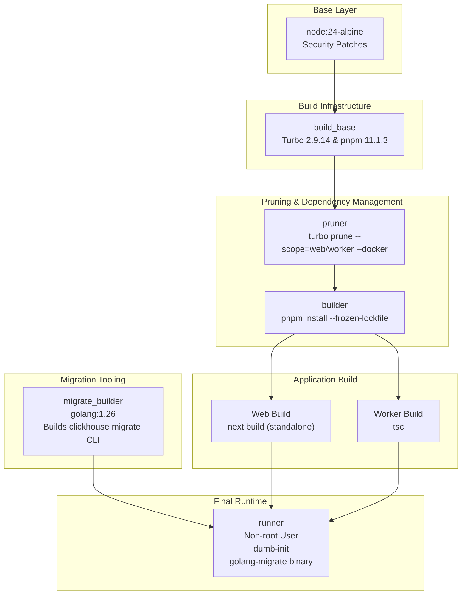
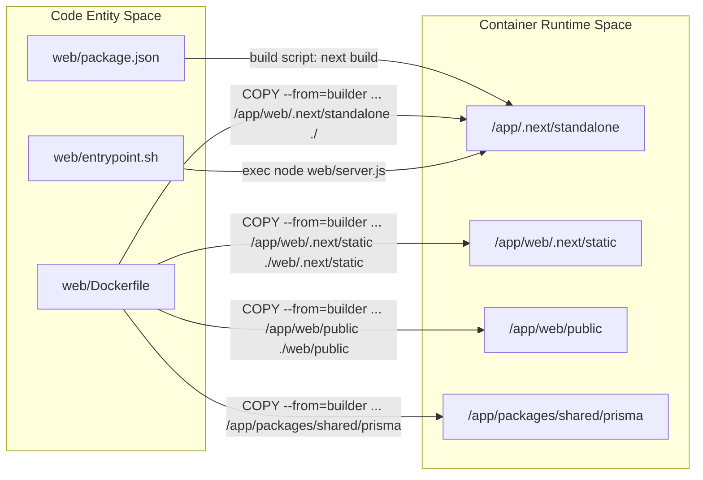
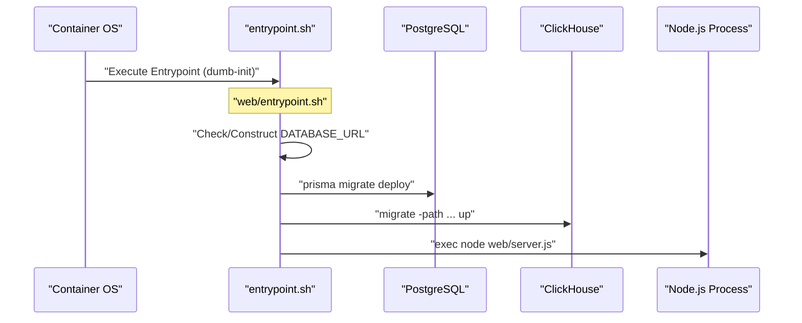

# Docker & Deployment

Relevant source files

The following files were used as context for generating this wiki page:

- [.dockerignore](.dockerignore)
- [docker-compose.build.yml](docker-compose.build.yml)
- [docker-compose.dev-azure.yml](docker-compose.dev-azure.yml)
- [docker-compose.dev-redis-cluster.yml](docker-compose.dev-redis-cluster.yml)
- [docker-compose.dev.yml](docker-compose.dev.yml)
- [docker-compose.yml](docker-compose.yml)
- [ee/package.json](ee/package.json)
- [package.json](package.json)
- [packages/config-eslint/package.json](packages/config-eslint/package.json)
- [packages/shared/clickhouse/scripts/down.sh](packages/shared/clickhouse/scripts/down.sh)
- [packages/shared/clickhouse/scripts/drop.sh](packages/shared/clickhouse/scripts/drop.sh)
- [packages/shared/clickhouse/scripts/up.sh](packages/shared/clickhouse/scripts/up.sh)
- [packages/shared/package.json](packages/shared/package.json)
- [packages/shared/src/constants/VERSION.ts](packages/shared/src/constants/VERSION.ts)
- [pnpm-lock.yaml](pnpm-lock.yaml)
- [pnpm-workspace.yaml](pnpm-workspace.yaml)
- [web/Dockerfile](web/Dockerfile)
- [web/entrypoint.sh](web/entrypoint.sh)
- [web/package.json](web/package.json)
- [web/src/constants/VERSION.ts](web/src/constants/VERSION.ts)
- [worker/Dockerfile](worker/Dockerfile)
- [worker/entrypoint.sh](worker/entrypoint.sh)
- [worker/package.json](worker/package.json)
- [worker/src/constants/VERSION.ts](worker/src/constants/VERSION.ts)
- [worker/src/index.ts](worker/src/index.ts)

This document describes the containerization and deployment architecture for Langfuse's web and worker services, including multi-stage Docker builds, build optimization strategies, multi-architecture support (AMD64/ARM64), and container orchestration.

## Overview

Langfuse provides production-ready Docker images for two core services that form the backbone of the platform:
- **Web Service**: A Next.js application serving the UI, the public Ingestion API, and the internal tRPC API (port 3000) [docker-compose.yml:71-76]().
- **Worker Service**: An Express-based application handling asynchronous background job processing via BullMQ (port 3030) [docker-compose.yml:7-20]().

Both services utilize multi-stage builds to minimize image size and maximize security by running as non-root users (`nextjs` for web, `expressjs` for worker) [web/Dockerfile:137-169](), [worker/Dockerfile:86-91]().

Sources: [docker-compose.yml:7-87](), [web/Dockerfile:1-176](), [worker/Dockerfile:1-101]()

## Docker Build Architecture

### Multi-Stage Build Pipeline

Langfuse uses a sophisticated multi-stage pipeline to ensure that build tools like `pnpm` and `turbo` are not included in the final runtime image. The build process leverages `turbo prune` to create a subset of the monorepo for each service.

**Build Pipeline Visualization**

**Build Stages Description**

1.  **pruner**: Executes `turbo prune --scope=<service> --docker`. This command extracts only the code and `package.json` files necessary for the specific service (web or worker) and its internal workspace dependencies like `@langfuse/shared` [web/Dockerfile:37-42](), [worker/Dockerfile:22-27]().
2.  **builder**: Performs `pnpm install --frozen-lockfile`. It also bakes in build-time arguments (`ARG`) into environment variables (`ENV`) required for the Next.js frontend bundle, such as `NEXT_PUBLIC_POSTHOG_KEY` [web/Dockerfile:44-79]().
3.  **migrate-builder**: A Go-based stage (using `golang:1.26`) that compiles the `migrate` CLI with ClickHouse support to avoid CVEs associated with prebuilt binaries [web/Dockerfile:23-35]().
4.  **runner**: The final production image. It copies only the standalone output (for Web) or the compiled `dist` folder (for Worker), installs runtime-only tools like `prisma`, and switches to a non-root user [web/Dockerfile:112-170](), [worker/Dockerfile:68-92]().

Sources: [web/Dockerfile:1-176](), [worker/Dockerfile:1-101](), [package.json:100](), [web/Dockerfile:10](), [worker/Dockerfile:10](), [package.json:51]()

### Web Service Optimization

The Web service leverages Next.js "standalone" mode to significantly reduce the image size by only including files detected during the build's dependency tracing [web/Dockerfile:157-159]().

**Code to Container Mapping**

Key optimizations in the deployment flow:
- **Dependency Pruning**: The worker Dockerfile uses a specific `pnpm deploy --legacy --prod` step to isolate production dependencies and manually syncs the generated Prisma client artifacts from the builder stage [worker/Dockerfile:52-66]().
- **Multi-Arch Support**: Both Dockerfiles use `--platform=${TARGETPLATFORM:-linux/amd64}` to support building for multiple architectures like ARM64 [web/Dockerfile:2](), [worker/Dockerfile:2]().

Sources: [web/Dockerfile:112-166](), [worker/Dockerfile:52-68](), [web/package.json:10]()

## Container Orchestration & Configuration

### Docker Compose
The primary orchestration method for self-hosting is Docker Compose. The standard stack includes:
- `langfuse-web`: Main application (Next.js) [docker-compose.yml:71]().
- `langfuse-worker`: Background processor (Express/BullMQ) [docker-compose.yml:7]().
- `postgres`: Metadata storage [docker-compose.yml:147]().
- `clickhouse`: Observability data storage [docker-compose.yml:90]().
- `redis`: Queue backend (BullMQ) and caching [docker-compose.yml:132]().
- `minio`: S3-compatible blob storage for event bodies and exports [docker-compose.yml:111]().

Sources: [docker-compose.yml:6-160]()

### Environment Variable Management
Variables are split between build-time (static) and runtime (dynamic).

| Category | Key Variables | Purpose |
| :--- | :--- | :--- |
| **Database** | `DATABASE_URL`, `CLICKHOUSE_URL` | Connectivity to Postgres and ClickHouse [docker-compose.yml:23-29]() |
| **Security** | `NEXTAUTH_SECRET`, `SALT`, `ENCRYPTION_KEY` | JWT signing, password hashing, and data encryption [docker-compose.yml:24-25](), [docker-compose.yml:79]() |
| **Storage** | `LANGFUSE_S3_EVENT_UPLOAD_BUCKET` | S3/Minio bucket for ingestion events [docker-compose.yml:36]() |
| **Cloud Metering** | `NEXT_PUBLIC_LANGFUSE_CLOUD_REGION` | Enables cloud-specific features and Datadog tracing [web/Dockerfile:142-146]() |

Sources: [docker-compose.yml:21-88](), [web/Dockerfile:59-93]()

## Deployment Initialization Flow

When a Langfuse container starts, it follows a specific sequence defined in the entrypoint scripts to ensure the environment is ready.

**Key Implementation Details:**
- **PostgreSQL Migrations**: Executed via `prisma migrate deploy` during the web container lifecycle to ensure the schema is up to date [web/Dockerfile:177]().
- **ClickHouse Migrations**: Managed via the `migrate` CLI compiled in the `migrate-builder` stage and copied to the runner [web/Dockerfile:152]().
- **Signal Handling**: Containers use `dumb-init` to properly handle signals and `NEXT_MANUAL_SIG_HANDLE=true` to allow Next.js to handle graceful shutdowns [web/Dockerfile:177](), [web/package.json:19]().
- **Cleanup**: A `cleanup.sql` script is provided for database maintenance tasks [packages/shared/package.json:10](), [web/Dockerfile:167]().

Sources: [web/Dockerfile:152-177](), [worker/Dockerfile:97-102](), [web/package.json:19](), [packages/shared/package.json:10-11]()
