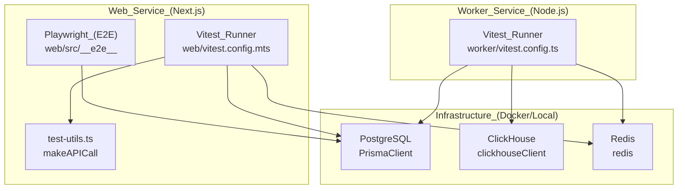
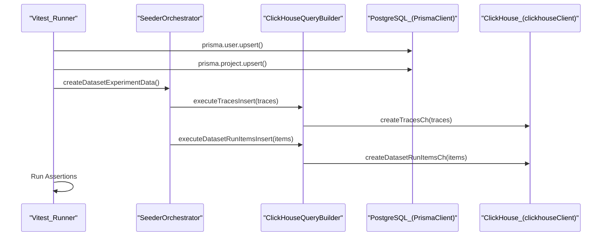

# Testing Strategy

Relevant source files

The following files were used as context for generating this wiki page:

- [.devcontainer/Dockerfile](.devcontainer/Dockerfile)
- [.env.test.example](.env.test.example)
- [.github/workflows/ci.yml.template](.github/workflows/ci.yml.template)
- [CONTRIBUTING.md](CONTRIBUTING.md)
- [packages/shared/scripts/seeder/load-seed-clickhouse.ts](packages/shared/scripts/seeder/load-seed-clickhouse.ts)
- [packages/shared/scripts/seeder/prepare-clickhouse.ts](packages/shared/scripts/seeder/prepare-clickhouse.ts)
- [packages/shared/scripts/seeder/seed-clickhouse.ts](packages/shared/scripts/seeder/seed-clickhouse.ts)
- [packages/shared/scripts/seeder/seed-dataset-versions.ts](packages/shared/scripts/seeder/seed-dataset-versions.ts)
- [packages/shared/scripts/seeder/seed-postgres.ts](packages/shared/scripts/seeder/seed-postgres.ts)
- [packages/shared/scripts/seeder/utils/README.md](packages/shared/scripts/seeder/utils/README.md)
- [packages/shared/scripts/seeder/utils/clickhouse-builder.ts](packages/shared/scripts/seeder/utils/clickhouse-builder.ts)
- [packages/shared/scripts/seeder/utils/data-generators.ts](packages/shared/scripts/seeder/utils/data-generators.ts)
- [packages/shared/scripts/seeder/utils/postgres-seed-constants.ts](packages/shared/scripts/seeder/utils/postgres-seed-constants.ts)
- [packages/shared/scripts/seeder/utils/seed-helpers.ts](packages/shared/scripts/seeder/utils/seed-helpers.ts)
- [packages/shared/scripts/seeder/utils/seeder-orchestrator.ts](packages/shared/scripts/seeder/utils/seeder-orchestrator.ts)
- [packages/shared/scripts/seeder/utils/types.ts](packages/shared/scripts/seeder/utils/types.ts)
- [packages/shared/src/features/analytics-integrations/blob-export-gate.ts](packages/shared/src/features/analytics-integrations/blob-export-gate.ts)
- [packages/shared/src/server/auth/apiKeys.ts](packages/shared/src/server/auth/apiKeys.ts)
- [scripts/codex/maintenance.sh](scripts/codex/maintenance.sh)
- [scripts/codex/setup.sh](scripts/codex/setup.sh)
- [turbo.json](turbo.json)
- [web/src/__tests__/after-teardown.ts](web/src/__tests__/after-teardown.ts)
- [web/src/__tests__/server/api-auth.servertest.ts](web/src/__tests__/server/api-auth.servertest.ts)
- [web/src/__tests__/server/ingestion-api.servertest.ts](web/src/__tests__/server/ingestion-api.servertest.ts)
- [web/src/__tests__/server/otel-api.servertest.ts](web/src/__tests__/server/otel-api.servertest.ts)
- [web/src/__tests__/server/prompts.v2.servertest.ts](web/src/__tests__/server/prompts.v2.servertest.ts)
- [web/src/__tests__/server/rate-limit.servertest.ts](web/src/__tests__/server/rate-limit.servertest.ts)
- [web/src/__tests__/server/traces-api.servertest.ts](web/src/__tests__/server/traces-api.servertest.ts)
- [web/src/__tests__/server/unit/assertLegacyBlobExportSourceAllowed.servertest.ts](web/src/__tests__/server/unit/assertLegacyBlobExportSourceAllowed.servertest.ts)
- [web/src/__tests__/test-utils.ts](web/src/__tests__/test-utils.ts)
- [web/src/__tests__/vitest-test-db-setup.ts](web/src/__tests__/vitest-test-db-setup.ts)
- [web/src/features/datasets/components/DatasetIOCells.tsx](web/src/features/datasets/components/DatasetIOCells.tsx)
- [web/src/features/datasets/components/DatasetRunItemsByItemTable.tsx](web/src/features/datasets/components/DatasetRunItemsByItemTable.tsx)
- [web/src/features/datasets/components/DatasetRunItemsByRunTable.tsx](web/src/features/datasets/components/DatasetRunItemsByRunTable.tsx)
- [web/src/features/datasets/components/NotFoundCard.tsx](web/src/features/datasets/components/NotFoundCard.tsx)
- [web/src/features/datasets/lib/convertRunItemDataToUiTableRow.ts](web/src/features/datasets/lib/convertRunItemDataToUiTableRow.ts)
- [web/src/features/datasets/lib/types.ts](web/src/features/datasets/lib/types.ts)
- [web/src/features/organizations/components/AIFeatureSwitch.tsx](web/src/features/organizations/components/AIFeatureSwitch.tsx)
- [web/src/features/public-api/server/projectApiKeyRouter.ts](web/src/features/public-api/server/projectApiKeyRouter.ts)
- [web/vitest.config.mts](web/vitest.config.mts)
- [worker/vitest.config.ts](worker/vitest.config.ts)

This document describes the comprehensive testing approach used in the Langfuse codebase, including test types, frameworks, execution patterns, and test utilities. The strategy ensures code quality through multiple layers of verification across the `web`, `worker`, and `packages/shared` workspace.

---

## Testing Philosophy and Scope

The Langfuse testing strategy employs a multi-layered approach with distinct test types targeting different aspects of the system:

- **Unit tests** verify isolated business logic and utilities, such as evaluation template variable extraction and string compilation.
- **Integration tests** validate interactions between components, including PostgreSQL, ClickHouse, Redis, and S3. These often involve maintain real database connections while mocking external APIs [web/src/vitest.config.mts:61-72]().
- **End-to-end (E2E) tests** ensure complete user workflows function correctly in a browser environment using Playwright [web/src/scripts/codex/setup.sh:29-31]().
- **LLM Connection tests** verify live connectivity and structured output parsing for various model providers via the playground and evaluation services.
- **Test Utilities** provide standardized methods for database setup, queue management, and API mocking [web/src/__tests__/test-utils.ts:1-16]().

**Sources:** [web/vitest.config.mts:1-96](), [web/src/__tests__/test-utils.ts:1-16](), [scripts/codex/setup.sh:29-31]()

---

## Test Framework Overview

The Langfuse monorepo uses `pnpm` and `Turbo` to manage the test lifecycle. The CI environment uses Node.js version 24 [scripts/codex/setup.sh:16-19]().

### Test Architecture and Entity Mapping

The diagram below illustrates how different test runners interact with the system's infrastructure and code entities.

**Sources:** [web/vitest.config.mts:1-96](), [worker/vitest.config.ts:1-10](), [web/src/__tests__/test-utils.ts:122-128](), [packages/shared/scripts/seeder/seed-postgres.ts:40-41](), [packages/shared/scripts/seeder/utils/seeder-orchestrator.ts:12-19]()

---

## Test Types and Organization

### Unit and Integration Tests

Langfuse uses **Vitest** as the primary test runner for unit and integration tests. The configuration is split into projects to handle different environments like `node` for server tests and `jsdom` for client-side component tests [web/vitest.config.mts:32-94]().

**Public API Integration Tests:**
Server-side tests verify the REST API endpoints using `makeAPICall` and `makeZodVerifiedAPICall` [web/src/__tests__/test-utils.ts:122-187]():
- **Prompt Management:** `prompts.v2.servertest.ts` validates prompt creation, versioning, and retrieval via the public API.
- **Rate Limiting:** `rate-limit.servertest.ts` ensures that the Redis-backed rate limiting correctly blocks requests when limits are exceeded.
- **OTel Ingestion:** `otel-api.servertest.ts` validates the mapping of OpenTelemetry spans to Langfuse events.
- **Authentication:** `api-auth.servertest.ts` ensures API keys are correctly validated and scoped to organizations or projects.

**Sources:** [web/vitest.config.mts:32-94](), [web/src/__tests__/test-utils.ts:122-187]()

### End-to-End Tests (Playwright)

E2E tests verify the frontend application and its integration with the backend services. The development environment includes a `playwright:install` step to ensure browser binaries are available [scripts/codex/setup.sh:29-31]().

**Sources:** [scripts/codex/setup.sh:29-31]()

---

## ClickHouse Seeder and Helpers

For complex integration tests and local development, Langfuse uses a specialized `SeederOrchestrator` to populate both PostgreSQL and ClickHouse with realistic data [packages/shared/scripts/seeder/utils/seeder-orchestrator.ts:39-48]().

- **`DataGenerator`**: Generates realistic synthetic traces, observations, and scores. It supports different modes like `generateDatasetTrace` for experiments and `generateDatasetRunItem` for dataset runs [packages/shared/scripts/seeder/utils/data-generators.ts:48-142]().
- **`ClickHouseQueryBuilder`**: Provides low-level methods to execute raw `INSERT` queries. It includes `buildBulkTracesInsert` and `buildBulkObservationsInsert` for generating large datasets (>1000 items) using ClickHouse's `numbers()` function [packages/shared/scripts/seeder/utils/clickhouse-builder.ts:86-160]().
- **Seeding Orchestration**: `SeederOrchestrator` coordinates the creation of dataset experiment data, evaluation data, and synthetic data across both databases [packages/shared/scripts/seeder/utils/seeder-orchestrator.ts:94-210]().

**Sources:** [packages/shared/scripts/seeder/utils/seeder-orchestrator.ts:39-210](), [packages/shared/scripts/seeder/utils/data-generators.ts:48-142](), [packages/shared/scripts/seeder/utils/clickhouse-builder.ts:1-160]()

---

## Test Utilities and Helpers

Langfuse provides several shared utilities in `web/src/__tests__/test-utils.ts` to simplify test writing:

| Utility | Purpose |
| :--- | :--- |
| `makeAPICall` | Wrapper for making authenticated REST API calls in tests [web/src/__tests__/test-utils.ts:122-163](). |
| `makeZodVerifiedAPICall` | Performs an API call and validates the response against a Zod schema [web/src/__tests__/test-utils.ts:165-187](). |
| `getQueues` | Retrieves instances of all active BullMQ queues (Ingestion, Eval, OTel, etc.) for testing [web/src/__tests__/test-utils.ts:17-81](). |
| `disconnectQueues` | Gracefully closes all Redis queue connections to prevent test hangs [web/src/__tests__/test-utils.ts:83-103](). |

**Sources:** [web/src/__tests__/test-utils.ts:17-187]()

---

## CI/CD Pipeline Integration

The testing strategy is enforced via GitHub Actions and Turborepo.

- **Turbo Pipeline**: The `test` task in `turbo.json` depends on `db:generate` to ensure Prisma clients are up to date before execution [turbo.json:89-92]().
- **Prisma Generation**: Explicit generation steps for the `shared` package and the workspace ensure type safety during tests [scripts/codex/setup.sh:33-39]().
- **Environment Setup**: Tests use dedicated `.env.test` files for configuration [web/vitest.config.mts:8-9]().
- **Matrix Testing**: The CI workflow executes builds, lints, and type-checks in parallel with database deployment [ .github/workflows/ci.yml.template:58-65]().

**Sources:** [turbo.json:89-92](), [scripts/codex/setup.sh:33-39](), [web/vitest.config.mts:8-9](), [ .github/workflows/ci.yml.template:58-65]()

---

## Data Flow in Testing

The following diagram maps the flow of a test case that verifies the evaluation system using the ClickHouse seeder and query builder.

**Sources:** [packages/shared/scripts/seeder/seed-postgres.ts:52-110](), [packages/shared/scripts/seeder/utils/seeder-orchestrator.ts:94-193](), [packages/shared/scripts/seeder/utils/clickhouse-builder.ts:46-71]()
