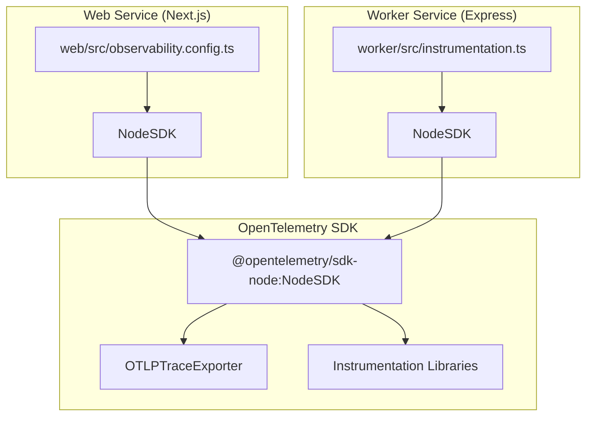
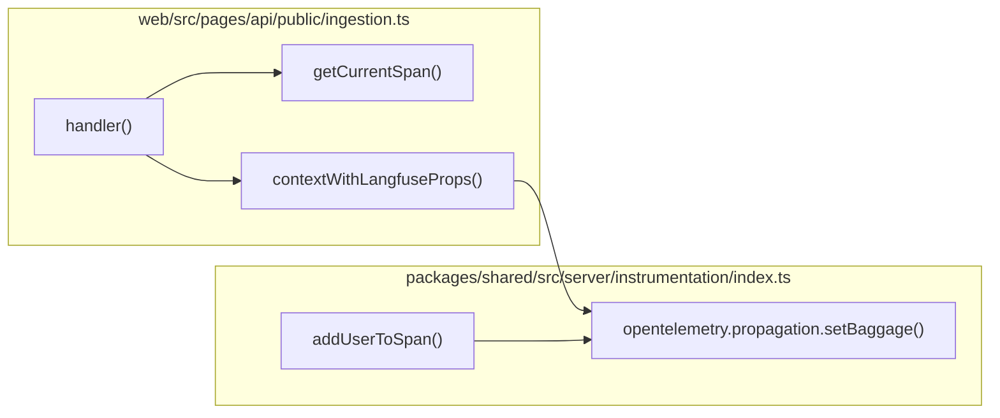
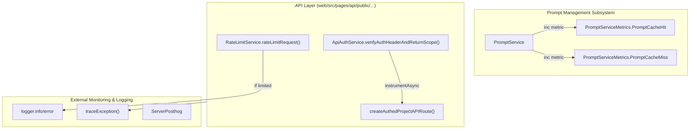

# Observability & Monitoring

<details>
<summary>Relevant source files</summary>

The following files were used as context for generating this wiki page:

- [packages/shared/src/features/prompts/types.ts](packages/shared/src/features/prompts/types.ts)
- [packages/shared/src/server/auth/types.ts](packages/shared/src/server/auth/types.ts)
- [packages/shared/src/server/headerPropagation.ts](packages/shared/src/server/headerPropagation.ts)
- [packages/shared/src/server/instrumentation/index.ts](packages/shared/src/server/instrumentation/index.ts)
- [packages/shared/src/server/services/PromptService/index.ts](packages/shared/src/server/services/PromptService/index.ts)
- [packages/shared/src/server/services/PromptService/types.ts](packages/shared/src/server/services/PromptService/types.ts)
- [web/src/__tests__/server/promptCache.servertest.ts](web/src/__tests__/server/promptCache.servertest.ts)
- [web/src/__tests__/server/unit/api-auth-span.servertest.ts](web/src/__tests__/server/unit/api-auth-span.servertest.ts)
- [web/src/__tests__/server/unit/langfuse-context-propagation.servertest.ts](web/src/__tests__/server/unit/langfuse-context-propagation.servertest.ts)
- [web/src/features/mcp/features/prompts/index.ts](web/src/features/mcp/features/prompts/index.ts)
- [web/src/features/mcp/features/prompts/tools/getPrompt.ts](web/src/features/mcp/features/prompts/tools/getPrompt.ts)
- [web/src/features/mcp/features/prompts/tools/getPromptUnresolved.ts](web/src/features/mcp/features/prompts/tools/getPromptUnresolved.ts)
- [web/src/features/mcp/features/prompts/tools/promptReadToolFactory.ts](web/src/features/mcp/features/prompts/tools/promptReadToolFactory.ts)
- [web/src/features/prompts/server/actions/deletePrompt.ts](web/src/features/prompts/server/actions/deletePrompt.ts)
- [web/src/features/prompts/server/actions/getPromptByName.ts](web/src/features/prompts/server/actions/getPromptByName.ts)
- [web/src/features/prompts/server/handlers/promptNameHandler.ts](web/src/features/prompts/server/handlers/promptNameHandler.ts)
- [web/src/features/public-api/server/apiAuth.ts](web/src/features/public-api/server/apiAuth.ts)
- [web/src/features/public-api/server/createAuthedProjectAPIRoute.ts](web/src/features/public-api/server/createAuthedProjectAPIRoute.ts)
- [web/src/features/telemetry/index.ts](web/src/features/telemetry/index.ts)
- [web/src/observability.config.ts](web/src/observability.config.ts)
- [web/src/pages/api/public/ingestion.ts](web/src/pages/api/public/ingestion.ts)
- [web/src/pages/api/public/projects/[projectId]/apiKeys/[apiKeyId].ts](web/src/pages/api/public/projects/[projectId]/apiKeys/[apiKeyId].ts)
- [web/src/pages/api/public/projects/[projectId]/apiKeys/index.ts](web/src/pages/api/public/projects/[projectId]/apiKeys/index.ts)
- [web/src/pages/api/public/prompts.ts](web/src/pages/api/public/prompts.ts)
- [worker/src/instrumentation.ts](worker/src/instrumentation.ts)

</details>


This document describes the observability and monitoring infrastructure in Langfuse, including distributed tracing, APM integration, error tracking, and metrics collection. This covers instrumentation for both the web and worker services.

For information about queue architecture and background processing, see [7. Queue & Worker System](). For deployment and infrastructure, see [11.2. Docker & Deployment]().

---

## Overview

Langfuse employs a multi-layered observability strategy:

1.  **OpenTelemetry** for distributed tracing and instrumentation.
2.  **DataDog APM** for application performance monitoring (Cloud deployments).
3.  **Sentry** for error tracking and monitoring (Web service).
4.  **PostHog** for product analytics and user behavior tracking.
5.  **Custom Metrics** for queue monitoring and operational metrics.
6.  **AWS CloudWatch** for metric publishing (optional).

Both the web and worker services are instrumented independently but follow similar patterns. The instrumentation is initialized at application startup before any other code runs.

---

## OpenTelemetry Instrumentation

### Initialization Flow

OpenTelemetry instrumentation is initialized at the earliest possible point in both services to ensure all subsequent modules are correctly wrapped. In the web service, this is handled via `observability.config.ts` [web/src/observability.config.ts:1-83](), while the worker uses a dedicated `instrumentation.ts` [worker/src/instrumentation.ts:1-79]().

Title: OpenTelemetry Initialization Flow

Sources: [web/src/observability.config.ts:2-26](), [worker/src/instrumentation.ts:2-26]()

### Configuration

Both services use identical OpenTelemetry SDK configuration with the following components:

| Component | Purpose | Configuration |
|-----------|---------|---------------|
| `NodeSDK` | Main SDK instance | Service name, version from `BUILD_ID` |
| `OTLPTraceExporter` | Exports traces via OTLP protocol | Endpoint from `OTEL_EXPORTER_OTLP_ENDPOINT` |
| Resource Detectors | Auto-detect deployment context | AWS ECS, Container, Process, Environment |
| Sampler (Web only) | Controls trace sampling rate | `TraceIdRatioBasedSampler` using `OTEL_TRACE_SAMPLING_RATIO` |

**Environment Variables:**

*   `OTEL_EXPORTER_OTLP_ENDPOINT`: OTLP endpoint URL (e.g., `http://localhost:4318/v1/traces`) [worker/src/instrumentation.ts:32-32]().
*   `OTEL_SERVICE_NAME`: Service identifier (e.g., "worker") [worker/src/instrumentation.ts:28-28]().
*   `OTEL_TRACE_SAMPLING_RATIO`: Sampling ratio 0.0-1.0 (web service only) [web/src/observability.config.ts:79-79]().
*   `BUILD_ID`: Used as service version for trace correlation [web/src/observability.config.ts:29-29]().

Sources: [web/src/observability.config.ts:26-80](), [worker/src/instrumentation.ts:26-78]()

### Instrumentation Libraries

The following OpenTelemetry instrumentation libraries are registered to capture telemetry from core dependencies:

*   **HttpInstrumentation**: Captures incoming and outgoing HTTP requests. It is configured to ignore health check endpoints (`/api/public/health`, `/api/public/ready`, `/api/health`) [web/src/observability.config.ts:38-42](), [worker/src/instrumentation.ts:38-42]().
*   **IORedisInstrumentation**: Instruments Redis operations. It includes a `requestHook` [worker/src/instrumentation.ts:35-35]() that redacts sensitive credentials and API key cache values using `ioredisRequestHook` [web/src/observability.config.ts:35-35]().
*   **BullMQInstrumentation**: Configuration `{ useProducerSpanAsConsumerParent: true }` links consumer spans to producer spans across queue boundaries [web/src/observability.config.ts:71-71](), [worker/src/instrumentation.ts:68-68]().
*   **PrismaInstrumentation**: Instruments database queries, ignoring noisy span types like serialization [web/src/observability.config.ts:60-68](), [worker/src/instrumentation.ts:57-65]().
*   **WinstonInstrumentation**: Correlates logs with active traces while disabling direct log sending [web/src/observability.config.ts:70-70](), [worker/src/instrumentation.ts:67-67]().

Sources: [web/src/observability.config.ts:34-72](), [worker/src/instrumentation.ts:34-69]()

---

## Context Propagation & Baggage

Langfuse heavily uses OpenTelemetry Baggage to propagate metadata across service boundaries. The `contextWithLangfuseProps` function creates a new context containing baggage entries for `userId`, `projectId`, and `apiKeyId` [packages/shared/src/server/headerPropagation.ts:17-65]().

Furthermore, specific `x-langfuse-*` headers are automatically extracted and added to both the active span and the baggage for downstream tracing [web/src/pages/api/public/ingestion.ts:61-71](), [packages/shared/src/server/headerPropagation.ts:35-48]().

Title: Context and Header Propagation

Sources: [web/src/pages/api/public/ingestion.ts:58-102](), [packages/shared/src/server/headerPropagation.ts:17-65](), [packages/shared/src/server/instrumentation/index.ts:190-247]()

---

## DataDog APM Integration

DataDog's `dd-trace` library is initialized for production monitoring in Langfuse Cloud deployments.

### Initialization

Both services initialize `dd-trace` before other modules to allow for automatic monkey-patching:

```javascript
// web/src/observability.config.ts & worker/src/instrumentation.ts
dd.init({
  runtimeMetrics: true,
  plugins: false, // OpenTelemetry handles standard instrumentations
});
```
Sources: [web/src/observability.config.ts:21-24](), [worker/src/instrumentation.ts:21-24]()

---

## PostHog Analytics

Langfuse uses PostHog for product analytics and telemetry.

### Server-side Telemetry
A dedicated `telemetry()` function handles periodic reporting of system metrics to PostHog for self-hosted instances [web/src/features/telemetry/index.ts:20-58](). This job is managed via a `cronJobs` table in PostgreSQL to ensure it only runs once every 12 hours across multiple instances [web/src/features/telemetry/index.ts:15-124]().

The telemetry job collects the following data points:
*   Total project counts [web/src/features/telemetry/index.ts:161-165]().
*   Aggregated counts of traces, scores, and observations from ClickHouse for the timeframe [web/src/features/telemetry/index.ts:168-198]().
*   Dataset and Dataset Item counts [web/src/features/telemetry/index.ts:201-213]().

Sources: [web/src/features/telemetry/index.ts:1-213]()

---

## Metrics & Instrumentation Utilities

### Application Service Monitoring

Title: Service-Level Observability (Code Entity Space)


**Internal Metrics:**
*   **PromptService**: Tracks cache performance using `PromptServiceMetrics.PromptCacheHit` and `PromptServiceMetrics.PromptCacheMiss` [packages/shared/src/server/services/PromptService/index.ts:55-59](). It utilizes a `metricIncrementer` callback to report these to OpenTelemetry or other providers [packages/shared/src/server/services/PromptService/index.ts:32-34]().
*   **Rate Limiting**: The `RateLimitService` monitors request volume per project/organization and reports when limits are reached [web/src/pages/api/public/prompts.ts:55-63]().
*   **Authentication Tracing**: `ApiAuthService` wraps its core verification logic in `instrumentAsync` to provide detailed spans for authentication performance [web/src/features/public-api/server/apiAuth.ts:94-96]().

Sources: [packages/shared/src/server/services/PromptService/index.ts:32-66](), [web/src/pages/api/public/prompts.ts:55-63](), [web/src/features/public-api/server/apiAuth.ts:94-118]()

---

## Error Handling & Reporting

### Public API Error Management
Public API handlers use structured error reporting. Exceptions are caught and passed to `traceException()` and `logger.error()` to ensure visibility in APM tools [web/src/pages/api/public/prompts.ts:111-113]().

The `traceException` utility [packages/shared/src/server/instrumentation/index.ts:141-188]() automatically:
1.  Records the exception as an OpenTelemetry event [packages/shared/src/server/instrumentation/index.ts:175-175]().
2.  Sets Datadog-specific error tags (`error.stack`, `error.message`, `error.type`) [packages/shared/src/server/instrumentation/index.ts:178-182]().
3.  Sets the span status to `ERROR` [packages/shared/src/server/instrumentation/index.ts:184-187]().

Specific error types are handled to provide correct HTTP status codes:
*   **UnauthorizedError / ForbiddenError**: Returns 401/403 for auth failures [web/src/pages/api/public/prompts.ts:36-44]().
*   **LangfuseNotFoundError**: Returns 404 when resources like prompts are missing [web/src/pages/api/public/prompts.ts:71-71]().

Sources: [web/src/pages/api/public/prompts.ts:110-140](), [packages/shared/src/server/instrumentation/index.ts:141-188]()
