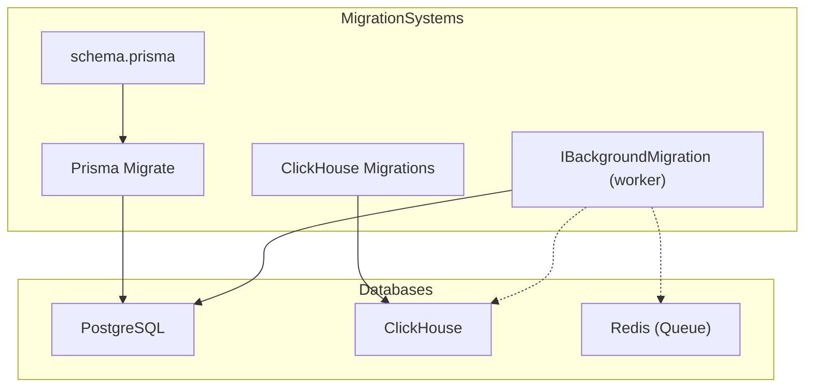
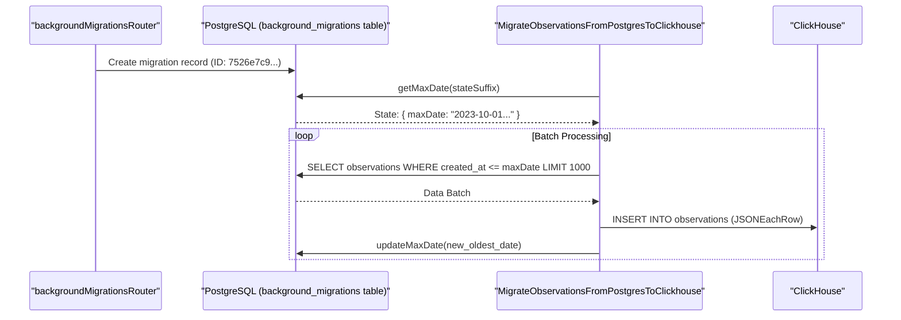
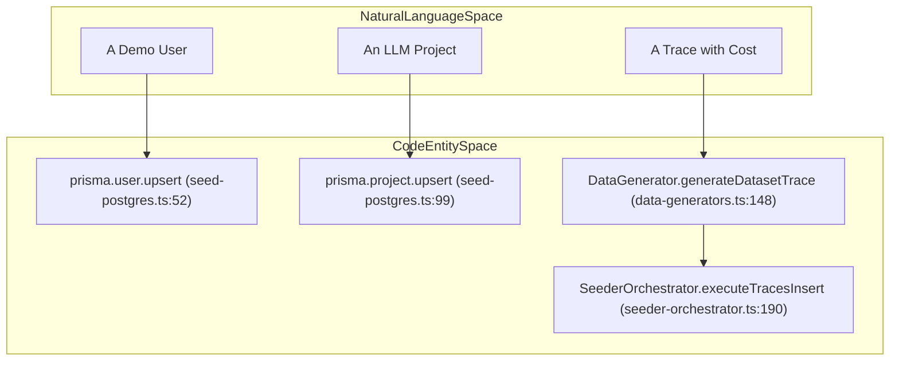

# Database Migrations

Relevant source files

The following files were used as context for generating this wiki page:

- [packages/shared/prisma/schema.prisma](packages/shared/prisma/schema.prisma)
- [packages/shared/scripts/seeder/load-seed-clickhouse.ts](packages/shared/scripts/seeder/load-seed-clickhouse.ts)
- [packages/shared/scripts/seeder/prepare-clickhouse.ts](packages/shared/scripts/seeder/prepare-clickhouse.ts)
- [packages/shared/scripts/seeder/seed-clickhouse.ts](packages/shared/scripts/seeder/seed-clickhouse.ts)
- [packages/shared/scripts/seeder/seed-dataset-versions.ts](packages/shared/scripts/seeder/seed-dataset-versions.ts)
- [packages/shared/scripts/seeder/seed-postgres.ts](packages/shared/scripts/seeder/seed-postgres.ts)
- [packages/shared/scripts/seeder/utils/README.md](packages/shared/scripts/seeder/utils/README.md)
- [packages/shared/scripts/seeder/utils/clickhouse-builder.ts](packages/shared/scripts/seeder/utils/clickhouse-builder.ts)
- [packages/shared/scripts/seeder/utils/data-generators.ts](packages/shared/scripts/seeder/utils/data-generators.ts)
- [packages/shared/scripts/seeder/utils/postgres-seed-constants.ts](packages/shared/scripts/seeder/utils/postgres-seed-constants.ts)
- [packages/shared/scripts/seeder/utils/seed-helpers.ts](packages/shared/scripts/seeder/utils/seed-helpers.ts)
- [packages/shared/scripts/seeder/utils/seeder-orchestrator.ts](packages/shared/scripts/seeder/utils/seeder-orchestrator.ts)
- [packages/shared/scripts/seeder/utils/types.ts](packages/shared/scripts/seeder/utils/types.ts)
- [web/src/__tests__/organization-settings-pages.clienttest.tsx](web/src/__tests__/organization-settings-pages.clienttest.tsx)
- [web/src/features/audit-logs/auditLog.ts](web/src/features/audit-logs/auditLog.ts)
- [web/src/features/datasets/components/DatasetIOCells.tsx](web/src/features/datasets/components/DatasetIOCells.tsx)
- [web/src/features/datasets/components/DatasetRunItemsByItemTable.tsx](web/src/features/datasets/components/DatasetRunItemsByItemTable.tsx)
- [web/src/features/datasets/components/DatasetRunItemsByRunTable.tsx](web/src/features/datasets/components/DatasetRunItemsByRunTable.tsx)
- [web/src/features/datasets/components/NotFoundCard.tsx](web/src/features/datasets/components/NotFoundCard.tsx)
- [web/src/features/datasets/lib/convertRunItemDataToUiTableRow.ts](web/src/features/datasets/lib/convertRunItemDataToUiTableRow.ts)
- [web/src/features/datasets/lib/types.ts](web/src/features/datasets/lib/types.ts)
- [web/src/features/models/components/ModelSettings.tsx](web/src/features/models/components/ModelSettings.tsx)
- [web/src/features/organizations/components/AIFeatureSwitch.tsx](web/src/features/organizations/components/AIFeatureSwitch.tsx)
- [web/src/pages/organization/[organizationId]/settings/index.tsx](web/src/pages/organization/[organizationId]/settings/index.tsx)
- [web/src/pages/project/[projectId]/settings/index.tsx](web/src/pages/project/[projectId]/settings/index.tsx)
- [web/src/server/api/root.ts](web/src/server/api/root.ts)
- [web/src/server/api/routers/public.ts](web/src/server/api/routers/public.ts)
- [worker/src/__tests__/inMemoryFilterService.test.ts](worker/src/__tests__/inMemoryFilterService.test.ts)
- [worker/src/backgroundMigrations/IBackgroundMigration.ts](worker/src/backgroundMigrations/IBackgroundMigration.ts)
- [worker/src/backgroundMigrations/addGenerationsCostBackfill.ts](worker/src/backgroundMigrations/addGenerationsCostBackfill.ts)
- [worker/src/backgroundMigrations/migrateObservationsFromPostgresToClickhouse.ts](worker/src/backgroundMigrations/migrateObservationsFromPostgresToClickhouse.ts)
- [worker/src/backgroundMigrations/migrateScoresFromPostgresToClickhouse.ts](worker/src/backgroundMigrations/migrateScoresFromPostgresToClickhouse.ts)
- [worker/src/backgroundMigrations/migrateTracesFromPostgresToClickhouse.ts](worker/src/backgroundMigrations/migrateTracesFromPostgresToClickhouse.ts)
- [worker/src/ee/cloudUsageMetering/constants.ts](worker/src/ee/cloudUsageMetering/constants.ts)

This document describes the database migration system for Langfuse, covering PostgreSQL schema migrations (managed via Prisma), ClickHouse schema management, background migrations for large-scale data transformations, and data seeding workflows.

## Migration Architecture Overview

Langfuse uses a dual-database architecture requiring separate migration strategies for each system:

- **PostgreSQL**: Stores metadata, configuration, and relational data. Migrations are managed through Prisma Migrate using declarative schema definitions in `schema.prisma`. [packages/shared/prisma/schema.prisma:1-14]()
- **ClickHouse**: Stores high-volume event data, traces, and metrics. Schema changes are managed through SQL scripts and versioned migrations.
- **Background Migrations**: Long-running data backfills and transformations that cannot be executed in a single transaction. These are managed via a dedicated worker-based system to ensure system stability and avoid locking production databases. [web/src/server/api/root.ts:109]()

Title: Migration System Architecture

**Sources:** [packages/shared/prisma/schema.prisma:9-14](), [web/src/server/api/root.ts:109](), [worker/src/backgroundMigrations/IBackgroundMigration.ts:1-1]()

## Background Migrations

For large-scale data moves or schema backfills, Langfuse uses an asynchronous background migration system. These migrations are registered in the `backgroundMigrationsRouter` and executed by background workers. [web/src/server/api/root.ts:109]()

### Migration Implementation
Classes implementing `IBackgroundMigration` define the logic for specific data transformations. For example, `MigrateObservationsFromPostgresToClickhouse` handles moving legacy relational data to the columnar store. [worker/src/backgroundMigrations/migrateObservationsFromPostgresToClickhouse.ts:14-14]()

Key behaviors include:
- **Resumability**: Progress is persisted in the `background_migrations` table. Workers store the current state (e.g., `maxDate`) in the `state` JSON column so that if a worker restarts, it picks up from the last successful batch. [worker/src/backgroundMigrations/migrateObservationsFromPostgresToClickhouse.ts:18-38]()
- **Batching**: Data is processed in chunks (defaulting to 1000 rows) to prevent memory exhaustion and long-running database locks. [worker/src/backgroundMigrations/migrateObservationsFromPostgresToClickhouse.ts:105-130]()
- **Validation**: The `validate` method checks for the existence of target ClickHouse tables or required credentials before execution begins. [worker/src/backgroundMigrations/migrateObservationsFromPostgresToClickhouse.ts:53-94]()

Title: Background Migration Logic Flow

**Sources:** [web/src/server/api/root.ts:109](), [worker/src/backgroundMigrations/migrateObservationsFromPostgresToClickhouse.ts:12-51](), [worker/src/backgroundMigrations/migrateObservationsFromPostgresToClickhouse.ts:122-155]()

## ClickHouse Schema Management

ClickHouse migrations maintain performance and consistency, especially in clustered environments.

- **Index Management**: Indexes are added to optimize specific query patterns, such as filtering by `user_id`, `session_id`, or `trace_id`.
- **Materialized Views**: ClickHouse uses materialized views to aggregate events into traces, observations, and scores in real-time. Schema migrations often involve updating these views to support new fields.
- **Partitioning**: The schema typically partitions data by time to allow for efficient data retention and TTL management.
- **Bulk Operations**: Large-scale data insertion during migrations or seeding is optimized using ClickHouse's `numbers()` function or `JSONEachRow` format. [packages/shared/scripts/seeder/utils/clickhouse-builder.ts:105-130](), [worker/src/backgroundMigrations/migrateScoresFromPostgresToClickhouse.ts:119-123]()

## Seeding Data

Seeding is handled via scripts in `packages/shared/scripts/seeder/`, providing a reproducible environment for development and testing.

### PostgreSQL Seeding
The `seed-postgres.ts` script populates the relational database with essential demo data:
- **Auth**: Creates a "Demo User" (`demo@langfuse.com`) and "Seed Org". [packages/shared/scripts/seeder/seed-postgres.ts:52-97]()
- **Projects**: Creates a project `llm-app` with ID `7a88fb47-b4e2-43b8-a06c-a5ce950dc53a`. [packages/shared/scripts/seeder/seed-postgres.ts:99-110]()
- **API Keys**: Generates a default project-scoped API key (`pk-lf-1234567890`) with a hashed secret. [packages/shared/scripts/seeder/seed-postgres.ts:182-205]()
- **Prompts**: Seeds initial prompt versions and labels for testing prompt management. [packages/shared/scripts/seeder/seed-postgres.ts:163-180]()

### ClickHouse Seeding
ClickHouse seeding uses the `DataGenerator` and `SeederOrchestrator` classes to generate and insert high-volume observability data. [packages/shared/scripts/seeder/utils/seeder-orchestrator.ts:39-48]()

- **Dataset Experiments**: `SeederOrchestrator.createDatasetExperimentData` creates traces, observations, and scores specifically for A/B testing scenarios using `SEED_DATASETS` constants. [packages/shared/scripts/seeder/utils/seeder-orchestrator.ts:118-174]()
- **Observations**: `DataGenerator.generateDatasetObservation` creates generations with variable token usage and cost details, simulating realistic LLM provider usage. [packages/shared/scripts/seeder/utils/data-generators.ts:195-211]()
- **Bulk Inserts**: Uses `ClickHouseQueryBuilder` to execute optimized inserts for large batches of traces and scores, often utilizing `createTracesCh` and `createObservationsCh`. [packages/shared/scripts/seeder/utils/clickhouse-builder.ts:46-60](), [packages/shared/scripts/seeder/utils/seeder-orchestrator.ts:189-197]()

Title: Seeding Entity Space Mapping

**Sources:** [packages/shared/scripts/seeder/seed-postgres.ts:52-110](), [packages/shared/scripts/seeder/utils/data-generators.ts:148-189](), [packages/shared/scripts/seeder/utils/seeder-orchestrator.ts:189-197]()

## Key Migration and Seeding Files

| Path | Purpose |
|------|---------|
| `packages/shared/prisma/schema.prisma` | Source of truth for PostgreSQL schema and Prisma migrations. [packages/shared/prisma/schema.prisma:1-14]() |
| `packages/shared/scripts/seeder/seed-postgres.ts` | Main entry point for PostgreSQL data seeding. [packages/shared/scripts/seeder/seed-postgres.ts:42-112]() |
| `packages/shared/scripts/seeder/utils/data-generators.ts` | Logic for generating realistic ClickHouse observability data. [packages/shared/scripts/seeder/utils/data-generators.ts:48-57]() |
| `packages/shared/scripts/seeder/utils/seeder-orchestrator.ts` | Orchestrates seeding across both PG and CH. [packages/shared/scripts/seeder/utils/seeder-orchestrator.ts:39-48]() |
| `worker/src/backgroundMigrations/` | Implementation of resumable background data migrations (e.g., `MigrateScoresFromPostgresToClickhouse`). [worker/src/backgroundMigrations/migrateScoresFromPostgresToClickhouse.ts:14-14]() |

**Sources:** [packages/shared/prisma/schema.prisma:1-14](), [packages/shared/scripts/seeder/seed-postgres.ts:42-112](), [packages/shared/scripts/seeder/utils/data-generators.ts:48-57](), [packages/shared/scripts/seeder/utils/seeder-orchestrator.ts:39-48](), [worker/src/backgroundMigrations/migrateScoresFromPostgresToClickhouse.ts:14-14]()
