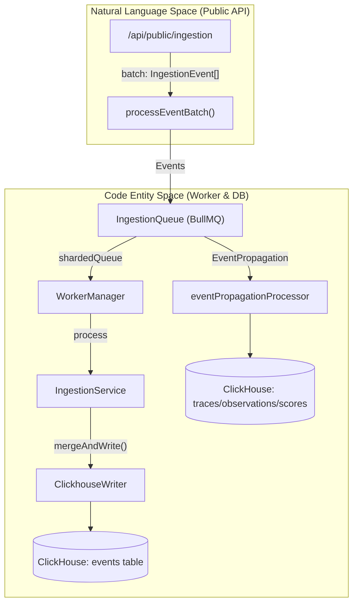
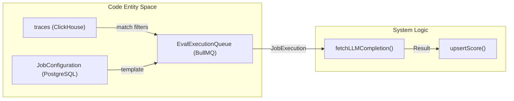

# Glossary

Relevant source files

The following files were used as context for generating this wiki page:

- [.env.dev-redis-cluster.example](.env.dev-redis-cluster.example)
- [.vscode/launch.json](.vscode/launch.json)
- [fern/apis/server/definition/ingestion.yml](fern/apis/server/definition/ingestion.yml)
- [packages/shared/clickhouse/scripts/dev-tables.sh](packages/shared/clickhouse/scripts/dev-tables.sh)
- [packages/shared/prisma/migrations/20250123103200_add_retention_days_to_projects/migration.sql](packages/shared/prisma/migrations/20250123103200_add_retention_days_to_projects/migration.sql)
- [packages/shared/src/domain/automations.ts](packages/shared/src/domain/automations.ts)
- [packages/shared/src/env.ts](packages/shared/src/env.ts)
- [packages/shared/src/features/entitlements/plans.ts](packages/shared/src/features/entitlements/plans.ts)
- [packages/shared/src/features/evals/types.ts](packages/shared/src/features/evals/types.ts)
- [packages/shared/src/features/monitors/service/helpers.test.ts](packages/shared/src/features/monitors/service/helpers.test.ts)
- [packages/shared/src/features/monitors/service/helpers.ts](packages/shared/src/features/monitors/service/helpers.ts)
- [packages/shared/src/features/monitors/service/service.ts](packages/shared/src/features/monitors/service/service.ts)
- [packages/shared/src/features/monitors/service/types.test.ts](packages/shared/src/features/monitors/service/types.test.ts)
- [packages/shared/src/features/monitors/service/types.ts](packages/shared/src/features/monitors/service/types.ts)
- [packages/shared/src/interfaces/rate-limits.ts](packages/shared/src/interfaces/rate-limits.ts)
- [packages/shared/src/server/automations.test.ts](packages/shared/src/server/automations.test.ts)
- [packages/shared/src/server/automations.ts](packages/shared/src/server/automations.ts)
- [packages/shared/src/server/index.ts](packages/shared/src/server/index.ts)
- [packages/shared/src/server/ingestion/types.ts](packages/shared/src/server/ingestion/types.ts)
- [packages/shared/src/server/queries/clickhouse-sql/clickhouse-filter.ts](packages/shared/src/server/queries/clickhouse-sql/clickhouse-filter.ts)
- [packages/shared/src/server/queries/clickhouse-sql/search.ts](packages/shared/src/server/queries/clickhouse-sql/search.ts)
- [packages/shared/src/server/queues.ts](packages/shared/src/server/queues.ts)
- [packages/shared/src/server/redis/eventPropagationQueue.ts](packages/shared/src/server/redis/eventPropagationQueue.ts)
- [packages/shared/src/server/redis/getQueue.ts](packages/shared/src/server/redis/getQueue.ts)
- [packages/shared/src/server/repositories/automation-repository.ts](packages/shared/src/server/repositories/automation-repository.ts)
- [packages/shared/src/server/repositories/definitions.ts](packages/shared/src/server/repositories/definitions.ts)
- [packages/shared/src/server/repositories/observations.ts](packages/shared/src/server/repositories/observations.ts)
- [packages/shared/src/server/repositories/scores.ts](packages/shared/src/server/repositories/scores.ts)
- [packages/shared/src/server/repositories/traces.ts](packages/shared/src/server/repositories/traces.ts)
- [packages/shared/src/server/services/sessions-ui-table-service.ts](packages/shared/src/server/services/sessions-ui-table-service.ts)
- [packages/shared/src/server/services/traces-ui-table-service.ts](packages/shared/src/server/services/traces-ui-table-service.ts)
- [packages/shared/src/server/test-utils/tracing-factory.ts](packages/shared/src/server/test-utils/tracing-factory.ts)
- [packages/shared/src/utils/json.ts](packages/shared/src/utils/json.ts)
- [web/src/__tests__/server/automations-trpc.servertest.ts](web/src/__tests__/server/automations-trpc.servertest.ts)
- [web/src/__tests__/server/clickhouseSearchCondition.servertest.ts](web/src/__tests__/server/clickhouseSearchCondition.servertest.ts)
- [web/src/__tests__/server/monitorService.servertest.ts](web/src/__tests__/server/monitorService.servertest.ts)
- [web/src/__tests__/server/monitors.servertest.ts](web/src/__tests__/server/monitors.servertest.ts)
- [web/src/components/VersionLabel.tsx](web/src/components/VersionLabel.tsx)
- [web/src/ee/features/ui-customization/uiCustomizationRouter.ts](web/src/ee/features/ui-customization/uiCustomizationRouter.ts)
- [web/src/ee/features/ui-customization/useUiCustomization.ts](web/src/ee/features/ui-customization/useUiCustomization.ts)
- [web/src/features/auth/lib/projectRetentionSchema.ts](web/src/features/auth/lib/projectRetentionSchema.ts)
- [web/src/features/automations/server/router.ts](web/src/features/automations/server/router.ts)
- [web/src/features/background-migrations/components/background-migrations.tsx](web/src/features/background-migrations/components/background-migrations.tsx)
- [web/src/features/background-migrations/components/retry-background-migration.tsx](web/src/features/background-migrations/components/retry-background-migration.tsx)
- [web/src/features/background-migrations/server/background-migrations-router.ts](web/src/features/background-migrations/server/background-migrations-router.ts)
- [web/src/features/entitlements/constants/entitlements.ts](web/src/features/entitlements/constants/entitlements.ts)
- [web/src/features/entitlements/server/getPlan.ts](web/src/features/entitlements/server/getPlan.ts)
- [web/src/features/evals/components/template-selector.tsx](web/src/features/evals/components/template-selector.tsx)
- [web/src/features/evals/hooks/useEvaluationModel.ts](web/src/features/evals/hooks/useEvaluationModel.ts)
- [web/src/features/experiments/components/MultiStepExperimentForm.tsx](web/src/features/experiments/components/MultiStepExperimentForm.tsx)
- [web/src/features/experiments/components/steps/EvaluatorsStep.tsx](web/src/features/experiments/components/steps/EvaluatorsStep.tsx)
- [web/src/features/experiments/components/steps/PromptModelStep.tsx](web/src/features/experiments/components/steps/PromptModelStep.tsx)
- [web/src/features/experiments/hooks/useEvaluatorDefaults.ts](web/src/features/experiments/hooks/useEvaluatorDefaults.ts)
- [web/src/features/experiments/hooks/useExperimentEvaluatorData.ts](web/src/features/experiments/hooks/useExperimentEvaluatorData.ts)
- [web/src/features/experiments/hooks/useExperimentPromptData.ts](web/src/features/experiments/hooks/useExperimentPromptData.ts)
- [web/src/features/experiments/types/stepProps.ts](web/src/features/experiments/types/stepProps.ts)
- [web/src/features/experiments/utils/evaluatorMappingUtils.ts](web/src/features/experiments/utils/evaluatorMappingUtils.ts)
- [web/src/features/feature-flags/available-flags.ts](web/src/features/feature-flags/available-flags.ts)
- [web/src/features/playground/page/hooks/useModelParams.ts](web/src/features/playground/page/hooks/useModelParams.ts)
- [web/src/features/projects/components/ConfigureRetention.tsx](web/src/features/projects/components/ConfigureRetention.tsx)
- [web/src/features/public-api/server/RateLimitService.ts](web/src/features/public-api/server/RateLimitService.ts)
- [web/src/features/rbac/constants/projectAccessRights.ts](web/src/features/rbac/constants/projectAccessRights.ts)
- [web/src/pages/api/admin/bullmq/index.ts](web/src/pages/api/admin/bullmq/index.ts)
- [web/src/pages/background-migrations.tsx](web/src/pages/background-migrations.tsx)
- [web/src/server/api/routers/generations/filterOptionsQuery.ts](web/src/server/api/routers/generations/filterOptionsQuery.ts)
- [web/src/server/api/routers/scores.ts](web/src/server/api/routers/scores.ts)
- [web/src/server/api/routers/sessions.ts](web/src/server/api/routers/sessions.ts)
- [web/src/server/api/routers/surveys.ts](web/src/server/api/routers/surveys.ts)
- [web/src/server/api/routers/traces.ts](web/src/server/api/routers/traces.ts)
- [web/src/utils/getFinalModelParams.tsx](web/src/utils/getFinalModelParams.tsx)
- [worker/src/app.ts](worker/src/app.ts)
- [worker/src/backgroundMigrations/backfillEventsHistoric.ts](worker/src/backgroundMigrations/backfillEventsHistoric.ts)
- [worker/src/backgroundMigrations/backfillEventsHistoricFromParts.ts](worker/src/backgroundMigrations/backfillEventsHistoricFromParts.ts)
- [worker/src/backgroundMigrations/backfillExperimentsHistoric.ts](worker/src/backgroundMigrations/backfillExperimentsHistoric.ts)
- [worker/src/env.ts](worker/src/env.ts)
- [worker/src/features/entityChange/promptVersionProcessor.ts](worker/src/features/entityChange/promptVersionProcessor.ts)
- [worker/src/features/eventPropagation/handleEventPropagationJob.ts](worker/src/features/eventPropagation/handleEventPropagationJob.ts)
- [worker/src/features/eventPropagation/handleExperimentBackfill.ts](worker/src/features/eventPropagation/handleExperimentBackfill.ts)
- [worker/src/features/tokenisation/usage.ts](worker/src/features/tokenisation/usage.ts)
- [worker/src/queues/ingestionQueue.ts](worker/src/queues/ingestionQueue.ts)
- [worker/src/queues/workerManager.ts](worker/src/queues/workerManager.ts)
- [worker/src/services/IngestionService/index.ts](worker/src/services/IngestionService/index.ts)
- [worker/src/services/IngestionService/tests/IngestionService.integration.test.ts](worker/src/services/IngestionService/tests/IngestionService.integration.test.ts)
- [worker/src/services/IngestionService/tests/calculateTokenCost.unit.test.ts](worker/src/services/IngestionService/tests/calculateTokenCost.unit.test.ts)
- [worker/src/services/IngestionService/tests/utils.unit.test.ts](worker/src/services/IngestionService/tests/utils.unit.test.ts)
- [worker/src/services/IngestionService/utils.ts](worker/src/services/IngestionService/utils.ts)
- [worker/src/utils/shutdown.ts](worker/src/utils/shutdown.ts)

This page defines codebase-specific terms, abbreviations, and domain concepts used within the Langfuse platform. It serves as a technical reference for onboarding engineers to navigate the dual-database architecture and event-driven pipeline.

## Core Domain Entities

The primary data models are defined in the Prisma schema and mirrored in ClickHouse for high-performance analytics.

| Term | Definition | Key Code Reference |
| :--- | :--- | :--- |
| **Trace** | The top-level container for a single request or execution flow. It tracks the overall latency and metadata for an LLM interaction. | `TraceRecordReadType` [packages/shared/src/server/repositories/definitions.ts:18-18]() |
| **Observation** | A granular event within a trace. Types include `SPAN`, `GENERATION`, `EVENT`, and `TOOL`. | `ObservationRecordReadType` [packages/shared/src/server/repositories/definitions.ts:11-11]() |
| **Generation** | A specific type of Observation that tracks LLM calls, including prompt input, completion output, and token usage. | `ObservationType` [packages/shared/src/domain/index.ts:47-47]() |
| **Score** | An evaluation metric attached to a Trace, Observation, or Session (e.g., accuracy, sentiment, user feedback). | `ScoreDomain` [packages/shared/src/domain/scores.ts:3-3]() |
| **ScoreConfig** | Predefined configuration for scores (numeric, categorical, boolean) to ensure consistency in manual and automated evaluations. | `ScoreConfig` [packages/shared/src/server/repositories/scores.ts:46-46]() |
| **Session** | A collection of multiple traces belonging to a single user interaction or conversation thread. | `getTracesGroupedBySessionId` [web/src/server/api/routers/traces.ts:50-50]() |
| **Prompt** | A versioned template for LLM inputs, supporting ChatML and text formats. Managed via the `PromptService`. | `PromptService` [packages/shared/src/server/services/PromptService/index.ts:1-10]() |
| **Dataset** | A collection of `DatasetItem`s used for benchmarking and evaluation. | `DatasetService` [packages/shared/src/server/index.ts:19-19]() |
| **DatasetRun** | An execution of a specific prompt or model version against a Dataset. | `DatasetRunItemEventType` [worker/src/services/IngestionService/index.ts:31-31]() |
| **Monitor** | Threshold-based alerting system on observability metrics. | `MonitorService` [packages/shared/src/server/index.ts:118-118]() |

**Sources:** [packages/shared/src/server/repositories/definitions.ts:11-18](), [packages/shared/src/domain/index.ts:47-47](), [web/src/server/api/routers/traces.ts:79-95](), [packages/shared/src/domain/scores.ts:3-3](), [worker/src/services/IngestionService/index.ts:185-193]()

## Data Architecture & ClickHouse

### Dual-Write / Event Sourcing
Langfuse uses an event-sourcing pattern where incoming data is first written to a staging area before being propagated to final analytical tables.

*   **Events Table**: The primary landing table in ClickHouse for all raw ingestion data. [worker/src/services/IngestionService/index.ts:154-155]()
*   **Final Tables**: Tables like `traces`, `observations`, and `scores` in ClickHouse that use the `ReplacingMergeTree` engine for deduplication. [packages/shared/src/server/repositories/traces.ts:162-162]()
*   **V4 Beta**: An architectural shift where synthetic traces are derived from observations, enabling more flexible event-first ingestion. [web/src/server/api/routers/traces.ts:87-88]()
*   **`ClickhouseWriter`**: A service in the worker responsible for batching writes to ClickHouse to improve ingestion throughput. [worker/src/services/IngestionService/index.ts:56-56]()
*   **`EventPropagationQueue`**: A BullMQ queue that handles moving data from staging tables (`observations_batch_staging`) to the final `events_full` table. [worker/src/features/eventPropagation/handleEventPropagationJob.ts:58-60]()

### ClickHouse Repository Pattern
The codebase abstracts complex ClickHouse SQL behind repository functions that handle deduplication (using `FINAL` or `LIMIT 1 BY id`) and time-window filtering.

*   **`checkTraceExistsAndGetTimestamp`**: A utility that validates if a trace exists within a window of a given timestamp to ensure eventual consistency during evaluation job creation. [packages/shared/src/server/repositories/traces.ts:58-72]()
*   **`upsertClickhouse`**: A shared utility to insert or update records in ClickHouse. [packages/shared/src/server/repositories/observations.ts:115-115]()
*   **`measureAndReturn`**: A wrapper used across repositories to instrument ClickHouse queries with OpenTelemetry and performance metrics. [packages/shared/src/server/repositories/traces.ts:128-155]()
*   **`shardedQueue`**: Logic to distribute ingestion and processing across multiple Redis shards for scalability. [packages/shared/src/env.ts:129-141]()

**Sources:** [packages/shared/src/server/repositories/traces.ts:58-192](), [packages/shared/src/server/repositories/observations.ts:64-126](), [packages/shared/src/env.ts:129-141](), [worker/src/features/eventPropagation/handleEventPropagationJob.ts:94-103]()

## Ingestion & Processing

### Ingestion Pipeline
The flow of data from external SDKs into the Langfuse storage layer. Incoming requests contain `IngestionEvent`s with a unique `EventBodyId`.

**Diagram: Ingestion Data Flow**

**Sources:** [worker/src/services/IngestionService/index.ts:136-155](), [packages/shared/src/server/repositories/traces.ts:198-204](), [packages/shared/src/env.ts:125-141](), [worker/src/app.ts:48-48]()

### OTel (OpenTelemetry) Ingestion
Langfuse supports native OTel traces. The `OtelIngestionProcessor` maps OTel resource spans to Langfuse entities.

*   **`OtelIngestionProcessor`**: Encapsulates logic for converting OpenTelemetry resource spans into Langfuse ingestion events. [worker/src/env.ts:70-74]()
*   **`ObservationTypeMapper`**: Registry that maps OTel span kinds and attributes to Langfuse observation types. [packages/shared/src/domain/index.ts:47-47]()

**Sources:** [worker/src/env.ts:70-74](), [packages/shared/src/server/repositories/observations.ts:148-150](), [worker/src/app.ts:79-79]()

## Evaluation & Automation

### Eval System
Automated processes that run LLM-based evaluations on traces.

*   **`JobConfiguration`**: Defines the filters and sampling for which traces should be evaluated. [worker/src/env.ts:111-114]()
*   **`JobExecution`**: Tracks the status and results of a specific evaluation run. [worker/src/env.ts:127-130]()
*   **`fetchLLMCompletion`**: The core abstraction for calling LLM providers (OpenAI, Anthropic, etc.) during evaluations. [packages/shared/src/server/index.ts:30-30]()
*   **`compileChatMessages`**: Function used to inject trace variables into evaluation prompts. [packages/shared/src/server/index.ts:35-35]()

### Automation System
Triggers and actions that execute based on platform events.

*   **`Trigger`**: The condition that starts an automation (e.g., a new score or trace). [packages/shared/src/domain/automations.ts:1-10]()
*   **`Action`**: The task to perform (e.g., Slack notification, Webhook). [packages/shared/src/domain/automations.ts:11-20]()
*   **`AnnotationQueue`**: A human-in-the-loop system where traces are queued for manual scoring by annotators. [packages/shared/src/server/index.ts:106-107]()

**Diagram: Evaluation Lifecycle**

**Sources:** [packages/shared/src/server/repositories/scores.ts:151-166](), [worker/src/env.ts:111-130](), [packages/shared/src/domain/automations.ts:1-20](), [worker/src/app.ts:140-153]()

## UI & Application State

*   **`FilterState`**: The standardized object structure for table filters in the UI. [packages/shared/src/server/repositories/traces.ts:12-12]()
*   **`OrderByState`**: Standardized structure for sorting table data. [packages/shared/src/server/repositories/observations.ts:25-25]()
*   **`TableViewPreset`**: Saved filter and column configurations for users. [packages/shared/src/server/index.ts:119-119]()
*   **`protectedProjectProcedure`**: A tRPC middleware that ensures the user has access to the specific project ID in the request. [web/src/server/api/routers/traces.ts:9-10]()

## Technical Abbreviations

| Abbreviation | Full Term | Description |
| :--- | :--- | :--- |
| **RBAC** | Role-Based Access Control | Managed via `ProjectMembership` and `OrganizationMembership`. [web/src/server/api/trpc.ts:1-10]() |
| **SSO** | Single Sign-On | Configured via `SsoConfig` and enforced by `VerifiedDomain`. [packages/shared/src/env.ts:13-18]() |
| **tRPC** | Typed RPC | Used for type-safe internal API communication. [web/src/server/api/routers/traces.ts:97-97]() |
| **BullMQ** | Bull Message Queue | The underlying library for the Langfuse worker queue system. [worker/src/queues/workerManager.ts:24-24]() |
| **LLMAdapter** | LLM Provider Adapter | Abstraction layer for different LLM providers (OpenAI, Anthropic, etc.). [packages/shared/src/server/index.ts:30-33]() |
| **Entitlement** | Feature Flag/Quota | Determines access to EE features or usage limits. [web/src/server/api/routers/traces.ts:56-56]() |
| **BatchAction** | Bulk Operation | Actions performed on multiple traces or scores at once (e.g., delete, export). [web/src/server/api/routers/traces.ts:12-15]() |
| **MonitorSeverity** | Alert Level | Defines the severity of a monitor trigger (`ok`, `warning`, `alert`). [packages/shared/src/features/monitors/server/index.ts:5-15]() |

**Sources:** [packages/shared/src/env.ts:1-150](), [worker/src/env.ts:1-150](), [web/src/server/api/routers/traces.ts:1-100](), [packages/shared/src/server/index.ts:1-120]()
