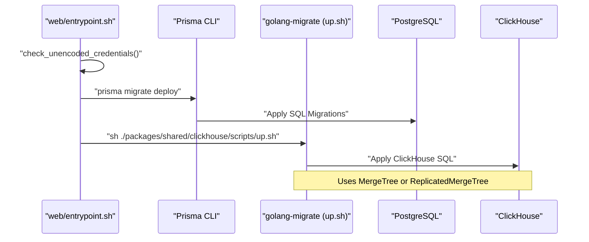

# Running Services

<details>
<summary>Relevant source files</summary>

The following files were used as context for generating this wiki page:

- [.dockerignore](.dockerignore)
- [docker-compose.build.yml](docker-compose.build.yml)
- [docker-compose.dev-azure.yml](docker-compose.dev-azure.yml)
- [docker-compose.dev-redis-cluster.yml](docker-compose.dev-redis-cluster.yml)
- [docker-compose.dev.yml](docker-compose.dev.yml)
- [docker-compose.yml](docker-compose.yml)
- [packages/shared/clickhouse/scripts/down.sh](packages/shared/clickhouse/scripts/down.sh)
- [packages/shared/clickhouse/scripts/drop.sh](packages/shared/clickhouse/scripts/drop.sh)
- [packages/shared/clickhouse/scripts/up.sh](packages/shared/clickhouse/scripts/up.sh)
- [packages/shared/src/db.ts](packages/shared/src/db.ts)
- [web/entrypoint.sh](web/entrypoint.sh)
- [web/src/pages/api/public/health.ts](web/src/pages/api/public/health.ts)
- [web/src/pages/api/public/ready.ts](web/src/pages/api/public/ready.ts)
- [web/src/utils/shutdown.ts](web/src/utils/shutdown.ts)
- [worker/entrypoint.sh](worker/entrypoint.sh)
- [worker/src/api/index.ts](worker/src/api/index.ts)
- [worker/src/features/health/index.ts](worker/src/features/health/index.ts)

</details>


This page documents how to start and run the Langfuse services in both development and production environments. It covers infrastructure setup, database migrations, service startup commands, and health monitoring.

For information about configuring environment variables, see [Environment Configuration (2.2)](). For details about the monorepo structure and package organization, see [Monorepo Structure (1.2)]().

---

## Infrastructure Services

Langfuse requires several infrastructure services to function. These are orchestrated via Docker Compose for local development and self-hosting.

### Core Components
*   **PostgreSQL**: Stores transactional data (Users, Organizations, Projects, Prompts, etc.) [docker-compose.yml:11]().
*   **ClickHouse**: Stores high-volume observability data (Traces, Observations, Scores) [docker-compose.yml:17]().
*   **Redis**: Powers the queue system (BullMQ), rate limiting, and caching [docker-compose.yml:15](), [web/src/utils/shutdown.ts:10-13]().
*   **MinIO**: Provides S3-compatible blob storage for raw event uploads, media, and batch exports [docker-compose.yml:111-131]().

### Service Orchestration
The system uses different Docker Compose files depending on the environment:
*   `docker-compose.yml`: Production-ready images for web and worker services [docker-compose.yml:7-72]().
*   `docker-compose.dev.yml`: Infrastructure-only setup for local development. It uses newer versions like ClickHouse 25.12 for testing [docker-compose.dev.yml:1-5]().
*   `docker-compose.build.yml`: Used for building services from local source code, providing health checks for all components [docker-compose.build.yml:3-67]().

**Diagram: Infrastructure Architecture**

```mermaid
flowchart TB
    subgraph "Client_Space"
        [User] --> ["UI, API, SDKs"]
    end

    subgraph "Service_Space"
        [Web_Service] --> ["Next.js (web/Dockerfile)"]
        [Worker_Service] --> ["Express/BullMQ (worker/Dockerfile)"]
    end

    subgraph "Infrastructure_Space"
        [Postgres_DB] --> ["PostgreSQL (OLTP)<br/>Transactional Data"]
        [Redis_Server] --> ["Redis (BullMQ)<br/>Cache, Queue, RateLimit"]
        [Clickhouse_DB] --> ["ClickHouse (OLAP)<br/>Observability Data"]
        [Minio_S3] --> ["MinIO / S3 Storage<br/>Raw events, media"]
    end

    [User] --> [Web_Service]
    [Web_Service] --> [Postgres_DB]
    [Web_Service] --> [Clickhouse_DB]
    [Web_Service] --> [Redis_Server]
    [Web_Service] --> [Minio_S3]

    [Redis_Server] --> [Worker_Service]
    [Worker_Service] --> [Clickhouse_DB]
    [Worker_Service] --> [Postgres_DB]
    [Worker_Service] --> [Minio_S3]
```

Sources: [docker-compose.yml:6-145](), [docker-compose.dev.yml:1-86](), [docker-compose.build.yml:2-81]()

---

## Database Migrations

Langfuse uses a dual-migration strategy for its relational and analytical databases. The `web/entrypoint.sh` script automates this process during startup.

### PostgreSQL Migrations (Prisma)
PostgreSQL migrations are managed via Prisma. 
1.  **Credential Validation**: `check_unencoded_credentials()` checks if `DATABASE_URL` contains special characters that require percent-encoding (e.g., `@`, `:`, `/`, `#`) to prevent Prisma `P1013` errors [web/entrypoint.sh:8-37]().
2.  **Cleanup**: Executes `prisma db execute` with `cleanup.sql` [web/entrypoint.sh:91]().
3.  **Deployment**: Runs `prisma migrate deploy` using the shared schema [web/entrypoint.sh:94]().

### ClickHouse Migrations (golang-migrate)
ClickHouse migrations are executed via a shell wrapper around `golang-migrate`.
1.  **Password Validation**: `check_clickhouse_password()` ensures the password won't break query-string interpolation [web/entrypoint.sh:42-57]().
2.  **Engine Selection**: The script `up.sh` chooses between `MergeTree` (unclustered) and `ReplicatedMergeTree` (clustered) based on `CLICKHOUSE_CLUSTER_ENABLED` [packages/shared/clickhouse/scripts/up.sh:54-72]().
3.  **Migration Execution**: SQL files are applied from `clickhouse/migrations/unclustered` or `clustered` [packages/shared/clickhouse/scripts/up.sh:62,71]().

**Diagram: Migration Sequence**



Sources: [web/entrypoint.sh:8-125](), [packages/shared/clickhouse/scripts/up.sh:1-73]()

---

## Health Monitoring & Shutdown

### Health Checks
Both services provide health and readiness endpoints used by container orchestrators.
*   **Web Health**: `/api/public/health` checks PostgreSQL connectivity and optionally verifies recent event ingestion in ClickHouse [web/src/pages/api/public/health.ts:14-113]().
*   **Worker Health**: `/health` and `/ready` endpoints call `checkContainerHealth()` to ensure the worker process and its dependencies are functional [worker/src/api/index.ts:8-30]().

### Graceful Shutdown
The application implements a custom shutdown logic to handle `SIGTERM` and `SIGINT` signals, particularly important in Docker/Kubernetes environments.
1.  **Signal Capture**: Sets a global `sigtermReceived` flag [web/src/utils/shutdown.ts:23-30]().
2.  **Timeout**: Waits for 110 seconds to allow inflight requests to finish [web/src/utils/shutdown.ts:15,39]().
3.  **Connection Cleanup**: Closes connections to `RateLimitService`, `ClickHouseClientManager`, Redis, and Prisma [web/src/utils/shutdown.ts:40-58]().

Sources: [web/src/pages/api/public/health.ts:14-113](), [worker/src/api/index.ts:1-32](), [web/src/utils/shutdown.ts:1-63]()

---

## Running Services

### Local Development Commands
Service execution is orchestrated by `turbo` and `pnpm`.

| Service | Command | Description |
| :--- | :--- | :--- |
| **Full Stack** | `pnpm run dev` | Starts web and worker services concurrently. |
| **Web Only** | `pnpm run dev:web` | Starts the Next.js app in development mode. |
| **Worker Only** | `pnpm run dev:worker` | Starts the worker service with watch mode. |
| **Infrastructure** | `docker compose up` | Starts the required databases and storage. |

### Container Execution Flow
In Docker environments, both the web and worker services utilize entrypoint scripts to ensure the environment is ready before starting the application.

1.  **Environment Check**: Validates required variables like `DATABASE_URL` and `CLICKHOUSE_URL`. If missing, it attempts to construct them from individual host/user/pass variables [web/entrypoint.sh:61-82]().
2.  **Migration**: Runs PostgreSQL and ClickHouse migrations unless explicitly disabled via `LANGFUSE_AUTO_POSTGRES_MIGRATION_DISABLED` or `LANGFUSE_AUTO_CLICKHOUSE_MIGRATION_DISABLED` [web/entrypoint.sh:89-115]().
3.  **Process Handover**: Executes the command passed to the container using `exec "$@"` [web/entrypoint.sh:128]().

Sources: [web/entrypoint.sh:1-128](), [docker-compose.yml:7-89](), [docker-compose.build.yml:1-154]()
