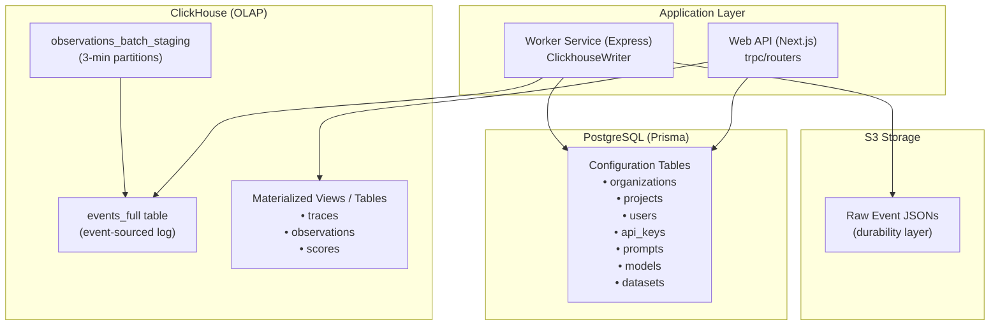
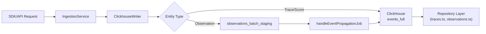
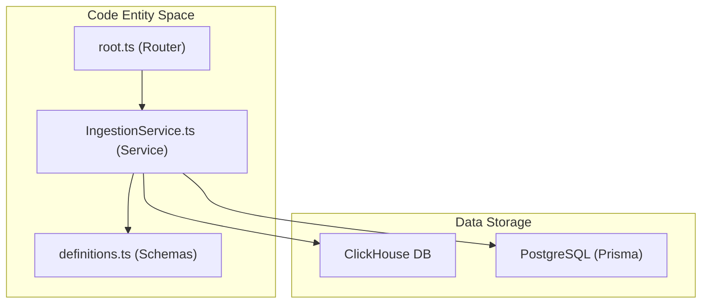

# Data Architecture

Relevant source files

The following files were used as context for generating this wiki page:

- [fern/apis/server/definition/ingestion.yml](fern/apis/server/definition/ingestion.yml)
- [packages/shared/clickhouse/scripts/dev-tables.sh](packages/shared/clickhouse/scripts/dev-tables.sh)
- [packages/shared/prisma/schema.prisma](packages/shared/prisma/schema.prisma)
- [packages/shared/src/server/ingestion/types.ts](packages/shared/src/server/ingestion/types.ts)
- [packages/shared/src/server/queries/clickhouse-sql/clickhouse-filter.ts](packages/shared/src/server/queries/clickhouse-sql/clickhouse-filter.ts)
- [packages/shared/src/server/redis/eventPropagationQueue.ts](packages/shared/src/server/redis/eventPropagationQueue.ts)
- [packages/shared/src/server/repositories/definitions.ts](packages/shared/src/server/repositories/definitions.ts)
- [packages/shared/src/server/test-utils/tracing-factory.ts](packages/shared/src/server/test-utils/tracing-factory.ts)
- [packages/shared/src/utils/json.ts](packages/shared/src/utils/json.ts)
- [web/src/__tests__/organization-settings-pages.clienttest.tsx](web/src/__tests__/organization-settings-pages.clienttest.tsx)
- [web/src/features/audit-logs/auditLog.ts](web/src/features/audit-logs/auditLog.ts)
- [web/src/features/models/components/ModelSettings.tsx](web/src/features/models/components/ModelSettings.tsx)
- [web/src/pages/organization/[organizationId]/settings/index.tsx](web/src/pages/organization/[organizationId]/settings/index.tsx)
- [web/src/pages/project/[projectId]/settings/index.tsx](web/src/pages/project/[projectId]/settings/index.tsx)
- [web/src/server/api/root.ts](web/src/server/api/root.ts)
- [web/src/server/api/routers/public.ts](web/src/server/api/routers/public.ts)
- [worker/src/backgroundMigrations/backfillEventsHistoric.ts](worker/src/backgroundMigrations/backfillEventsHistoric.ts)
- [worker/src/backgroundMigrations/backfillEventsHistoricFromParts.ts](worker/src/backgroundMigrations/backfillEventsHistoricFromParts.ts)
- [worker/src/backgroundMigrations/backfillExperimentsHistoric.ts](worker/src/backgroundMigrations/backfillExperimentsHistoric.ts)
- [worker/src/features/eventPropagation/handleEventPropagationJob.ts](worker/src/features/eventPropagation/handleEventPropagationJob.ts)
- [worker/src/features/eventPropagation/handleExperimentBackfill.ts](worker/src/features/eventPropagation/handleExperimentBackfill.ts)
- [worker/src/services/IngestionService/index.ts](worker/src/services/IngestionService/index.ts)
- [worker/src/services/IngestionService/tests/IngestionService.integration.test.ts](worker/src/services/IngestionService/tests/IngestionService.integration.test.ts)
- [worker/src/services/IngestionService/tests/calculateTokenCost.unit.test.ts](worker/src/services/IngestionService/tests/calculateTokenCost.unit.test.ts)
- [worker/src/services/IngestionService/tests/utils.unit.test.ts](worker/src/services/IngestionService/tests/utils.unit.test.ts)
- [worker/src/services/IngestionService/utils.ts](worker/src/services/IngestionService/utils.ts)

This page describes the dual-database architecture underlying Langfuse's data storage and retrieval systems. It covers the separation between PostgreSQL (metadata/configuration) and ClickHouse (observability events), the event-sourcing pattern for trace data, and the repository layer that abstracts data access.

For information about the ingestion pipeline that feeds data into these databases, see [Data Ingestion Pipeline](#6). For details on the worker queues that process data asynchronously, see [Queue & Worker System](#7).

## Overview

Langfuse employs a **dual-database architecture** that separates concerns between transactional metadata and high-volume observability data. This split enables horizontal scalability for analytics workloads while maintaining ACID guarantees for configuration changes.

### Database Responsibilities

The system architecture bridges the gap between transactional application state and high-throughput analytical events.

**System Components and Data Storage**

Sources: [worker/src/services/ClickhouseWriter/index.ts:56-59](), [packages/shared/clickhouse/scripts/dev-tables.sh:81-137](), [worker/src/services/IngestionService/index.ts:136-146]()

The architecture uses:
- **PostgreSQL**: ACID-compliant storage for user accounts, project configuration, datasets, prompts, and API keys. Managed via Prisma. [packages/shared/prisma/schema.prisma:10-14](), [worker/src/services/IngestionService/index.ts:7-10]()
- **ClickHouse**: Column-oriented database optimized for analytical queries over traces, observations, and scores. [packages/shared/src/server/repositories/definitions.ts:4-15](), [packages/shared/clickhouse/scripts/dev-tables.sh:137-140]()
- **Redis**: Used for rate limiting, job queuing via BullMQ, and tracking last processed partitions for event propagation. [worker/src/features/eventPropagation/handleEventPropagationJob.ts:15-29](), [worker/src/services/IngestionService/index.ts:1-3]()

### Data Flow Pattern

**Data Ingestion and Processing Flow**

Sources: [worker/src/services/IngestionService/index.ts:148-194](), [worker/src/features/eventPropagation/handleEventPropagationJob.ts:58-140](), [packages/shared/src/server/repositories/definitions.ts:127-143]()

## PostgreSQL Schema

PostgreSQL stores configuration, user management, and metadata that requires transactional consistency. The schema is defined in Prisma and includes core entities for multi-tenancy and configuration.

### Core Entity Groups

| Entity Group | Purpose |
|-------------|---------|
| Multi-tenancy | Hierarchical isolation via `Organization` and `Project` models. [packages/shared/prisma/schema.prisma:93-116]() |
| Datasets | Storage for `Dataset` and `DatasetItem` entities for benchmarking. [packages/shared/prisma/schema.prisma:129-129]() |
| Prompts | Versioned prompt management and lifecycle tracking. [packages/shared/prisma/schema.prisma:132-132]() |
| Evaluations | `JobConfiguration` and `JobExecution` for tracking evaluation runs. [packages/shared/prisma/schema.prisma:135-136]() |

Sources: [packages/shared/prisma/schema.prisma:93-150](), [worker/src/services/IngestionService/index.ts:136-146]()

## ClickHouse Schema

ClickHouse stores observability data in an event-sourced architecture, optimized for high-throughput writes and analytical queries.

### Events Table Structure

The `events_full` table is the primary destination for tracing data, designed to be immutable and eventually replace legacy observation tables. It includes fields for core properties (trace_id, span_id), model details, and cost calculations using `MATERIALIZED` columns for performance. [packages/shared/clickhouse/scripts/dev-tables.sh:137-183]()

### Event Propagation and Staging

Langfuse uses a staging table `observations_batch_staging` to buffer incoming observation data. It uses 3-minute partitions based on `s3_first_seen_timestamp` and a TTL of 12 hours. [packages/shared/clickhouse/scripts/dev-tables.sh:81-130]() 

The `handleEventPropagationJob` performs the following:
1.  Retrieves the next partition to process using a cursor stored in Redis (`LAST_PROCESSED_PARTITION_KEY`). [worker/src/features/eventPropagation/handleEventPropagationJob.ts:15-29](), [worker/src/features/eventPropagation/handleEventPropagationJob.ts:74-102]()
2.  Joins `observations_batch_staging` with the `traces` table to enrich events with trace-level metadata (user_id, session_id, tags). [worker/src/features/eventPropagation/handleEventPropagationJob.ts:142-183]()
3.  Inserts the enriched records into `events_full`. [worker/src/features/eventPropagation/handleEventPropagationJob.ts:185-190]()

### Batch Writing

The `ClickhouseWriter` class manages high-throughput writes by buffering records and flushing them to ClickHouse. It handles oversized records by truncating fields to prevent write failures. [worker/src/services/ClickhouseWriter/index.ts:56-61]()

## Repository Pattern

The repository layer abstracts ClickHouse query construction and provides a bridge between raw database rows and application domain objects.

### Repository Architecture

Sources: [packages/shared/src/server/repositories/definitions.ts:1-40](), [web/src/server/api/root.ts:65-123](), [worker/src/services/IngestionService/index.ts:136-146]()

### Core Repository Logic

- **Standardized Schema**: Repositories use Zod schemas like `traceRecordReadSchema` and `observationRecordReadSchema` to transform ClickHouse types (like string-encoded Int64) into TypeScript-native types. [packages/shared/src/server/repositories/definitions.ts:155-161](), [packages/shared/src/server/repositories/definitions.ts:63-74]()
- **Data Enrichment**: `IngestionService` performs parallel lookups for prompts and model/usage enrichment before writing to ClickHouse. [worker/src/services/IngestionService/index.ts:225-235]()
- **Background Migrations**: For large-scale data moves, Langfuse uses a background migration system that processes ClickHouse data in chunks to avoid overwhelming the database. [worker/src/backgroundMigrations/backfillEventsHistoric.ts:23-52]()

---

**For details, see:**
- [Database Overview](#3.1) — Purpose of PostgreSQL, ClickHouse, and Redis.
- [PostgreSQL Schema](#3.2) — Prisma models for Organizations, Projects, and Users.
- [ClickHouse Schema](#3.3) — Document the events table structure, materialized views, and partitioning strategy.
- [Events Table & Dual-Write Architecture](#3.4) — Explain the event-sourcing pattern and propagation logic.
- [Repository Pattern](#3.5) — Describe the repository layer that abstracts ClickHouse queries.
- [Query Optimization](#3.6) — Cover CTEs for complex aggregations and performance patterns.
