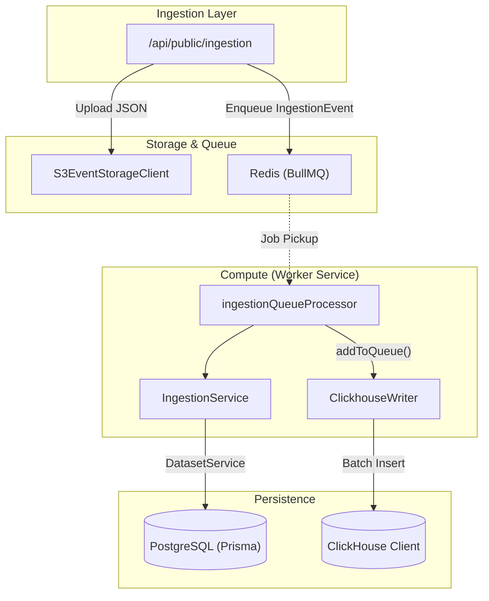
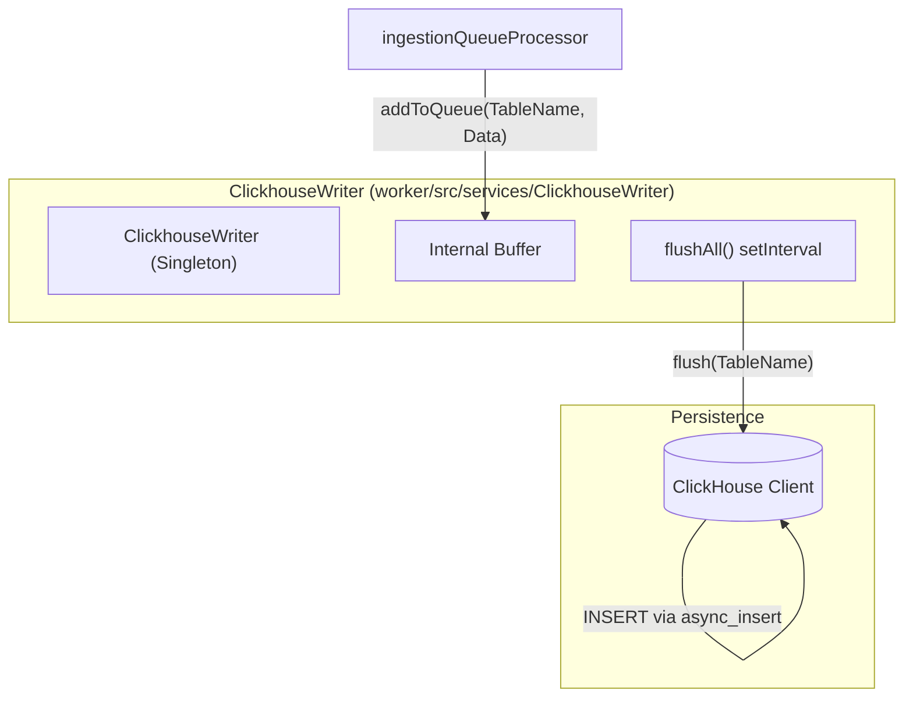

# Database Overview

Relevant source files

The following files were used as context for generating this wiki page:

- [.env.dev-redis-cluster.example](.env.dev-redis-cluster.example)
- [.vscode/launch.json](.vscode/launch.json)
- [packages/shared/prisma/schema.prisma](packages/shared/prisma/schema.prisma)
- [packages/shared/src/env.ts](packages/shared/src/env.ts)
- [packages/shared/src/server/index.ts](packages/shared/src/server/index.ts)
- [packages/shared/src/server/queues.ts](packages/shared/src/server/queues.ts)
- [packages/shared/src/server/redis/batchExport.ts](packages/shared/src/server/redis/batchExport.ts)
- [packages/shared/src/server/redis/blobStorageIntegrationProcessingQueue.ts](packages/shared/src/server/redis/blobStorageIntegrationProcessingQueue.ts)
- [packages/shared/src/server/redis/createEvalQueue.ts](packages/shared/src/server/redis/createEvalQueue.ts)
- [packages/shared/src/server/redis/datasetRunItemUpsert.ts](packages/shared/src/server/redis/datasetRunItemUpsert.ts)
- [packages/shared/src/server/redis/dlqRetryQueue.ts](packages/shared/src/server/redis/dlqRetryQueue.ts)
- [packages/shared/src/server/redis/getQueue.ts](packages/shared/src/server/redis/getQueue.ts)
- [packages/shared/src/server/redis/ingestionQueue.ts](packages/shared/src/server/redis/ingestionQueue.ts)
- [packages/shared/src/server/redis/redis.ts](packages/shared/src/server/redis/redis.ts)
- [packages/shared/src/server/redis/traceUpsert.ts](packages/shared/src/server/redis/traceUpsert.ts)
- [web/src/__tests__/organization-settings-pages.clienttest.tsx](web/src/__tests__/organization-settings-pages.clienttest.tsx)
- [web/src/features/audit-logs/auditLog.ts](web/src/features/audit-logs/auditLog.ts)
- [web/src/features/models/components/ModelSettings.tsx](web/src/features/models/components/ModelSettings.tsx)
- [web/src/pages/api/admin/bullmq/index.ts](web/src/pages/api/admin/bullmq/index.ts)
- [web/src/pages/organization/[organizationId]/settings/index.tsx](web/src/pages/organization/[organizationId]/settings/index.tsx)
- [web/src/pages/project/[projectId]/settings/index.tsx](web/src/pages/project/[projectId]/settings/index.tsx)
- [web/src/server/api/root.ts](web/src/server/api/root.ts)
- [web/src/server/api/routers/public.ts](web/src/server/api/routers/public.ts)
- [worker/src/__tests__/redisConsumer.test.ts](worker/src/__tests__/redisConsumer.test.ts)
- [worker/src/app.ts](worker/src/app.ts)
- [worker/src/env.ts](worker/src/env.ts)
- [worker/src/features/blobstorage/handleBlobStorageIntegrationSchedule.ts](worker/src/features/blobstorage/handleBlobStorageIntegrationSchedule.ts)
- [worker/src/features/tokenisation/usage.ts](worker/src/features/tokenisation/usage.ts)
- [worker/src/queues/ingestionQueue.ts](worker/src/queues/ingestionQueue.ts)
- [worker/src/queues/workerManager.ts](worker/src/queues/workerManager.ts)
- [worker/src/utils/shutdown.ts](worker/src/utils/shutdown.ts)

This page explains the dual-database architecture used in Langfuse, detailing the purpose and structure of PostgreSQL, ClickHouse, and Redis. It covers their respective schemas, data flow patterns, and how they interact to support high-volume LLM observability.

## Architecture Purpose

Langfuse employs a **split-database architecture** to optimize for different workload characteristics:

- **PostgreSQL**: The primary transactional store for relational metadata, configuration, and low-tenancy data requiring strong ACID consistency. It is managed via Prisma. [packages/shared/prisma/schema.prisma:9-14](), [packages/shared/src/env.ts:1145-1145]()
- **ClickHouse**: An OLAP database for high-volume observability data (traces, observations, scores) optimized for analytical queries and time-series aggregations. [packages/shared/src/env.ts:81-87](), [packages/shared/src/server/index.ts:46-48]()
- **Redis**: An in-memory store used for BullMQ queue management, rate limiting, and caching. [packages/shared/src/server/redis/redis.ts:1-12](), [packages/shared/src/env.ts:20-57]()
- **S3/Blob Storage**: Used as an intermediate buffer for ingestion events and for long-term storage of large trace payloads and batch exports. [worker/src/env.ts:41-53](), [worker/src/queues/ingestionQueue.ts:135-137]()

### System Data Flow

The following diagram bridges the high-level ingestion flow to the specific code entities responsible for data persistence and processing.

**Diagram: Data Flow from Ingestion to Code Persistence Entities**

Sources: [worker/src/queues/ingestionQueue.ts:29-80](), [worker/src/services/IngestionService.ts:1-20](), [packages/shared/src/server/queues.ts:14-28](), [packages/shared/src/server/index.ts:54-54]()

## Database Responsibilities

### PostgreSQL (Transactional & Metadata)
PostgreSQL handles strongly-typed relational data. It is the source of truth for administrative entities, configuration, and experiments.

| Category | Key Models/Tables | Purpose |
|----------|-------------------|---------|
| **Identity** | `User`, `Organization`, `Project` | Core multi-tenancy and RBAC hierarchy. [packages/shared/prisma/schema.prisma:48-128]() |
| **Config** | `Prompt`, `Model`, `ScoreConfig` | Versioned templates, pricing metadata, and score definitions. [packages/shared/prisma/schema.prisma:132-141]() |
| **Datasets** | `Dataset`, `DatasetItem` | Metadata and inputs for evaluation sets. [packages/shared/prisma/schema.prisma:129-129]() |
| **Orchestration**| `JobConfiguration`, `JobExecution` | State management for background evaluation jobs. [packages/shared/prisma/schema.prisma:135-136]() |

### ClickHouse (Analytics & Observability)
ClickHouse stores the high-cardinality event stream. The architecture uses a batched writer to manage high-volume inserts.

| Table/View | Purpose |
|------------|---------|
| `events` | Primary destination for consolidated observability events. [packages/shared/src/server/index.ts:48-48]() |
| `traces` | Stores trace-level metadata and indexing. [packages/shared/src/server/index.ts:107-107]() |
| `observations` | Stores spans, generations, and events. [packages/shared/src/server/index.ts:106-106]() |
| `scores` | Stores evaluation results and manual annotations. [packages/shared/src/server/index.ts:5-5]() |
| `blob_storage_file_log` | Tracks ingestion files in S3 for retention and deletion. [worker/src/queues/ingestionQueue.ts:68-81]() |

### Redis (Coordination & Caching)
Redis is critical for background task coordination and ingestion performance.

- **Queue Management**: Stores job data for BullMQ processors. Langfuse uses sharded queues for ingestion and trace upserts to scale throughput. [packages/shared/src/env.ts:129-158](), [worker/src/app.ts:126-137]()
- **Deduplication Cache**: Prevents re-processing the same S3 event file within a short window via `langfuse:ingestion:recently-processed`. [worker/src/queues/ingestionQueue.ts:84-106]()
- **ClickhouseReadSkipCache**: A specialized cache to skip ClickHouse reads for projects that don't rely on historic updates. [worker/src/app.ts:119-124]()
- **Rate Limiting**: Used for S3 slowdown tracking to redirect traffic to secondary queues. [worker/src/queues/ingestionQueue.ts:112-133]()

## Ingestion and Write Path

Langfuse uses a batched write strategy via the `ClickhouseWriter` to maintain high throughput and minimize the number of small inserts into ClickHouse.

**Diagram: ClickhouseWriter Batched Write Flow**

Sources: [worker/src/queues/ingestionQueue.ts:60-81](), [packages/shared/src/env.ts:91-93](), [worker/src/env.ts:90-97]()

## Implementation Details

### Redis Instance Management
Redis connections are managed with robust retry strategies and support for various topologies (Standalone, Cluster, Sentinel).

- **Retry Strategy**: Implements exponential backoff with a minimum of 1s and maximum of 20s between retries. [packages/shared/src/server/redis/redis.ts:16-24]()
- **TLS Support**: Configurable via environment variables for secure connections to managed Redis instances. [packages/shared/src/server/redis/redis.ts:62-103]()
- **Cluster/Sentinel**: Specialized instantiation logic for `REDIS_CLUSTER_ENABLED` and `REDIS_SENTINEL_ENABLED`. [packages/shared/src/server/redis/redis.ts:105-181]()

### Data Access Patterns
The codebase abstracts database operations to handle the dual-database split.

- **tRPC API**: The internal web UI uses tRPC routers (e.g., `traceRouter`, `observationsRouter`) which interact with both PostgreSQL (via Prisma) and ClickHouse (via repositories). [web/src/server/api/root.ts:65-123]()
- **Worker Manager**: Centralizes the registration of BullMQ workers, wrapping processors with standardized metrics for queue length, processing time, and failure rates. [worker/src/queues/workerManager.ts:41-109]()
- **ClickhouseReadSkipCache**: Initialized on worker startup to optimize ingestion by avoiding unnecessary OLAP lookups for newer projects. [worker/src/app.ts:119-124]()

Sources: [packages/shared/src/server/redis/redis.ts:1-225](), [worker/src/queues/workerManager.ts:127-185](), [web/src/server/api/root.ts:1-127]()
