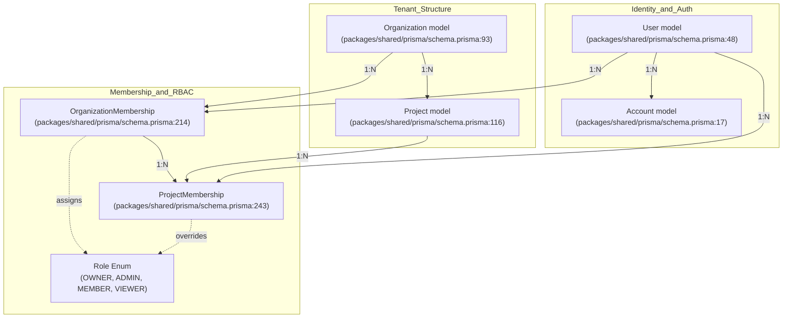
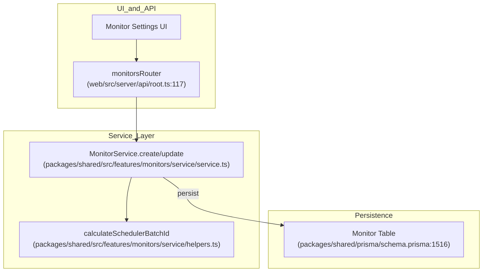

# PostgreSQL Schema

Relevant source files

The following files were used as context for generating this wiki page:

- [packages/shared/prisma/schema.prisma](packages/shared/prisma/schema.prisma)
- [packages/shared/src/features/monitors/service/helpers.test.ts](packages/shared/src/features/monitors/service/helpers.test.ts)
- [packages/shared/src/features/monitors/service/helpers.ts](packages/shared/src/features/monitors/service/helpers.ts)
- [packages/shared/src/features/monitors/service/service.ts](packages/shared/src/features/monitors/service/service.ts)
- [packages/shared/src/features/monitors/service/types.test.ts](packages/shared/src/features/monitors/service/types.test.ts)
- [packages/shared/src/features/monitors/service/types.ts](packages/shared/src/features/monitors/service/types.ts)
- [web/src/__tests__/organization-settings-pages.clienttest.tsx](web/src/__tests__/organization-settings-pages.clienttest.tsx)
- [web/src/__tests__/server/monitorService.servertest.ts](web/src/__tests__/server/monitorService.servertest.ts)
- [web/src/__tests__/server/monitors.servertest.ts](web/src/__tests__/server/monitors.servertest.ts)
- [web/src/features/audit-logs/auditLog.ts](web/src/features/audit-logs/auditLog.ts)
- [web/src/features/feature-flags/available-flags.ts](web/src/features/feature-flags/available-flags.ts)
- [web/src/features/models/components/ModelSettings.tsx](web/src/features/models/components/ModelSettings.tsx)
- [web/src/features/rbac/constants/projectAccessRights.ts](web/src/features/rbac/constants/projectAccessRights.ts)
- [web/src/pages/organization/[organizationId]/settings/index.tsx](web/src/pages/organization/[organizationId]/settings/index.tsx)
- [web/src/pages/project/[projectId]/settings/index.tsx](web/src/pages/project/[projectId]/settings/index.tsx)
- [web/src/server/api/root.ts](web/src/server/api/root.ts)
- [web/src/server/api/routers/public.ts](web/src/server/api/routers/public.ts)

PostgreSQL serves as the primary metadata and configuration database for Langfuse. It stores organizational structures, user accounts, project settings, evaluation configurations, dataset definitions, and prompt versions. While high-volume observability events are stored in ClickHouse, PostgreSQL maintains the relational integrity of the platform's configuration and management layer.

For information about the dual-database architecture, see [3.1 Database Overview](). For the ClickHouse schema containing observability events, see [3.3 ClickHouse Schema]().

## Schema Overview

The PostgreSQL schema is managed via Prisma ORM, defined in [packages/shared/prisma/schema.prisma:1-1254](). It utilizes advanced PostgreSQL features such as JSONB for flexible metadata, GIN indexes for efficient searching, and relation joins for performant data retrieval.

**Key Technical Characteristics:**
- **ORM**: Prisma Client with support for `views`, `relationJoins`, and `metrics` [packages/shared/prisma/schema.prisma:4-7]().
- **Multi-tenancy**: Strictly enforced via `Organization` and `Project` hierarchies.
- **Auditability**: Extensive audit logging for sensitive resource changes [web/src/features/audit-logs/auditLog.ts:7-48]().
- **Backward Compatibility**: Legacy observability tables (`LegacyPrismaTrace`, `LegacyPrismaObservation`, `LegacyPrismaScore`) are maintained for historical data and specific migration paths [packages/shared/prisma/schema.prisma:151-153]().

Sources: [packages/shared/prisma/schema.prisma:1-153](), [web/src/features/audit-logs/auditLog.ts:7-48]()

## Multi-Tenancy and Access Control

Langfuse employs a nested multi-tenant model. Organizations serve as the billing and top-level administrative unit, while Projects serve as the operational silo for observability data.

### Organizational Hierarchy

**Natural Language Space to Code Entity Space: Access Control**

- **Organization**: Manages cloud billing (`cloudBillingCycleAnchor`), usage limits (`cloudCurrentCycleUsage`), and enterprise features like `aiFeaturesEnabled` [packages/shared/prisma/schema.prisma:100-104]().
- **Project**: Scopes API keys, traces, and configurations. It includes a `retentionDays` setting to manage data lifecycle [packages/shared/prisma/schema.prisma:123]().
- **User**: Stores profile information and global `admin` status [packages/shared/prisma/schema.prisma:49-55]().

Sources: [packages/shared/prisma/schema.prisma:17-262](), [web/src/pages/organization/[organizationId]/settings/index.tsx:68-103]()

### API Key Authentication

The `ApiKey` model facilitates programmatic access to the Langfuse API. Keys can be scoped to an entire organization or a specific project.

| Field | Description |
| :--- | :--- |
| `publicKey` | The identifier used in API requests [packages/shared/prisma/schema.prisma:194](). |
| `hashedSecretKey` | A secure hash of the secret key for verification [packages/shared/prisma/schema.prisma:195](). |
| `scope` | `ORGANIZATION` or `PROJECT` [packages/shared/prisma/schema.prisma:197](). |

Sources: [packages/shared/prisma/schema.prisma:190-212](), [web/src/features/rbac/constants/projectAccessRights.ts:9-10]()

## Configuration Tables

### Score Configurations

Score configurations define the validation logic and UI representation for metrics (e.g., user feedback, model evaluations).

- **ScoreConfig**: Defines the `dataType` (`NUMERIC`, `CATEGORICAL`, `BOOLEAN`) and metadata like `minValue`, `maxValue`, or categorical `categories` [packages/shared/prisma/schema.prisma:1052-1065]().
- **Integration**: The `appRouter` exposes these via `scoreConfigs` [web/src/server/api/root.ts:76]().

Sources: [packages/shared/prisma/schema.prisma:1052-1077](), [web/src/server/api/root.ts:76]()

### Prompt Management and LLM Definitions

Prompts are managed as versioned entities, allowing users to deploy specific versions to production using labels.

- **Prompt**: Stores the template content as JSON, supporting both text and chat formats [packages/shared/prisma/schema.prisma:763-770]().
- **Labels**: Versions can be tagged with labels (e.g., "production") for dynamic retrieval by SDKs [packages/shared/prisma/schema.prisma:774]().
- **PromptDependency**: Tracks relationships between prompts for complex template resolution [packages/shared/prisma/schema.prisma:792-810]().
- **LlmSchema & LlmTool**: Reusable structured definitions for prompt variables and tool-calling capabilities. `LlmSchema` stores JSON schema definitions for model parameters or outputs, while `LlmTool` defines executable functions for LLM interaction [packages/shared/prisma/schema.prisma:153-154]().
- **LlmApiKeys**: Securely stores encrypted credentials for various LLM providers (OpenAI, Anthropic, etc.) used in the playground and evaluation system [packages/shared/prisma/schema.prisma:137]().

Sources: [packages/shared/prisma/schema.prisma:763-810](), [packages/shared/prisma/schema.prisma:153-154](), [web/src/pages/project/[projectId]/settings/index.tsx:140-157]()

### Model and Pricing

The `Model` table stores definitions for LLMs, including regex patterns for matching model names in traces and pricing details.

- **Model**: Includes `matchPattern` for identification and `unit` (e.g., TOKENS, CHARACTERS) for cost calculation [packages/shared/prisma/schema.prisma:825-831]().
- **PricingTier**: Allows for complex pricing models based on conditions (e.g., tiered pricing based on context window size) [packages/shared/prisma/schema.prisma:868-886]().

Sources: [packages/shared/prisma/schema.prisma:825-886]()

## Evaluation and Automation

Langfuse uses PostgreSQL to coordinate background evaluation jobs and automations.

- **EvalTemplate**: Stores the prompt and configuration for LLM-as-a-judge evaluations [packages/shared/prisma/schema.prisma:920-945]().
- **JobConfiguration**: Defines which traces or observations should be evaluated, including filters and sampling rates [packages/shared/prisma/schema.prisma:967-975]().
- **JobExecution**: Tracks the lifecycle of an evaluation job (e.g., `PENDING`, `COMPLETED`, `ERROR`) [packages/shared/prisma/schema.prisma:1004-1014]().
- **Automation**: Maps triggers (like `trace-create`) to actions (like `webhook` or `slack`) [packages/shared/prisma/schema.prisma:1454-1560]().

Sources: [packages/shared/prisma/schema.prisma:920-1042](), [packages/shared/prisma/schema.prisma:1454-1560]()

## Monitors and Alerting

The `Monitor` model enables threshold-based alerting on observability metrics. It is managed via the `MonitorService` [packages/shared/src/features/monitors/service/service.ts:43]().

- **Monitor**: Stores configuration including `view` (e.g., `OBSERVATIONS`), `filters`, `metric`, `windowMs`, and `alertThreshold` [packages/shared/prisma/schema.prisma:1516-1555]().
- **Lifecycle Management**: The service calculates derived fields like `cadenceMs` and `schedulerBatchId` to optimize background execution [packages/shared/src/features/monitors/service/service.ts:48-61]().
- **State Tracking**: Fields such as `severity` (`OK`, `WARNING`, `ALERT`, `NO_DATA`) and `lastCompletedRunAt` track the real-time status of the monitor [packages/shared/src/features/monitors/service/service.ts:107-108]().

**Natural Language Space to Code Entity Space: Monitor Data Flow**

Sources: [packages/shared/src/features/monitors/service/service.ts:43-189](), [packages/shared/prisma/schema.prisma:1516-1555](), [web/src/server/api/root.ts:117]()

## Datasets and Experiments

Datasets allow users to create golden sets for testing and benchmarking.

- **Dataset**: The top-level container for items [packages/shared/prisma/schema.prisma:590-611]().
- **DatasetItem**: Represents a single test case, using `validFrom` and `validTo` for versioning [packages/shared/prisma/schema.prisma:613-624]().
- **DatasetRun**: Groups the results of running a dataset through a specific model or prompt version [packages/shared/prisma/schema.prisma:647-664]().

Sources: [packages/shared/prisma/schema.prisma:590-686]()

## Batch Operations

The system supports large-scale data operations through batch exports and actions.

- **BatchExport**: Tracks asynchronous export jobs, storing query parameters, format (CSV/JSONL), and the resulting file URL [packages/shared/prisma/schema.prisma:1134-1153]().
- **Status Tracking**: Jobs move through `QUEUED`, `PROCESSING`, `COMPLETED`, or `FAILED` states.

Sources: [packages/shared/prisma/schema.prisma:1134-1153](), [web/src/server/api/root.ts:69]()

## Integrations and Audit Logs

### External Integrations

PostgreSQL stores configurations for syncing data to third-party platforms.

- **BlobStorageIntegration**: Configures exports to S3 or Azure Blob Storage, including `exportFrequency` and `exportMode` [packages/shared/prisma/schema.prisma:1105-1132]().
- **Analytics**: Stores settings for **PosthogIntegration** and **MixpanelIntegration** [packages/shared/prisma/schema.prisma:1079-1103]().

### Audit Logging

Langfuse maintains an immutable record of significant changes via the `AuditLog` model.

- **AuditLog**: Captures the `resourceType` (e.g., `prompt`, `apiKey`), the `action` (e.g., `create`, `update`), and `before`/`after` states [packages/shared/prisma/schema.prisma:894-918]().
- **Implementation**: The `auditLog` function in the web layer standardizes log creation across the codebase [web/src/features/audit-logs/auditLog.ts:82-119]().

Sources: [packages/shared/prisma/schema.prisma:894-918](), [packages/shared/prisma/schema.prisma:1105-1169](), [web/src/features/audit-logs/auditLog.ts:1-120](), [web/src/server/api/root.ts:1-123]()
