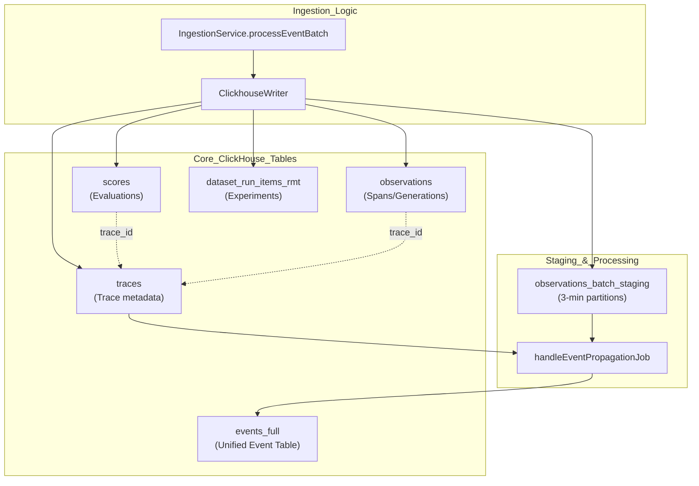

# ClickHouse Schema

Relevant source files

The following files were used as context for generating this wiki page:

- [fern/apis/server/definition/ingestion.yml](fern/apis/server/definition/ingestion.yml)
- [packages/shared/clickhouse/scripts/dev-tables.sh](packages/shared/clickhouse/scripts/dev-tables.sh)
- [packages/shared/src/domain/observations.ts](packages/shared/src/domain/observations.ts)
- [packages/shared/src/eventsTable.ts](packages/shared/src/eventsTable.ts)
- [packages/shared/src/server/clickhouse/client.ts](packages/shared/src/server/clickhouse/client.ts)
- [packages/shared/src/server/clickhouse/schema.ts](packages/shared/src/server/clickhouse/schema.ts)
- [packages/shared/src/server/ingestion/types.ts](packages/shared/src/server/ingestion/types.ts)
- [packages/shared/src/server/queries/clickhouse-sql/clickhouse-filter.ts](packages/shared/src/server/queries/clickhouse-sql/clickhouse-filter.ts)
- [packages/shared/src/server/queries/clickhouse-sql/event-query-builder.ts](packages/shared/src/server/queries/clickhouse-sql/event-query-builder.ts)
- [packages/shared/src/server/queries/clickhouse-sql/query-fragments.ts](packages/shared/src/server/queries/clickhouse-sql/query-fragments.ts)
- [packages/shared/src/server/queries/index.ts](packages/shared/src/server/queries/index.ts)
- [packages/shared/src/server/queries/public-api-filter-builder.ts](packages/shared/src/server/queries/public-api-filter-builder.ts)
- [packages/shared/src/server/redis/eventPropagationQueue.ts](packages/shared/src/server/redis/eventPropagationQueue.ts)
- [packages/shared/src/server/repositories/dataset-run-items.ts](packages/shared/src/server/repositories/dataset-run-items.ts)
- [packages/shared/src/server/repositories/definitions.ts](packages/shared/src/server/repositories/definitions.ts)
- [packages/shared/src/server/repositories/events.ts](packages/shared/src/server/repositories/events.ts)
- [packages/shared/src/server/repositories/observations_converters.ts](packages/shared/src/server/repositories/observations_converters.ts)
- [packages/shared/src/server/tableMappings/mapEventsTable.ts](packages/shared/src/server/tableMappings/mapEventsTable.ts)
- [packages/shared/src/server/test-utils/tracing-factory.ts](packages/shared/src/server/test-utils/tracing-factory.ts)
- [packages/shared/src/utils/json.ts](packages/shared/src/utils/json.ts)
- [web/src/__tests__/server/observations-api-v2.servertest.ts](web/src/__tests__/server/observations-api-v2.servertest.ts)
- [web/src/__tests__/server/repositories/event-repository.servertest.ts](web/src/__tests__/server/repositories/event-repository.servertest.ts)
- [web/src/__tests__/server/unit/observations-converters.servertest.ts](web/src/__tests__/server/unit/observations-converters.servertest.ts)
- [web/src/components/table/peek/hooks/usePeekData.ts](web/src/components/table/peek/hooks/usePeekData.ts)
- [web/src/features/datasets/components/DatasetItemsTable.tsx](web/src/features/datasets/components/DatasetItemsTable.tsx)
- [web/src/features/datasets/components/DatasetRunsTable.tsx](web/src/features/datasets/components/DatasetRunsTable.tsx)
- [web/src/features/datasets/components/DatasetsTable.tsx](web/src/features/datasets/components/DatasetsTable.tsx)
- [web/src/features/datasets/server/dataset-router.ts](web/src/features/datasets/server/dataset-router.ts)
- [web/src/features/datasets/server/service.ts](web/src/features/datasets/server/service.ts)
- [web/src/features/events/config/filter-config.ts](web/src/features/events/config/filter-config.ts)
- [web/src/features/events/hooks/useEventsFilterOptions.ts](web/src/features/events/hooks/useEventsFilterOptions.ts)
- [web/src/features/events/hooks/useEventsTableData.ts](web/src/features/events/hooks/useEventsTableData.ts)
- [web/src/features/events/hooks/useEventsTraceData.ts](web/src/features/events/hooks/useEventsTraceData.ts)
- [web/src/features/events/lib/eventsToTraceAdapter.clienttest.ts](web/src/features/events/lib/eventsToTraceAdapter.clienttest.ts)
- [web/src/features/events/lib/eventsToTraceAdapter.ts](web/src/features/events/lib/eventsToTraceAdapter.ts)
- [web/src/features/events/server/eventsRouter.ts](web/src/features/events/server/eventsRouter.ts)
- [web/src/features/events/server/eventsService.ts](web/src/features/events/server/eventsService.ts)
- [web/src/features/public-api/types/observations.ts](web/src/features/public-api/types/observations.ts)
- [web/src/hooks/useParsedObservation.ts](web/src/hooks/useParsedObservation.ts)
- [web/src/utils/clientSideDomainTypes.ts](web/src/utils/clientSideDomainTypes.ts)
- [worker/src/backgroundMigrations/backfillEventsHistoric.ts](worker/src/backgroundMigrations/backfillEventsHistoric.ts)
- [worker/src/backgroundMigrations/backfillEventsHistoricFromParts.ts](worker/src/backgroundMigrations/backfillEventsHistoricFromParts.ts)
- [worker/src/backgroundMigrations/backfillExperimentsHistoric.ts](worker/src/backgroundMigrations/backfillExperimentsHistoric.ts)
- [worker/src/features/eventPropagation/handleEventPropagationJob.ts](worker/src/features/eventPropagation/handleEventPropagationJob.ts)
- [worker/src/features/eventPropagation/handleExperimentBackfill.ts](worker/src/features/eventPropagation/handleExperimentBackfill.ts)
- [worker/src/services/ClickhouseWriter/ClickhouseWriter.unit.test.ts](worker/src/services/ClickhouseWriter/ClickhouseWriter.unit.test.ts)
- [worker/src/services/ClickhouseWriter/index.ts](worker/src/services/ClickhouseWriter/index.ts)
- [worker/src/services/IngestionService/index.ts](worker/src/services/IngestionService/index.ts)
- [worker/src/services/IngestionService/tests/IngestionService.integration.test.ts](worker/src/services/IngestionService/tests/IngestionService.integration.test.ts)
- [worker/src/services/IngestionService/tests/calculateTokenCost.unit.test.ts](worker/src/services/IngestionService/tests/calculateTokenCost.unit.test.ts)
- [worker/src/services/IngestionService/tests/utils.unit.test.ts](worker/src/services/IngestionService/tests/utils.unit.test.ts)
- [worker/src/services/IngestionService/utils.ts](worker/src/services/IngestionService/utils.ts)

This document describes the ClickHouse schema used for storing high-volume observability data in Langfuse. ClickHouse serves as the analytical database for traces, observations, scores, and dataset run items, complementing PostgreSQL which stores configuration and metadata.

For information about the dual-database architecture and when each database is used, see [Database Overview](3.1). For details on the event-sourcing ingestion pattern and write paths, see [Events Table & Dual-Write Architecture](3.4).

---

## Core Tables Overview

ClickHouse stores primary entity types as tables optimized for high-volume writes and analytical queries. The system is currently transitioning from a split architecture (separate traces and observations) to a unified events-first architecture.

### Data Flow and Table Relationships

The following diagram illustrates how ingestion events flow into ClickHouse tables and the relationships between them, including the batch staging and event propagation path used for unified event construction.

**ClickHouse Ingestion and Propagation Flow**

**Table Engines and Strategy:**
- `traces`, `observations`, `scores`: Use `ReplacingMergeTree` with `event_ts` and `is_deleted` for deduplication and soft deletes [packages/shared/clickhouse/scripts/dev-tables.sh:120-120]().
- `observations_batch_staging`: Optimized for short-term storage with a 12-hour TTL and 3-minute partitioning to facilitate batch propagation. It uses `ReplacingMergeTree(event_ts, is_deleted)` [packages/shared/clickhouse/scripts/dev-tables.sh:120-130]().
- `events_full`: A unified table designed to replace the split architecture, containing denormalized trace metadata alongside span data [packages/shared/clickhouse/scripts/dev-tables.sh:137-158]().

**Sources:** [packages/shared/clickhouse/scripts/dev-tables.sh:75-130](), [worker/src/features/eventPropagation/handleEventPropagationJob.ts:58-72](), [worker/src/services/ClickhouseWriter/index.ts:50-59]()

---

## The Unified Events Schema (`events_full`)

Langfuse is migrating toward a unified `events_full` table that combines trace-level context with observation-level data to eliminate expensive joins during analysis.

### Schema Structure

| Field | Type | Description |
|-------|------|-------------|
| `project_id` | String | Primary partition key |
| `trace_id` | String | Trace identifier |
| `span_id` | String | Unique identifier for this event/span (mapped to `id` in domain) |
| `parent_span_id` | String | Parent span identifier for tree structure |
| `start_time` | DateTime64(6) | Start of the event |
| `end_time` | Nullable(DateTime64(6)) | End of the event |
| `name` | String | Event/Span name |
| `type` | LowCardinality(String) | SPAN, GENERATION, EVENT, TOOL, etc. |
| `trace_name` | String | Denormalized name of the parent trace |
| `user_id` | String | Denormalized user identifier |
| `session_id` | String | Denormalized session identifier |
| `input` | String | Event input (ZSTD compressed) |
| `output` | String | Event output (ZSTD compressed) |
| `metadata_names` | Array(String) | Flattened metadata keys for optimized search |
| `metadata_values` | Array(String) | Flattened metadata values |

**Sources:** [packages/shared/clickhouse/scripts/dev-tables.sh:137-200](), [packages/shared/src/server/queries/clickhouse-sql/event-query-builder.ts:57-146]()

### Materialized Columns
The `events_full` table utilizes ClickHouse `MATERIALIZED` columns to calculate metrics at write-time:
- `calculated_input_cost`: Sum of costs filtered by 'input' key [packages/shared/clickhouse/scripts/dev-tables.sh:180-180]().
- `calculated_output_cost`: Sum of costs filtered by 'output' key [packages/shared/clickhouse/scripts/dev-tables.sh:181-181]().
- `calculated_total_cost`: Sum of both input and output costs [packages/shared/clickhouse/scripts/dev-tables.sh:182-182]().
- `input_length` / `output_length`: Character lengths of I/O strings calculated via `lengthUTF8` [packages/shared/clickhouse/scripts/dev-tables.sh:195-197]().

---

## Partitioning and TTL Strategy

Langfuse uses a tiered partitioning strategy to manage high-volume ingestion and event propagation.

### Staging Partitioning
The `observations_batch_staging` table is partitioned by `toStartOfInterval(s3_first_seen_timestamp, INTERVAL 3 MINUTE)` [packages/shared/clickhouse/scripts/dev-tables.sh:121-121](). This allows the `handleEventPropagationJob` to process data in small, sequential chunks. The job tracks the `LAST_PROCESSED_PARTITION_KEY` in Redis to ensure sequential processing [worker/src/features/eventPropagation/handleEventPropagationJob.ts:15-24]().

### TTL Management
- **Staging Data**: Automatically expired after 12 hours via `TTL s3_first_seen_timestamp + INTERVAL 12 HOUR` [packages/shared/clickhouse/scripts/dev-tables.sh:129-129]().
- **Partition Cleanup**: The setting `ttl_only_drop_parts = 1` ensures ClickHouse drops entire partitions efficiently rather than performing row-by-row deletes [packages/shared/clickhouse/scripts/dev-tables.sh:130-130]().

**Sources:** [packages/shared/clickhouse/scripts/dev-tables.sh:120-130](), [worker/src/features/eventPropagation/handleEventPropagationJob.ts:94-109]()

---

## Event Propagation and Enrichment

The system provides mechanisms to populate the unified `events_full` table from staging data and enrich it with model pricing.

### Event Propagation Job
The `handleEventPropagationJob` performs a join between `observations_batch_staging` and the `traces` table to enrich span data with trace-level metadata (like `user_id`, `session_id`, `tags`, and `release`) before inserting into `events_full` [worker/src/features/eventPropagation/handleEventPropagationJob.ts:140-210](). It uses a time window for traces to limit join scope [worker/src/features/eventPropagation/handleEventPropagationJob.ts:174-180]().

### Model Enrichment logic
When querying observations, the system enriches raw ClickHouse records with model pricing data:
1. **Model Lookup**: The `enrichObservationsWithModelData` function identifies unique `internal_model_id`s from ClickHouse records [packages/shared/src/server/repositories/events.ts:157-163]().
2. **Prisma Fetch**: It queries the PostgreSQL `Model` table (including `Price` relations) for these IDs [packages/shared/src/server/repositories/events.ts:165-176]().
3. **Price Mapping**: The `enrichObservationWithModelData` helper maps specific usage types (`input`, `output`, `total`) to the observation domain object [packages/shared/src/server/repositories/observations_converters.ts:125-137]().

**Sources:** [worker/src/features/eventPropagation/handleEventPropagationJob.ts:58-134](), [packages/shared/src/server/repositories/events.ts:131-180](), [packages/shared/src/server/repositories/observations_converters.ts:125-137]()

---

## Repository Layer

The `EventsRepository` and associated query builders abstract the ClickHouse schema for the rest of the application.

### EventsQueryBuilder
The `EventsQueryBuilder` defines standard field sets for common query patterns:
- **`base`**: Standard fields for UI lists (ID, name, start/end times, level, status) [packages/shared/src/server/queries/clickhouse-sql/event-query-builder.ts:157-196]().
- **`full`**: Includes large fields like `input`, `output`, and `metadata` [packages/shared/src/server/queries/clickhouse-sql/event-query-builder.ts:241-246]().
- **Calculated Fields**: Latency and `time_to_first_token` are calculated using `date_diff` in SQL [packages/shared/src/server/queries/clickhouse-sql/event-query-builder.ts:142-145]().

### ClickhouseWriter
The `ClickhouseWriter` singleton manages the actual `INSERT` operations into ClickHouse [worker/src/services/ClickhouseWriter/index.ts:32-43](). It implements:
- **Batching**: Buffers records until `batchSize` or `writeInterval` is reached [worker/src/services/ClickhouseWriter/index.ts:44-46]().
- **Error Handling**: Retries on network errors and handles ClickHouse "extremely large JSON object" errors by splitting batches or truncating fields [worker/src/services/ClickhouseWriter/index.ts:143-206]().

**Sources:** [packages/shared/src/server/queries/clickhouse-sql/event-query-builder.ts:57-250](), [worker/src/services/ClickhouseWriter/index.ts:32-132](), [packages/shared/src/server/repositories/events.ts:75-82]()
