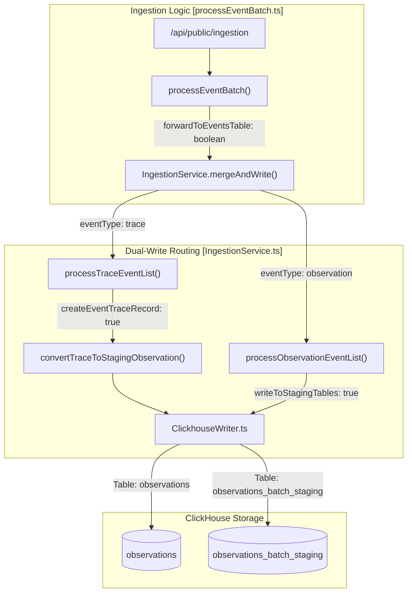
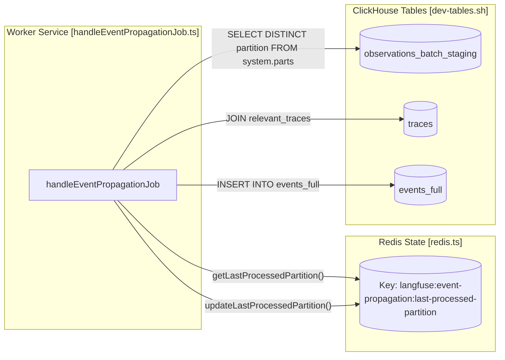

# Events Table & Dual-Write Architecture

Relevant source files

The following files were used as context for generating this wiki page:

- [fern/apis/server/definition/ingestion.yml](fern/apis/server/definition/ingestion.yml)
- [packages/shared/clickhouse/scripts/dev-tables.sh](packages/shared/clickhouse/scripts/dev-tables.sh)
- [packages/shared/prisma/migrations/20241029130802_prices_drop_excess_index/migration.sql](packages/shared/prisma/migrations/20241029130802_prices_drop_excess_index/migration.sql)
- [packages/shared/src/domain/observations.ts](packages/shared/src/domain/observations.ts)
- [packages/shared/src/eventsTable.ts](packages/shared/src/eventsTable.ts)
- [packages/shared/src/server/clickhouse/schema.ts](packages/shared/src/server/clickhouse/schema.ts)
- [packages/shared/src/server/ingestion/processEventBatch.ts](packages/shared/src/server/ingestion/processEventBatch.ts)
- [packages/shared/src/server/ingestion/types.ts](packages/shared/src/server/ingestion/types.ts)
- [packages/shared/src/server/otel/ObservationTypeMapper.ts](packages/shared/src/server/otel/ObservationTypeMapper.ts)
- [packages/shared/src/server/otel/OtelIngestionProcessor.ts](packages/shared/src/server/otel/OtelIngestionProcessor.ts)
- [packages/shared/src/server/queries/clickhouse-sql/clickhouse-filter.ts](packages/shared/src/server/queries/clickhouse-sql/clickhouse-filter.ts)
- [packages/shared/src/server/queries/clickhouse-sql/event-query-builder.ts](packages/shared/src/server/queries/clickhouse-sql/event-query-builder.ts)
- [packages/shared/src/server/queries/clickhouse-sql/query-fragments.ts](packages/shared/src/server/queries/clickhouse-sql/query-fragments.ts)
- [packages/shared/src/server/queries/index.ts](packages/shared/src/server/queries/index.ts)
- [packages/shared/src/server/queries/public-api-filter-builder.ts](packages/shared/src/server/queries/public-api-filter-builder.ts)
- [packages/shared/src/server/redis/eventPropagationQueue.ts](packages/shared/src/server/redis/eventPropagationQueue.ts)
- [packages/shared/src/server/redis/otelIngestionQueue.ts](packages/shared/src/server/redis/otelIngestionQueue.ts)
- [packages/shared/src/server/repositories/definitions.ts](packages/shared/src/server/repositories/definitions.ts)
- [packages/shared/src/server/repositories/events.ts](packages/shared/src/server/repositories/events.ts)
- [packages/shared/src/server/repositories/observations_converters.ts](packages/shared/src/server/repositories/observations_converters.ts)
- [packages/shared/src/server/tableMappings/mapEventsTable.ts](packages/shared/src/server/tableMappings/mapEventsTable.ts)
- [packages/shared/src/server/test-utils/tracing-factory.ts](packages/shared/src/server/test-utils/tracing-factory.ts)
- [packages/shared/src/utils/json.ts](packages/shared/src/utils/json.ts)
- [web/src/__tests__/server/api/otel/otelMapping.servertest.ts](web/src/__tests__/server/api/otel/otelMapping.servertest.ts)
- [web/src/__tests__/server/observations-api-v2.servertest.ts](web/src/__tests__/server/observations-api-v2.servertest.ts)
- [web/src/__tests__/server/repositories/event-repository.servertest.ts](web/src/__tests__/server/repositories/event-repository.servertest.ts)
- [web/src/__tests__/server/unit/observations-converters.servertest.ts](web/src/__tests__/server/unit/observations-converters.servertest.ts)
- [web/src/components/table/peek/hooks/usePeekData.ts](web/src/components/table/peek/hooks/usePeekData.ts)
- [web/src/features/events/config/filter-config.ts](web/src/features/events/config/filter-config.ts)
- [web/src/features/events/hooks/useEventsFilterOptions.ts](web/src/features/events/hooks/useEventsFilterOptions.ts)
- [web/src/features/events/hooks/useEventsTableData.ts](web/src/features/events/hooks/useEventsTableData.ts)
- [web/src/features/events/hooks/useEventsTraceData.ts](web/src/features/events/hooks/useEventsTraceData.ts)
- [web/src/features/events/lib/eventsToTraceAdapter.clienttest.ts](web/src/features/events/lib/eventsToTraceAdapter.clienttest.ts)
- [web/src/features/events/lib/eventsToTraceAdapter.ts](web/src/features/events/lib/eventsToTraceAdapter.ts)
- [web/src/features/events/server/eventsRouter.ts](web/src/features/events/server/eventsRouter.ts)
- [web/src/features/events/server/eventsService.ts](web/src/features/events/server/eventsService.ts)
- [web/src/features/models/components/pricing-tiers/TierPrefillButtons.tsx](web/src/features/models/components/pricing-tiers/TierPrefillButtons.tsx)
- [web/src/features/public-api/types/observations.ts](web/src/features/public-api/types/observations.ts)
- [web/src/hooks/useParsedObservation.ts](web/src/hooks/useParsedObservation.ts)
- [web/src/pages/api/public/otel/v1/traces/index.ts](web/src/pages/api/public/otel/v1/traces/index.ts)
- [web/src/utils/clientSideDomainTypes.ts](web/src/utils/clientSideDomainTypes.ts)
- [worker/src/backgroundMigrations/backfillEventsHistoric.ts](worker/src/backgroundMigrations/backfillEventsHistoric.ts)
- [worker/src/backgroundMigrations/backfillEventsHistoricFromParts.ts](worker/src/backgroundMigrations/backfillEventsHistoricFromParts.ts)
- [worker/src/backgroundMigrations/backfillExperimentsHistoric.ts](worker/src/backgroundMigrations/backfillExperimentsHistoric.ts)
- [worker/src/constants/default-model-prices.json](worker/src/constants/default-model-prices.json)
- [worker/src/features/eventPropagation/handleEventPropagationJob.ts](worker/src/features/eventPropagation/handleEventPropagationJob.ts)
- [worker/src/features/eventPropagation/handleExperimentBackfill.ts](worker/src/features/eventPropagation/handleExperimentBackfill.ts)
- [worker/src/queues/__tests__/otelDirectEventWrite.test.ts](worker/src/queues/__tests__/otelDirectEventWrite.test.ts)
- [worker/src/queues/otelIngestionQueue.ts](worker/src/queues/otelIngestionQueue.ts)
- [worker/src/queues/shardedQueueRegistry.ts](worker/src/queues/shardedQueueRegistry.ts)
- [worker/src/scripts/upsertDefaultModelPrices.ts](worker/src/scripts/upsertDefaultModelPrices.ts)
- [worker/src/services/IngestionService/index.ts](worker/src/services/IngestionService/index.ts)
- [worker/src/services/IngestionService/tests/IngestionService.integration.test.ts](worker/src/services/IngestionService/tests/IngestionService.integration.test.ts)
- [worker/src/services/IngestionService/tests/calculateTokenCost.unit.test.ts](worker/src/services/IngestionService/tests/calculateTokenCost.unit.test.ts)
- [worker/src/services/IngestionService/tests/utils.unit.test.ts](worker/src/services/IngestionService/tests/utils.unit.test.ts)
- [worker/src/services/IngestionService/utils.ts](worker/src/services/IngestionService/utils.ts)

This page covers the design and implementation of the `events` table family in ClickHouse, the dual-write mechanism that populates it from the existing `observations` pipeline, real-time partition propagation via `EventPropagationQueue`, and the repository patterns used to query this data.

---

## Purpose and Context

Langfuse's traditional `observations` table stores spans and generations independently of their parent trace metadata. The `events` table architecture (v2) introduces a denormalized layer that merges observation data with trace properties (`user_id`, `session_id`, `tags`, `trace_name`, etc.) at write time. This allows for significantly faster analytical queries by eliminating expensive joins during read operations.

The system uses a **dual-write** approach to ensure backward compatibility:
1. Data is written to the legacy `observations` table.
2. Simultaneously, data is written to a staging table (`observations_batch_staging`).
3. An asynchronous worker propagates and denormalizes this data into the final `events_full` table.

Sources: [worker/src/services/IngestionService/index.ts:149-156](), [worker/src/features/eventPropagation/handleEventPropagationJob.ts:58-72]()

---

## Table Family Overview

The architecture consists of several ClickHouse tables with specific roles defined in the development schema scripts.

| Table | Engine | Purpose |
| :--- | :--- | :--- |
| `observations_batch_staging` | `ReplacingMergeTree` | Short-lived buffer for raw observations; partitioned by 3-minute intervals. |
| `events_full` | `ReplacingMergeTree` | The primary denormalized table containing full I/O and trace metadata. |

### `observations_batch_staging`
This table acts as a temporary landing zone. It uses a fine-grained partitioning strategy: `PARTITION BY toStartOfInterval(s3_first_seen_timestamp, INTERVAL 3 MINUTE)` [packages/shared/clickhouse/scripts/dev-tables.sh:121](). 

*   **TTL**: Data is automatically expired after 12 hours (`TTL s3_first_seen_timestamp + INTERVAL 12 HOUR`) [packages/shared/clickhouse/scripts/dev-tables.sh:129]().
*   **Settings**: `ttl_only_drop_parts = 1` ensures ClickHouse only drops complete partitions, maintaining data integrity during propagation [packages/shared/clickhouse/scripts/dev-tables.sh:130]().

### `events_full`
`events_full` is the source of truth for the denormalized event-sourcing pattern [packages/shared/clickhouse/scripts/dev-tables.sh:135-198](). It stores full `input` and `output` strings using `ZSTD(3)` compression [packages/shared/clickhouse/scripts/dev-tables.sh:192-194]().

*   **Materialized Columns**: It includes materialized columns for cost calculation, such as `calculated_total_cost` which sums input and output costs using `mapFilter` on the `cost_details` map [packages/shared/clickhouse/scripts/dev-tables.sh:180-183]().
*   **Metadata Storage**: Metadata is stored as two parallel arrays (`metadata_names` and `metadata_values`) to allow efficient filtering and reconstruction [packages/shared/clickhouse/scripts/dev-tables.sh:198-199]().

Sources: [packages/shared/clickhouse/scripts/dev-tables.sh:81-130](), [packages/shared/clickhouse/scripts/dev-tables.sh:135-200]()

---

## Dual-Write Architecture

The `IngestionService` manages the routing of incoming events. The decision to write to the events table is controlled by the `forwardToEventsTable` parameter in `mergeAndWrite` [worker/src/services/IngestionService/index.ts:154-156]().

### Ingestion Flow
When an event (Trace or Observation) arrives:
1.  **Traces**: Traces are converted into "synthetic" observations via `convertTraceToStagingObservation` [worker/src/services/IngestionService/index.ts:17]() and processed in `processTraceEventList` [worker/src/services/IngestionService/index.ts:162-168](). This allows the propagation job to treat trace metadata updates as events that need to be merged into the `events_full` table.
2.  **Observations**: Standard observations are mapped to `ObservationRecordInsertType` and written to both the legacy `observations` table and the `observations_batch_staging` table if `forwardToEventsTable` is true [worker/src/services/IngestionService/index.ts:170-176]().

### ClickhouseWriter
The `ClickhouseWriter` class handles the physical batching of these writes. It maintains separate buffers for different tables defined in `TableName` (e.g., `TableName.Observations`, `TableName.ObservationsBatchStaging`) [worker/src/services/ClickhouseWriter.ts:56]().

**Diagram: Data Ingestion & Dual-Write Path**

Sources: [worker/src/services/IngestionService/index.ts:148-194](), [packages/shared/src/server/ingestion/processEventBatch.ts:104-125](), [worker/src/services/IngestionService/index.ts:56-57]()

---

## Real-Time Propagation: `EventPropagationQueue`

The `handleEventPropagationJob` moves data from the staging table to the final `events_full` table by performing the denormalization join.

### Propagation Logic
The worker executes a sequential, partition-based migration [worker/src/features/eventPropagation/handleEventPropagationJob.ts:58-72]():

1.  **Cursor Check**: It reads the `LAST_PROCESSED_PARTITION_KEY` from Redis to determine the last successful 3-minute window processed [worker/src/features/eventPropagation/handleEventPropagationJob.ts:22-29]().
2.  **Partition Selection**: It identifies the next available partition in `observations_batch_staging` that is older than `LANGFUSE_EXPERIMENT_EVENT_PROPAGATION_PARTITION_DELAY_MINUTES` [worker/src/features/eventPropagation/handleEventPropagationJob.ts:94-103]().
3.  **The Denormalization Join**: It executes an `INSERT INTO events_full` that joins `observations_batch_staging` with the `traces` table [worker/src/features/eventPropagation/handleEventPropagationJob.ts:140-182]().
    *   It selects the latest trace metadata for each `trace_id` in the batch using `limit 1 by t.project_id, t.id` [worker/src/features/eventPropagation/handleEventPropagationJob.ts:181-182]().
    *   It merges trace fields like `user_id`, `session_id`, and `tags` into the observation record [worker/src/features/eventPropagation/handleEventPropagationJob.ts:185-196]().
4.  **Cursor Update**: Upon success, it updates the cursor in Redis via `updateLastProcessedPartition` [worker/src/features/eventPropagation/handleEventPropagationJob.ts:35-40]().

**Diagram: Propagation and Denormalization [Code Entity Space]**

Sources: [worker/src/features/eventPropagation/handleEventPropagationJob.ts:15-50](), [worker/src/features/eventPropagation/handleEventPropagationJob.ts:94-103](), [worker/src/features/eventPropagation/handleEventPropagationJob.ts:140-210]()

---

## Data Access and Repositories

Querying the events architecture is handled by the `events.ts` repository, which abstracts the underlying ClickHouse SQL.

### `EventsQueryBuilder`
The system uses a structured `EventsQueryBuilder` to generate SQL for the denormalized table [packages/shared/src/server/queries/clickhouse-sql/event-query-builder.ts:75](). This builder handles:
*   **Field Mapping**: Mapping internal field names to SQL expressions with appropriate aliases (e.g., `e.span_id as id`) [packages/shared/src/server/queries/clickhouse-sql/event-query-builder.ts:57-146]().
*   **Calculated Latency**: Computing latency via `date_diff` on `start_time` and `end_time` [packages/shared/src/server/queries/clickhouse-sql/event-query-builder.ts:142-143]().
*   **Enrichment**: The repository enriches raw ClickHouse records with model pricing data using `enrichObservationsWithModelData` [packages/shared/src/server/repositories/events.ts:125-130]().

### Data Conversion
Raw ClickHouse results are transformed into domain entities via `convertEventsObservation` [packages/shared/src/server/repositories/observations_converters.ts:140-165](). This process ensures that:
*   Timestamps are correctly parsed from ClickHouse format [packages/shared/src/server/repositories/observations_converters.ts:110-113]().
*   Metadata parallel arrays are reconstructed into objects [packages/shared/src/server/repositories/observations_converters.ts:15]().
*   Input and Output strings are optionally parsed as JSON based on `RenderingProps` [packages/shared/src/server/repositories/observations_converters.ts:153-165]().

Sources: [packages/shared/src/server/repositories/events.ts:125-178](), [packages/shared/src/server/queries/clickhouse-sql/event-query-builder.ts:57-146](), [packages/shared/src/server/repositories/observations_converters.ts:140-210]()
