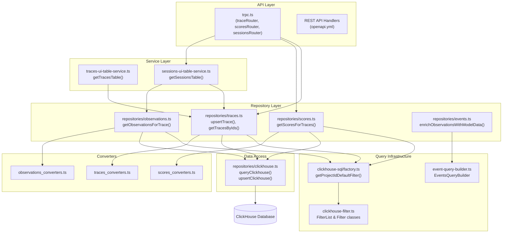
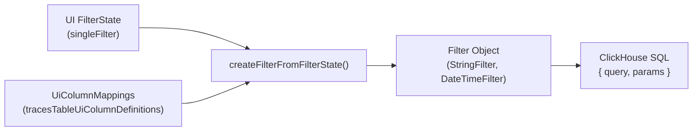

# Repository Pattern

Relevant source files

The following files were used as context for generating this wiki page:

- [packages/shared/src/domain/observations.ts](packages/shared/src/domain/observations.ts)
- [packages/shared/src/eventsTable.ts](packages/shared/src/eventsTable.ts)
- [packages/shared/src/server/clickhouse/schema.ts](packages/shared/src/server/clickhouse/schema.ts)
- [packages/shared/src/server/queries/clickhouse-sql/event-query-builder.ts](packages/shared/src/server/queries/clickhouse-sql/event-query-builder.ts)
- [packages/shared/src/server/queries/clickhouse-sql/query-fragments.ts](packages/shared/src/server/queries/clickhouse-sql/query-fragments.ts)
- [packages/shared/src/server/queries/clickhouse-sql/search.ts](packages/shared/src/server/queries/clickhouse-sql/search.ts)
- [packages/shared/src/server/queries/index.ts](packages/shared/src/server/queries/index.ts)
- [packages/shared/src/server/queries/public-api-filter-builder.ts](packages/shared/src/server/queries/public-api-filter-builder.ts)
- [packages/shared/src/server/repositories/clickhouse.ts](packages/shared/src/server/repositories/clickhouse.ts)
- [packages/shared/src/server/repositories/events.ts](packages/shared/src/server/repositories/events.ts)
- [packages/shared/src/server/repositories/observations.ts](packages/shared/src/server/repositories/observations.ts)
- [packages/shared/src/server/repositories/observations_converters.ts](packages/shared/src/server/repositories/observations_converters.ts)
- [packages/shared/src/server/repositories/scores.ts](packages/shared/src/server/repositories/scores.ts)
- [packages/shared/src/server/repositories/traces.ts](packages/shared/src/server/repositories/traces.ts)
- [packages/shared/src/server/services/sessions-ui-table-service.ts](packages/shared/src/server/services/sessions-ui-table-service.ts)
- [packages/shared/src/server/services/traces-ui-table-service.ts](packages/shared/src/server/services/traces-ui-table-service.ts)
- [packages/shared/src/server/tableMappings/mapEventsTable.ts](packages/shared/src/server/tableMappings/mapEventsTable.ts)
- [web/src/__tests__/server/clickhouseSearchCondition.servertest.ts](web/src/__tests__/server/clickhouseSearchCondition.servertest.ts)
- [web/src/__tests__/server/observations-api-v2.servertest.ts](web/src/__tests__/server/observations-api-v2.servertest.ts)
- [web/src/__tests__/server/repositories/clickhouse-resource-errors.servertest.ts](web/src/__tests__/server/repositories/clickhouse-resource-errors.servertest.ts)
- [web/src/__tests__/server/repositories/event-repository.servertest.ts](web/src/__tests__/server/repositories/event-repository.servertest.ts)
- [web/src/__tests__/server/trpc-error-formatting.servertest.ts](web/src/__tests__/server/trpc-error-formatting.servertest.ts)
- [web/src/__tests__/server/unit/observations-converters.servertest.ts](web/src/__tests__/server/unit/observations-converters.servertest.ts)
- [web/src/__tests__/server/withMiddlewares.servertest.ts](web/src/__tests__/server/withMiddlewares.servertest.ts)
- [web/src/components/table/peek/hooks/usePeekData.ts](web/src/components/table/peek/hooks/usePeekData.ts)
- [web/src/features/events/config/filter-config.ts](web/src/features/events/config/filter-config.ts)
- [web/src/features/events/hooks/useEventsFilterOptions.ts](web/src/features/events/hooks/useEventsFilterOptions.ts)
- [web/src/features/events/hooks/useEventsTableData.ts](web/src/features/events/hooks/useEventsTableData.ts)
- [web/src/features/events/hooks/useEventsTraceData.ts](web/src/features/events/hooks/useEventsTraceData.ts)
- [web/src/features/events/lib/eventsToTraceAdapter.clienttest.ts](web/src/features/events/lib/eventsToTraceAdapter.clienttest.ts)
- [web/src/features/events/lib/eventsToTraceAdapter.ts](web/src/features/events/lib/eventsToTraceAdapter.ts)
- [web/src/features/events/server/eventsRouter.ts](web/src/features/events/server/eventsRouter.ts)
- [web/src/features/events/server/eventsService.ts](web/src/features/events/server/eventsService.ts)
- [web/src/features/notifications/ErrorNotification.tsx](web/src/features/notifications/ErrorNotification.tsx)
- [web/src/features/notifications/showErrorToast.tsx](web/src/features/notifications/showErrorToast.tsx)
- [web/src/features/public-api/server/withMiddlewares.ts](web/src/features/public-api/server/withMiddlewares.ts)
- [web/src/features/public-api/types/observations.ts](web/src/features/public-api/types/observations.ts)
- [web/src/hooks/useParsedObservation.ts](web/src/hooks/useParsedObservation.ts)
- [web/src/server/api/routers/generations/filterOptionsQuery.ts](web/src/server/api/routers/generations/filterOptionsQuery.ts)
- [web/src/server/api/routers/scores.ts](web/src/server/api/routers/scores.ts)
- [web/src/server/api/routers/sessions.ts](web/src/server/api/routers/sessions.ts)
- [web/src/server/api/routers/traces.ts](web/src/server/api/routers/traces.ts)
- [web/src/server/api/trpc.ts](web/src/server/api/trpc.ts)
- [web/src/utils/clientSideDomainTypes.ts](web/src/utils/clientSideDomainTypes.ts)
- [web/src/utils/trpcErrorToast.tsx](web/src/utils/trpcErrorToast.tsx)

The repository pattern in Langfuse provides a structured data access layer for ClickHouse operations. Repositories encapsulate all queries for core domain entities (traces, observations, scores, sessions), offering a consistent interface for data retrieval, insertion, and deletion. This abstraction isolates business logic from database implementation details and provides a centralized location for query optimization and instrumentation.

For information about the ClickHouse schema and table structure, see [3.3](). For details on the events table architecture, see [3.4]().

---

## Repository Architecture

The repository layer sits between service/router code and the raw ClickHouse client, providing domain-specific query functions organized by entity type.

### Repository Data Flow

**Sources:**
- [packages/shared/src/server/repositories/traces.ts:1-40]()
- [packages/shared/src/server/repositories/observations.ts:1-50]()
- [packages/shared/src/server/repositories/scores.ts:1-58]()
- [web/src/server/api/routers/traces.ts:97-152]()
- [packages/shared/src/server/repositories/events.ts:75-83]()

---

## Core Repository Structure

Each repository is implemented as a collection of exported functions that encapsulate specific query operations. Repositories follow a consistent naming convention and structure.

### Traces Repository

The traces repository provides functions for managing trace records in ClickHouse.

| Function | Purpose | Return Type |
|----------|---------|-------------|
| `checkTraceExistsAndGetTimestamp` | Validate trace existence with time window filtering | `Promise<{exists: boolean, timestamp?: Date}>` |
| `upsertTrace` | Insert or update a trace record | `Promise<void>` |
| `getTracesByIds` | Retrieve multiple traces by IDs | `Promise<TraceDomain[]>` |

**Key Implementation Details:**

The `checkTraceExistsAndGetTimestamp` function uses a ±2 day window and CTE-based aggregation to validate traces before evaluation job creation [packages/shared/src/server/repositories/traces.ts:58-72](). It constructs an `observations_agg` CTE to calculate aggregated levels and latencies [packages/shared/src/server/repositories/traces.ts:102-126]().

**Sources:**
- [packages/shared/src/server/repositories/traces.ts:58-192]()
- [packages/shared/src/server/repositories/traces.ts:198-204]()

### Observations Repository

The observations repository manages observation records (spans, generations, events).

| Function | Purpose | Return Type |
|----------|---------|-------------|
| `checkObservationExists` | Validate observation existence | `Promise<boolean>` |
| `upsertObservation` | Insert or update an observation record | `Promise<void>` |
| `getObservationsForTrace` | Retrieve all observations for a trace | `Promise<ObservationRecordReadType[]>` |

**Key Implementation Details:**

`getObservationsForTrace` handles large payloads by limiting the size of input/output/metadata fields to the `LANGFUSE_API_TRACE_OBSERVATIONS_SIZE_LIMIT_BYTES` environment variable to prevent memory exhaustion [packages/shared/src/server/repositories/observations.ts:206-231]().

**Sources:**
- [packages/shared/src/server/repositories/observations.ts:64-97]()
- [packages/shared/src/server/repositories/observations.ts:103-126]()
- [packages/shared/src/server/repositories/observations.ts:136-205]()

### Scores Repository

The scores repository manages score records attached to traces, observations, or sessions.

| Function | Purpose | Return Type |
|----------|---------|-------------|
| `searchExistingAnnotationScore` | Find existing annotation score by criteria | `Promise<ScoreDomain \| undefined>` |
| `getScoreById` | Retrieve a single score by ID | `Promise<ScoreDomain \| undefined>` |
| `upsertScore` | Insert or update a score record | `Promise<void>` |
| `getScoresForTraces` | Retrieve all scores for given trace IDs | `Promise<ScoreDomain[]>` |
| `getScoresForSessions` | Retrieve all scores for given session IDs | `Promise<ScoreDomain[]>` |

**Sources:**
- [packages/shared/src/server/repositories/scores.ts:63-114]()
- [packages/shared/src/server/repositories/scores.ts:116-131]()
- [packages/shared/src/server/repositories/scores.ts:151-166]()
- [packages/shared/src/server/repositories/scores.ts:224-249]()

### Events Repository (V4 Architecture)

The events repository abstracts the newer `events_full` and `events_core` tables, primarily used in the V4 architecture where traces and observations are unified into a single event stream.

| Function | Purpose | Return Type |
|----------|---------|-------------|
| `enrichObservationsWithModelData` | Maps raw ClickHouse records to domain objects and enriches with model pricing | `Promise<EventsObservation[]>` |
| `convertEventsObservation` | Converter for event-based observations [packages/shared/src/server/repositories/events.ts:73]() | `EventsObservation` |

**Key Implementation Details:**
The `enrichObservationsWithModelData` function supports both V1 (complete) and V2 (partial) API requests. It fetches model data via `prisma.model.findMany` only if requested or required for the version, ensuring pricing details are attached to the observations [packages/shared/src/server/repositories/events.ts:125-180]().

**Sources:**
- [packages/shared/src/server/repositories/events.ts:125-180]()
- [packages/shared/src/server/repositories/events.ts:181-211]()

---

## Write Path Abstraction

The repository pattern extends to the write path via `upsertClickhouse` and the ClickHouse client.

### Direct Upsert
The `upsertClickhouse` function in the shared package provides a way to write directly to ClickHouse while simultaneously logging the event to S3 blob storage if `LANGFUSE_ENABLE_BLOB_STORAGE_FILE_LOG` is enabled [packages/shared/src/server/repositories/clickhouse.ts:157-180]().

- **Event Mapping**: It maps records to event types like `trace-create` or `span-create` [packages/shared/src/server/repositories/clickhouse.ts:148-152]().
- **Blob Storage**: Records are uploaded as JSON to S3 using the `StorageService` [packages/shared/src/server/repositories/clickhouse.ts:182-192]().
- **ClickHouse Insert**: Records are finally inserted into the target table with an `event_ts` [packages/shared/src/server/repositories/clickhouse.ts:195-205]().

**Sources:**
- [packages/shared/src/server/repositories/clickhouse.ts:128-206]()

---

## Query Patterns and Optimization Strategies

### Deduplication Pattern
ClickHouse's `ReplacingMergeTree` engine requires explicit deduplication in queries using `ORDER BY event_ts DESC` and `LIMIT 1 BY id, project_id` [packages/shared/src/server/repositories/observations.ts:187-188](). For OTel projects using immutable spans, deduplication is skipped via `shouldSkipObservationsFinal(projectId)` [packages/shared/src/server/repositories/observations.ts:148-150]().

### Time-Based Filtering
Repositories use standard time intervals to constrain queries for performance:
- `TRACE_TO_OBSERVATIONS_INTERVAL`: `INTERVAL 2 DAY` [packages/shared/src/server/repositories/observations.ts:40-41]().
- `OBSERVATIONS_TO_TRACE_INTERVAL`: `INTERVAL 5 MINUTE` [packages/shared/src/server/repositories/traces.ts:29-31]().
- `SCORE_TO_TRACE_OBSERVATIONS_INTERVAL`: `INTERVAL 2 DAY` [packages/shared/src/server/repositories/scores.ts:34]().

### CTE-Based Aggregations
Complex queries use Common Table Expressions (CTEs) for multi-step aggregations. For example, `checkTraceExistsAndGetTimestamp` defines `observations_agg` to calculate latency and aggregate levels before joining with the traces table [packages/shared/src/server/repositories/traces.ts:102-126]().

### Structured Query Building
The `EventsQueryBuilder` and `SplitQueryBuilder` provide a type-safe way to construct queries against the unified events tables. They define a centralized `EVENTS_FIELDS` mapping to ensure consistency across different query types (list, count, metrics) [packages/shared/src/server/queries/clickhouse-sql/event-query-builder.ts:57-146]().

---

## Filter and Search System

The repository layer integrates with a sophisticated filter system that translates UI state into ClickHouse SQL.

### Filter Mapping

**Key Filter Classes:**
- `StringFilter`: Handles equality and partial matches [packages/shared/src/server/repositories/traces.ts:88-93]().
- `DateTimeFilter`: Handles timestamp comparisons [packages/shared/src/server/repositories/traces.ts:77-80]().

**Sources:**
- [packages/shared/src/server/repositories/traces.ts:73-101]()
- [packages/shared/src/server/queries/clickhouse-sql/factory.ts:9-11]()

---

## Integration with Service Layer

Higher-level services use repositories to provide data for the web UI and Public API.

### Session Router
The `sessionRouter` coordinates complex lookups by chunking trace IDs (e.g., in batches of 500) and calling `getScoresForTraces` and `getCostForTraces` in parallel [web/src/server/api/routers/sessions.ts:97-124]().

### Scores Router
The `scoresRouter` uses repositories to fetch paginated lists of scores for the UI, optionally joining with event-based metadata for the V4 architecture via `getScoresUiTableFromEvents` [web/src/server/api/routers/scores.ts:211-224]().

**Sources:**
- [web/src/server/api/routers/sessions.ts:97-124]()
- [web/src/server/api/routers/traces.ts:125-152]()
- [web/src/server/api/routers/scores.ts:107-168]()
- [web/src/server/api/routers/scores.ts:211-224]()
