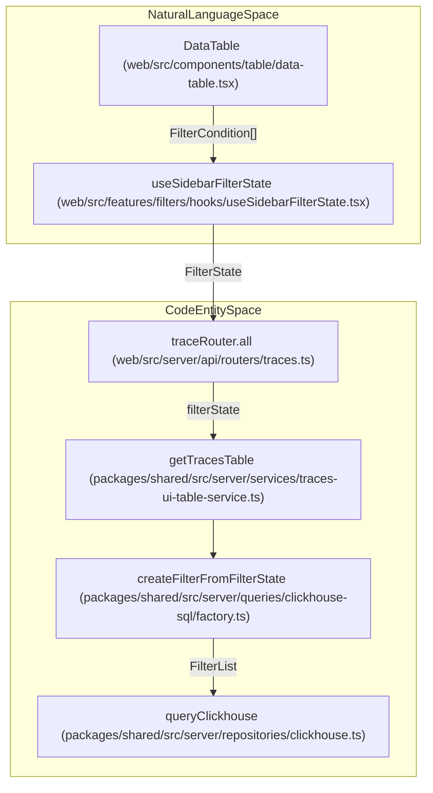
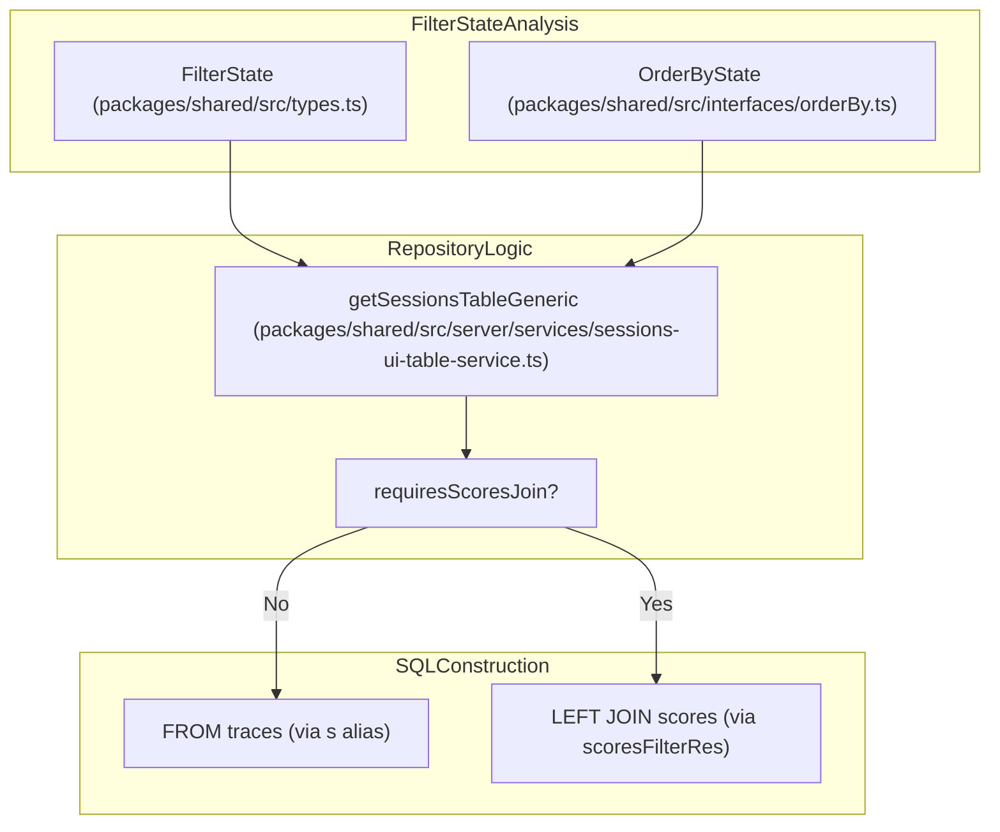

# Query Optimization

Relevant source files

The following files were used as context for generating this wiki page:

- [packages/shared/src/server/queries/clickhouse-sql/factory.ts](packages/shared/src/server/queries/clickhouse-sql/factory.ts)
- [packages/shared/src/server/queries/clickhouse-sql/search.ts](packages/shared/src/server/queries/clickhouse-sql/search.ts)
- [packages/shared/src/server/queries/createGenerationsQuery.ts](packages/shared/src/server/queries/createGenerationsQuery.ts)
- [packages/shared/src/server/repositories/observations.ts](packages/shared/src/server/repositories/observations.ts)
- [packages/shared/src/server/repositories/scores.ts](packages/shared/src/server/repositories/scores.ts)
- [packages/shared/src/server/repositories/traces.ts](packages/shared/src/server/repositories/traces.ts)
- [packages/shared/src/server/services/InMemoryFilterService.ts](packages/shared/src/server/services/InMemoryFilterService.ts)
- [packages/shared/src/server/services/sessions-ui-table-service.ts](packages/shared/src/server/services/sessions-ui-table-service.ts)
- [packages/shared/src/server/services/traces-ui-table-service.ts](packages/shared/src/server/services/traces-ui-table-service.ts)
- [packages/shared/src/tableDefinitions/types.ts](packages/shared/src/tableDefinitions/types.ts)
- [web/src/__tests__/server/clickhouseSearchCondition.servertest.ts](web/src/__tests__/server/clickhouseSearchCondition.servertest.ts)
- [web/src/__tests__/server/createFilterFromFilterState-filterTypeValidation.servertest.ts](web/src/__tests__/server/createFilterFromFilterState-filterTypeValidation.servertest.ts)
- [web/src/__tests__/server/observations-api.servertest.ts](web/src/__tests__/server/observations-api.servertest.ts)
- [web/src/features/evals/hooks/useEvalConfigFilterOptions.ts](web/src/features/evals/hooks/useEvalConfigFilterOptions.ts)
- [web/src/features/evals/pages/remap-evaluator.tsx](web/src/features/evals/pages/remap-evaluator.tsx)
- [web/src/features/evals/utils/evaluator-constants.ts](web/src/features/evals/utils/evaluator-constants.ts)
- [web/src/features/public-api/types/metrics.ts](web/src/features/public-api/types/metrics.ts)
- [web/src/features/public-api/types/sessions.ts](web/src/features/public-api/types/sessions.ts)
- [web/src/pages/api/public/metrics/index.ts](web/src/pages/api/public/metrics/index.ts)
- [web/src/pages/api/public/v2/metrics.ts](web/src/pages/api/public/v2/metrics.ts)
- [web/src/pages/api/public/v2/observations/index.ts](web/src/pages/api/public/v2/observations/index.ts)
- [web/src/server/api/routers/generations/db/getAllGenerationsSqlQuery.ts](web/src/server/api/routers/generations/db/getAllGenerationsSqlQuery.ts)
- [web/src/server/api/routers/generations/filterOptionsQuery.ts](web/src/server/api/routers/generations/filterOptionsQuery.ts)
- [web/src/server/api/routers/generations/getAllQueries.ts](web/src/server/api/routers/generations/getAllQueries.ts)
- [web/src/server/api/routers/observations.ts](web/src/server/api/routers/observations.ts)
- [web/src/server/api/routers/scores.ts](web/src/server/api/routers/scores.ts)
- [web/src/server/api/routers/sessions.ts](web/src/server/api/routers/sessions.ts)
- [web/src/server/api/routers/traces.ts](web/src/server/api/routers/traces.ts)

This page documents query optimization strategies employed throughout the Langfuse codebase to improve ClickHouse query performance. These optimizations focus on reducing table scans, minimizing expensive JOINs, and leveraging time-based partitioning through a structured Repository pattern and specialized Query Builder.

## Overview

Langfuse implements several query optimization strategies to handle high-volume observability data efficiently:

- **Common Table Expressions (CTEs)**: Using CTEs for complex aggregations, such as calculating trace-level metrics (latency, cost, usage) from the `observations` table before joining with `traces` [packages/shared/src/server/repositories/traces.ts:102-126]().
- **Conditional JOINs**: Dynamically adding table joins only when filters or requested measures require them, such as joining `observations_agg` only if observation-level filters are active [packages/shared/src/server/repositories/traces.ts:163-164]().
- **Time Window Constraints**: Using time-based filters to limit partition scans. The system applies lookback windows (e.g., `±2 day` or specific intervals) to narrow searches [packages/shared/src/server/repositories/traces.ts:166-168]().
- **Deduplication Control**: Utilizing `LIMIT 1 BY id, project_id` with `ORDER BY event_ts DESC` to fetch the latest version of a record without the performance penalty of `FINAL` in many read paths [packages/shared/src/server/repositories/observations.ts:75-76]().
- **Skip Final for OTel**: For OpenTelemetry-based projects where spans are immutable, the system skips expensive deduplication logic using `shouldSkipObservationsFinal` [packages/shared/src/server/repositories/observations.ts:148-188]().
- **V4 Beta Synthetic Trace Optimization**: In the V4 architecture, trace metadata is often derived directly from observation events using `getScoresUiTableFromEvents` and `getTraceMetadataByIdsFromEvents` to avoid joining the `traces` table entirely [web/src/server/api/routers/scores.ts:211-224]().

Sources: [packages/shared/src/server/repositories/traces.ts:102-168](), [packages/shared/src/server/repositories/observations.ts:75-188](), [web/src/server/api/routers/scores.ts:211-224]()

## Repository Query Architecture

The Repository layer bridges the tRPC API routers to optimized ClickHouse SQL. It handles the translation of UI `FilterState` into ClickHouse-specific SQL fragments.

### Data Flow Diagram
The following diagram illustrates how the system bridges UI filter states to the Repository layer.

**Diagram: Relationship between UI filter interactions and ClickHouse repository execution.**

### Implementation Detail
Functions like `getTracesTableGeneric` utilize `getProjectIdDefaultFilter` to establish base project-level security and then append dynamic filters generated from the UI [packages/shared/src/server/services/traces-ui-table-service.ts:222-225](). This ensures that every query is partitioned by `project_id` and often by a time range derived from `FilterState`.

Sources: [packages/shared/src/server/services/traces-ui-table-service.ts:206-225](), [web/src/server/api/routers/traces.ts:125-152](), [packages/shared/src/server/queries/clickhouse-sql/factory.ts:186-203]()

## Complex Aggregation Patterns

Langfuse utilizes specialized ClickHouse functions and CTE structures to aggregate data across hierarchical structures (Traces -> Observations -> Scores).

### CTE Aggregation
In `checkTraceExistsAndGetTimestamp`, a CTE named `observations_agg` is used to pre-calculate aggregated levels (ERROR, WARNING, etc.) and latency across all observations belonging to a trace [packages/shared/src/server/repositories/traces.ts:102-126](). This prevents repeated scanning of the `observations` table during the main `traces` query.

### Optimized Functions
- `sumMap(usage_details)`: Efficiently aggregates token usage maps across multiple spans [packages/shared/src/server/repositories/traces.ts:116]().
- `multiIf`: Used within aggregations to determine the "worst" status level (e.g., if any observation is 'ERROR', the trace level is 'ERROR') [packages/shared/src/server/repositories/traces.ts:105-110]().
- `date_diff`: Calculates latency in milliseconds by finding the span between the earliest `start_time` and latest `end_time` [packages/shared/src/server/repositories/traces.ts:115]().
- `reduceUsageOrCostDetails`: A TypeScript utility used to flatten complex ClickHouse `usage_details` maps into standard UI metrics [packages/shared/src/server/services/traces-ui-table-service.ts:108-116]().

Sources: [packages/shared/src/server/repositories/traces.ts:102-126](), [packages/shared/src/server/services/traces-ui-table-service.ts:105-145]()

## Conditional JOIN Optimization

The repository layer analyzes the `FilterState` and requested columns to determine if secondary table joins are necessary.

### Join Decision Logic
In `getSessionsTableGeneric`, the system detects if filters reference the `scores` table or if the `orderBy` clause targets a score metric. If neither is true, the expensive join to the scores table is omitted [packages/shared/src/server/services/sessions-ui-table-service.ts:218-221]().

**Diagram: Conditional JOIN logic for session metrics based on active filters and sorting.**

Sources: [packages/shared/src/server/services/sessions-ui-table-service.ts:175-221]()

## Filter Optimization

The `createFilterFromFilterState` function maps UI filters to specialized ClickHouse filter classes like `StringFilter`, `DateTimeFilter`, and `StringOptionsFilter` [packages/shared/src/server/queries/clickhouse-sql/factory.ts:75-161]().

### Performance Patterns
- **Time-based Pruning**: The system automatically extracts `DateTimeFilter` values to apply as direct `WHERE` conditions on the ClickHouse `timestamp` or `start_time` columns, ensuring partition pruning [packages/shared/src/server/services/sessions-ui-table-service.ts:188-204]().
- **Interval-based Lookups**: When checking for related entities (e.g., finding observations for a trace), the system uses predefined constants like `TRACE_TO_OBSERVATIONS_INTERVAL` to limit the search window in ClickHouse [packages/shared/src/server/repositories/observations.ts:186]().
- **Batch Processing**: For session views, the system chunks large lists of trace IDs (e.g., 500 at a time) and executes parallelized queries for scores and costs to prevent hitting ClickHouse memory limits [web/src/server/api/routers/sessions.ts:97-124]().
- **Metadata Exclusion**: Internal UI routes often call `getScoresForTraces` with `excludeMetadata: true` to reduce network payload and memory overhead when metadata is not required for the view [packages/shared/src/server/repositories/scores.ts:210-222]().

Sources: [packages/shared/src/server/services/sessions-ui-table-service.ts:188-204](), [packages/shared/src/server/repositories/observations.ts:183-188](), [web/src/server/api/routers/sessions.ts:97-124](), [packages/shared/src/server/repositories/scores.ts:210-222]()

## Performance Instrumentation

Langfuse monitors query performance using a `measureAndReturn` wrapper. This utility captures:
- **Operation Name**: e.g., `checkTraceExistsAndGetTimestamp` [packages/shared/src/server/repositories/traces.ts:129]().
- **Project Context**: Associating performance metrics with specific `projectId`s [packages/shared/src/server/repositories/traces.ts:130]().
- **Tags**: Adding metadata such as `feature: "tracing"` and `kind: "exists"` for granular dashboarding [packages/shared/src/server/repositories/traces.ts:146-152]().

Sources: [packages/shared/src/server/repositories/traces.ts:128-155](), [packages/shared/src/server/repositories/observations.ts:28](), [packages/shared/src/server/repositories/scores.ts:47]()
