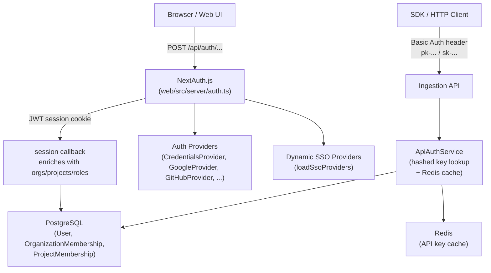
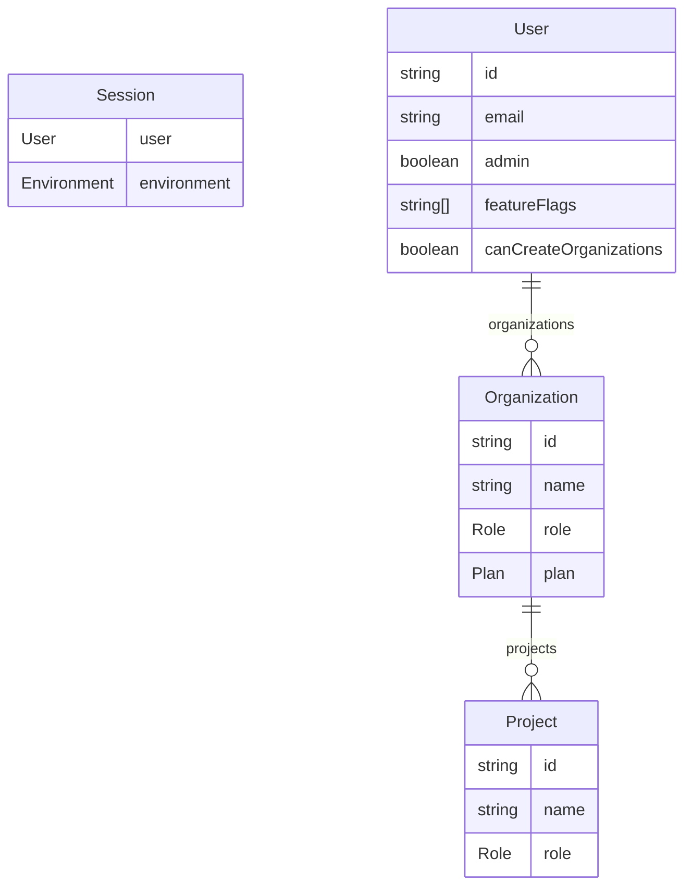
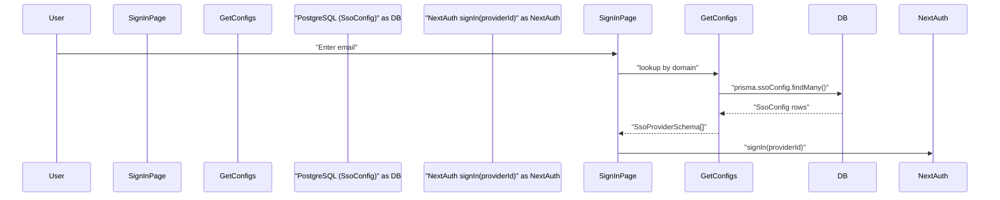

# Authentication & Authorization

Relevant source files

The following files were used as context for generating this wiki page:

- [.env.dev-azure.example](.env.dev-azure.example)
- [.env.dev.example](.env.dev.example)
- [.env.prod.example](.env.prod.example)
- [packages/shared/src/features/monitors/service/helpers.test.ts](packages/shared/src/features/monitors/service/helpers.test.ts)
- [packages/shared/src/features/monitors/service/helpers.ts](packages/shared/src/features/monitors/service/helpers.ts)
- [packages/shared/src/features/monitors/service/service.ts](packages/shared/src/features/monitors/service/service.ts)
- [packages/shared/src/features/monitors/service/types.test.ts](packages/shared/src/features/monitors/service/types.test.ts)
- [packages/shared/src/features/monitors/service/types.ts](packages/shared/src/features/monitors/service/types.ts)
- [packages/shared/src/server/auth/jumpcloudProvider.ts](packages/shared/src/server/auth/jumpcloudProvider.ts)
- [web/src/__tests__/server/monitorService.servertest.ts](web/src/__tests__/server/monitorService.servertest.ts)
- [web/src/__tests__/server/monitors.servertest.ts](web/src/__tests__/server/monitors.servertest.ts)
- [web/src/components/layouts/app-layout/utils/pathClassification.ts](web/src/components/layouts/app-layout/utils/pathClassification.ts)
- [web/src/ee/features/multi-tenant-sso/types.ts](web/src/ee/features/multi-tenant-sso/types.ts)
- [web/src/ee/features/multi-tenant-sso/utils.ts](web/src/ee/features/multi-tenant-sso/utils.ts)
- [web/src/env.mjs](web/src/env.mjs)
- [web/src/features/auth-credentials/components/ResetPasswordButton.tsx](web/src/features/auth-credentials/components/ResetPasswordButton.tsx)
- [web/src/features/auth-credentials/components/ResetPasswordPage.tsx](web/src/features/auth-credentials/components/ResetPasswordPage.tsx)
- [web/src/features/auth-credentials/lib/credentialsUtils.ts](web/src/features/auth-credentials/lib/credentialsUtils.ts)
- [web/src/features/auth-credentials/server/signupApiHandler.ts](web/src/features/auth-credentials/server/signupApiHandler.ts)
- [web/src/features/feature-flags/available-flags.ts](web/src/features/feature-flags/available-flags.ts)
- [web/src/features/posthog-analytics/usePostHogClientCapture.ts](web/src/features/posthog-analytics/usePostHogClientCapture.ts)
- [web/src/features/rbac/constants/projectAccessRights.ts](web/src/features/rbac/constants/projectAccessRights.ts)
- [web/src/pages/api/auth/signup-verify.ts](web/src/pages/api/auth/signup-verify.ts)
- [web/src/pages/auth/setup-password.tsx](web/src/pages/auth/setup-password.tsx)
- [web/src/pages/auth/sign-in.tsx](web/src/pages/auth/sign-in.tsx)
- [web/src/pages/auth/sign-up.tsx](web/src/pages/auth/sign-up.tsx)
- [web/src/server/auth.ts](web/src/server/auth.ts)
- [web/types/next-auth.d.ts](web/types/next-auth.d.ts)

This page provides an overview of how users and API clients are authenticated and how access is controlled throughout the Langfuse platform. It covers the web UI authentication stack built on NextAuth.js, the enterprise multi-tenant SSO system, API key authentication, and the role-based access control (RBAC) model.

For detailed coverage of specific sub-systems, see:
- [Authentication System](#4.1) — Document NextAuth.js configuration, session callback that enriches JWT with user/org/project data, and provider setup.
- [Multi-tenant SSO](#4.2) — Explain domain-based SSO provider detection, SsoConfig table for per-organization OAuth credentials, credential encryption, and verified domains for automatic SSO enforcement.
- [API Key Management](#4.3) — Document API key creation, scopes (ORGANIZATION vs PROJECT), hashed secret storage, and verification flow.
- [RBAC & Permissions](#4.4) — Describe the role system (OrganizationMembership, ProjectMembership), role resolution, and scope-based access control.

---

## High-Level Architecture

There are two distinct authentication paths in Langfuse:

1.  **Browser sessions** — users signing into the web UI via NextAuth.js (credentials, OAuth, or SSO).
2.  **API clients** — SDK or HTTP clients authenticating with project-scoped or organization-scoped API keys.

**Authentication paths overview**

Sources: [web/src/server/auth.ts:1-60](), [web/src/ee/features/multi-tenant-sso/utils.ts:103-116](), [web/src/env.mjs:40-105]()

---

## Session Authentication (NextAuth.js)

The web application uses [NextAuth.js](https://next-auth.js.org/) with a **JWT session strategy**. The main configuration is assembled in `web/src/server/auth.ts`.

### Session Strategy

Sessions are stored as signed JWTs with a configurable lifetime. The `NEXTAUTH_SECRET` is used for signing [web/src/env.mjs:49-52](). The session max age can be configured via `AUTH_SESSION_MAX_AGE` [.env.prod.example:63]().

### Session Enrichment

Every request that touches a NextAuth session executes the `session` callback, which re-fetches the user from PostgreSQL and attaches:

*   User identity fields (`id`, `name`, `email`, `image`, `admin`) [web/types/next-auth.d.ts:29-35]()
*   Feature flags (`featureFlags`) [web/types/next-auth.d.ts:59-59]()
*   `canCreateOrganizations` flag (controlled by `LANGFUSE_ALLOWED_ORGANIZATION_CREATORS` allowlist [web/src/server/auth.ts:70-88]())
*   Full hierarchy of `organizations` and their nested `projects`, including the user's `role` in each [web/types/next-auth.d.ts:40-58]().

**Session data shape**

Sources: [web/src/server/auth.ts:147-158](), [web/types/next-auth.d.ts:18-61](), [web/src/env.mjs:78-105]()

---

## Authentication Providers

### Static Providers

Providers are registered in `web/src/server/auth.ts` and are activated at startup if their corresponding environment variables are set.

| Provider | Environment Variables Required | Notes |
| :--- | :--- | :--- |
| `CredentialsProvider` | _(always enabled unless `AUTH_DISABLE_USERNAME_PASSWORD=true`)_ | Email + password [web/src/server/auth.ts:91-161]() |
| `EmailProvider` | `SMTP_CONNECTION_URL`, `EMAIL_FROM_ADDRESS` | OTP-based password reset [web/src/server/auth.ts:164-176]() |
| `GoogleProvider` | `AUTH_GOOGLE_CLIENT_ID`, `AUTH_GOOGLE_CLIENT_SECRET` | [web/src/env.mjs:113-114]() |
| `GitHubProvider` | `AUTH_GITHUB_CLIENT_ID`, `AUTH_GITHUB_CLIENT_SECRET` | [web/src/env.mjs:120-121]() |
| `AzureADProvider` | `AUTH_AZURE_AD_CLIENT_ID`, `AUTH_AZURE_AD_TENANT_ID` | [web/src/env.mjs:141-143]() |
| `OktaProvider` | `AUTH_OKTA_CLIENT_ID`, `AUTH_OKTA_ISSUER` | [web/src/env.mjs:148-150]() |
| `AuthentikProvider` | `AUTH_AUTHENTIK_CLIENT_ID`, `AUTH_AUTHENTIK_ISSUER` | [web/src/env.mjs:155-157]() |
| `Auth0Provider` | `AUTH_AUTH0_CLIENT_ID`, `AUTH_AUTH0_ISSUER` | [web/src/env.mjs:176-178]() |

Sources: [web/src/server/auth.ts:90-200](), [web/src/env.mjs:113-205]()

### Dynamic (Multi-tenant) SSO Providers

At request time, `loadSsoProviders()` reads `SsoConfig` rows from PostgreSQL and converts them to NextAuth `Provider` instances. This is an Enterprise Edition feature [web/src/ee/features/multi-tenant-sso/utils.ts:103-116]().

### Credentials Flow

The `CredentialsProvider.authorize` function [web/src/server/auth.ts:101-159]() performs:
1.  Checks `AUTH_DISABLE_USERNAME_PASSWORD` flag [web/src/server/auth.ts:103-106]().
2.  Checks if the email domain is in the SSO-blocked-domains list [web/src/server/auth.ts:108-114]().
3.  Calls `getSsoAuthProviderIdForDomain` for enterprise SSO enforcement [web/src/server/auth.ts:117-121]().
4.  Looks up the user in PostgreSQL and verifies the password hash [web/src/server/auth.ts:123-145]().

Sources: [web/src/server/auth.ts:101-159](), [web/src/ee/features/multi-tenant-sso/utils.ts:133-143]()

---

## Multi-tenant SSO (Enterprise Edition)

Multi-tenant SSO allows organizations to configure domain-specific SSO providers stored in the database via the `SsoConfig` table [web/src/ee/features/multi-tenant-sso/utils.ts:53-62]().

**Multi-tenant SSO flow**

Sources: [web/src/ee/features/multi-tenant-sso/utils.ts:39-96](), [web/src/pages/auth/sign-in.tsx:99-185]()

### Key Functions

| Function | File | Description |
| :--- | :--- | :--- |
| `getSsoConfigs()` | [web/src/ee/features/multi-tenant-sso/utils.ts:39-96]() | Fetches and caches `SsoConfig` rows (TTL 10 minutes). |
| `loadSsoProviders()` | [web/src/ee/features/multi-tenant-sso/utils.ts:103-116]() | Converts `SsoProviderSchema` objects to NextAuth `Provider` instances. |
| `getSsoAuthProviderIdForDomain()` | [web/src/ee/features/multi-tenant-sso/utils.ts:133-143]() | Returns the provider ID for a given domain to enforce SSO. |

Sources: [web/src/ee/features/multi-tenant-sso/utils.ts](), [web/src/ee/features/multi-tenant-sso/types.ts:49-214]()

---

## API Key Management

SDK and HTTP clients authenticate using project-scoped or organization-scoped API key pairs. API keys consist of a public key and a secret key. Secret keys are hashed using a `SALT` [web/src/env.mjs:70-75]().

API key creation and deletion events are tracked for analytics [web/src/features/posthog-analytics/usePostHogClientCapture.ts:192-193]().

Sources: [web/src/env.mjs:70-75](), [web/src/features/posthog-analytics/usePostHogClientCapture.ts:192-193]()

---

## RBAC & Permissions

### Role Hierarchy

The role system applies at both the organization and project level: `OWNER`, `ADMIN`, `MEMBER`, `VIEWER`, and `NONE` [web/src/env.mjs:89-105]().

### Membership Model

-   **Organization Level**: Defined by `OrganizationMembership` roles.
-   **Project Level**: Defined by `ProjectMembership` roles.
-   **Default Access**: New users can be auto-assigned to default organizations and projects via `LANGFUSE_DEFAULT_ORG_ID` and `LANGFUSE_DEFAULT_PROJECT_ID` [web/src/env.mjs:78-105]().

### Enforcement via Scopes

Langfuse uses a granular scope system defined in `projectRoleAccessRights` [web/src/features/rbac/constants/projectAccessRights.ts:88-262](). Each role is mapped to a set of `ProjectScope` strings like `traces:delete`, `scores:CUD`, or `prompts:read`.

| Role | Access Level Summary |
| :--- | :--- |
| `OWNER` | Full access including project deletion and member management [web/src/features/rbac/constants/projectAccessRights.ts:89-144](). |
| `ADMIN` | Full project access except for project deletion [web/src/features/rbac/constants/projectAccessRights.ts:145-199](). |
| `MEMBER` | Can read and create most resources (traces, prompts, datasets) [web/src/features/rbac/constants/projectAccessRights.ts:200-241](). |
| `VIEWER` | Read-only access to the project data [web/src/features/rbac/constants/projectAccessRights.ts:242-260](). |

Sources: [web/src/features/rbac/constants/projectAccessRights.ts:5-262](), [web/src/env.mjs:78-105]()

---

## Key Environment Variables Summary

| Category | Variable | Description |
| :--- | :--- | :--- |
| NextAuth | `NEXTAUTH_SECRET` | JWT signing secret [web/src/env.mjs:49-52]() |
| NextAuth | `NEXTAUTH_URL` | Canonical URL for the application [web/src/env.mjs:54-63]() |
| API Keys | `SALT` | Required for hashing API secret keys [web/src/env.mjs:70-75]() |
| SSO (EE) | `ENCRYPTION_KEY` | Hex key for encrypting sensitive SSO credentials [.env.prod.example:26]() |
| Defaults | `LANGFUSE_DEFAULT_ORG_ID` | Auto-enroll new users into this org [web/src/env.mjs:78-88]() |

Sources: [web/src/env.mjs:40-230](), [.env.prod.example:1-180]()
