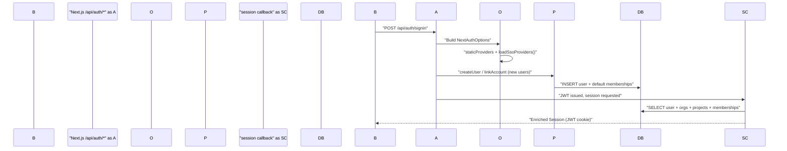
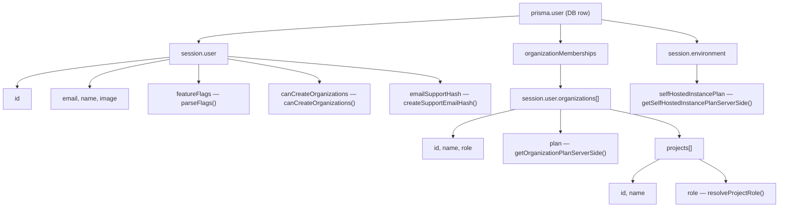

# Authentication System

Relevant source files

The following files were used as context for generating this wiki page:

- [.env.dev-azure.example](.env.dev-azure.example)
- [.env.dev.example](.env.dev.example)
- [.env.prod.example](.env.prod.example)
- [packages/shared/src/server/auth/jumpcloudProvider.ts](packages/shared/src/server/auth/jumpcloudProvider.ts)
- [web/src/components/layouts/app-layout/utils/pathClassification.ts](web/src/components/layouts/app-layout/utils/pathClassification.ts)
- [web/src/ee/features/multi-tenant-sso/types.ts](web/src/ee/features/multi-tenant-sso/types.ts)
- [web/src/ee/features/multi-tenant-sso/utils.ts](web/src/ee/features/multi-tenant-sso/utils.ts)
- [web/src/env.mjs](web/src/env.mjs)
- [web/src/features/auth-credentials/components/ResetPasswordButton.tsx](web/src/features/auth-credentials/components/ResetPasswordButton.tsx)
- [web/src/features/auth-credentials/components/ResetPasswordPage.tsx](web/src/features/auth-credentials/components/ResetPasswordPage.tsx)
- [web/src/features/auth-credentials/lib/credentialsUtils.ts](web/src/features/auth-credentials/lib/credentialsUtils.ts)
- [web/src/features/auth-credentials/server/signupApiHandler.ts](web/src/features/auth-credentials/server/signupApiHandler.ts)
- [web/src/features/auth/lib/createProjectMembershipsOnSignup.ts](web/src/features/auth/lib/createProjectMembershipsOnSignup.ts)
- [web/src/features/posthog-analytics/ServerPosthog.ts](web/src/features/posthog-analytics/ServerPosthog.ts)
- [web/src/features/posthog-analytics/usePostHogClientCapture.ts](web/src/features/posthog-analytics/usePostHogClientCapture.ts)
- [web/src/features/rbac/components/CreateProjectMemberButton.tsx](web/src/features/rbac/components/CreateProjectMemberButton.tsx)
- [web/src/initialize.ts](web/src/initialize.ts)
- [web/src/pages/api/auth/signup-verify.ts](web/src/pages/api/auth/signup-verify.ts)
- [web/src/pages/auth/setup-password.tsx](web/src/pages/auth/setup-password.tsx)
- [web/src/pages/auth/sign-in.tsx](web/src/pages/auth/sign-in.tsx)
- [web/src/pages/auth/sign-up.tsx](web/src/pages/auth/sign-up.tsx)
- [web/src/server/auth.ts](web/src/server/auth.ts)
- [web/types/next-auth.d.ts](web/types/next-auth.d.ts)

This page documents the web application's authentication layer: how NextAuth.js is configured, which providers are supported, how the Prisma adapter is extended, and how the session is enriched with organization and project membership data. It also covers the sign-in and sign-up UI pages.

For API key authentication (used by the public REST API), see [API Key Management](#4.3). For multi-tenant SSO configuration management, see [Multi-tenant SSO](#4.2). For role-based access control enforcement, see [RBAC & Permissions](#4.4).

---

## Overview

Authentication is implemented with **NextAuth.js** and is configured entirely in `web/src/server/auth.ts`. The configuration is produced by the async function `getAuthOptions`, which merges a static list of providers with providers loaded dynamically from the database at request time.

Sessions use the **JWT strategy** and are validated against the database on every request to the session callback. The session object is augmented with the user's full organization and project membership tree, making RBAC data available everywhere in the application without additional queries.

**Authentication Flow Summary:**

Title: Authentication Sequence

Sources: [web/src/server/auth.ts:654-660](), [web/src/server/auth.ts:500-633]()

---

## `getAuthOptions` and Provider Loading

`getAuthOptions` is an async factory that is called on each NextAuth route request. It:

1. Calls `loadSsoProviders()` to fetch enterprise SSO providers stored in the database [web/src/ee/features/multi-tenant-sso/utils.ts:103-116]().
2. Concatenates them with the module-level `staticProviders` array [web/src/server/auth.ts:646-648]().
3. Returns the full `NextAuthOptions` object.

**Provider Architecture:**

Title: Provider Resolution Architecture

```mermaid
flowchart TD
    getAuthOptions["getAuthOptions()"] --> staticProviders["staticProviders (module-level array)"]
    getAuthOptions --> loadSsoProviders["loadSsoProviders() — from DB via getSsoConfigs()"]

    staticProviders --> CP["CredentialsProvider (email/password)"]
    staticProviders --> EP["EmailProvider (SMTP password reset)"]
    staticProviders --> GP["GoogleProvider"]
    staticProviders --> GHP["GitHubProvider"]
    staticProviders --> GHEP["GitHubEnterpriseProvider"]
    staticProviders --> GLP["GitLabProvider"]
    staticProviders --> AP["AzureADProvider"]
    staticProviders --> OP["OktaProvider"]
    staticProviders --> A0P["Auth0Provider"]
    staticProviders --> COGP["CognitoProvider"]
    staticProviders --> KP["KeycloakProvider"]
    staticProviders --> AUP["AuthentikProvider"]
    staticProviders --> OLP["OneLoginProvider"]
    staticProviders --> JCP["JumpCloudProvider"]
    staticProviders --> WOP["WorkOSProvider"]
    staticProviders --> WPP["WordPressProvider"]
    staticProviders --> CSSO["CustomSSOProvider"]

    loadSsoProviders --> dbToNextAuthProvider["dbToNextAuthProvider() per SsoConfig row"]
    dbToNextAuthProvider --> dynProv["Dynamic provider — id format: getAuthProviderIdForSsoConfig(provider)"]
```

Sources: [web/src/server/auth.ts:88-648](), [web/src/ee/features/multi-tenant-sso/utils.ts:103-116]()

### Static Providers

All static providers are conditionally added to the `staticProviders` array based on whether the corresponding environment variables are set in `env.mjs`.

| Provider | Env Vars Required | Notes |
|---|---|---|
| `CredentialsProvider` | _(always present)_ | Disabled by `AUTH_DISABLE_USERNAME_PASSWORD=true` [web/src/server/auth.ts:102-105]() |
| `EmailProvider` | `SMTP_CONNECTION_URL`, `EMAIL_FROM_ADDRESS` | Used for password-reset OTP flow; 3-minute token TTL [web/src/server/auth.ts:163-175]() |
| `GoogleProvider` | `AUTH_GOOGLE_CLIENT_ID`, `AUTH_GOOGLE_CLIENT_SECRET` | Optional domain allowlist via `AUTH_GOOGLE_ALLOWED_DOMAINS` [web/src/env.mjs:113-115]() |
| `GitHubProvider` | `AUTH_GITHUB_CLIENT_ID`, `AUTH_GITHUB_CLIENT_SECRET` | [web/src/env.mjs:120-121]() |
| `GitHubEnterpriseProvider` | `AUTH_GITHUB_ENTERPRISE_CLIENT_ID`, `AUTH_GITHUB_ENTERPRISE_CLIENT_SECRET`, `AUTH_GITHUB_ENTERPRISE_BASE_URL` | [web/src/env.mjs:125-127]() |
| `GitLabProvider` | `AUTH_GITLAB_CLIENT_ID`, `AUTH_GITLAB_CLIENT_SECRET` | Self-hosted via `AUTH_GITLAB_URL` [web/src/env.mjs:133-140]() |
| `AzureADProvider` | `AUTH_AZURE_AD_CLIENT_ID`, `AUTH_AZURE_AD_CLIENT_SECRET`, `AUTH_AZURE_AD_TENANT_ID` | [web/src/env.mjs:141-143]() |
| `OktaProvider` | `AUTH_OKTA_CLIENT_ID`, `AUTH_OKTA_CLIENT_SECRET`, `AUTH_OKTA_ISSUER` | [web/src/env.mjs:148-150]() |
| `Auth0Provider` | `AUTH_AUTH0_CLIENT_ID`, `AUTH_AUTH0_CLIENT_SECRET`, `AUTH_AUTH0_ISSUER` | [web/src/env.mjs:176-178]() |
| `CognitoProvider` | `AUTH_COGNITO_CLIENT_ID`, `AUTH_COGNITO_CLIENT_SECRET`, `AUTH_COGNITO_ISSUER` | [web/src/env.mjs:186-188]() |
| `KeycloakProvider` | `AUTH_KEYCLOAK_CLIENT_ID`, `AUTH_KEYCLOAK_CLIENT_SECRET`, `AUTH_KEYCLOAK_ISSUER` | Custom display name via `AUTH_KEYCLOAK_NAME` [web/src/env.mjs:195-202]() |
| `AuthentikProvider` | `AUTH_AUTHENTIK_CLIENT_ID`, `AUTH_AUTHENTIK_CLIENT_SECRET`, `AUTH_AUTHENTIK_ISSUER` | [web/src/env.mjs:155-163]() |
| `OneLoginProvider` | `AUTH_ONELOGIN_CLIENT_ID`, `AUTH_ONELOGIN_CLIENT_SECRET`, `AUTH_ONELOGIN_ISSUER` | [web/src/env.mjs:169-171]() |
| `JumpCloudProvider` | `AUTH_JUMPCLOUD_CLIENT_ID`, `AUTH_JUMPCLOUD_CLIENT_SECRET`, `AUTH_JUMPCLOUD_ISSUER` | [web/src/env.mjs:223-225]() |
| `WorkOSProvider` | `AUTH_WORKOS_CLIENT_ID`, `AUTH_WORKOS_CLIENT_SECRET` | [web/src/env.mjs:212-213]() |
| `WordPressProvider` | `AUTH_WORDPRESS_CLIENT_ID`, `AUTH_WORDPRESS_CLIENT_SECRET` | [web/src/env.mjs:235-236]() |
| `CustomSSOProvider` | `AUTH_CUSTOM_CLIENT_ID`, `AUTH_CUSTOM_CLIENT_SECRET`, `AUTH_CUSTOM_ISSUER`, `AUTH_CUSTOM_NAME` | [web/src/env.mjs:241-244]() |

Sources: [web/src/server/auth.ts:88-648](), [web/src/env.mjs:113-244]()

### Dynamic SSO Providers

Enterprise multi-tenant SSO providers are stored in the `SsoConfig` Prisma table and loaded at runtime by `loadSsoProviders()` [web/src/ee/features/multi-tenant-sso/utils.ts:103-116](). These are converted to NextAuth `Provider` instances by `dbToNextAuthProvider()` [web/src/ee/features/multi-tenant-sso/utils.ts:196-201](). Their provider IDs are domain-specific to handle multiple organizations using the same provider type.

The SSO config list is cached in memory for 10 minutes (or 1 minute on fetch failure) via the module-level `cachedSsoConfigs` variable [web/src/ee/features/multi-tenant-sso/utils.ts:26-95]().

---

## Extended Prisma Adapter

The standard `PrismaAdapter` is wrapped and extended into `extendedPrismaAdapter` at [web/src/server/auth.ts:500-633](). Three methods are overridden:

### `createUser`

Called when a new user signs up via an OAuth provider for the first time.

- Checks `AUTH_DISABLE_SIGNUP` — throws if `true` [web/src/server/auth.ts:510-514]().
- Requires a non-null email on the profile [web/src/server/auth.ts:516]().
- Delegates to the base `prismaAdapter.createUser` [web/src/server/auth.ts:519]().
- Calls `createProjectMembershipsOnSignup(user)` to assign default org/project memberships configured via `LANGFUSE_DEFAULT_ORG_ID` / `LANGFUSE_DEFAULT_PROJECT_ID` [web/src/server/auth.ts:522]().

### `linkAccount`

Called when an existing user links an OAuth account (e.g., first sign-in via SSO on an existing email-only account).

- Strips incompatible fields from Keycloak payloads (`refresh_expires_in`, `not-before-policy`) [web/src/server/auth.ts:543-547]().
- Strips `profile` from WorkOS payloads [web/src/server/auth.ts:548]().
- Strips any fields listed in `AUTH_IGNORE_ACCOUNT_FIELDS` [web/src/server/auth.ts:553-559]().
- Calls `createProjectMembershipsOnSignup` — this is idempotent and ensures SSO users also get default memberships [web/src/server/auth.ts:566]().

### `useVerificationToken`

Used by the `EmailProvider` for OTP-based password reset.

- On success: logs the event and returns the token [web/src/server/auth.ts:586-590]().
- On failure or missing token: deletes all tokens for the identifier (anti-enumeration measure) and returns `null` [web/src/server/auth.ts:592-598]().

Sources: [web/src/server/auth.ts:500-633]()

---

## NextAuth Callbacks

### `session` Callback

**Called on every session access**. This re-fetches the user from the database to expand the stateless JWT into a rich `Session` object.

**Database query fields:**
The query retrieves the user along with their full organization membership hierarchy, including associated projects and project memberships [web/src/server/auth.ts:661-683]().

**Session enrichment diagram:**

Title: Session Object Construction

The project role for each project is computed by `resolveProjectRole()`, which considers both the project-level `ProjectMembership` and the organization-level role [web/src/server/auth.ts:756-764]().

Sources: [web/src/server/auth.ts:656-782](), [web/types/next-auth.d.ts:18-68]()

### `signIn` Callback

**Called on every sign-in attempt**, before the session is created.

Validation steps in order:
1. **Email presence** — throws if `user.email` is missing [web/src/server/auth.ts:786]().
2. **Multi-tenant SSO enforcement** — calls `getSsoAuthProviderIdForDomain(userDomain)`. If a domain-specific SSO provider is configured *and* the user is signing in with a different provider, the sign-in is blocked [web/src/server/auth.ts:805-812]().
3. **Google domain allowlist** — if `AUTH_GOOGLE_ALLOWED_DOMAINS` is set and the provider is `google`, the user's email domain must be in the allowlist [web/src/server/auth.ts:835-847]().

Sources: [web/src/server/auth.ts:783-850]()

---

## Sign-In and Sign-Up UI

**Files:** `web/src/pages/auth/sign-in.tsx`, `web/src/pages/auth/sign-up.tsx`

### `getServerSideProps`

Builds the `PageProps` object by inspecting environment variables and database configuration:
- `authProviders` — a map indicating which providers are active based on environment variable presence [web/src/pages/auth/sign-in.tsx:103-176]().
- `sso` — `true` if any enterprise SSO is configured in the database via `isAnySsoConfigured()` [web/src/pages/auth/sign-in.tsx:100]().
- `signUpDisabled` — `true` if `AUTH_DISABLE_SIGNUP=true` [web/src/pages/auth/sign-in.tsx:177]().

### Two-Step Login/Signup Flow

Both sign-in and sign-up implement a two-step flow when SSO is enabled:
1. User enters email.
2. The application checks for a domain-specific SSO provider via the `/api/auth/check-sso` endpoint [web/src/pages/auth/sign-up.tsx:148-155]().
3. If an enterprise SSO provider is found, the user is redirected immediately to the identity provider via `signIn(providerId)` [web/src/pages/auth/sign-up.tsx:165]().
4. If no SSO is found, the UI reveals the password field for credential-based login or signup [web/src/pages/auth/sign-up.tsx:170]().

Sources: [web/src/pages/auth/sign-in.tsx:99-185](), [web/src/pages/auth/sign-up.tsx:77-190]()

---

## Password Management

### Password Reset Flow
Langfuse uses the `EmailProvider` for password resets if `SMTP_CONNECTION_URL` is configured [web/src/server/auth.ts:163-175](). Users receive a 6-digit OTP to verify their email before they can set a new password on the `ResetPasswordPage`.

### Signup Verification
When email verification is required, Langfuse uses a "Verified Signup Flow" [web/src/pages/auth/sign-up.tsx:60-67](). This flow creates a user record without a password first. The user then sets their password via the `setup-password` page or reset flow.

Sources: [web/src/pages/auth/sign-up.tsx:60-75](), [web/src/server/auth.ts:163-175]()

---

## Key Environment Variables

| Variable | Purpose | Default |
|---|---|---|
| `NEXTAUTH_SECRET` | JWT signing secret | Required in production [web/src/env.mjs:49-52]() |
| `NEXTAUTH_URL` | Base URL for NextAuth callbacks | Required [web/src/env.mjs:54-63]() |
| `SALT` | Salt used for hashing API keys | Required [web/src/env.mjs:70-75]() |
| `AUTH_DISABLE_USERNAME_PASSWORD` | Disable credentials provider | — [web/src/env.mjs:275]() |
| `AUTH_DISABLE_SIGNUP` | Prevent new user registration | — [web/src/env.mjs:276]() |
| `LANGFUSE_DEFAULT_ORG_ID` | Org(s) to auto-add new users to | — [web/src/env.mjs:78-88]() |
| `LANGFUSE_DEFAULT_PROJECT_ID` | Project(s) to auto-add new users to | — [web/src/env.mjs:92-102]() |

Sources: [web/src/env.mjs:40-276](), [.env.prod.example:15-152]()
