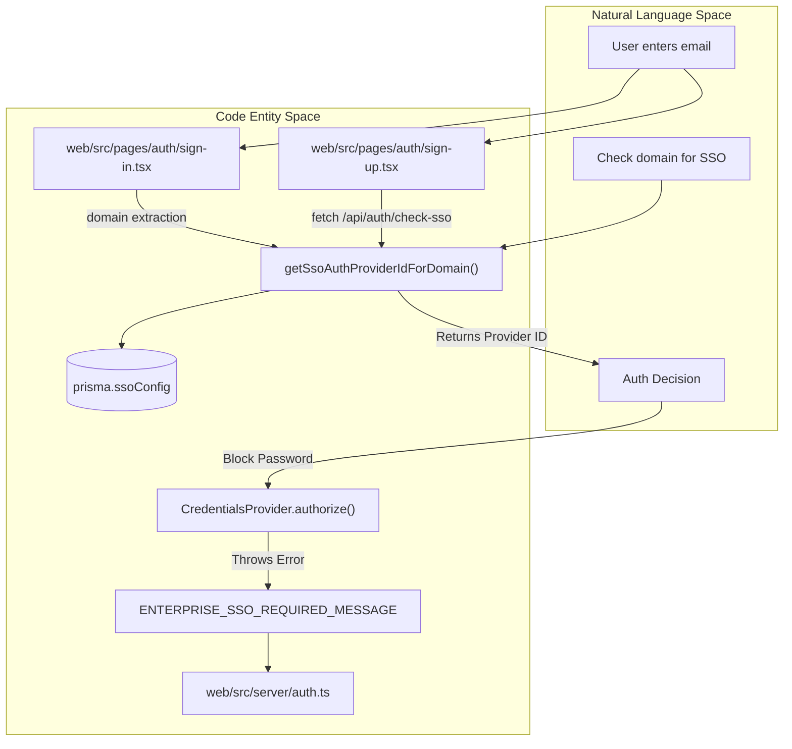
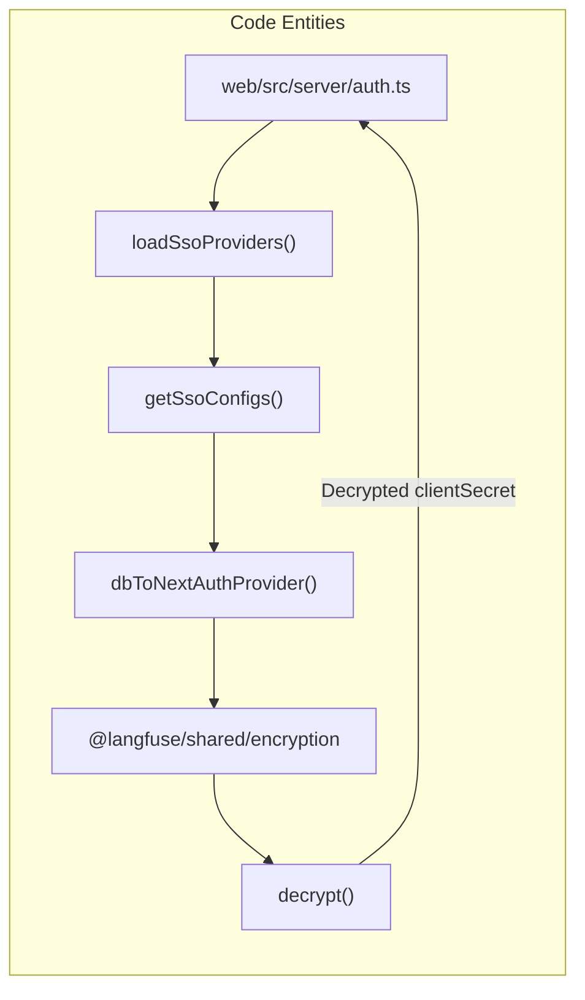

# Multi-tenant SSO

<details>
<summary>Relevant source files</summary>

The following files were used as context for generating this wiki page:

- [.env.dev-azure.example](.env.dev-azure.example)
- [.env.dev.example](.env.dev.example)
- [.env.prod.example](.env.prod.example)
- [packages/shared/prisma/migrations/20260506144028_add_verified_domains/migration.sql](packages/shared/prisma/migrations/20260506144028_add_verified_domains/migration.sql)
- [packages/shared/prisma/migrations/20260507120000_share_pending_verified_domains/migration.sql](packages/shared/prisma/migrations/20260507120000_share_pending_verified_domains/migration.sql)
- [packages/shared/src/server/auth/jumpcloudProvider.ts](packages/shared/src/server/auth/jumpcloudProvider.ts)
- [web/src/__tests__/server/ssoConfigRouter.servertest.ts](web/src/__tests__/server/ssoConfigRouter.servertest.ts)
- [web/src/__tests__/server/verifiedDomainRouter.servertest.ts](web/src/__tests__/server/verifiedDomainRouter.servertest.ts)
- [web/src/components/layouts/app-layout/utils/pathClassification.ts](web/src/components/layouts/app-layout/utils/pathClassification.ts)
- [web/src/ee/features/multi-tenant-sso/createNewSsoConfigHandler.ts](web/src/ee/features/multi-tenant-sso/createNewSsoConfigHandler.ts)
- [web/src/ee/features/multi-tenant-sso/server/ssoConfigRouter.ts](web/src/ee/features/multi-tenant-sso/server/ssoConfigRouter.ts)
- [web/src/ee/features/multi-tenant-sso/types.ts](web/src/ee/features/multi-tenant-sso/types.ts)
- [web/src/ee/features/multi-tenant-sso/utils.ts](web/src/ee/features/multi-tenant-sso/utils.ts)
- [web/src/ee/features/multi-tenant-sso/validateSsoConfig.ts](web/src/ee/features/multi-tenant-sso/validateSsoConfig.ts)
- [web/src/ee/features/sso-settings/components/SSOSettings.tsx](web/src/ee/features/sso-settings/components/SSOSettings.tsx)
- [web/src/ee/features/verified-domains/components/VerifiedDomainsSettings.tsx](web/src/ee/features/verified-domains/components/VerifiedDomainsSettings.tsx)
- [web/src/env.mjs](web/src/env.mjs)
- [web/src/features/auth-credentials/components/ResetPasswordButton.tsx](web/src/features/auth-credentials/components/ResetPasswordButton.tsx)
- [web/src/features/auth-credentials/components/ResetPasswordPage.tsx](web/src/features/auth-credentials/components/ResetPasswordPage.tsx)
- [web/src/features/auth-credentials/lib/credentialsUtils.ts](web/src/features/auth-credentials/lib/credentialsUtils.ts)
- [web/src/features/auth-credentials/server/signupApiHandler.ts](web/src/features/auth-credentials/server/signupApiHandler.ts)
- [web/src/features/posthog-analytics/usePostHogClientCapture.ts](web/src/features/posthog-analytics/usePostHogClientCapture.ts)
- [web/src/pages/api/auth/signup-verify.ts](web/src/pages/api/auth/signup-verify.ts)
- [web/src/pages/auth/setup-password.tsx](web/src/pages/auth/setup-password.tsx)
- [web/src/pages/auth/sign-in.tsx](web/src/pages/auth/sign-in.tsx)
- [web/src/pages/auth/sign-up.tsx](web/src/pages/auth/sign-up.tsx)
- [web/src/server/auth.ts](web/src/server/auth.ts)
- [web/types/next-auth.d.ts](web/types/next-auth.d.ts)

</details>


## Purpose and Scope

This page documents Langfuse's multi-tenant Single Sign-On (SSO) system, which allows organizations to configure domain-specific SSO providers that are dynamically detected and enforced at authentication time. This enables each organization to use their own identity provider (e.g., Okta, Azure AD, Keycloak) based on their email domain, without requiring global environment variables or application restarts.

For information about the general authentication system including NextAuth.js configuration and static SSO providers, see [Authentication System (4.1)](4.1). For details about role-based access control after authentication, see [RBAC & Permissions (4.4)](4.4).

---

## System Overview

The multi-tenant SSO system enables domain-based SSO routing. When a user enters their email address during sign-in or sign-up, the system:

1.  **Detection**: Extracts the email domain (e.g., `example.com`) and queries the `SsoConfig` table [web/src/ee/features/multi-tenant-sso/utils.ts:133-143]().
2.  **Routing**: If a configuration exists, it redirects the user to the organization-specific SSO provider using a unique `providerId` derived from the domain [web/src/ee/features/multi-tenant-sso/utils.ts:259-262]().
3.  **Enforcement**: Blocks password-based login for that domain to ensure compliance with organization security policies [web/src/server/auth.ts:117-121]().
4.  **Credential Management**: Stores OAuth credentials per-organization, encrypted at rest using a system-wide `ENCRYPTION_KEY` [web/src/ee/features/multi-tenant-sso/utils.ts:204]().

This functionality is gated by the enterprise edition license check in `multiTenantSsoAvailable` [web/src/ee/features/multi-tenant-sso/utils.ts:13]().

**Sources:** [web/src/ee/features/multi-tenant-sso/utils.ts:13-45](), [web/src/server/auth.ts:41-45](), [web/src/ee/features/multi-tenant-sso/utils.ts:133-143]()

---

## Architecture Diagram

### Sign-in Flow and SSO Detection



**Sources:** [web/src/server/auth.ts:117-121](), [web/src/ee/features/multi-tenant-sso/utils.ts:133-143](), [web/src/pages/auth/sign-in.tsx:99-185](), [web/src/pages/auth/sign-up.tsx:145-166]()

---

## Database Schema: SsoConfig Table

The `SsoConfig` table stores domain-specific SSO configurations in PostgreSQL. Each record associates an email domain with an SSO provider and its encrypted credentials.

| Field | Type | Description |
| :--- | :--- | :--- |
| `domain` | `string` | Email domain (lowercase), primary key [web/src/ee/features/multi-tenant-sso/types.ts:4-7](). |
| `authProvider` | `enum` | One of supported provider types (e.g., `google`, `okta`, `azure-ad`). |
| `authConfig` | `JSON` | Encrypted provider-specific configuration containing `clientId` and `clientSecret`. |

When `authConfig` is populated, it contains domain-specific OAuth credentials that override global environment variables defined in `env.mjs`.

**Sources:** [web/src/ee/features/multi-tenant-sso/utils.ts:14-16](), [web/src/ee/features/multi-tenant-sso/types.ts:3-7](), [web/src/env.mjs:113-182]()

---

## Supported SSO Provider Types

The system supports a wide array of SSO providers, each with a specific configuration schema defined in `SsoProviderSchema` using Zod discriminated unions in `web/src/ee/features/multi-tenant-sso/types.ts`.

| Provider | Type Literal | Required Config Fields |
| :--- | :--- | :--- |
| Google | `"google"` | `clientId`, `clientSecret` [web/src/ee/features/multi-tenant-sso/types.ts:49-60]() |
| GitHub | `"github"` | `clientId`, `clientSecret` [web/src/ee/features/multi-tenant-sso/types.ts:62-72]() |
| GitHub Enterprise | `"github-enterprise"` | `clientId`, `clientSecret`, `enterprise.baseUrl` [web/src/ee/features/multi-tenant-sso/types.ts:74-91]() |
| GitLab | `"gitlab"` | `clientId`, `clientSecret`, optional `issuer` [web/src/ee/features/multi-tenant-sso/types.ts:93-105]() |
| Azure AD | `"azure-ad"` | `clientId`, `clientSecret`, `tenantId` [web/src/ee/features/multi-tenant-sso/types.ts:166-184]() |
| Okta | `"okta"` | `clientId`, `clientSecret`, `issuer` [web/src/ee/features/multi-tenant-sso/types.ts:121-133]() |
| Authentik | `"authentik"` | `clientId`, `clientSecret`, `issuer` (regex validated) [web/src/ee/features/multi-tenant-sso/types.ts:135-150]() |
| OneLogin | `"onelogin"` | `clientId`, `clientSecret`, `issuer` [web/src/ee/features/multi-tenant-sso/types.ts:152-164]() |
| Auth0 | `"auth0"` | `clientId`, `clientSecret`, `issuer` [web/src/ee/features/multi-tenant-sso/types.ts:107-119]() |
| Cognito | `"cognito"` | `clientId`, `clientSecret`, `issuer` [web/src/ee/features/multi-tenant-sso/types.ts:186-198]() |
| Keycloak | `"keycloak"` | `clientId`, `clientSecret`, `issuer`, optional `name` [web/src/ee/features/multi-tenant-sso/types.ts:200-213]() |
| Custom OIDC | `"custom"` | `clientId`, `clientSecret`, `issuer`, `name` [web/src/ee/features/multi-tenant-sso/types.ts:215-226]() |

**Sources:** [web/src/ee/features/multi-tenant-sso/types.ts:49-226](), [web/src/ee/features/multi-tenant-sso/utils.ts:196-256]()

---

## Dynamic Provider Loading System

### Provider Loading at Startup



The system loads custom SSO providers dynamically through the `loadSsoProviders()` function called during NextAuth initialization in `auth.ts` [web/src/server/auth.ts:41-45]():

1.  **Fetch configurations**: `getSsoConfigs()` queries the `SsoConfig` table with caching [web/src/ee/features/multi-tenant-sso/utils.ts:39-96]().
2.  **Parse and validate**: Each record is validated against `SsoProviderSchema` using Zod [web/src/ee/features/multi-tenant-sso/utils.ts:71-86]().
3.  **Transform to NextAuth providers**: `dbToNextAuthProvider()` converts database configs to NextAuth `Provider` instances. It uses domain-specific IDs for the providers to ensure correct routing [web/src/ee/features/multi-tenant-sso/utils.ts:196-256]().
4.  **Decrypt credentials**: Client secrets are decrypted using `decrypt()` from `@langfuse/shared/encryption` [web/src/ee/features/multi-tenant-sso/utils.ts:15-15](), [web/src/ee/features/multi-tenant-sso/utils.ts:204]().

### Configuration Caching

The caching strategy in `getSsoConfigs()` optimizes performance:

*   **Cache TTL**: 10 minutes for successful fetches [web/src/ee/features/multi-tenant-sso/utils.ts:42]().
*   **Failure retry**: 1 minute for failed fetches [web/src/ee/features/multi-tenant-sso/utils.ts:43]().
*   **Database timeout**: 2-second max wait and 3-second timeout via Prisma `$transaction` to prevent hanging authentication processes [web/src/ee/features/multi-tenant-sso/utils.ts:56-62]().

**Sources:** [web/src/ee/features/multi-tenant-sso/utils.ts:39-96](), [web/src/server/auth.ts:41-45]()

---

## SSO Enforcement and Detection

### Domain-based Blocking

The `CredentialsProvider` in `auth.ts` actively blocks password authentication for SSO-enforced domains. If a matching configuration is found for the domain via `getSsoAuthProviderIdForDomain(domain)`, it throws an error to force the user to use the enterprise identity provider [web/src/server/auth.ts:117-121]().

```typescript
// web/src/server/auth.ts:117-121
const multiTenantSsoProvider =
  await getSsoAuthProviderIdForDomain(domain);
if (multiTenantSsoProvider) {
  throw new Error(ENTERPRISE_SSO_REQUIRED_MESSAGE);
}
```

### Sign-up Flow Integration

In `sign-up.tsx`, a two-step flow is implemented. When a user enters their email, the client calls `/api/auth/check-sso` to detect if an enterprise SSO is configured for that domain. If found, it automatically redirects the user to the SSO provider [web/src/pages/auth/sign-up.tsx:145-166]().

**Sources:** [web/src/server/auth.ts:117-121](), [web/src/pages/auth/sign-up.tsx:145-166](), [web/src/ee/features/multi-tenant-sso/utils.ts:133-143]()

---

## Credential Encryption and Management

### Encryption Logic
SSO provider credentials (specifically OAuth `clientSecret`) are encrypted before storage to protect sensitive organization data.

*   **Encryption Key**: The `ENCRYPTION_KEY` environment variable must be a 64-character hex string (256-bit). This key is shared across the web and worker services for consistent decryption [.env.prod.example:26](), [.env.dev.example:131]().
*   **Implementation**:
    *   **Retrieval**: Decryption occurs in `dbToNextAuthProvider` using `decrypt(provider.authConfig.clientSecret)` from the shared encryption package [web/src/ee/features/multi-tenant-sso/utils.ts:204](), [web/src/ee/features/multi-tenant-sso/utils.ts:212]().

### Verified Domains
Organizations can verify their ownership of a domain to enforce SSO across all users with that email domain.
*   **Enforcement**: Once a domain is verified, Langfuse can enforce that all users from that domain must sign in via the configured SSO provider, disabling standard email/password login for those accounts [web/src/features/auth-credentials/server/signupApiHandler.ts:46-49]().
*   **Global Enforcement**: Administrators can also use `AUTH_DOMAINS_WITH_SSO_ENFORCEMENT` in environment variables to globally block password login for specific domains [web/src/features/auth-credentials/server/signupApiHandler.ts:10-16]().

**Sources:** [web/src/ee/features/multi-tenant-sso/utils.ts:184-212](), [.env.prod.example:26](), [web/src/features/auth-credentials/server/signupApiHandler.ts:10-49]()
