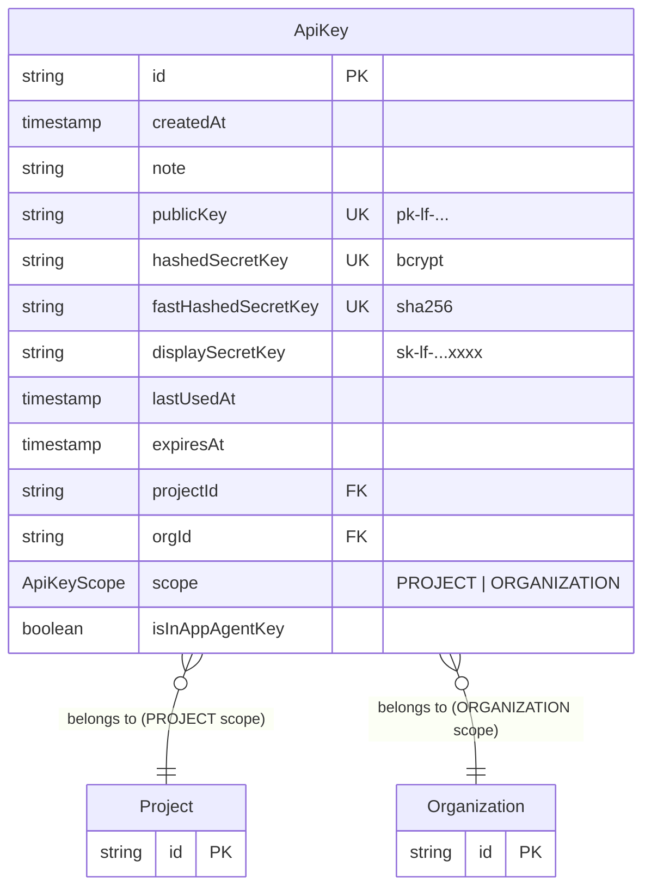
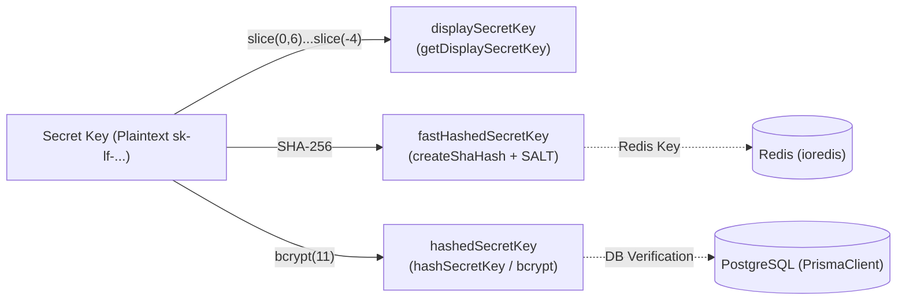
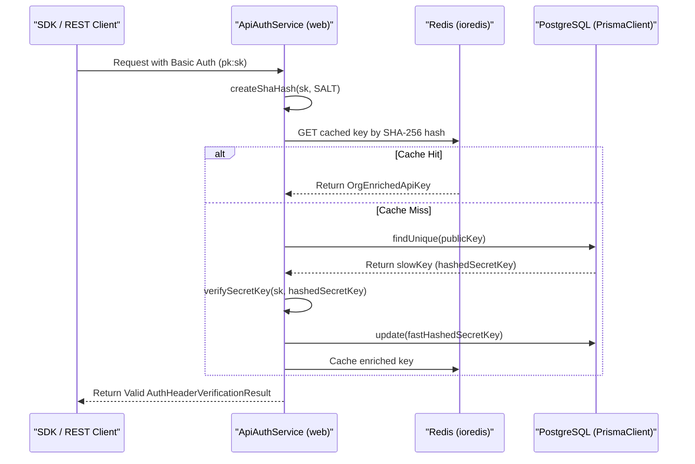

# API Key Management

<details>
<summary>Relevant source files</summary>

The following files were used as context for generating this wiki page:

- [fern/apis/server/definition/projects.yml](fern/apis/server/definition/projects.yml)
- [packages/shared/prisma/migrations/20250711134738_add_patch_llm_tool_schema_audit_logs_background_migration/migration.sql](packages/shared/prisma/migrations/20250711134738_add_patch_llm_tool_schema_audit_logs_background_migration/migration.sql)
- [packages/shared/src/server/auth/types.ts](packages/shared/src/server/auth/types.ts)
- [packages/shared/src/server/headerPropagation.ts](packages/shared/src/server/headerPropagation.ts)
- [packages/shared/src/server/instrumentation/index.ts](packages/shared/src/server/instrumentation/index.ts)
- [web/src/__tests__/server/projects-api.servertest.ts](web/src/__tests__/server/projects-api.servertest.ts)
- [web/src/__tests__/server/unit/api-auth-span.servertest.ts](web/src/__tests__/server/unit/api-auth-span.servertest.ts)
- [web/src/__tests__/server/unit/langfuse-context-propagation.servertest.ts](web/src/__tests__/server/unit/langfuse-context-propagation.servertest.ts)
- [web/src/components/JSONSchemaEditor.tsx](web/src/components/JSONSchemaEditor.tsx)
- [web/src/components/SettingsDangerZone.tsx](web/src/components/SettingsDangerZone.tsx)
- [web/src/components/layouts/header.tsx](web/src/components/layouts/header.tsx)
- [web/src/ee/features/admin-api/server/projects.ts](web/src/ee/features/admin-api/server/projects.ts)
- [web/src/ee/features/admin-api/server/projects/createProject.ts](web/src/ee/features/admin-api/server/projects/createProject.ts)
- [web/src/ee/features/admin-api/server/projects/projectById/index.ts](web/src/ee/features/admin-api/server/projects/projectById/index.ts)
- [web/src/features/llm-schemas/server/router.ts](web/src/features/llm-schemas/server/router.ts)
- [web/src/features/llm-tools/server/router.ts](web/src/features/llm-tools/server/router.ts)
- [web/src/features/organizations/components/DeleteOrganizationButton.tsx](web/src/features/organizations/components/DeleteOrganizationButton.tsx)
- [web/src/features/organizations/components/RenameOrganization.tsx](web/src/features/organizations/components/RenameOrganization.tsx)
- [web/src/features/projects/components/DeleteProjectButton.tsx](web/src/features/projects/components/DeleteProjectButton.tsx)
- [web/src/features/projects/components/HostNameProject.tsx](web/src/features/projects/components/HostNameProject.tsx)
- [web/src/features/projects/components/RenameProject.tsx](web/src/features/projects/components/RenameProject.tsx)
- [web/src/features/projects/components/TransferProjectButton.tsx](web/src/features/projects/components/TransferProjectButton.tsx)
- [web/src/features/public-api/components/ApiKeyList.tsx](web/src/features/public-api/components/ApiKeyList.tsx)
- [web/src/features/public-api/components/CreateApiKeyButton.tsx](web/src/features/public-api/components/CreateApiKeyButton.tsx)
- [web/src/features/public-api/hooks/useLangfuseEnvCode.ts](web/src/features/public-api/hooks/useLangfuseEnvCode.ts)
- [web/src/features/public-api/server/apiAuth.ts](web/src/features/public-api/server/apiAuth.ts)
- [web/src/features/public-api/server/createAuthedProjectAPIRoute.ts](web/src/features/public-api/server/createAuthedProjectAPIRoute.ts)
- [web/src/pages/api/public/ingestion.ts](web/src/pages/api/public/ingestion.ts)
- [web/src/pages/api/public/projects/[projectId]/index.ts](web/src/pages/api/public/projects/[projectId]/index.ts)
- [web/src/pages/api/public/projects/index.ts](web/src/pages/api/public/projects/index.ts)
- [worker/src/__tests__/patchLLMToolAndLLLMSchemaAuditLogs.test.ts](worker/src/__tests__/patchLLMToolAndLLLMSchemaAuditLogs.test.ts)
- [worker/src/backgroundMigrations/patchLLMToolAndLLLMSchemaAuditLogs.ts](worker/src/backgroundMigrations/patchLLMToolAndLLLMSchemaAuditLogs.ts)

</details>


## Purpose and Scope

This document describes the API key management system used for programmatic authentication in Langfuse. API keys provide an alternative to session-based authentication and enable SDK and REST API access.

API keys in Langfuse have two distinct scopes: **project-level** (`PROJECT`) for accessing data within a specific project, and **organization-level** (`ORGANIZATION`) for administrative operations across an organization. Each key pair consists of a public key (visible) and a secret key (hashed and stored securely).

Sources: [packages/shared/src/server/auth/types.ts:22-31]()

---

## API Key Data Model

### Database Schema

The `ApiKey` table in PostgreSQL (managed via Prisma) stores all API key metadata and credentials.



**Key Fields:**

| Field | Type | Purpose |
|-------|------|---------|
| `publicKey` | string (unique) | Client-visible identifier, used as username in Basic Auth. [packages/shared/src/server/auth/types.ts:9-9]() |
| `hashedSecretKey` | string (unique) | Slow hash (bcrypt) for verification, used on cache misses. [packages/shared/src/server/auth/types.ts:15-15]() |
| `fastHashedSecretKey` | string (unique) | Fast hash (SHA-256) for Redis cache lookups. [packages/shared/src/server/auth/types.ts:14-14]() |
| `displaySecretKey` | string | Partial key shown in UI (e.g., `sk-lf-...abc123`). [packages/shared/src/server/auth/types.ts:10-10]() |
| `scope` | `ApiKeyScope` | Enum: `PROJECT` or `ORGANIZATION`. [packages/shared/src/server/auth/types.ts:25-31]() |
| `projectId` | string | Required for `PROJECT` scope; null for `ORGANIZATION`. [packages/shared/src/server/auth/types.ts:26-30]() |
| `isInAppAgentKey` | boolean | Flag for specialized internal agent access. [packages/shared/src/server/auth/types.ts:20-20]() |

Sources: [web/src/features/public-api/server/apiAuth.ts:16-21](), [packages/shared/src/server/auth/types.ts:7-32]()

---

## API Key Security

### Triple-Hash Strategy

Langfuse employs a three-tier hashing strategy for API key security to balance performance and safety.



### Security Components

| Component | Logic | Purpose |
|-----------|-----------|---------|
| `SALT` | `env.SALT` | Mixed with secret keys before SHA-256 hashing to prevent rainbow table attacks. [web/src/features/public-api/server/apiAuth.ts:111-112]() |
| `fastHashedSecretKey` | `createShaHash(secretKey, salt)` | Used for fast lookups in Redis. The system trusts this hash if found in the cache. [web/src/features/public-api/server/apiAuth.ts:112-117]() |
| `hashedSecretKey` | `bcrypt.hash(key, 11)` | Secure verification used during the "Slow Path" (cache miss). [web/src/features/public-api/server/apiAuth.ts:144-147]() |
| `displaySecretKey` | `sk-lf-...xxxx` | Shows enough of the key for users to identify it in the UI without exposing the full secret. [web/src/features/public-api/components/ApiKeyList.tsx:154-154]() |

Sources: [web/src/features/public-api/server/apiAuth.ts:111-166](), [web/src/features/public-api/components/ApiKeyList.tsx:154-154]()

---

## API Key Authentication Flow

The `ApiAuthService` class handles the verification of credentials provided in the `Authorization` header.

### Authentication Service Logic



### Verification Steps

1.  **Header Extraction**: The service extracts credentials from the `Authorization` header using `extractBasicAuthCredentials`. [web/src/features/public-api/server/apiAuth.ts:108-109]()
2.  **Fast Path (Redis)**: It generates a SHA-256 hash of the provided secret and attempts to fetch the key from Redis via `fetchApiKeyAndAddToRedis`. [web/src/features/public-api/server/apiAuth.ts:112-117]()
3.  **Slow Path (Postgres)**: On a cache miss, it fetches the record from Postgres and performs a secure bcrypt verification using `verifySecretKey`. [web/src/features/public-api/server/apiAuth.ts:144-147]()
4.  **Cache Warmup**: If the bcrypt check succeeds but the `fastHashedSecretKey` was missing (legacy key), the database is updated with the SHA-256 hash to enable the "Fast Path" for future requests. [web/src/features/public-api/server/apiAuth.ts:156-161]()

Sources: [web/src/features/public-api/server/apiAuth.ts:90-166]()

---

## API Key Management Operations

### Creation and Scoping

API keys are created via tRPC procedures or the Public API. The backend logic generates a new `pk-lf-...` and `sk-lf-...` pair, hashes them, and stores the record with the appropriate `ApiKeyScope`.

-   **Project Scope**: Grants access to ingestion and data within a specific project. [web/src/features/public-api/components/ApiKeyList.tsx:35-35]()
-   **Organization Scope**: Grants access to organization-level operations such as creating or deleting projects. [web/src/pages/api/public/projects/index.ts:88-96]()

The frontend provides a `CreateApiKeyButton` which triggers mutations to generate these keys. [web/src/features/public-api/components/CreateApiKeyButton.tsx:45-50]()

### UI Implementation

The `ApiKeyList` component renders a table of existing keys, including the creation date, optional note, public key, and the `displaySecretKey`. [web/src/features/public-api/components/ApiKeyList.tsx:105-171]()

-   **Access Control**: Visibility and management are guarded by `useHasProjectAccess` and `useHasOrganizationAccess`. [web/src/features/public-api/components/ApiKeyList.tsx:48-58]()
-   **Deletion**: The `DeleteApiKeyButton` handles destructive removal, which also invalidates the key in Redis via `invalidateCachedApiKeys`. [web/src/features/public-api/server/apiAuth.ts:63-88](), [web/src/features/public-api/components/ApiKeyList.tsx:160-165]()
-   **Sensitive Data**: The full secret key is only displayed once upon creation using the `ApiKeyRender` component. [web/src/features/public-api/components/CreateApiKeyButton.tsx:173-183]()

Sources: [web/src/features/public-api/components/ApiKeyList.tsx:38-174](), [web/src/features/public-api/server/apiAuth.ts:63-88](), [web/src/features/public-api/components/CreateApiKeyButton.tsx:160-197]()

---

## API Layer Integration

### Ingestion API

The `/api/public/ingestion` endpoint is the primary entry point for SDK data. It uses `ApiAuthService` to verify the key and ensure it is not an organization-scoped key, which is prohibited for ingestion. [web/src/pages/api/public/ingestion.ts:76-88]()

### Verification Logic

Public API routes delegate to `verifyApiKeyAuth` within `createAuthedProjectAPIRoute`. This logic checks if the provided key has the required access levels (e.g., `project`, `scores`) for the specific endpoint. [web/src/features/public-api/server/createAuthedProjectAPIRoute.ts:90-130]()

```mermaid
graph TD
    A[API Request] --> B{Authorization Header?};
    B -- Yes --> C{Extract Public/Secret Key};
    C --> D[ApiAuthService.verifyAuthHeaderAndReturnScope];
    D --> E{Cache Lookup (fastHashedSecretKey)};
    E -- Cache Hit --> F[Return Cached ApiKey];
    E -- Cache Miss --> G{DB Lookup (publicKey)};
    G --> H{Verify Secret Key (bcrypt)};
    H -- Success --> I[Update DB with fastHashedSecretKey];
    I --> J[Cache ApiKey];
    J --> F;
    F --> K{Check ApiAccessLevel against allowedAccessLevels};
    K -- Allowed --> L[Proceed with API Route Logic];
    K -- Not Allowed --> M[403 Forbidden];
    B -- No --> N[401 Unauthorized];
```

Sources: [web/src/features/public-api/server/createAuthedProjectAPIRoute.ts:90-130](), [web/src/pages/api/public/ingestion.ts:76-88]()

### Admin API Key (Self-Hosted)

For administrative operations on self-hosted instances, an `ADMIN_API_KEY` can be configured. The `verifyAdminApiKeyAuth` function handles this specific authentication flow:
- Requires `NEXT_PUBLIC_LANGFUSE_CLOUD_REGION` to be unset. [web/src/features/public-api/server/createAuthedProjectAPIRoute.ts:162-168]()
- Compares the `Authorization` Bearer token and `x-langfuse-admin-api-key` header against the server-side `ADMIN_API_KEY` using `crypto.timingSafeEqual`. [web/src/features/public-api/server/createAuthedProjectAPIRoute.ts:184-190]()

Sources: [web/src/features/public-api/server/createAuthedProjectAPIRoute.ts:148-200]()
