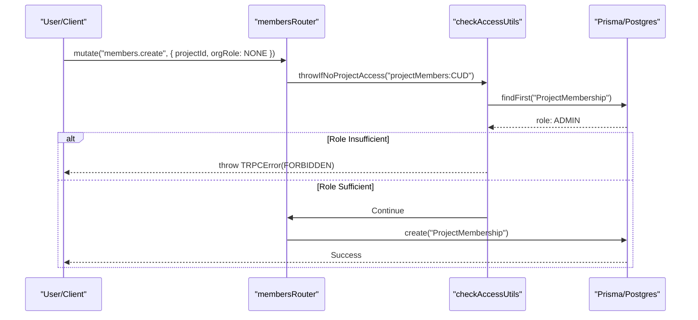

# RBAC & Permissions

<details>
<summary>Relevant source files</summary>

The following files were used as context for generating this wiki page:

- [packages/shared/prisma/migrations/20250123103200_add_retention_days_to_projects/migration.sql](packages/shared/prisma/migrations/20250123103200_add_retention_days_to_projects/migration.sql)
- [packages/shared/prisma/migrations/20250403153555_membership_invitations_no_duplicates/migration.sql](packages/shared/prisma/migrations/20250403153555_membership_invitations_no_duplicates/migration.sql)
- [packages/shared/src/features/entitlements/plans.ts](packages/shared/src/features/entitlements/plans.ts)
- [packages/shared/src/features/monitors/service/helpers.test.ts](packages/shared/src/features/monitors/service/helpers.test.ts)
- [packages/shared/src/features/monitors/service/helpers.ts](packages/shared/src/features/monitors/service/helpers.ts)
- [packages/shared/src/features/monitors/service/service.ts](packages/shared/src/features/monitors/service/service.ts)
- [packages/shared/src/features/monitors/service/types.test.ts](packages/shared/src/features/monitors/service/types.test.ts)
- [packages/shared/src/features/monitors/service/types.ts](packages/shared/src/features/monitors/service/types.ts)
- [packages/shared/src/interfaces/rate-limits.ts](packages/shared/src/interfaces/rate-limits.ts)
- [packages/shared/src/server/services/email/organizationInvitation/MembershipInvitationEmailTemplate.tsx](packages/shared/src/server/services/email/organizationInvitation/MembershipInvitationEmailTemplate.tsx)
- [packages/shared/src/server/utils/formatAuthProvider.ts](packages/shared/src/server/utils/formatAuthProvider.ts)
- [web/src/__tests__/server/members-trpc.servertest.ts](web/src/__tests__/server/members-trpc.servertest.ts)
- [web/src/__tests__/server/monitorService.servertest.ts](web/src/__tests__/server/monitorService.servertest.ts)
- [web/src/__tests__/server/monitors.servertest.ts](web/src/__tests__/server/monitors.servertest.ts)
- [web/src/components/VersionLabel.tsx](web/src/components/VersionLabel.tsx)
- [web/src/ee/features/ui-customization/uiCustomizationRouter.ts](web/src/ee/features/ui-customization/uiCustomizationRouter.ts)
- [web/src/ee/features/ui-customization/useUiCustomization.ts](web/src/ee/features/ui-customization/useUiCustomization.ts)
- [web/src/features/annotation-queues/server/annotationQueueAssignmentsRouter.ts](web/src/features/annotation-queues/server/annotationQueueAssignmentsRouter.ts)
- [web/src/features/auth/lib/projectRetentionSchema.ts](web/src/features/auth/lib/projectRetentionSchema.ts)
- [web/src/features/background-migrations/components/background-migrations.tsx](web/src/features/background-migrations/components/background-migrations.tsx)
- [web/src/features/background-migrations/components/retry-background-migration.tsx](web/src/features/background-migrations/components/retry-background-migration.tsx)
- [web/src/features/background-migrations/server/background-migrations-router.ts](web/src/features/background-migrations/server/background-migrations-router.ts)
- [web/src/features/entitlements/constants/entitlements.ts](web/src/features/entitlements/constants/entitlements.ts)
- [web/src/features/entitlements/server/getPlan.ts](web/src/features/entitlements/server/getPlan.ts)
- [web/src/features/feature-flags/available-flags.ts](web/src/features/feature-flags/available-flags.ts)
- [web/src/features/projects/components/ConfigureRetention.tsx](web/src/features/projects/components/ConfigureRetention.tsx)
- [web/src/features/public-api/server/RateLimitService.ts](web/src/features/public-api/server/RateLimitService.ts)
- [web/src/features/rbac/components/MembersTable.tsx](web/src/features/rbac/components/MembersTable.tsx)
- [web/src/features/rbac/components/MembershipInvitesPage.tsx](web/src/features/rbac/components/MembershipInvitesPage.tsx)
- [web/src/features/rbac/constants/projectAccessRights.ts](web/src/features/rbac/constants/projectAccessRights.ts)
- [web/src/features/rbac/server/allInvitesRoutes.ts](web/src/features/rbac/server/allInvitesRoutes.ts)
- [web/src/features/rbac/server/allMembersRoutes.ts](web/src/features/rbac/server/allMembersRoutes.ts)
- [web/src/features/rbac/server/membersRouter.ts](web/src/features/rbac/server/membersRouter.ts)
- [web/src/pages/background-migrations.tsx](web/src/pages/background-migrations.tsx)
- [web/src/server/api/routers/surveys.ts](web/src/server/api/routers/surveys.ts)

</details>


This document describes Langfuse's Role-Based Access Control (RBAC) system, which governs user and API key permissions across organizations and projects. The system implements a hierarchical dual-role model where organization-level roles can be inherited or overridden at the project level, with fine-grained permission scopes controlling access to specific operations.

## Overview

Langfuse implements a hierarchical RBAC system with two membership levels:

1.  **Organization-level memberships**: Each user has a role within each organization they belong to, tracked via the `OrganizationMembership` model in PostgreSQL.
2.  **Project-level memberships**: Users can have project-specific role overrides via the `ProjectMembership` model that supersede their organization role [web/src/features/rbac/server/membersRouter.ts:94-99]().

API keys are scoped to either an entire organization or a specific project, inheriting appropriate permissions based on their scope.

Sources: [web/src/features/rbac/server/membersRouter.ts:112-169]()

## Role Hierarchy

### Role Enum

The system defines roles in descending order of privilege. The `Role` enum is imported from `@langfuse/shared` [web/src/features/rbac/components/MembersTable.tsx:21-21]():

| Role | Description |
| :--- | :--- |
| `OWNER` | Full administrative access, can manage members, billing, and delete projects/orgs [web/src/features/rbac/constants/projectAccessRights.ts:89-144](). |
| `ADMIN` | Administrative access; can manage most resources and members but not delete projects [web/src/features/rbac/constants/projectAccessRights.ts:145-199](). |
| `MEMBER` | Standard access; can create and manage resources (traces, prompts, etc.) [web/src/features/rbac/constants/projectAccessRights.ts:200-241](). |
| `VIEWER` | Read-only access; can view resources but cannot modify them [web/src/features/rbac/constants/projectAccessRights.ts:242-260](). |
| `NONE` | Explicitly denies access or indicates no override (used for organization-level roles to require project-specific overrides) [web/src/features/rbac/constants/projectAccessRights.ts:261-261](). |

Sources: [web/src/features/rbac/constants/projectAccessRights.ts:88-262](), [web/src/features/rbac/server/membersRouter.ts:18-19]()

### Role Ordering and Validation

The system uses internal ordering to ensure users cannot grant or edit a role higher than their own. This is enforced in the `membersRouter` via `throwIfHigherRole` [web/src/features/rbac/server/membersRouter.ts:53-60]() and `throwIfHigherProjectRole` [web/src/features/rbac/server/membersRouter.ts:66-107]().

```typescript
function throwIfHigherRole({ ownRole, role }: { ownRole: Role; role: Role }) {
  if (orderedRoles[ownRole] < orderedRoles[role]) {
    throw new TRPCError({
      code: "FORBIDDEN",
      message: "You cannot grant/edit a role higher than your own",
    });
  }
}
```

Sources: [web/src/features/rbac/server/membersRouter.ts:53-60](), [web/src/features/rbac/server/membersRouter.ts:30-30]()

## Membership Models & Data Flow

### Entity Relationship

The following diagram bridges the natural language concepts of "Organizations" and "Projects" to the code entities used for RBAC as defined in the Prisma schema and the `membersRouter`.

**Langfuse RBAC Entity Relationships**
```mermaid
classDiagram
    class "User"["User"] {
        +String id
        +String email
        +OrganizationMembership[] organizationMemberships
    }
    class "Organization"["Organization"] {
        +String id
        +String name
        +Project[] projects
        +OrganizationMembership[] organizationMemberships
    }
    class "OrganizationMembership"["OrganizationMembership"] {
        +String id
        +Role role
        +String orgId
        +String userId
        +ProjectMembership[] projectMemberships
    }
    class "Project"["Project"] {
        +String id
        +String orgId
        +ProjectMembership[] projectMembers
    }
    class "ProjectMembership"["ProjectMembership"] {
        +String id
        +Role role
        +String projectId
        +String orgMembershipId
    }

    "User" "1" -- "*" "OrganizationMembership" : "has"
    "Organization" "1" -- "*" "OrganizationMembership" : "contains"
    "Organization" "1" -- "*" "Project" : "owns"
    "OrganizationMembership" "1" -- "*" "ProjectMembership" : "linked_to"
    "Project" "1" -- "*" "ProjectMembership" : "has_members"
```

Sources: [web/src/features/rbac/server/membersRouter.ts:84-92]()

### Role Resolution Logic

The effective role for a user in a specific project is determined by taking the maximum privilege between their `OrganizationMembership.role` and their `ProjectMembership.role` [web/src/features/rbac/server/membersRouter.ts:94-99]().

1.  If a `ProjectMembership` exists for the user and project, that role is fetched [web/src/features/rbac/server/membersRouter.ts:84-92]().
2.  The system calculates `ownRoleValue` by taking the `Math.max` of the `orderedRoles` values for both the project role and the organization role [web/src/features/rbac/server/membersRouter.ts:94-99]().
3.  If no project membership exists, it defaults to the organization role [web/src/features/rbac/server/membersRouter.ts:99-99]().

Sources: [web/src/features/rbac/server/membersRouter.ts:94-106](), [web/src/features/rbac/server/membersRouter.ts:30-30]()

## Access Scopes (Permissions)

Langfuse uses fine-grained "Scopes" to define what a role can actually do. These are defined as strings in the format `resource:action` [web/src/features/rbac/constants/projectAccessRights.ts:85-86]().

### Project Scopes

Project-level scopes control access to tracing data, prompts, and project settings. Examples include:
*   `projectMembers:CUD`: Create, Update, Delete project members [web/src/features/rbac/constants/projectAccessRights.ts:7-7]().
*   `llmTools:CUD`: Create or update LLM tools [web/src/features/rbac/constants/projectAccessRights.ts:64-64]().
*   `scoreConfigs:read`: Read score configurations [web/src/features/rbac/constants/projectAccessRights.ts:21-21]().
*   `prompts:CUD`: Create, Update, or Delete prompts [web/src/features/rbac/constants/projectAccessRights.ts:36-36]().
*   `auditLogs:read`: Access to view audit logs [web/src/features/rbac/constants/projectAccessRights.ts:73-73]().
*   `monitors:CUD`: Create, Update, or Delete monitors [web/src/features/rbac/constants/projectAccessRights.ts:82-82]().

The mapping of roles to these scopes is maintained in `projectRoleAccessRights` [web/src/features/rbac/constants/projectAccessRights.ts:88-262]().

Sources: [web/src/features/rbac/constants/projectAccessRights.ts:5-83](), [web/src/features/rbac/constants/projectAccessRights.ts:88-262]()

### Organization Scopes

Organization-level scopes control billing, SSO, and membership at the org level.
*   `organizationMembers:read`: View organization members [web/src/features/rbac/components/MembersTable.tsx:75-75]().
*   `organizationMembers:CUD`: Manage organization-wide membership [web/src/features/rbac/server/membersRouter.ts:167-167]().

Sources: [web/src/features/rbac/components/MembersTable.tsx:73-76](), [web/src/features/rbac/server/membersRouter.ts:162-169]()

## Enforcement Mechanisms

### Server-Side: tRPC Procedures

Permissions are enforced in the API layer using tRPC procedures and utility functions defined in `membersRouter.ts` and `allInvitesRoutes.ts`.

*   `throwIfNoProjectAccess`: Utility function called within procedures to check for a specific scope [web/src/features/rbac/server/membersRouter.ts:26-27](), [web/src/features/rbac/server/membersRouter.ts:157-161]().
*   `throwIfNoOrganizationAccess`: Similar check for organization-level scopes [web/src/features/rbac/server/membersRouter.ts:11-12](), [web/src/features/rbac/server/membersRouter.ts:164-168]().

**RBAC Enforcement via tRPC**


Sources: [web/src/features/rbac/server/membersRouter.ts:112-169](), [web/src/features/rbac/server/allInvitesRoutes.ts:86-125]()

### Client-Side: UI Guards

The UI uses React hooks to conditionally show or hide elements based on permissions:

*   `useHasProjectAccess`: Returns a boolean indicating if the current user has a specific scope in the active project [web/src/features/rbac/components/MembersTable.tsx:27-27]().
*   `useHasOrganizationAccess`: Similar to project access, but for organization-level scopes [web/src/features/rbac/components/MembersTable.tsx:17-17]().
*   `useHasEntitlement`: Checks for feature availability (e.g., `rbac-project-roles`) based on the organization's plan [web/src/features/rbac/components/MembersTable.tsx:25-25]().

Sources: [web/src/features/rbac/components/MembersTable.tsx:73-81](), [web/src/features/rbac/components/MembersTable.tsx:138-147]()

## Entitlements & Limits

The system enforces limits on memberships and feature access based on the organization's plan and entitlements.

### Membership Limits
The `membersRouter` checks membership counts before creating new memberships or invitations [web/src/features/rbac/server/membersRouter.ts:223-228]().

*   `throwIfExceedsLimit`: Enforces limits like maximum organization member counts [web/src/features/rbac/server/membersRouter.ts:23-23]().
*   `organization-member-count`: A specific entitlement limit (e.g., 2 for Hobby plan) [web/src/features/entitlements/constants/entitlements.ts:61-61]().
*   This check includes both current members and pending invitations [web/src/features/rbac/server/membersRouter.ts:223-231]().

Sources: [web/src/features/entitlements/constants/entitlements.ts:51-171](), [web/src/features/rbac/server/membersRouter.ts:223-231](), [web/src/__tests__/server/members-trpc.servertest.ts:119-142]()

### Feature Entitlements
Specific features are gated by entitlements defined in `entitlements.ts` [web/src/features/entitlements/constants/entitlements.ts:6-21]():
*   `rbac-project-roles`: Required to assign different roles per project [web/src/features/rbac/server/membersRouter.ts:177-189](), [web/src/features/rbac/components/MembersTable.tsx:147-147]().
*   `cloud-multi-tenant-sso`: Required for multi-tenant SSO features [web/src/features/entitlements/constants/entitlements.ts:11-11]().
*   `audit-logs`: Required to access audit log features [web/src/features/entitlements/constants/entitlements.ts:15-15]().
*   `admin-api`: Required for organization-level administrative API access [web/src/features/entitlements/constants/entitlements.ts:19-19]().

Sources: [web/src/features/entitlements/constants/entitlements.ts:51-171](), [web/src/features/rbac/server/membersRouter.ts:177-189]()

## Rate Limiting

Access is further controlled via the `RateLimitService`, which applies limits based on organization ID, plan, and resource [web/src/features/public-api/server/RateLimitService.ts:30-35]().

*   **Strategy**: Uses Redis to track points consumed per organization within a duration [web/src/features/public-api/server/RateLimitService.ts:108-116]().
*   **Resources**: Limits are applied to specific resources like `ingestion`, `public-api`, `prompts`, and `datasets` [packages/shared/src/interfaces/rate-limits.ts:4-14]().
*   **Plan-based**: Limits vary by organization plan (e.g., Hobby vs. Enterprise) [web/src/features/public-api/server/RateLimitService.ts:153-155]().

Sources: [web/src/features/public-api/server/RateLimitService.ts:35-164](), [packages/shared/src/interfaces/rate-limits.ts:4-36]()
