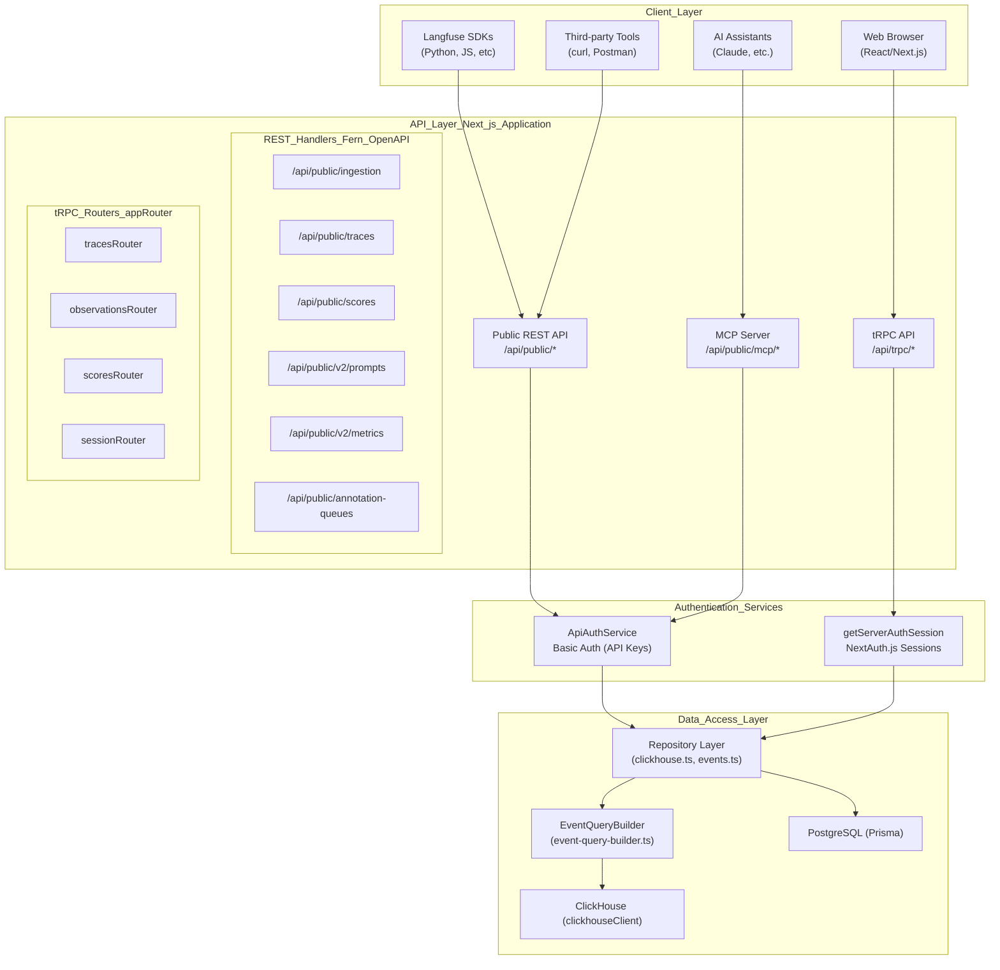

# API Layer

Relevant source files

The following files were used as context for generating this wiki page:

- [fern/apis/server/definition/commons.yml](fern/apis/server/definition/commons.yml)
- [fern/apis/server/definition/metrics.yml](fern/apis/server/definition/metrics.yml)
- [fern/apis/server/definition/observations.yml](fern/apis/server/definition/observations.yml)
- [fern/apis/server/definition/prompt-version.yml](fern/apis/server/definition/prompt-version.yml)
- [fern/apis/server/definition/prompts.yml](fern/apis/server/definition/prompts.yml)
- [packages/shared/src/domain/observation-field-groups.ts](packages/shared/src/domain/observation-field-groups.ts)
- [packages/shared/src/server/repositories/clickhouse.ts](packages/shared/src/server/repositories/clickhouse.ts)
- [web/public/generated/api/openapi.yml](web/public/generated/api/openapi.yml)
- [web/src/__tests__/server/repositories/clickhouse-resource-errors.servertest.ts](web/src/__tests__/server/repositories/clickhouse-resource-errors.servertest.ts)
- [web/src/__tests__/server/trpc-error-formatting.servertest.ts](web/src/__tests__/server/trpc-error-formatting.servertest.ts)
- [web/src/__tests__/server/withMiddlewares.servertest.ts](web/src/__tests__/server/withMiddlewares.servertest.ts)
- [web/src/features/notifications/ErrorNotification.tsx](web/src/features/notifications/ErrorNotification.tsx)
- [web/src/features/notifications/showErrorToast.tsx](web/src/features/notifications/showErrorToast.tsx)
- [web/src/features/prompts/server/actions/getPromptsMeta.ts](web/src/features/prompts/server/actions/getPromptsMeta.ts)
- [web/src/features/public-api/server/dailyMetrics.ts](web/src/features/public-api/server/dailyMetrics.ts)
- [web/src/features/public-api/server/withMiddlewares.ts](web/src/features/public-api/server/withMiddlewares.ts)
- [web/src/pages/api/public/metrics/daily.ts](web/src/pages/api/public/metrics/daily.ts)
- [web/src/pages/api/public/v2/prompts/[promptName]/index.ts](web/src/pages/api/public/v2/prompts/[promptName]/index.ts)
- [web/src/pages/api/public/v2/prompts/[promptName]/versions/[promptVersion].ts](web/src/pages/api/public/v2/prompts/[promptName]/versions/[promptVersion].ts)
- [web/src/server/api/trpc.ts](web/src/server/api/trpc.ts)
- [web/src/utils/trpcErrorToast.tsx](web/src/utils/trpcErrorToast.tsx)

## Purpose and Scope

This document describes the dual API architecture that exposes Langfuse functionality to external clients and the web application. The API Layer consists of two distinct surfaces: the **Public REST API** for language-agnostic programmatic access (primarily used by SDKs), and the **tRPC API** for type-safe communication between the Next.js web application and server.

For details on authentication mechanisms and authorization checks, see [API Authentication & Rate Limiting](#5.3). For information on data ingestion processing that occurs after API requests are received, see [Data Ingestion Pipeline](#6).

## Dual API Architecture

Langfuse implements two parallel API architectures that serve different client types with different requirements. This architecture bridges high-level client requests to low-level repository operations like `enrichObservationsWithModelData` [packages/shared/src/server/repositories/events.ts:32-32]() and ClickHouse query builders.

### API System Overview

**Key Architectural Decisions:**

| Aspect | Public REST API | tRPC API |
|--------|----------------|----------|
| **Primary Users** | SDKs, CLI tools, external integrations | Web application frontend |
| **Authentication** | HTTP Basic Auth (API keys) | NextAuth.js sessions via `getServerAuthSession` [web/src/server/api/trpc.ts:61-61]() |
| **Type Safety** | OpenAPI/Fern validation at runtime | Full TypeScript type inference via `initTRPC` [web/src/server/api/trpc.ts:103-103]() |
| **Schema Definition** | Fern YAML definitions [fern/apis/server/definition/commons.yml:4-4]() | Zod schemas and `superjson` transformer [web/src/server/api/trpc.ts:104-105]() |
| **Code Generation** | Fern generates OpenAPI spec and SDKs | Generates types for Next.js client |
| **Base Path** | `/api/public/*` [web/public/generated/api/openapi.yml:23-24]() | `/api/trpc/*` |

**Sources:**
- [web/src/server/api/trpc.ts:57-124]()
- [web/public/generated/api/openapi.yml:1-24]()
- [packages/shared/src/server/repositories/clickhouse.ts:128-135]()
- [packages/shared/src/domain/observation-field-groups.ts:34-45]()

## Public REST API

The Public REST API is the primary integration point for external systems. It is defined using Fern and exported as an OpenAPI specification [web/public/generated/api/openapi.yml:22-22](). All endpoints require authentication via API keys (Public Key as username, Secret Key as password) [web/public/generated/api/openapi.yml:9-17]().

### Core Features
- **V2 High-Performance Endpoints**: The API features optimized V2 endpoints for `observations` [fern/apis/server/definition/observations.yml:36-36]() and `metrics` [fern/apis/server/definition/metrics.yml:113-113]() that leverage ClickHouse for scale.
- **CRUD Operations**: Management of traces [fern/apis/server/definition/commons.yml:4-44](), observations [fern/apis/server/definition/commons.yml:95-160](), and prompts [fern/apis/server/definition/prompts.yml:9-82]().
- **Field Selection**: The V2 Observations API allows clients to specify `fields` groups (e.g., `core`, `usage`, `model`) to minimize payload size [packages/shared/src/domain/observation-field-groups.ts:34-45]().
- **Annotation Queues**: Endpoints to manage human-in-the-loop labeling workflows, including listing queues and adding items [web/public/generated/api/openapi.yml:24-81]().
- **Metrics API**: Supports querying `observations`, `scores-numeric`, and `scores-categorical` with complex aggregations like `p99` or `histogram` [fern/apis/server/definition/metrics.yml:106-110]().

For details, see [Public REST API](#5.1).

**Sources:**
- [web/public/generated/api/openapi.yml:1-118]()
- [fern/apis/server/definition/commons.yml:4-160]()
- [fern/apis/server/definition/observations.yml:36-116]()
- [fern/apis/server/definition/metrics.yml:9-56]()
- [packages/shared/src/domain/observation-field-groups.ts:1-56]()

## tRPC Internal API

The tRPC API is used exclusively by the Langfuse web UI. It provides a type-safe bridge between the React frontend and the Node.js backend.

### Architecture
- **Router Structure**: A hierarchical tree of routers initialized via `createTRPCRouter` [web/src/server/api/trpc.ts:138-138]().
- **Context Injection**: The `createTRPCContext` function injects `prisma`, user session, and request headers into every procedure [web/src/server/api/trpc.ts:57-72]().
- **Global Error Handling**: A middleware `withErrorHandling` intercepts errors, specifically surfacing `ClickHouseResourceError` with user-friendly advice to prevent exposing sensitive stack traces [web/src/server/api/trpc.ts:167-208]().
- **Telemetry**: OpenTelemetry instrumentation is integrated via `withOtelInstrumentation` to track procedure performance and context [web/src/server/api/trpc.ts:211-211]().

For details, see [tRPC Internal API](#5.2).

**Sources:**
- [web/src/server/api/trpc.ts:43-72]()
- [web/src/server/api/trpc.ts:138-138]()
- [web/src/server/api/trpc.ts:167-208]()

## API Authentication & Rate Limiting

Langfuse protects its API surface using a multi-layered approach to security and resource management.

- **Authentication**: Public API requests are authenticated using `BasicAuth` [web/public/generated/api/openapi.yml:77-78](). Admin APIs use specialized auth services like `AdminApiAuthService` [web/src/server/api/trpc.ts:94-94]().
- **Resource Protection**: The `ClickHouseResourceError` class tracks memory limits, timeouts, and overcommits to prevent database exhaustion [packages/shared/src/server/repositories/clickhouse.ts:29-67]().
- **Error Propagation**: Errors are formatted to provide specific guidance. For example, ClickHouse resource errors return a 422 status with advice on how to optimize queries [web/src/features/public-api/server/withMiddlewares.ts:141-158]().
- **Query Safeguards**: Internal checks like `assertNoLegacyEventsRead` prevent accidental queries to deprecated tables in ClickHouse [packages/shared/src/server/repositories/clickhouse.ts:120-126]().

For details, see [API Authentication & Rate Limiting](#5.3).

**Sources:**
- [web/public/generated/api/openapi.yml:9-17]()
- [packages/shared/src/server/repositories/clickhouse.ts:29-91]()
- [web/src/features/public-api/server/withMiddlewares.ts:130-158]()
- [web/src/utils/trpcErrorToast.tsx:37-65]()

## MCP Server

The Model Context Protocol (MCP) server allows AI assistants to connect directly to Langfuse to manage prompts and other resources.

- **Stateless Architecture**: The server operates per-request, leveraging the same authentication foundations as the REST API [web/public/generated/api/openapi.yml:6-17]().
- **Tooling**: Exposes Langfuse features as "tools" that assistants can invoke, such as fetching prompt templates defined in the Prompts V2 system. This allows LLMs to interact with the Langfuse prompt registry directly.

For details, see [MCP Server](#5.4).

**Sources:**
- [web/public/generated/api/openapi.yml:1-17]()
- [fern/apis/server/definition/prompts.yml:9-32]()
