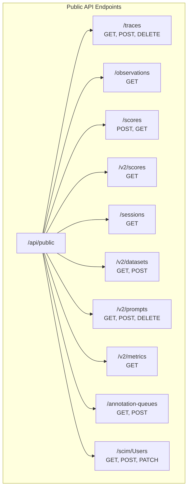
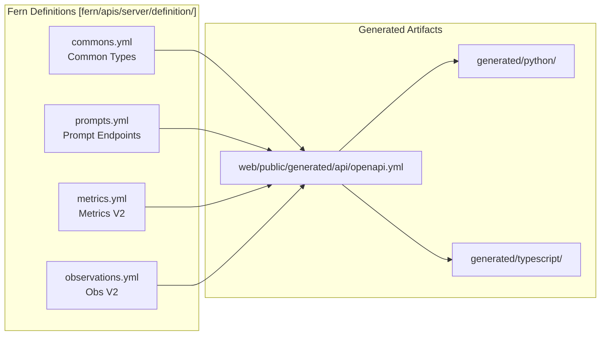
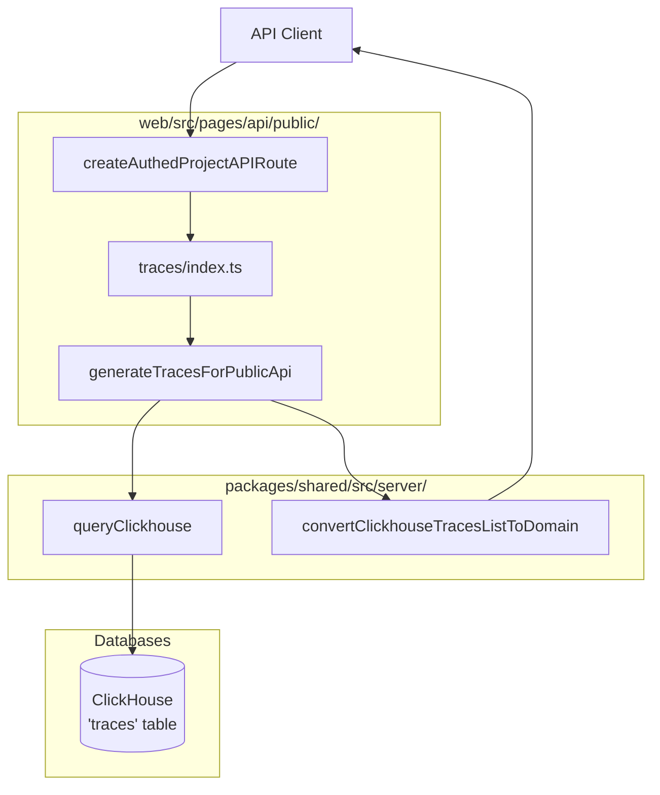

# Public REST API

<details>
<summary>Relevant source files</summary>

The following files were used as context for generating this wiki page:

- [fern/apis/server/definition/commons.yml](fern/apis/server/definition/commons.yml)
- [fern/apis/server/definition/legacy/metrics-v1.yml](fern/apis/server/definition/legacy/metrics-v1.yml)
- [fern/apis/server/definition/legacy/observations-v1.yml](fern/apis/server/definition/legacy/observations-v1.yml)
- [fern/apis/server/definition/metrics.yml](fern/apis/server/definition/metrics.yml)
- [fern/apis/server/definition/observations.yml](fern/apis/server/definition/observations.yml)
- [fern/apis/server/definition/prompt-version.yml](fern/apis/server/definition/prompt-version.yml)
- [fern/apis/server/definition/prompts.yml](fern/apis/server/definition/prompts.yml)
- [fern/apis/server/definition/scim.yml](fern/apis/server/definition/scim.yml)
- [fern/apis/server/definition/scores.yml](fern/apis/server/definition/scores.yml)
- [fern/apis/server/definition/trace.yml](fern/apis/server/definition/trace.yml)
- [packages/shared/src/domain/observation-field-groups.ts](packages/shared/src/domain/observation-field-groups.ts)
- [packages/shared/src/features/scores/interfaces/api/v2/endpoints.ts](packages/shared/src/features/scores/interfaces/api/v2/endpoints.ts)
- [web/public/generated/api/openapi.yml](web/public/generated/api/openapi.yml)
- [web/src/__tests__/server/scim-api.servertest.ts](web/src/__tests__/server/scim-api.servertest.ts)
- [web/src/__tests__/server/scores-api-v2.servertest.ts](web/src/__tests__/server/scores-api-v2.servertest.ts)
- [web/src/features/prompts/server/actions/getPromptsMeta.ts](web/src/features/prompts/server/actions/getPromptsMeta.ts)
- [web/src/features/public-api/server/dailyMetrics.ts](web/src/features/public-api/server/dailyMetrics.ts)
- [web/src/features/public-api/server/observations.ts](web/src/features/public-api/server/observations.ts)
- [web/src/features/public-api/server/scores.ts](web/src/features/public-api/server/scores.ts)
- [web/src/features/public-api/server/traces.ts](web/src/features/public-api/server/traces.ts)
- [web/src/features/public-api/types/traces.ts](web/src/features/public-api/types/traces.ts)
- [web/src/pages/api/public/events.ts](web/src/pages/api/public/events.ts)
- [web/src/pages/api/public/generations.ts](web/src/pages/api/public/generations.ts)
- [web/src/pages/api/public/metrics/daily.ts](web/src/pages/api/public/metrics/daily.ts)
- [web/src/pages/api/public/observations/[observationId].ts](web/src/pages/api/public/observations/[observationId].ts)
- [web/src/pages/api/public/observations/index.ts](web/src/pages/api/public/observations/index.ts)
- [web/src/pages/api/public/scim/ResourceTypes.ts](web/src/pages/api/public/scim/ResourceTypes.ts)
- [web/src/pages/api/public/scim/Schemas.ts](web/src/pages/api/public/scim/Schemas.ts)
- [web/src/pages/api/public/scim/ServiceProviderConfig.ts](web/src/pages/api/public/scim/ServiceProviderConfig.ts)
- [web/src/pages/api/public/scim/Users/[id].ts](web/src/pages/api/public/scim/Users/[id].ts)
- [web/src/pages/api/public/scim/Users/index.ts](web/src/pages/api/public/scim/Users/index.ts)
- [web/src/pages/api/public/scores/index.ts](web/src/pages/api/public/scores/index.ts)
- [web/src/pages/api/public/spans.ts](web/src/pages/api/public/spans.ts)
- [web/src/pages/api/public/traces/[traceId].ts](web/src/pages/api/public/traces/[traceId].ts)
- [web/src/pages/api/public/traces/index.ts](web/src/pages/api/public/traces/index.ts)
- [web/src/pages/api/public/v2/prompts/[promptName]/index.ts](web/src/pages/api/public/v2/prompts/[promptName]/index.ts)
- [web/src/pages/api/public/v2/prompts/[promptName]/versions/[promptVersion].ts](web/src/pages/api/public/v2/prompts/[promptName]/versions/[promptVersion].ts)
- [web/src/pages/api/public/v2/scores/index.ts](web/src/pages/api/public/v2/scores/index.ts)

</details>


## Purpose and Scope

The Public REST API provides programmatic access to Langfuse functionality for external integrations, SDKs, and automation tools. This document covers the structure, authentication, and resource types exposed by the API at `/api/public/*` endpoints. It details the OpenAPI specification, data flow from request to storage, and the implementation of CRUD operations for core entities.

For internal web application APIs, see [tRPC Internal API](5.2). For data ingestion specifically, see [Data Ingestion Pipeline](6). For authentication mechanisms, see [Authentication & Authorization](4).

---

## API Overview

### Base Path and Versioning

The Public REST API is served under the `/api/public` base path with selective versioning for breaking changes.

| Base Path | Description | Example |
|-----------|-------------|---------|
| `/api/public` | Main API endpoints (v1 implicit) | `/api/public/traces` |
| `/api/public/v2` | Version 2 endpoints with improvements | `/api/public/v2/prompts` |
| `/api/public/otel` | OpenTelemetry ingestion | `/api/public/otel/v1/traces` |

**Sources:** [web/public/generated/api/openapi.yml:23-25](), [fern/apis/server/definition/prompts.yml:8-8](), [fern/apis/server/definition/trace.yml:7-7]()

### Authentication

The API uses HTTP Basic Authentication with API keys from project settings:

- **Username**: Langfuse Public Key
- **Password**: Langfuse Secret Key

```
Authorization: Basic base64(publicKey:secretKey)
```

API keys are validated through the `ApiAuthService`, which resolves the key to a project or organization scope with permissions. The `createAuthedProjectAPIRoute` wrapper ensures that requests are scoped to a valid `projectId`.

**Sources:** [web/public/generated/api/openapi.yml:6-18](), [web/src/pages/api/public/scim/Users/index.ts:30-40](), [web/src/pages/api/public/traces/[traceId].ts:33-37]()

---

## API Structure

### Endpoint Organization

The API is organized into resource-based endpoints with standard REST operations.

Title: Public API Endpoint Map


**Sources:** [web/public/generated/api/openapi.yml:24-172](), [fern/apis/server/definition/prompts.yml:6-83](), [fern/apis/server/definition/metrics.yml:5-113](), [fern/apis/server/definition/trace.yml:9-36]()

---

## Schema Management with Fern

### Fern Build Pipeline

The API schema is defined using Fern, which generates OpenAPI specs and SDKs. Langfuse uses these definitions to maintain consistency across the Python and TypeScript SDKs.

Title: Fern Build Pipeline


**Sources:** [web/public/generated/api/openapi.yml:1-5](), [fern/apis/server/definition/commons.yml:1-208](), [fern/apis/server/definition/prompts.yml:1-216]()

### Common Type Definitions

Core types shared across all endpoints are defined in `commons.yml`:

| Type | Description | Key Properties |
|------|-------------|----------------|
| `Trace` | Top-level execution trace | `id`, `timestamp`, `name`, `input`, `output`, `metadata`, `tags` |
| `Observation` | Execution unit (span/gen) | `id`, `traceId`, `type`, `name`, `startTime`, `usageDetails`, `costDetails` |
| `Prompt` | Managed prompt template | `name`, `version`, `prompt` (text/chat), `config`, `labels` |
| `Session` | Trace grouping | `id`, `createdAt`, `projectId`, `environment` |

**Sources:** [fern/apis/server/definition/commons.yml:4-208](), [fern/apis/server/definition/prompts.yml:142-208]()

---

## Core Resources

### Traces

#### GET /api/public/traces

List traces with advanced filtering. The endpoint supports a `filter` query parameter that accepts a JSON-encoded array of conditions for complex queries.

**Implementation Details:**
- Queries ClickHouse directly with complex CTEs for metrics and score aggregations [web/src/features/public-api/server/traces.ts:132-201]().
- The query builder `buildTracesBaseQuery` handles ClickHouse optimizations like `shouldUseSkipIndexes` and conditional CTE inclusion for `observation_stats` or `score_stats` [web/src/features/public-api/server/traces.ts:48-170]().
- CTE `observation_stats` aggregates costs and latencies from the `observations` table [web/src/features/public-api/server/traces.ts:149-169]().
- Supports field selection via `fields` parameter to include IO, metrics, or scores [web/src/features/public-api/server/traces.ts:48-64]().
- Can toggle between legacy `traces` table and the new `events` table architecture via `useEventsTable` parameter [web/src/pages/api/public/traces/index.ts:127-132]().

**Sources:** [web/src/features/public-api/server/traces.ts:48-170](), [web/src/features/public-api/server/traces.ts:29-46](), [web/src/pages/api/public/traces/index.ts:127-157]()

#### GET /api/public/traces/{traceId}

Retrieves a single trace by ID.
- Fetches the trace record via `getTraceById` [web/src/pages/api/public/traces/[traceId].ts:58-65]().
- Conditionally includes observations and scores using `getObservationsForTrace` and `getScoresForTraces` [web/src/pages/api/public/traces/[traceId].ts:73-91]().
- Calculates aggregated metrics like `latency` and `totalCost` if the `metrics` field group is requested [web/src/pages/api/public/traces/[traceId].ts:156-186]().

**Sources:** [web/src/pages/api/public/traces/[traceId].ts:33-189]()

### Observations

#### GET /api/public/v2/observations

The V2 observations endpoint provides high-performance retrieval using ClickHouse.
- Uses `generateObservationsForPublicApi` to execute optimized SQL with a subquery on `clickhouse_keys` for efficient pagination [web/src/features/public-api/server/observations.ts:29-90]().
- Allows field selection groups (core, basic, time, io, metadata, model, usage, prompt, metrics) to minimize data transfer [fern/apis/server/definition/observations.yml:18-27]().
- Implements `shouldSkipObservationsFinal` check to optimize query performance by avoiding `FINAL` keyword when possible [web/src/features/public-api/server/observations.ts:35-37]().

**Sources:** [web/src/features/public-api/server/observations.ts:29-121](), [fern/apis/server/definition/observations.yml:35-135]()

### Scores

#### POST /api/public/scores

Creates a score by calling `ScoresApiService.createScore`.
- For legacy reasons, it may use `processEventBatch` for certain event types [web/src/pages/api/public/traces/index.ts:52-59]().
- The `ScoresApiService` handles the actual persistence logic, ensuring the score is associated with the correct project [web/src/pages/api/public/scores/index.ts:36-40]().

**Sources:** [web/src/pages/api/public/scores/index.ts:16-54](), [web/src/pages/api/public/traces/index.ts:36-65]()

#### GET /api/public/v2/scores

Retrieves scores with optional trace metadata join.
- Implementation `_handleGenerateScoresForPublicApi` performs a `LEFT JOIN` on the `traces` table if trace metadata (tags, userId, etc.) is requested [web/src/features/public-api/server/scores.ts:104-136]().
- For `CORRECTION` score types, the `longStringValue` is mapped to `stringValue` for API compatibility [web/src/features/public-api/server/scores.ts:41-47]().
- For `TEXT` score types, the numeric `value` field is removed as it is not meaningful [web/src/features/public-api/server/scores.ts:49-51]().

**Sources:** [web/src/features/public-api/server/scores.ts:87-164](), [web/src/features/public-api/server/scores.ts:34-54]()

### Prompts

#### GET /api/public/v2/prompts/{promptName}

Retrieves a specific prompt version or the one associated with a label (defaults to `production`).
- Supports `resolve=true` (default) to return the prompt with all dependencies resolved via the `resolutionGraph` [fern/apis/server/definition/prompts.yml:29-31]().
- Returns either a `TextPrompt` or `ChatPrompt` union type, extending a `BasePrompt` that includes `config`, `labels`, and `tags` [fern/apis/server/definition/prompts.yml:142-208]().

**Sources:** [fern/apis/server/definition/prompts.yml:10-32](), [fern/apis/server/definition/prompts.yml:152-168]()

---

## Implementation Architecture

### Request Flow and Data Conversion

Title: Public API Data Retrieval Flow


**Sources:** [web/src/pages/api/public/traces/index.ts:68-186](), [web/src/features/public-api/server/traces.ts:48-170](), [web/src/features/public-api/server/traces.ts:1-14]()

### Metrics V2 (Optimized Analytics)

The `/api/public/v2/metrics` endpoint provides a high-performance interface for querying aggregated data directly from ClickHouse. It supports three views: `observations`, `scores-numeric`, and `scores-categorical`.

- **Dimensions:** Grouping by `environment`, `model`, `promptName`, `type`, and time-based dimensions like `startTimeMonth` [fern/apis/server/definition/metrics.yml:26-40]().
- **Measures:** Aggregations like `sum`, `avg`, `p95`, and `histogram` on fields like `latency`, `inputTokens`, and `totalCost` [fern/apis/server/definition/metrics.yml:42-55]().
- **Constraints:** High cardinality fields (like `traceId` or `userId`) must be used in filters rather than dimensions to prevent performance degradation [fern/apis/server/definition/metrics.yml:88-105]().

**Sources:** [fern/apis/server/definition/metrics.yml:9-113]()

---

## SCIM Provisioning

Langfuse supports the SCIM 2.0 protocol for automated user provisioning from identity providers.

- **Endpoints:** `/api/public/scim/Users`.
- **Authentication:** Requires an organization-scoped API key verified by `ApiAuthService` [web/src/pages/api/public/scim/Users/index.ts:30-54]().
- **Operations:** 
    - `GET`: Lists users in the organization with SCIM-compliant filtering (e.g., `userName eq "..."`) [web/src/pages/api/public/scim/Users/index.ts:60-130]().
    - `POST`: Creates or upserts a user in the `User` table and creates an `OrganizationMembership` [web/src/pages/api/public/scim/Users/index.ts:141-219]().
- **Role Mapping:** Supports mapping SCIM roles to internal roles like `OWNER`, `ADMIN`, `MEMBER`, or `VIEWER` [web/src/pages/api/public/scim/Users/index.ts:168-184]().

**Sources:** [web/src/pages/api/public/scim/Users/index.ts:1-219]()

---

## Error Handling

The API uses standard HTTP status codes. For batch operations (like ingestion), a `207 Multi-Status` may be returned if some events failed validation while others succeeded.

| Status | Description |
|--------|-------------|
| 400 | Validation failure or malformed JSON [web/src/pages/api/public/scim/Users/index.ts:149-153]() |
| 401 | Invalid or missing API keys [web/src/pages/api/public/scim/Users/index.ts:35-39]() |
| 403 | Forbidden (e.g., project-scoped key used for SCIM) [web/src/pages/api/public/scim/Users/index.ts:44-54]() |
| 405 | Method not allowed [web/src/pages/api/public/scim/Users/index.ts:18-26]() |
| 409 | Conflict (e.g., user already exists) [web/src/pages/api/public/scim/Users/index.ts:200-209]() |

**Sources:** [web/src/pages/api/public/scim/Users/index.ts:18-209](), [web/public/generated/api/openapi.yml:52-76]()
