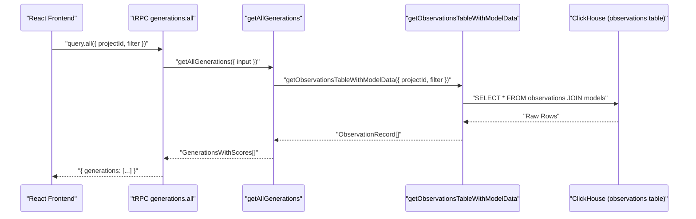

# tRPC Internal API

<details>
<summary>Relevant source files</summary>

The following files were used as context for generating this wiki page:

- [packages/shared/prisma/schema.prisma](packages/shared/prisma/schema.prisma)
- [packages/shared/src/server/queries/createGenerationsQuery.ts](packages/shared/src/server/queries/createGenerationsQuery.ts)
- [packages/shared/src/server/repositories/clickhouse.ts](packages/shared/src/server/repositories/clickhouse.ts)
- [web/src/__tests__/organization-settings-pages.clienttest.tsx](web/src/__tests__/organization-settings-pages.clienttest.tsx)
- [web/src/__tests__/server/repositories/clickhouse-resource-errors.servertest.ts](web/src/__tests__/server/repositories/clickhouse-resource-errors.servertest.ts)
- [web/src/__tests__/server/trpc-error-formatting.servertest.ts](web/src/__tests__/server/trpc-error-formatting.servertest.ts)
- [web/src/__tests__/server/withMiddlewares.servertest.ts](web/src/__tests__/server/withMiddlewares.servertest.ts)
- [web/src/features/audit-logs/auditLog.ts](web/src/features/audit-logs/auditLog.ts)
- [web/src/features/models/components/ModelSettings.tsx](web/src/features/models/components/ModelSettings.tsx)
- [web/src/features/notifications/ErrorNotification.tsx](web/src/features/notifications/ErrorNotification.tsx)
- [web/src/features/notifications/showErrorToast.tsx](web/src/features/notifications/showErrorToast.tsx)
- [web/src/features/public-api/server/withMiddlewares.ts](web/src/features/public-api/server/withMiddlewares.ts)
- [web/src/features/public-api/types/metrics.ts](web/src/features/public-api/types/metrics.ts)
- [web/src/features/public-api/types/sessions.ts](web/src/features/public-api/types/sessions.ts)
- [web/src/pages/api/public/metrics/index.ts](web/src/pages/api/public/metrics/index.ts)
- [web/src/pages/api/public/v2/metrics.ts](web/src/pages/api/public/v2/metrics.ts)
- [web/src/pages/api/public/v2/observations/index.ts](web/src/pages/api/public/v2/observations/index.ts)
- [web/src/pages/organization/[organizationId]/settings/index.tsx](web/src/pages/organization/[organizationId]/settings/index.tsx)
- [web/src/pages/project/[projectId]/settings/index.tsx](web/src/pages/project/[projectId]/settings/index.tsx)
- [web/src/server/api/root.ts](web/src/server/api/root.ts)
- [web/src/server/api/routers/generations/db/getAllGenerationsSqlQuery.ts](web/src/server/api/routers/generations/db/getAllGenerationsSqlQuery.ts)
- [web/src/server/api/routers/generations/getAllQueries.ts](web/src/server/api/routers/generations/getAllQueries.ts)
- [web/src/server/api/routers/observations.ts](web/src/server/api/routers/observations.ts)
- [web/src/server/api/routers/public.ts](web/src/server/api/routers/public.ts)
- [web/src/server/api/trpc.ts](web/src/server/api/trpc.ts)
- [web/src/utils/trpcErrorToast.tsx](web/src/utils/trpcErrorToast.tsx)

</details>


This page documents the tRPC-based internal API used for communication between the Next.js frontend and the server-side backend within the same web application process. This is distinct from the public REST API consumed by external SDK clients — for that, see [Public REST API](#5.1), and for API key authentication and rate limiting, see [API Authentication & Rate Limiting](#5.3).

---

## Overview

The tRPC internal API is defined entirely within the `web` package. It provides type-safe remote procedure calls that the React frontend invokes to read and mutate application data. All tRPC procedures run within the Next.js API route at `/api/trpc`, using the Pages Router adapter [web/src/server/api/trpc.ts:1-8]().

The API is structured as a tree of routers, each covering a domain entity (traces, observations, sessions, scores, generations, datasets, evaluations, dashboard, etc.). Procedures communicate with PostgreSQL via Prisma and with ClickHouse via repository functions and service layers from `packages/shared`.

---

## Context

Every tRPC request receives a **context** object constructed in `createTRPCContext` [web/src/server/api/trpc.ts:57-72]().

**Diagram: Context construction**

```mermaid
flowchart LR
  "HTTPRequest[/api/trpc]" --> "createTRPCContext()"
  "createTRPCContext()" --> "getServerAuthSession()"
  "createTRPCContext()" --> "createInnerTRPCContext()"
  "createInnerTRPCContext()" --> "CTX[Context Object]"
  "CTX" --> "session(NextAuth)"
  "CTX" --> "prisma(PrismaClient)"
  "CTX" --> "headers"
```

Sources: [web/src/server/api/trpc.ts:43-72]()

| Context Field | Type | Description |
|---|---|---|
| `session` | `Session \| null` | NextAuth session with user, org, and project data [web/src/server/api/trpc.ts:29]() |
| `prisma` | `PrismaClient` | Shared Prisma instance from `@langfuse/shared/src/db` [web/src/server/api/trpc.ts:21]() |
| `headers` | `IncomingHttpHeaders` | Raw HTTP headers from the request [web/src/server/api/trpc.ts:64]() |

The context is used to resolve user identity and project-level access before any procedure logic executes.

---

## tRPC Initialization

The tRPC instance is created at [web/src/server/api/trpc.ts:103-124]() using `initTRPC`:

- **Transformer**: `superjson` — allows serializing `Date`, `bigint`, `Decimal`, and other non-JSON-safe types across the wire [web/src/server/api/trpc.ts:104]().
- **Error formatter**: ZodErrors are flattened and attached to the response under `data.zodError` [web/src/server/api/trpc.ts:110-111](). It also handles `ClickHouseResourceError` by preserving original stack traces only for non-ClickHouse errors [web/src/server/api/trpc.ts:113-121]().

`createTRPCRouter` (`t.router`) is exported as the factory for all routers [web/src/server/api/trpc.ts:138]().

---

## Middleware Stack and Procedure Types

The middleware stack handles OpenTelemetry instrumentation, error normalization, and authorization.

**Diagram: Procedure types and their middleware chains**

```mermaid
flowchart TD
  "BaseProcedure[t.procedure]"

  "withOtelInstrumentation[withOtelInstrumentation]"
  "OtelTracingMiddleware[tracing()]"
  "withErrorHandling[withErrorHandling]"
  "enforceUserIsAuthed[enforceUserIsAuthed]"
  "protectedProjectProcedure[protectedProjectProcedure]"

  "BaseProcedure" --> "withOtelInstrumentation"
  "withOtelInstrumentation" --> "OtelTracingMiddleware"
  "OtelTracingMiddleware" --> "withErrorHandling"
  "withErrorHandling" --> "publicProcedure"

  "withErrorHandling" --> "enforceUserIsAuthed"
  "enforceUserIsAuthed" --> "authenticatedProcedure"

  "enforceUserIsAuthed" --> "protectedProjectProcedure"
```

Sources: [web/src/server/api/trpc.ts:167-211]()

### Procedure Types Reference

| Export | Auth Required | Project Check | Use Case |
|---|---|---|---|
| `publicProcedure` | No | No | Unauthenticated queries (e.g., public trace access) |
| `protectedProjectProcedure` | Yes | Yes (`projectId` in input) | Most common: project-scoped data fetching [web/src/server/api/routers/generations/getAllQueries.ts:16](). |
| `protectedGetTraceProcedure` | Yes | Yes + trace access | Trace detail pages (supports public traces) [web/src/server/api/routers/observations.ts:11](). |

### `withErrorHandling` detail

[web/src/server/api/trpc.ts:167-208]()

- Catches `ClickHouseResourceError` → returns `UNPROCESSABLE_CONTENT` with a standard advice message [web/src/server/api/trpc.ts:171-185]().
- Catches other errors → normalizes to a `TRPCError`, hiding internal stack traces. 4xx errors expose the original message; 5xx errors return a generic message on Langfuse Cloud [web/src/server/api/trpc.ts:190-204]().

---

## Root Router Composition

The root router merges feature-specific sub-routers. Major routers include `traceRouter`, `observationsRouter`, `sessionRouter`, `scoresRouter`, and `datasetRouter`.

Sources: [web/src/server/api/root.ts:65-123]()

---

## Key Routers

### `observationsRouter`

File: [web/src/server/api/routers/observations.ts]()

| Procedure | Type | Description |
|---|---|---|
| `byId` | query | Fetches a single observation with parsed input/output; uses `protectedGetTraceProcedure` [web/src/server/api/routers/observations.ts:11-45](). |

The `byId` procedure utilizes `getObservationById` from the shared server package and applies `toDomainWithStringifiedMetadata` to ensure consistent data structures [web/src/server/api/routers/observations.ts:33-40]().

### `generationsRouter`

File: [web/src/server/api/routers/generations/getAllQueries.ts]()

| Procedure | Type | Description |
|---|---|---|
| `all` | query | Paginated generation list with score aggregation and comment filtering [web/src/server/api/routers/generations/getAllQueries.ts:16-38](). |
| `countAll` | query | Total count for generation table pagination [web/src/server/api/routers/generations/getAllQueries.ts:39-63](). |

The `all` query uses `getAllGenerations` which joins observation data with model definitions and aggregates scores [web/src/server/api/routers/generations/db/getAllGenerationsSqlQuery.ts:13-59]().

---

## Data Fetching Patterns

The tRPC layer acts as an orchestrator between the frontend and the data repositories/services.

**Diagram: Generation Data Flow**



Sources: [web/src/server/api/routers/generations/getAllQueries.ts:30-37](), [web/src/server/api/routers/generations/db/getAllGenerationsSqlQuery.ts:13-30](), [packages/shared/src/server/repositories/clickhouse.ts:128-143]()

### ClickHouse Repositories
Repositories in `packages/shared/src/server/repositories/` handle the low-level ClickHouse communication:
- `upsertClickhouse`: Handles writes by mapping records to event bodies and uploading to S3 before inserting into ClickHouse [packages/shared/src/server/repositories/clickhouse.ts:128-205]().
- `ClickHouseResourceError`: A custom error class that wraps memory limits or timeouts [packages/shared/src/server/repositories/clickhouse.ts:48-92]().

---

## Error Handling and UI Integration

1.  **Input Validation**: Every procedure uses `zod` schemas (e.g., `paginationZod`, `GetAllGenerationsInput`) to validate incoming payloads [web/src/server/api/routers/generations/getAllQueries.ts:9-11]().
2.  **Client-Side Toasts**: The `trpcErrorToast` utility maps tRPC error codes to user-friendly notifications [web/src/utils/trpcErrorToast.tsx:82-113]().
3.  **ClickHouse Feedback**: If a `ClickHouseResourceError` occurs, the UI displays a "Request Timed Out" message with specific guidance on query optimization [web/src/utils/trpcErrorToast.tsx:41-50]().

Sources: [web/src/server/api/trpc.ts:105-123](), [web/src/utils/trpcErrorToast.tsx:20-35](), [packages/shared/src/server/repositories/clickhouse.ts:48-50]()
