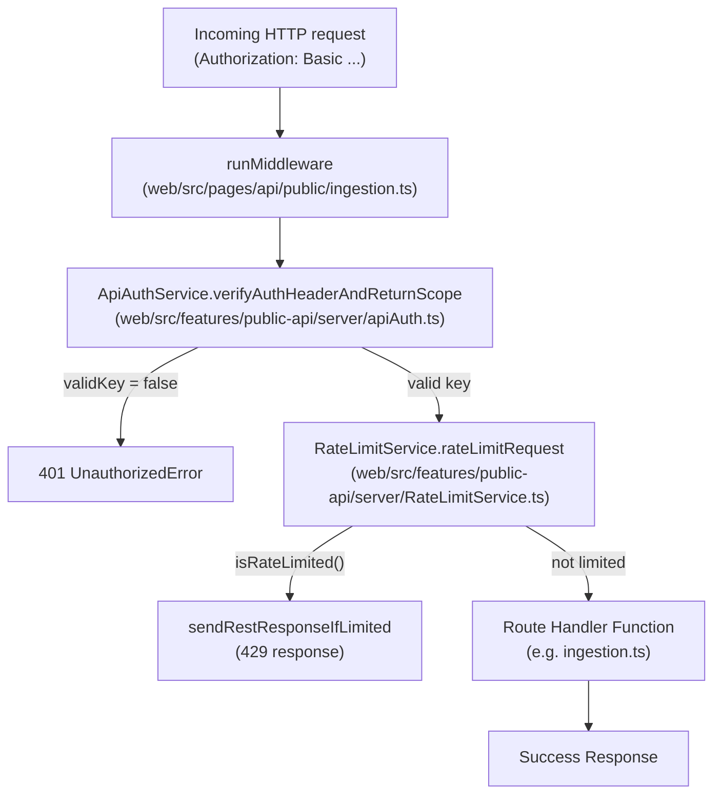
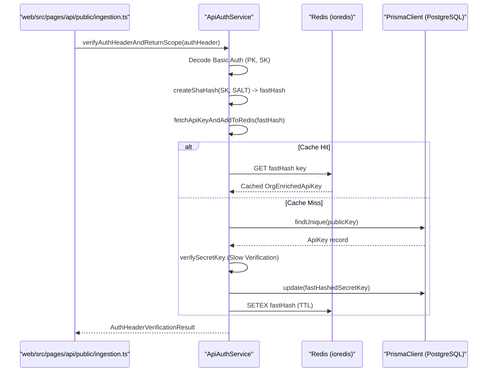
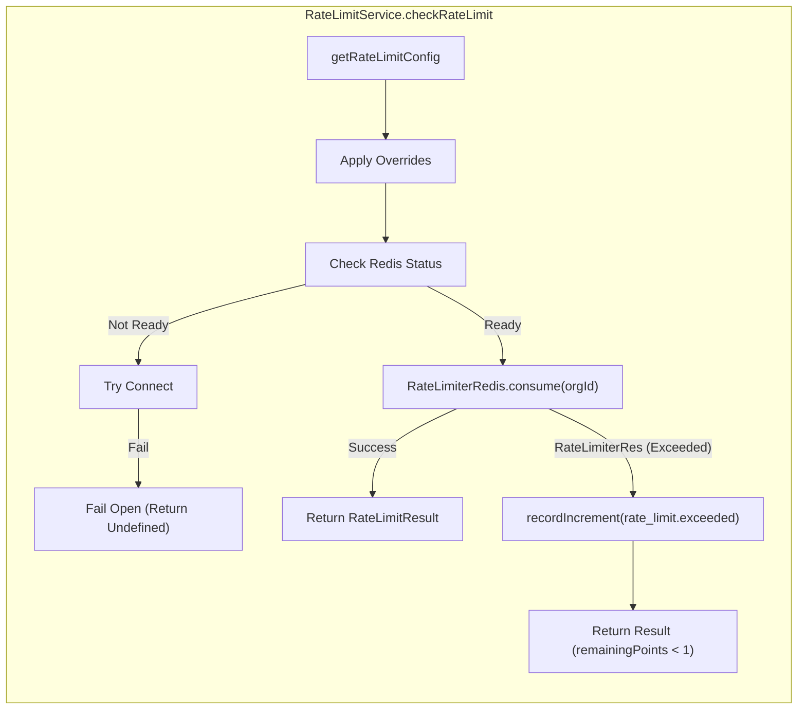

# API Authentication & Rate Limiting

Relevant source files

The following files were used as context for generating this wiki page:

- [packages/shared/prisma/migrations/20250123103200_add_retention_days_to_projects/migration.sql](packages/shared/prisma/migrations/20250123103200_add_retention_days_to_projects/migration.sql)
- [packages/shared/src/features/entitlements/plans.ts](packages/shared/src/features/entitlements/plans.ts)
- [packages/shared/src/interfaces/rate-limits.ts](packages/shared/src/interfaces/rate-limits.ts)
- [packages/shared/src/server/auth/types.ts](packages/shared/src/server/auth/types.ts)
- [packages/shared/src/server/headerPropagation.ts](packages/shared/src/server/headerPropagation.ts)
- [packages/shared/src/server/instrumentation/index.ts](packages/shared/src/server/instrumentation/index.ts)
- [web/src/__tests__/server/unit/api-auth-span.servertest.ts](web/src/__tests__/server/unit/api-auth-span.servertest.ts)
- [web/src/__tests__/server/unit/langfuse-context-propagation.servertest.ts](web/src/__tests__/server/unit/langfuse-context-propagation.servertest.ts)
- [web/src/components/VersionLabel.tsx](web/src/components/VersionLabel.tsx)
- [web/src/ee/features/ui-customization/uiCustomizationRouter.ts](web/src/ee/features/ui-customization/uiCustomizationRouter.ts)
- [web/src/ee/features/ui-customization/useUiCustomization.ts](web/src/ee/features/ui-customization/useUiCustomization.ts)
- [web/src/features/auth/lib/projectRetentionSchema.ts](web/src/features/auth/lib/projectRetentionSchema.ts)
- [web/src/features/background-migrations/components/background-migrations.tsx](web/src/features/background-migrations/components/background-migrations.tsx)
- [web/src/features/background-migrations/components/retry-background-migration.tsx](web/src/features/background-migrations/components/retry-background-migration.tsx)
- [web/src/features/background-migrations/server/background-migrations-router.ts](web/src/features/background-migrations/server/background-migrations-router.ts)
- [web/src/features/entitlements/constants/entitlements.ts](web/src/features/entitlements/constants/entitlements.ts)
- [web/src/features/entitlements/server/getPlan.ts](web/src/features/entitlements/server/getPlan.ts)
- [web/src/features/projects/components/ConfigureRetention.tsx](web/src/features/projects/components/ConfigureRetention.tsx)
- [web/src/features/public-api/server/RateLimitService.ts](web/src/features/public-api/server/RateLimitService.ts)
- [web/src/features/public-api/server/apiAuth.ts](web/src/features/public-api/server/apiAuth.ts)
- [web/src/features/public-api/server/createAuthedProjectAPIRoute.ts](web/src/features/public-api/server/createAuthedProjectAPIRoute.ts)
- [web/src/pages/api/public/ingestion.ts](web/src/pages/api/public/ingestion.ts)
- [web/src/pages/background-migrations.tsx](web/src/pages/background-migrations.tsx)
- [web/src/server/api/routers/surveys.ts](web/src/server/api/routers/surveys.ts)

This page explains how incoming public REST API requests are authenticated, how the `ApiAuthService` resolves and caches credentials, and how rate limiting is applied per project scope using Redis. It covers the runtime enforcement layer that sits at the boundary of every `POST /api/public/*` and `GET /api/public/*` endpoint.

- For how API keys are created, hashed, and stored in the database, see [4.3]().
- For the full public REST API surface, see [5.1]().
- For tRPC internal authentication (session-based), see [4.1]().
- For RBAC enforced after authentication, see [4.4]().

---

## Overview

Every public REST API request goes through a multi-stage gate. The ingestion endpoint, for example, validates permissions, rate limits, and request structure before dispatching events to the processing pipeline [web/src/pages/api/public/ingestion.ts:34-49]().

1.  **CORS & Method Validation**: Handled by `runMiddleware` with `cors` and basic method checks [web/src/pages/api/public/ingestion.ts:55-73]().
2.  **Authentication**: The `ApiAuthService` decodes the `Authorization` header, resolves the API key against PostgreSQL (with a Redis cache layer), and produces an `AuthHeaderVerificationResult` [web/src/features/public-api/server/apiAuth.ts:90-198]().
3.  **Rate Limiting**: The `RateLimitService` checks the resolved scope against configurable limits (based on the organization's plan or custom overrides) before the request is processed [web/src/features/public-api/server/RateLimitService.ts:63-82]().

**Request lifecycle diagram for Public API**

Sources: [web/src/pages/api/public/ingestion.ts:50-139](), [web/src/features/public-api/server/apiAuth.ts:90-198](), [web/src/features/public-api/server/RateLimitService.ts:63-82]()

---

## Authentication Methods

The Langfuse Public API supports multiple authentication mechanisms depending on the environment and the required access level.

### Basic Authentication
Primarily used for full project/org access. The client base64-encodes `publicKey:secretKey` and sends it as `Authorization: Basic <encoded>` [web/src/features/public-api/server/apiAuth.ts:107-109]().

| Field | Value |
|---|---|
| Username | Langfuse **Public Key** (prefix `pk-lf-...`) |
| Password | Langfuse **Secret Key** (prefix `sk-lf-...`) |

### Bearer Authentication (Public Key)
Used for limited public access (e.g., scoring from client-side environments) or Admin API access on self-hosted instances [web/src/features/public-api/server/apiAuth.ts:200-201](). 

### Admin API Key Authentication
For self-hosted instances, a global `ADMIN_API_KEY` can be used to bypass standard project-key auth. This requires the `x-langfuse-admin-api-key` and `x-langfuse-project-id` headers [web/src/features/public-api/server/createAuthedProjectAPIRoute.ts:148-183]().

Sources: [web/src/features/public-api/server/apiAuth.ts:102-201](), [web/src/features/public-api/server/createAuthedProjectAPIRoute.ts:148-183]()

---

## ApiAuthService

`ApiAuthService` (at `web/src/features/public-api/server/apiAuth.ts`) is the central class for verifying credentials.

### Credential Resolution Flow

The service uses a "fast-hash" strategy. It first checks for a SHA-256 hash of the secret key in Redis/PostgreSQL. If not found, it performs a "slow" verification against the legacy hashed key and then upgrades the record to include the `fastHashedSecretKey` for future requests [web/src/features/public-api/server/apiAuth.ts:111-161]().

Sources: [web/src/features/public-api/server/apiAuth.ts:90-161](), [web/src/features/public-api/server/apiAuth.ts:111-112]()

### API Key Caching & Invalidation

Redis caching is used to avoid expensive database lookups on every API call.
- **Invalidation**: Methods like `invalidateCachedOrgApiKeys` and `invalidateCachedProjectApiKeys` purge keys from Redis when projects move, plans change, or keys are deleted [web/src/features/public-api/server/apiAuth.ts:45-55]().
- **Deletion**: When an API key is deleted via `deleteApiKey`, it is removed from the database and invalidated in Redis for consistency [web/src/features/public-api/server/apiAuth.ts:63-88]().

---

## Rate Limiting with Redis

`RateLimitService` (at `web/src/features/public-api/server/RateLimitService.ts`) implements rate limiting using the `rate-limiter-flexible` library backed by Redis [web/src/features/public-api/server/RateLimitService.ts:3-33]().

### Strategy & Configuration

Limits are applied per **Organization ID** for specific **Resources**. The system distinguishes between different operation types via the `RateLimitResource` enum [packages/shared/src/interfaces/rate-limits.ts:4-14]().

| Resource Type | Description |
|---|---|
| `ingestion` | Main event ingestion endpoint (`/api/public/ingestion`) [web/src/pages/api/public/ingestion.ts:107](). |
| `public-api` | General GET/POST CRUD operations on traces, scores, etc. |
| `prompts` | Access to prompt management APIs. |

### Plan-Based Limits

Limits are determined by the organization's plan (e.g., `cloud:hobby`, `cloud:pro`) defined in `entitlementAccess` [web/src/features/entitlements/constants/entitlements.ts:51-171]().
- **Cloud**: Rate limits are strictly enforced using Redis if the `NEXT_PUBLIC_LANGFUSE_CLOUD_REGION` is set [web/src/features/public-api/server/RateLimitService.ts:68-70]().
- **Self-Hosted/OSS**: Rate limiting is disabled by default (`fail open`) or if Redis is unavailable [web/src/features/public-api/server/RateLimitService.ts:68-79]().
- **Overrides**: The `ApiAccessScope` can contain `rateLimitOverrides` which take precedence over plan defaults [web/src/features/public-api/server/apiAuth.ts:202]().

### Fail-Open Design

The service is designed to be resilient. If Redis is down or a connection fails, the system logs an error and allows the request to proceed [web/src/features/public-api/server/RateLimitService.ts:141-148]().

Sources: [web/src/features/public-api/server/RateLimitService.ts:84-159](), [web/src/features/entitlements/constants/entitlements.ts:51-171]()

---

## Implementation Details

### Error Handling

The ingestion handler provides unified error formatting for the Public API:
- **BaseError**: Returns mapped HTTP codes for known internal errors [web/src/pages/api/public/ingestion.ts:147-152]().
- **UnauthorizedError**: Thrown if the API key is invalid or missing `projectId` [web/src/pages/api/public/ingestion.ts:81-88]().
- **ForbiddenError**: Thrown if ingestion is suspended due to usage thresholds [web/src/pages/api/public/ingestion.ts:90-94]().
- **ZodError**: Returns `400 Bad Request` with validation details if the request body is incorrect [web/src/pages/api/public/ingestion.ts:160-166]().

### Observability & Instrumentation

Authentication and Redis operations are instrumented using OpenTelemetry.
- **ioredisRequestHook**: Redacts credentials from `AUTH` and `HELLO` commands and masks API key values in Redis traces [packages/shared/src/server/instrumentation/index.ts:16-35]().
- **addUserToSpan**: Enriches telemetry spans with `userId`, `projectId`, `orgId`, and `plan` during the authentication phase [packages/shared/src/server/instrumentation/index.ts:190-243]().
- **instrumentAsync**: Used within `ApiAuthService` to trace the `api-auth-verify` operation [web/src/features/public-api/server/apiAuth.ts:94-96]().

### Context Propagation
The `contextWithLangfuseProps` function ensures that headers and auth metadata (like `projectId` and `apiKeyId`) are propagated through the OpenTelemetry baggage into downstream spans [packages/shared/src/server/headerPropagation.ts:17-65]().

---

## Environment Variable Summary

| Variable | Description |
|---|---|
| `SALT` | Used for SHA-256 hashing of API secret keys [web/src/features/public-api/server/apiAuth.ts:111](). |
| `LANGFUSE_RATE_LIMITS_ENABLED` | Global toggle for the `RateLimitService` [web/src/features/public-api/server/RateLimitService.ts:72](). |
| `NEXT_PUBLIC_LANGFUSE_CLOUD_REGION` | Enables cloud-specific behaviors like strict rate limiting [web/src/features/public-api/server/RateLimitService.ts:68](). |
| `ADMIN_API_KEY` | Global key for administrative operations on self-hosted instances [web/src/features/public-api/server/createAuthedProjectAPIRoute.ts:170](). |

Sources: [web/src/features/public-api/server/apiAuth.ts:111](), [web/src/features/public-api/server/RateLimitService.ts:68-72](), [packages/shared/src/server/instrumentation/index.ts:16-35](), [web/src/features/public-api/server/createAuthedProjectAPIRoute.ts:170](), [packages/shared/src/server/headerPropagation.ts:17-65]()
