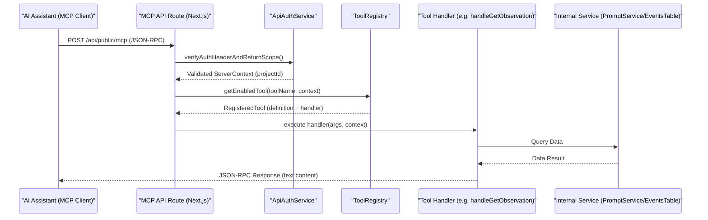
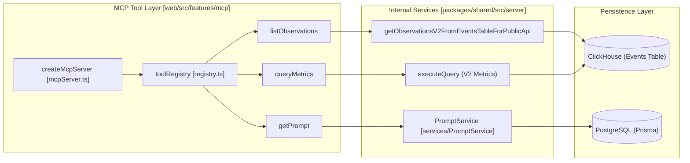

# MCP Server

Relevant source files

The following files were used as context for generating this wiki page:

- [packages/shared/src/features/prompts/types.ts](packages/shared/src/features/prompts/types.ts)
- [packages/shared/src/server/services/PromptService/index.ts](packages/shared/src/server/services/PromptService/index.ts)
- [packages/shared/src/server/services/PromptService/types.ts](packages/shared/src/server/services/PromptService/types.ts)
- [web/src/__tests__/server/mcp-tools-read.servertest.ts](web/src/__tests__/server/mcp-tools-read.servertest.ts)
- [web/src/__tests__/server/promptCache.servertest.ts](web/src/__tests__/server/promptCache.servertest.ts)
- [web/src/features/mcp/README.md](web/src/features/mcp/README.md)
- [web/src/features/mcp/features/metrics/index.ts](web/src/features/mcp/features/metrics/index.ts)
- [web/src/features/mcp/features/metrics/tools/getMetricsSchema.ts](web/src/features/mcp/features/metrics/tools/getMetricsSchema.ts)
- [web/src/features/mcp/features/metrics/tools/queryMetrics.ts](web/src/features/mcp/features/metrics/tools/queryMetrics.ts)
- [web/src/features/mcp/features/observations/index.ts](web/src/features/mcp/features/observations/index.ts)
- [web/src/features/mcp/features/observations/schema.ts](web/src/features/mcp/features/observations/schema.ts)
- [web/src/features/mcp/features/observations/tools/getObservation.ts](web/src/features/mcp/features/observations/tools/getObservation.ts)
- [web/src/features/mcp/features/prompts/index.ts](web/src/features/mcp/features/prompts/index.ts)
- [web/src/features/mcp/features/prompts/tools/getPrompt.ts](web/src/features/mcp/features/prompts/tools/getPrompt.ts)
- [web/src/features/mcp/features/prompts/tools/getPromptUnresolved.ts](web/src/features/mcp/features/prompts/tools/getPromptUnresolved.ts)
- [web/src/features/mcp/features/prompts/tools/promptReadToolFactory.ts](web/src/features/mcp/features/prompts/tools/promptReadToolFactory.ts)
- [web/src/features/mcp/server/bootstrap.ts](web/src/features/mcp/server/bootstrap.ts)
- [web/src/features/mcp/server/mcpServer.ts](web/src/features/mcp/server/mcpServer.ts)
- [web/src/features/mcp/server/registry.ts](web/src/features/mcp/server/registry.ts)
- [web/src/features/prompts/server/actions/deletePrompt.ts](web/src/features/prompts/server/actions/deletePrompt.ts)
- [web/src/features/prompts/server/actions/getPromptByName.ts](web/src/features/prompts/server/actions/getPromptByName.ts)
- [web/src/features/prompts/server/handlers/promptNameHandler.ts](web/src/features/prompts/server/handlers/promptNameHandler.ts)
- [web/src/features/telemetry/index.ts](web/src/features/telemetry/index.ts)
- [web/src/pages/api/public/mcp/index.ts](web/src/pages/api/public/mcp/index.ts)
- [web/src/pages/api/public/projects/[projectId]/apiKeys/[apiKeyId].ts](web/src/pages/api/public/projects/[projectId]/apiKeys/[apiKeyId].ts)
- [web/src/pages/api/public/projects/[projectId]/apiKeys/index.ts](web/src/pages/api/public/projects/[projectId]/apiKeys/index.ts)
- [web/src/pages/api/public/prompts.ts](web/src/pages/api/public/prompts.ts)

The Langfuse MCP (Model Context Protocol) Server enables AI assistants (such as Claude Desktop, Claude Code, or Cursor) to interact directly with Langfuse resources. It provides a standardized interface for LLMs to fetch prompts, manage versions, and inspect observability data like observations and metrics within a Langfuse project.

## Overview

The MCP implementation in Langfuse follows a **stateless per-request architecture** integrated into the Next.js web application layer at the `/api/public/mcp` endpoint [web/src/pages/api/public/mcp/index.ts:1-10](). It exposes specific "tools" across multiple domains (prompts, observations, metrics, scores) that allow an AI agent to query and manage Langfuse data.

### Key Characteristics
- **Stateless Architecture**: Each MCP request creates a fresh server instance via `createMcpServer(context)`. Authentication context is captured in handler closures, and no session state is maintained between requests [web/src/features/mcp/server/mcpServer.ts:8-13](), [web/src/features/mcp/README.md:142-156]().
- **Transport Layer**: Implements the **Streamable HTTP transport** (2025-03-26 spec), using SSE (Server-Sent Events) for the GET stream and JSON-RPC for POST messages [web/src/pages/api/public/mcp/index.ts:9-17]().
- **Feature Registry**: Tools are organized into feature modules (e.g., `promptsFeature`, `observationsFeature`, `scoresFeature`) and registered at startup via a central `toolRegistry` [web/src/features/mcp/server/bootstrap.ts:33-48]().
- **Unified Authentication**: Uses the `ApiAuthService` requiring project-scoped API keys (Public Key + Secret Key) via Basic Auth [web/src/pages/api/public/mcp/index.ts:79-99]().

**Sources:** [web/src/pages/api/public/mcp/index.ts:1-100](), [web/src/features/mcp/README.md:140-160]().

## Architecture & Data Flow

The MCP server acts as a bridge between the Model Context Protocol and Langfuse's internal services. When an AI assistant calls a tool, the request is authenticated, a server is instantiated, and the registry routes the call to the appropriate domain handler.

### Request Flow Diagram

Title: MCP Tool Execution Flow

**Sources:** [web/src/pages/api/public/mcp/index.ts:65-145](), [web/src/features/mcp/server/mcpServer.ts:73-101](), [web/src/features/mcp/server/registry.ts:156-175]().

## Available Tools

The MCP server provides tools for prompt management, observation inspection, scores management, and metrics analysis.

### Prompt Management Tools
These tools leverage the `PromptService` to handle versioning and recursive resolution of nested prompts [web/src/features/mcp/README.md:86-118]().

| Tool Name | Description |
| :--- | :--- |
| `getPrompt` | Fetches a prompt by name and label/version, recursively resolving dependency tags [web/src/features/mcp/README.md:90-99](). |
| `getPromptUnresolved` | Fetches a prompt WITHOUT resolving dependencies (preserves `@@@langfusePrompt:...@@@` tags) [web/src/features/mcp/README.md:101-110](). |
| `listPrompts` | Lists and filters prompts in the project with pagination [web/src/features/mcp/README.md:56](). |
| `createTextPrompt` | Creates a new text prompt version [web/src/features/mcp/README.md:57](). |
| `createChatPrompt` | Creates a new chat prompt version (OpenAI-style messages) [web/src/features/mcp/README.md:58](). |

### Observation & Metrics Tools
These tools interact with the **Events Table V2** backend to provide high-performance observability data [web/src/features/mcp/features/observations/index.ts:24-56]().

| Tool Name | Description |
| :--- | :--- |
| `listObservations` | Find generations, spans, and events with advanced filters and field projection [web/src/features/mcp/README.md:67](). |
| `getObservation` | Fetch a single observation by ID, including payloads and metadata [web/src/features/mcp/features/observations/tools/getObservation.ts:24-33](). |
| `queryMetrics` | Query usage, cost, and quality metrics using the V2 metrics engine [web/src/features/mcp/features/metrics/tools/queryMetrics.ts:9-12](). |
| `getMetricsSchema` | Discover available metrics views, dimensions, and measures [web/src/features/mcp/features/metrics/tools/getMetricsSchema.ts:16-19](). |

### Score Tools
The `scoresFeature` allows AI assistants to manage evaluations and human-in-the-loop feedback [web/src/features/mcp/server/bootstrap.ts:41]().

| Tool Name | Description |
| :--- | :--- |
| `createScore` | Create a new score for a trace or observation [web/src/__tests__/server/mcp-tools-read.servertest.ts:89-91](). |
| `listScores` | List scores in the project with filtering [web/src/__tests__/server/mcp-tools-read.servertest.ts:113-115](). |
| `createScoreConfig` | Define a new score configuration (categorical, numeric, etc.) [web/src/__tests__/server/mcp-tools-read.servertest.ts:85-87](). |

Title: MCP Tool to Code Entity Bridge

**Sources:** [web/src/features/mcp/server/registry.ts:75-113](), [web/src/features/mcp/server/mcpServer.ts:46-104](), [packages/shared/src/server/services/PromptService/index.ts:20-47]().

## Authentication & Security

The MCP server enforces strict security boundaries:
1.  **Project Scoping**: Only project-scoped API keys are permitted. Organization-level keys and Bearer tokens are rejected [web/src/pages/api/public/mcp/index.ts:92-99]().
2.  **In-App Agent Keys**: Specific tools can be gated for "In-App Agent" keys using the `allowInAppAgentKey` flag in the `RegisteredTool` definition [web/src/features/mcp/server/registry.ts:22-32](). The registry's `canUseTool` method checks this against the `ServerContext` [web/src/features/mcp/server/registry.ts:177-183]().
3.  **CORS & Headers**: Validates Host/Origin headers via `validateMcpRequestSecurity` and applies specific CORS headers for MCP client compatibility [web/src/pages/api/public/mcp/index.ts:70-71]().
4.  **Rate Limiting**: Integrated with `RateLimitService` using the `public-api` bucket [web/src/pages/api/public/mcp/index.ts:109-117]().

**Sources:** [web/src/pages/api/public/mcp/index.ts:79-137](), [web/src/features/mcp/server/registry.ts:156-183]().

## Implementation Details

### Stateless Server Creation
The `createMcpServer` function instantiates the `@modelcontextprotocol/sdk` Server. It defines two primary request handlers:
- `ListToolsRequestSchema`: Queries the `toolRegistry` to return available tools based on the current project's context and enabled features [web/src/features/mcp/server/mcpServer.ts:60-70]().
- `CallToolRequestSchema`: Routes tool execution to the registered handler via `toolRegistry.getEnabledTool` and wraps the result in MCP content format [web/src/features/mcp/server/mcpServer.ts:73-101]().

### Feature Bootstrapping
Langfuse uses a registration pattern to avoid circular dependencies. Feature modules (e.g., `observationsFeature`) define their own tools and an optional `isEnabled` check (e.g., checking the `LANGFUSE_ENABLE_EVENTS_TABLE_V2_APIS` flag) [web/src/features/mcp/features/observations/index.ts:24-56](). All features (prompts, observations, scores, metrics, models, etc.) are registered in `bootstrapMcpFeatures()` at application startup [web/src/features/mcp/server/bootstrap.ts:33-48]().

### Prompt Resolution Graph
When `getPrompt` is called, the `PromptService` builds a `PromptGraph` to resolve nested dependencies. It recursively fetches referenced prompts up to a `MAX_PROMPT_NESTING_DEPTH` of 5 [packages/shared/src/server/services/PromptService/index.ts:18-47](). The `getPromptUnresolved` tool bypasses this resolution by setting `resolve: false` in the `PromptParams` [packages/shared/src/server/services/PromptService/index.ts:48-50]().

**Sources:** [web/src/features/mcp/server/mcpServer.ts:46-104](), [web/src/features/mcp/server/registry.ts:85-113](), [web/src/features/mcp/server/bootstrap.ts:1-56](), [packages/shared/src/server/services/PromptService/index.ts:18-145]().
