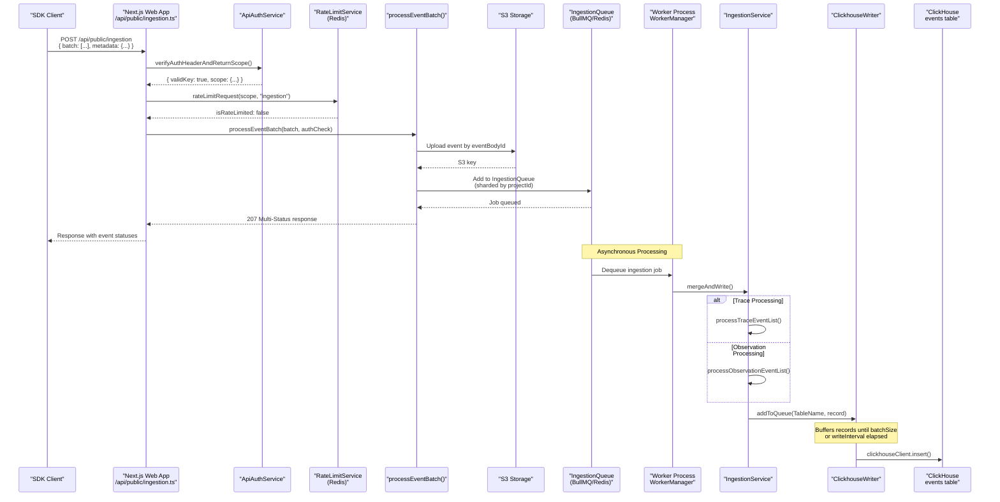
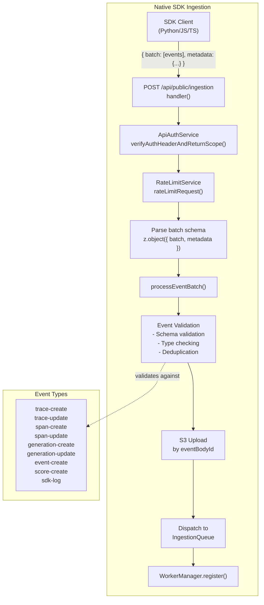

# Ingestion Overview

Relevant source files

The following files were used as context for generating this wiki page:

- [.env.dev-redis-cluster.example](.env.dev-redis-cluster.example)
- [.vscode/launch.json](.vscode/launch.json)
- [fern/apis/server/definition/ingestion.yml](fern/apis/server/definition/ingestion.yml)
- [packages/shared/clickhouse/scripts/dev-tables.sh](packages/shared/clickhouse/scripts/dev-tables.sh)
- [packages/shared/src/env.ts](packages/shared/src/env.ts)
- [packages/shared/src/server/auth/types.ts](packages/shared/src/server/auth/types.ts)
- [packages/shared/src/server/headerPropagation.ts](packages/shared/src/server/headerPropagation.ts)
- [packages/shared/src/server/index.ts](packages/shared/src/server/index.ts)
- [packages/shared/src/server/ingestion/types.ts](packages/shared/src/server/ingestion/types.ts)
- [packages/shared/src/server/instrumentation/index.ts](packages/shared/src/server/instrumentation/index.ts)
- [packages/shared/src/server/queries/clickhouse-sql/clickhouse-filter.ts](packages/shared/src/server/queries/clickhouse-sql/clickhouse-filter.ts)
- [packages/shared/src/server/queues.ts](packages/shared/src/server/queues.ts)
- [packages/shared/src/server/redis/eventPropagationQueue.ts](packages/shared/src/server/redis/eventPropagationQueue.ts)
- [packages/shared/src/server/redis/getQueue.ts](packages/shared/src/server/redis/getQueue.ts)
- [packages/shared/src/server/repositories/definitions.ts](packages/shared/src/server/repositories/definitions.ts)
- [packages/shared/src/server/test-utils/tracing-factory.ts](packages/shared/src/server/test-utils/tracing-factory.ts)
- [packages/shared/src/utils/json.ts](packages/shared/src/utils/json.ts)
- [web/src/__tests__/server/unit/api-auth-span.servertest.ts](web/src/__tests__/server/unit/api-auth-span.servertest.ts)
- [web/src/__tests__/server/unit/langfuse-context-propagation.servertest.ts](web/src/__tests__/server/unit/langfuse-context-propagation.servertest.ts)
- [web/src/features/public-api/server/apiAuth.ts](web/src/features/public-api/server/apiAuth.ts)
- [web/src/features/public-api/server/createAuthedProjectAPIRoute.ts](web/src/features/public-api/server/createAuthedProjectAPIRoute.ts)
- [web/src/pages/api/admin/bullmq/index.ts](web/src/pages/api/admin/bullmq/index.ts)
- [web/src/pages/api/public/ingestion.ts](web/src/pages/api/public/ingestion.ts)
- [worker/src/app.ts](worker/src/app.ts)
- [worker/src/backgroundMigrations/backfillEventsHistoric.ts](worker/src/backgroundMigrations/backfillEventsHistoric.ts)
- [worker/src/backgroundMigrations/backfillEventsHistoricFromParts.ts](worker/src/backgroundMigrations/backfillEventsHistoricFromParts.ts)
- [worker/src/backgroundMigrations/backfillExperimentsHistoric.ts](worker/src/backgroundMigrations/backfillExperimentsHistoric.ts)
- [worker/src/env.ts](worker/src/env.ts)
- [worker/src/features/eventPropagation/handleEventPropagationJob.ts](worker/src/features/eventPropagation/handleEventPropagationJob.ts)
- [worker/src/features/eventPropagation/handleExperimentBackfill.ts](worker/src/features/eventPropagation/handleExperimentBackfill.ts)
- [worker/src/features/tokenisation/usage.ts](worker/src/features/tokenisation/usage.ts)
- [worker/src/queues/ingestionQueue.ts](worker/src/queues/ingestionQueue.ts)
- [worker/src/queues/workerManager.ts](worker/src/queues/workerManager.ts)
- [worker/src/services/IngestionService/index.ts](worker/src/services/IngestionService/index.ts)
- [worker/src/services/IngestionService/tests/IngestionService.integration.test.ts](worker/src/services/IngestionService/tests/IngestionService.integration.test.ts)
- [worker/src/services/IngestionService/tests/calculateTokenCost.unit.test.ts](worker/src/services/IngestionService/tests/calculateTokenCost.unit.test.ts)
- [worker/src/services/IngestionService/tests/utils.unit.test.ts](worker/src/services/IngestionService/tests/utils.unit.test.ts)
- [worker/src/services/IngestionService/utils.ts](worker/src/services/IngestionService/utils.ts)
- [worker/src/utils/shutdown.ts](worker/src/utils/shutdown.ts)

This document describes the high-level architecture of Langfuse's data ingestion system, which processes observability events from SDK clients and OpenTelemetry integrations. It covers the request flow from initial API authentication through asynchronous processing and eventual storage in ClickHouse.

## Purpose and Architecture

The ingestion system is designed to handle high-volume telemetry data with the following objectives:

- **Durability**: Events are persisted to S3 immediately upon receipt as an event cache and for long-term storage [web/src/pages/api/public/ingestion.ts:42-45]().
- **Scalability**: Asynchronous queue-based processing enables horizontal scaling via BullMQ and Redis [web/src/pages/api/public/ingestion.ts:44-44]().
- **Reliability**: The system supports fallback to synchronous processing on errors and utilizes a dual-write architecture for eventual consistency [web/src/pages/api/public/ingestion.ts:45-45]().
- **Flexibility**: Supports both native Langfuse SDK events and OpenTelemetry OTLP traces.

The system uses a **dual-database architecture** where PostgreSQL stores metadata and configuration, while ClickHouse stores high-volume event data.

**Sources:** [web/src/pages/api/public/ingestion.ts:34-49](), [packages/shared/src/env.ts:81-101]()

## Ingestion Flow: Request to Storage

The following diagram associates high-level system components with specific code entities responsible for the ingestion flow.

**Sources:** [web/src/pages/api/public/ingestion.ts:50-140](), [worker/src/queues/ingestionQueue.ts:29-147](), [worker/src/services/IngestionService/index.ts:136-194](), [worker/src/services/ClickhouseWriter.ts:25-25]()

## Dual Ingestion Pathways

Langfuse supports two distinct ingestion mechanisms, each with its own endpoint and processing logic:

| Pathway | Endpoint | Event Format | Use Case |
|---------|----------|--------------|----------|
| **Native SDK** | `/api/public/ingestion` | Langfuse event schema (trace-create, span-create, score-create, etc.) | Applications using Langfuse Python/JS SDKs |
| **OpenTelemetry** | `/api/public/otel/v1/traces` | OTLP (OpenTelemetry Protocol) format | Applications using standard OpenTelemetry instrumentation |

### Native SDK Ingestion Path

The native path validates incoming batches against Zod schemas before persisting them to S3 and dispatching to the worker queue.

**Sources:** [web/src/pages/api/public/ingestion.ts:119-140](), [packages/shared/src/server/queues.ts:14-28](), [packages/shared/src/server/index.ts:54-54]()

## Authentication and Rate Limiting

Before any event processing occurs, the ingestion endpoint enforces authentication and rate limiting using `ApiAuthService` and `RateLimitService`.

- **ApiAuthService**: Verifies the `Basic` or `Bearer` auth header. It utilizes a fast-hashing mechanism (`fastHashedSecretKey`) with Redis caching to minimize database lookups [web/src/features/public-api/server/apiAuth.ts:107-166]().
- **RateLimitService**: Checks against project-specific ingestion limits. It can "fail open" if the rate limiter itself returns an error to ensure availability [web/src/pages/api/public/ingestion.ts:104-117]().

**Sources:** [web/src/pages/api/public/ingestion.ts:76-117](), [web/src/features/public-api/server/apiAuth.ts:33-206]()

## Event Propagation and V4 Beta Architecture

In the V4 architecture, Langfuse uses an event-sourcing pattern. Observations are first written to a staging table (`observations_batch_staging`) before being propagated to the final `events_full` table.

- **Staging Table**: Uses 3-minute partitions to group observations for batch processing [packages/shared/clickhouse/scripts/dev-tables.sh:75-81]().
- **Event Propagation Job**: The `handleEventPropagationJob` joins staged observations with trace metadata and inserts them into `events_full`. It tracks the `last-processed-partition` in Redis to ensure sequential processing [worker/src/features/eventPropagation/handleEventPropagationJob.ts:58-126]().
- **TTL**: Partitions in the staging table are automatically expired after 12 hours [packages/shared/clickhouse/scripts/dev-tables.sh:129-130]().

**Sources:** [worker/src/features/eventPropagation/handleEventPropagationJob.ts:15-185](), [packages/shared/clickhouse/scripts/dev-tables.sh:75-130]()

## Core Component: IngestionService

The `IngestionService` handles the heavy lifting of transforming loose event inputs into strict ClickHouse records.

- **mergeAndWrite**: Dispatches events based on type (`trace`, `observation`, `score`, `dataset_run_item`) [worker/src/services/IngestionService/index.ts:148-194]().
- **createEventRecord**: Performs critical enrichments, including prompt lookup via `PromptService`, model/usage cost calculation, and metadata flattening [worker/src/services/IngestionService/index.ts:211-235]().
- **ClickhouseReadSkipCache**: Optimizes ingestion by skipping unnecessary ClickHouse reads for projects created after S3 ingestion was activated [worker/src/services/IngestionService/index.ts:65-65](), [worker/src/app.ts:119-124]().

**Sources:** [worker/src/services/IngestionService/index.ts:136-235](), [worker/src/app.ts:119-124]()

## The ClickhouseWriter Component

The `ClickhouseWriter` is a singleton service that buffers records and performs batch writes to ClickHouse to optimize throughput.

- **Buffering**: Records are added to a local queue and flushed when `batchSize` is reached or the `writeInterval` expires. Configuration is controlled via `LANGFUSE_INGESTION_CLICKHOUSE_WRITE_BATCH_SIZE` and `LANGFUSE_INGESTION_CLICKHOUSE_WRITE_INTERVAL_MS` [worker/src/env.ts:90-97]().
- **Table Logging**: It can log file metadata to `BlobStorageFileLog` for tracking and retention purposes [worker/src/queues/ingestionQueue.ts:68-81]().

**Sources:** [worker/src/queues/ingestionQueue.ts:60-81](), [worker/src/env.ts:90-101]()

## The IngestionQueue Processor

The `ingestionQueueProcessorBuilder` creates the processor for handling ingestion jobs. It includes several critical features:

- **Secondary Queue Redirection**: If a project is flagged for S3 slowdown or manually configured via `LANGFUSE_SECONDARY_INGESTION_QUEUE_ENABLED_PROJECT_IDS`, jobs are redirected to a secondary queue to isolate performance issues [worker/src/queues/ingestionQueue.ts:108-133]().
- **S3 Download Strategy**: The processor can either list files in a prefix or perform a direct download if `skipS3List` is set (common for OTel observations) [worker/src/queues/ingestionQueue.ts:158-180]().
- **Redis Cache Check**: If enabled via `LANGFUSE_ENABLE_REDIS_SEEN_EVENT_CACHE`, it checks Redis to skip processing recently seen events [worker/src/queues/ingestionQueue.ts:84-106]().

**Sources:** [worker/src/queues/ingestionQueue.ts:29-180](), [worker/src/env.ts:150-155]()

## Monitoring and Resource Management

The ingestion pipeline implements multiple layers of observability:
- **WorkerManager Metrics**: Wraps processors to record `wait_time`, `processing_time`, and queue lengths into metrics [worker/src/queues/workerManager.ts:24-24]().
- **Instrumentation**: Uses OpenTelemetry spans to track job execution, including attributes for `projectId`, `eventBodyId`, and `fileKey` [worker/src/queues/ingestionQueue.ts:38-57]().
- **Graceful Shutdown**: The `onShutdown` handler ensures that workers are closed and pending ClickHouse writes are flushed before the process exits [worker/src/utils/shutdown.ts:55-63]().

**Sources:** [worker/src/queues/ingestionQueue.ts:38-57](), [worker/src/utils/shutdown.ts:19-63]()
