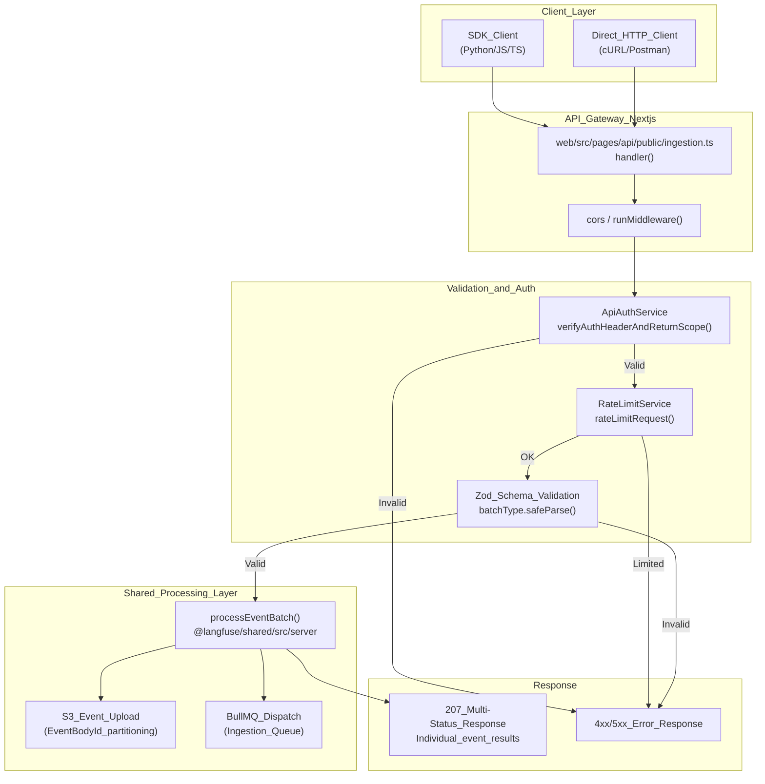
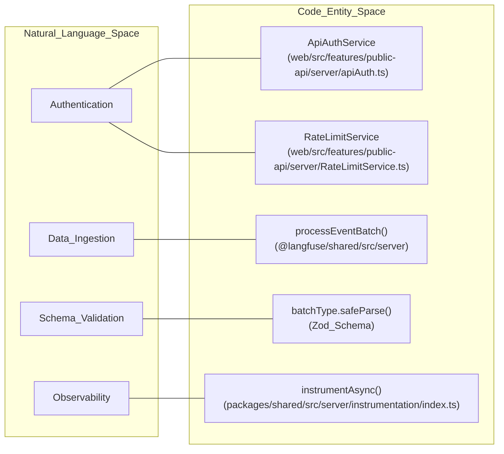
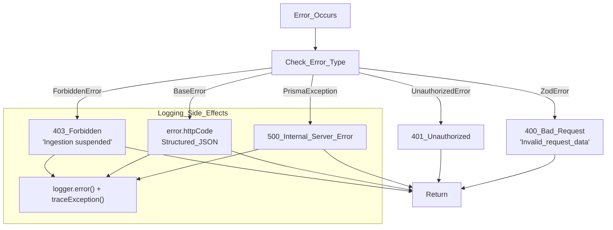

# Ingestion API Endpoints

<details>
<summary>Relevant source files</summary>

The following files were used as context for generating this wiki page:

- [fern/apis/server/definition/trace.yml](fern/apis/server/definition/trace.yml)
- [packages/shared/src/server/auth/types.ts](packages/shared/src/server/auth/types.ts)
- [packages/shared/src/server/headerPropagation.ts](packages/shared/src/server/headerPropagation.ts)
- [packages/shared/src/server/instrumentation/index.ts](packages/shared/src/server/instrumentation/index.ts)
- [web/src/__tests__/server/unit/api-auth-span.servertest.ts](web/src/__tests__/server/unit/api-auth-span.servertest.ts)
- [web/src/__tests__/server/unit/langfuse-context-propagation.servertest.ts](web/src/__tests__/server/unit/langfuse-context-propagation.servertest.ts)
- [web/src/features/public-api/server/apiAuth.ts](web/src/features/public-api/server/apiAuth.ts)
- [web/src/features/public-api/server/createAuthedProjectAPIRoute.ts](web/src/features/public-api/server/createAuthedProjectAPIRoute.ts)
- [web/src/features/public-api/types/traces.ts](web/src/features/public-api/types/traces.ts)
- [web/src/pages/api/public/events.ts](web/src/pages/api/public/events.ts)
- [web/src/pages/api/public/generations.ts](web/src/pages/api/public/generations.ts)
- [web/src/pages/api/public/ingestion.ts](web/src/pages/api/public/ingestion.ts)
- [web/src/pages/api/public/observations/[observationId].ts](web/src/pages/api/public/observations/[observationId].ts)
- [web/src/pages/api/public/observations/index.ts](web/src/pages/api/public/observations/index.ts)
- [web/src/pages/api/public/spans.ts](web/src/pages/api/public/spans.ts)
- [web/src/pages/api/public/traces/[traceId].ts](web/src/pages/api/public/traces/[traceId].ts)
- [web/src/pages/api/public/traces/index.ts](web/src/pages/api/public/traces/index.ts)

</details>


This page documents the HTTP API endpoints that receive tracing data from external clients (SDKs, integrations, OpenTelemetry instrumentation). These endpoints serve as the entry point to Langfuse's data ingestion pipeline and are responsible for authentication, validation, and rate limiting before forwarding events to the asynchronous processing system.

For information about the internal processing logic after events are received, see [Ingestion Overview (6.1)]() and [Event Processing & Validation (6.3)]().

## Overview

The ingestion API provides several endpoints for data submission. The primary endpoint is a batch-oriented route that accepts various event types (traces, spans, generations, scores) in a single request.

| Endpoint | Purpose | Auth Method | Max Body Size |
|----------|---------|-------------|---------------|
| `POST /api/public/ingestion` | Main batch ingestion endpoint for traces, spans, generations, and scores | Basic Auth (Public Key + Secret Key) | 4.5 MB |
| `POST /api/public/traces` | Legacy single-trace ingestion (proxies to batch system) | Basic Auth | 4.5 MB |
| `POST /api/public/otel/v1/traces` | OpenTelemetry-specific ingestion endpoint | Basic Auth | 4.5 MB |

Sources: [web/src/pages/api/public/ingestion.ts:26-32](), [web/src/pages/api/public/ingestion.ts:50-53](), [web/src/pages/api/public/traces/index.ts:36-41](), [fern/apis/server/definition/trace.yml:122-124]()

## Main Ingestion Endpoint Architecture

The `/api/public/ingestion` endpoint is a high-throughput entry point designed for asynchronous processing. It performs minimal synchronous work (validation and auth) before offloading data to S3 and Redis-backed queues.

### Ingestion Request Flow



Sources: [web/src/pages/api/public/ingestion.ts:50-139](), [web/src/pages/api/public/ingestion.ts:34-49](), [web/src/features/public-api/server/apiAuth.ts:90-102]()

## Request Format

### HTTP Method and Headers
The ingestion endpoint only accepts `POST` requests. Authentication uses Basic Auth where the username is the `Public Key` and the password is the `Secret Key`.

Optional headers prefixed with `x-langfuse-` or `x_langfuse_` are captured and added to the OpenTelemetry span attributes for observability via `currentSpan?.setAttributes`. This context is propagated through the execution using `contextWithLangfuseProps`.

Sources: [web/src/pages/api/public/ingestion.ts:73](), [web/src/pages/api/public/ingestion.ts:61-71](), [web/src/pages/api/public/ingestion.ts:96-102](), [packages/shared/src/server/headerPropagation.ts:17-49]()

### Request Body Schema
The request body must contain a `batch` array and optional `metadata`.

```typescript
{
  batch: Array<IngestionEvent>,
  metadata?: any
}
```

The `batch` is validated using Zod at runtime to ensure it is an array of objects. Each object in the array is a discriminated union based on the `type` field.

Sources: [web/src/pages/api/public/ingestion.ts:118-131](), [web/src/features/public-api/types/traces.ts:123-124]()

### Event Types
The ingestion API supports several event types within a single batch.

| Type | Description | Entity Target |
|------|-------------|---------------|
| `trace-create` | Creates or updates a trace | `trace` |
| `span-create` | Creates a new span observation | `observation` |
| `span-update` | Updates an existing span | `observation` |
| `generation-create` | Creates a generation (LLM call) | `observation` |
| `generation-update` | Updates a generation | `observation` |
| `score-create` | Creates a new evaluation score | `score` |
| `event-create` | Creates a basic event observation | `observation` |
| `sdk-log` | SDK internal logging for debugging | N/A |

Sources: [web/src/pages/api/public/traces/index.ts:19-24](), [web/src/pages/api/public/traces/index.ts:43-48]()

## Authentication and Rate Limiting

### API Key Verification
Authentication is handled by `ApiAuthService.verifyAuthHeaderAndReturnScope()`. This service validates the key against PostgreSQL (using `prisma`) and checks if the project has exceeded its usage threshold. The service utilizes `createShaHash` to compare provided credentials against stored `fastHashedSecretKey` values, which are also cached in Redis via `fetchApiKeyAndAddToRedis`.

If `authCheck.scope.isIngestionSuspended` is true, the API returns a `403 Forbidden` error with the message "Ingestion suspended: Usage threshold exceeded. Please upgrade your plan."

Sources: [web/src/pages/api/public/ingestion.ts:76-94](), [web/src/features/public-api/server/apiAuth.ts:90-117](), [web/src/features/public-api/server/apiAuth.ts:154-161](), [packages/shared/src/server/auth/types.ts:23-32]()

### Rate Limit Enforcement
Rate limits are checked via `RateLimitService` using Redis as the backend. The service tracks "ingestion" specific limits per project. If a request is rate-limited, it returns a response via `sendRestResponseIfLimited`.

The system "fails open" for rate limiting: if the Redis check fails, the error is logged via `logger.error` but the request is allowed to proceed to ensure data availability.

Sources: [web/src/pages/api/public/ingestion.ts:103-117](), [web/src/features/public-api/server/createAuthedProjectAPIRoute.ts:14]()

## Code Entity Association

This diagram bridges the Natural Language concepts to the specific Code Entities used in the ingestion layer.



Sources: [web/src/pages/api/public/ingestion.ts:20-23](), [web/src/features/public-api/server/apiAuth.ts:33](), [packages/shared/src/server/instrumentation/index.ts:53]()

## Processing and Response

### The 207 Multi-Status Response
Because a single request contains a batch of events, Langfuse uses HTTP `207 Multi-Status`. The response body contains two arrays: `successes` and `errors`, generated by `processEventBatch`.

Sources: [web/src/pages/api/public/ingestion.ts:134-139]()

### Error Handling Flow



Sources: [web/src/pages/api/public/ingestion.ts:141-175](), [packages/shared/src/server/instrumentation/index.ts:141-145]()

## Technical Constraints

- **Batch Size Limit**: Requests are limited to **4.5 MB** via the Next.js `bodyParser` config in the API route.
- **Async Workflow**: The `processEventBatch` function uploads each event to S3 for long-term storage and adds the event batch to a queue for async processing.
- **Instrumentation**: The entire ingestion handler is wrapped in `opentelemetry.context.with(ctx, ...)` to ensure that all downstream operations (database calls, Redis checks) are correctly attributed to the specific project and API key.

Sources: [web/src/pages/api/public/ingestion.ts:26-32](), [web/src/pages/api/public/ingestion.ts:34-49](), [web/src/pages/api/public/ingestion.ts:102](), [packages/shared/src/server/instrumentation/index.ts:190-200]()

## Code Entity Reference

| Entity | Source File | Role |
|--------|-------------|------|
| `handler` | [web/src/pages/api/public/ingestion.ts:50]() | Entry point for `/api/public/ingestion` |
| `processEventBatch` | [web/src/pages/api/public/ingestion.ts:20]() | Orchestrates S3 upload and queue dispatch |
| `ApiAuthService` | [web/src/features/public-api/server/apiAuth.ts:33]() | Verifies Basic Auth and project scope |
| `createAuthedProjectAPIRoute` | [web/src/features/public-api/server/createAuthedProjectAPIRoute.ts:30]() | Factory for project-authenticated API routes (traces, observations) |
| `instrumentAsync` | [packages/shared/src/server/instrumentation/index.ts:53]() | Wraps authentication and ingestion logic for tracing |
| `contextWithLangfuseProps` | [packages/shared/src/server/headerPropagation.ts:17]() | Propagates Langfuse-specific headers into OpenTelemetry baggage |

Sources: [web/src/pages/api/public/ingestion.ts:1-175](), [web/src/features/public-api/server/apiAuth.ts:33-40](), [packages/shared/src/server/instrumentation/index.ts:53-93](), [web/src/features/public-api/server/createAuthedProjectAPIRoute.ts:78-130]()
