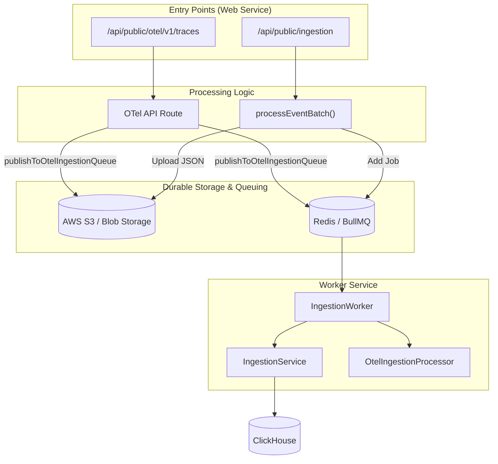
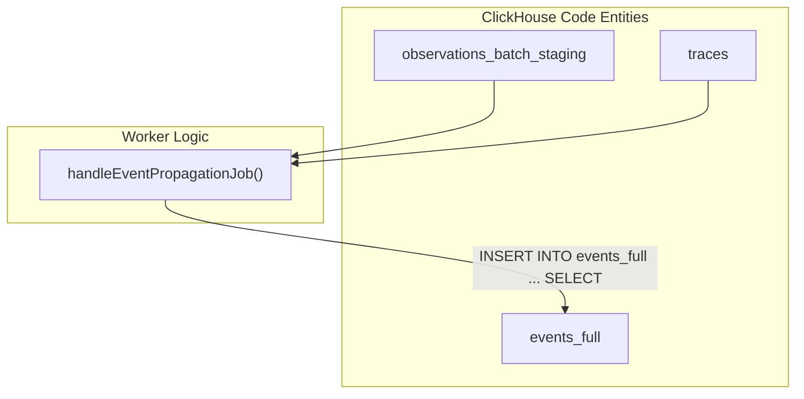

# Event Processing & Validation

Relevant source files

The following files were used as context for generating this wiki page:

- [fern/apis/client/definition/score.yml](fern/apis/client/definition/score.yml)
- [fern/apis/server/definition/ingestion.yml](fern/apis/server/definition/ingestion.yml)
- [fern/apis/server/definition/legacy/score-v1.yml](fern/apis/server/definition/legacy/score-v1.yml)
- [packages/shared/AGENTS.md](packages/shared/AGENTS.md)
- [packages/shared/clickhouse/scripts/dev-tables.sh](packages/shared/clickhouse/scripts/dev-tables.sh)
- [packages/shared/src/domain/scores.ts](packages/shared/src/domain/scores.ts)
- [packages/shared/src/encryption/signature.ts](packages/shared/src/encryption/signature.ts)
- [packages/shared/src/features/scores/interfaces/api/shared.ts](packages/shared/src/features/scores/interfaces/api/shared.ts)
- [packages/shared/src/server/cache/index.ts](packages/shared/src/server/cache/index.ts)
- [packages/shared/src/server/cache/localCache.ts](packages/shared/src/server/cache/localCache.ts)
- [packages/shared/src/server/ingestion/modelMatch.ts](packages/shared/src/server/ingestion/modelMatch.ts)
- [packages/shared/src/server/ingestion/types.ts](packages/shared/src/server/ingestion/types.ts)
- [packages/shared/src/server/ingestion/validateAndInflateScore.ts](packages/shared/src/server/ingestion/validateAndInflateScore.ts)
- [packages/shared/src/server/queries/clickhouse-sql/clickhouse-filter.ts](packages/shared/src/server/queries/clickhouse-sql/clickhouse-filter.ts)
- [packages/shared/src/server/redis/eventPropagationQueue.ts](packages/shared/src/server/redis/eventPropagationQueue.ts)
- [packages/shared/src/server/repositories/definitions.ts](packages/shared/src/server/repositories/definitions.ts)
- [packages/shared/src/server/test-utils/tracing-factory.ts](packages/shared/src/server/test-utils/tracing-factory.ts)
- [packages/shared/src/utils/json.ts](packages/shared/src/utils/json.ts)
- [web/public/generated/api-client/openapi.yml](web/public/generated/api-client/openapi.yml)
- [web/src/__tests__/server/scores-api-v1.servertest.ts](web/src/__tests__/server/scores-api-v1.servertest.ts)
- [web/src/__tests__/server/validateAndInflateScore.servertest.ts](web/src/__tests__/server/validateAndInflateScore.servertest.ts)
- [worker/AGENTS.md](worker/AGENTS.md)
- [worker/src/__tests__/localCache.test.ts](worker/src/__tests__/localCache.test.ts)
- [worker/src/__tests__/modelMatch.test.ts](worker/src/__tests__/modelMatch.test.ts)
- [worker/src/__tests__/signature.test.ts](worker/src/__tests__/signature.test.ts)
- [worker/src/backgroundMigrations/backfillEventsHistoric.ts](worker/src/backgroundMigrations/backfillEventsHistoric.ts)
- [worker/src/backgroundMigrations/backfillEventsHistoricFromParts.ts](worker/src/backgroundMigrations/backfillEventsHistoricFromParts.ts)
- [worker/src/backgroundMigrations/backfillExperimentsHistoric.ts](worker/src/backgroundMigrations/backfillExperimentsHistoric.ts)
- [worker/src/features/entityChange/entityChangeWorker.ts](worker/src/features/entityChange/entityChangeWorker.ts)
- [worker/src/features/eventPropagation/handleEventPropagationJob.ts](worker/src/features/eventPropagation/handleEventPropagationJob.ts)
- [worker/src/features/eventPropagation/handleExperimentBackfill.ts](worker/src/features/eventPropagation/handleExperimentBackfill.ts)
- [worker/src/queues/entityChangeQueue.ts](worker/src/queues/entityChangeQueue.ts)
- [worker/src/services/IngestionService/index.ts](worker/src/services/IngestionService/index.ts)
- [worker/src/services/IngestionService/tests/IngestionService.integration.test.ts](worker/src/services/IngestionService/tests/IngestionService.integration.test.ts)
- [worker/src/services/IngestionService/tests/calculateTokenCost.unit.test.ts](worker/src/services/IngestionService/tests/calculateTokenCost.unit.test.ts)
- [worker/src/services/IngestionService/tests/utils.unit.test.ts](worker/src/services/IngestionService/tests/utils.unit.test.ts)
- [worker/src/services/IngestionService/utils.ts](worker/src/services/IngestionService/utils.ts)

## Purpose and Scope

Event Processing & Validation is the critical entry stage of the Langfuse ingestion pipeline. It handles the transition of raw data from the Public API (REST or OpenTelemetry) into a structured, validated format suitable for storage and asynchronous processing. This stage is responsible for synchronous validation, deduplication using S3 as a durable buffer, and dispatching events to BullMQ queues.

This page details the implementation of `processEventBatch`, the event transformation logic in `IngestionService`, and the ingestion architecture that ensures data consistency between staging tables and the modern ClickHouse events schema.

---

## Ingestion Flow Overview

The ingestion process follows two primary paths depending on the source: the standard Ingestion API and the OpenTelemetry (OTEL) collector. Both converge on S3 storage and BullMQ dispatch.

### High-Level Ingestion Architecture

**Sources:** [packages/shared/src/server/ingestion/processEventBatch.ts:104-116](), [web/src/pages/api/public/otel/v1/traces/index.ts:33-38](), [packages/shared/src/server/otel/OtelIngestionProcessor.ts:183-219]()

---

## Event Validation & Deduplication

### processEventBatch
The `processEventBatch` function in `packages/shared` is the core utility for handling incoming event arrays from the Public REST API. It performs several critical steps:

1.  **Schema Validation**: It uses `createIngestionEventSchema` to validate every event in the batch. Invalid events are collected into an `errors` array and returned with a `207 Multi-Status` response. [packages/shared/src/server/ingestion/processEventBatch.ts:154-169]()
2.  **Authorization**: Checks if the API key scope permits the specific project ID referenced in the event via `isAuthorized`. [packages/shared/src/server/ingestion/processEventBatch.ts:170-176]()
3.  **Grouping by eventBodyId**: Events are grouped by `eventBodyId` (typically the ID of the trace or observation). This allows Langfuse to batch multiple updates to the same entity into a single S3 object and queue job, effectively deduplicating high-frequency updates. [packages/shared/src/server/ingestion/processEventBatch.ts:192-209]()
4.  **S3 Upload**: Raw events are uploaded to S3 using the `StorageService`. The path is structured using the project ID and a timestamp (e.g., `yyyy/mm/dd/hh/mm`) to optimize S3 partitioning. [packages/shared/src/server/ingestion/processEventBatch.ts:241-255]()
5.  **Queue Dispatch**: After successful upload, a job is added to the `IngestionQueue`. The job payload contains the `fileKey` for the S3 object, allowing the worker to retrieve the full event body. [packages/shared/src/server/ingestion/processEventBatch.ts:285-300]()

**Sources:** [packages/shared/src/server/ingestion/processEventBatch.ts:104-116](), [packages/shared/src/server/ingestion/processEventBatch.ts:154-186](), [packages/shared/src/server/ingestion/processEventBatch.ts:192-215]()

### OpenTelemetry Processing
The OpenTelemetry endpoint handles OTLP resource spans. Unlike the standard API, it uses the `OtelIngestionProcessor` to manage the conversion.

-   **OtelIngestionProcessor**: This class encapsulates the logic for converting OTel spans into Langfuse events. It maintains an internal `seenTraces` set for deduplication within a batch. [packages/shared/src/server/otel/OtelIngestionProcessor.ts:145-146]()
-   **Async Processing**: The processor calls `publishToOtelIngestionQueue`, which mirrors the standard ingestion logic: it uploads raw `resourceSpans` to S3 and adds a `OtelIngestionJob` to the `OtelIngestionQueue`. [packages/shared/src/server/otel/OtelIngestionProcessor.ts:182-219]()

**Sources:** [packages/shared/src/server/otel/OtelIngestionProcessor.ts:141-219](), [web/src/pages/api/public/otel/v1/traces/index.ts:172-187]()

---

## Ingestion Service & Entity Routing

When a worker picks up an ingestion job, `IngestionService.mergeAndWrite` determines how to process the batch based on the `eventType`.

### Entity Processing Matrix

| Method | Role | Entity Type |
| :--- | :--- | :--- |
| `processTraceEventList` | Merges trace updates and writes to `traces` table. | `trace` |
| `processObservationEventList` | Validates spans/generations and writes to `observations` table. | `observation` |
| `processScoreEventList` | Validates and inflates scores (categorical/boolean). | `score` |
| `processDatasetRunItemEventList` | Processes dataset run items for experiments. | `dataset_run_item` |

**Sources:** [worker/src/services/IngestionService/index.ts:148-194]()

### Event Record Creation & Enrichment
The `createEventRecord` method in `IngestionService` is the single point of transformation from loose `EventInput` (internal OTel format) to strict `EventRecordInsertType`. It performs lookups to enrich the data:

1.  **Prompt Lookup**: Resolves prompt IDs by name and version using the `PromptService`. [worker/src/services/IngestionService/index.ts:226-233]()
2.  **Model Enrichment**: Matches provided model names via `findModel` to calculate costs and token usage via `tokenCountAsync`. [worker/src/services/IngestionService/index.ts:235-245](), [packages/shared/src/server/ingestion/modelMatch.ts:44-50]()
3.  **Metadata Flattening**: Flattens nested JSON metadata into path arrays (`metadata_names` and `metadata_values`) for efficient ClickHouse querying. [worker/src/services/IngestionService/index.ts:304-307]()

**Sources:** [worker/src/services/IngestionService/index.ts:211-307](), [packages/shared/src/server/ingestion/modelMatch.ts:44-156]()

---

## Event Propagation System

Langfuse uses a dual-write and propagation strategy to maintain a modern `events_full` table alongside legacy staging tables.

### Batch Staging to Events Table
Observations are initially written to `observations_batch_staging`. A background job, `handleEventPropagationJob`, periodically moves this data to the `events_full` table.

- **Partitioning**: The staging table uses 3-minute partitions based on `s3_first_seen_timestamp`. [packages/shared/clickhouse/scripts/dev-tables.sh:121-122]()
- **Sequential Processing**: The job tracks the `lastProcessedPartition` in Redis to ensure data is moved in order. [worker/src/features/eventPropagation/handleEventPropagationJob.ts:22-29]()
- **Join Logic**: The propagation query joins `observations_batch_staging` with the `traces` table to denormalize trace-level attributes (like `user_id`, `session_id`, and `tags`) directly into the `events_full` record. [worker/src/features/eventPropagation/handleEventPropagationJob.ts:158-185]()

**Sources:** [worker/src/features/eventPropagation/handleEventPropagationJob.ts:58-185](), [packages/shared/clickhouse/scripts/dev-tables.sh:81-130]()

### Experiment Backfill
A specialized process, `handleExperimentBackfill`, handles the propagation of dataset run items into the events system. It fetches relevant observations and enriches them with experiment metadata (dataset run name, description, etc.) before writing to the events table. [worker/src/features/eventPropagation/handleExperimentBackfill.ts:110-179]()

**Sources:** [worker/src/features/eventPropagation/handleExperimentBackfill.ts:19-104]()

---

## Data Transformation Logic

### Usage Normalization
The `UsageCostSchema` transforms ClickHouse's string-encoded Int64/Decimal values back into numeric formats for the application layer. [packages/shared/src/server/repositories/definitions.ts:13-31]()

### Token and Cost Calculation
The `IngestionService` includes logic to calculate costs when they are not provided by the SDK. 
- **Model Matching**: `findModel` performs a lookup in Redis/Postgres to find the model definition and associated pricing tiers. [packages/shared/src/server/ingestion/modelMatch.ts:44-103]()
- **Local Caching**: To minimize database load, model matches are cached in `modelMatchLocalCache` with a short TTL. [packages/shared/src/server/ingestion/modelMatch.ts:31-42]()

**Sources:** [worker/src/services/IngestionService/index.ts:235-245](), [packages/shared/src/server/ingestion/modelMatch.ts:31-156]()
