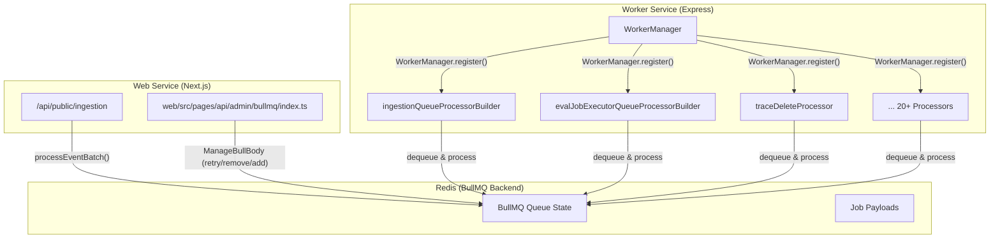
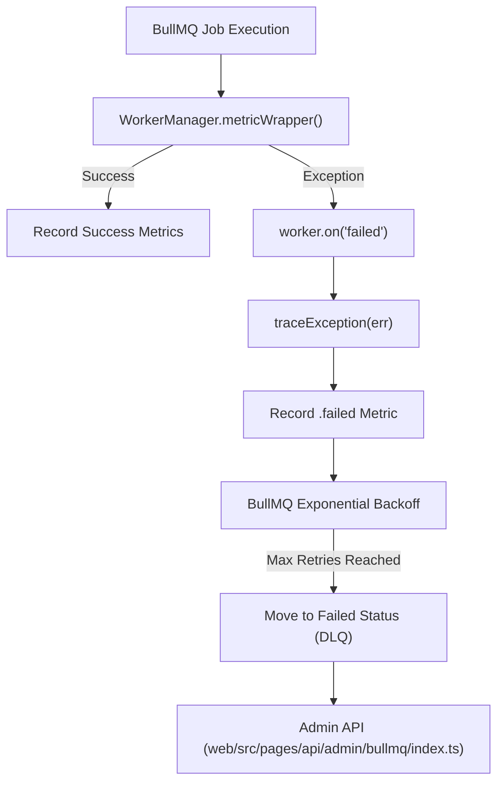

# Queue & Worker System

<details>
<summary>Relevant source files</summary>

The following files were used as context for generating this wiki page:

- [.env.dev-redis-cluster.example](.env.dev-redis-cluster.example)
- [.vscode/launch.json](.vscode/launch.json)
- [packages/shared/src/env.ts](packages/shared/src/env.ts)
- [packages/shared/src/server/index.ts](packages/shared/src/server/index.ts)
- [packages/shared/src/server/queues.ts](packages/shared/src/server/queues.ts)
- [packages/shared/src/server/redis/batchExport.ts](packages/shared/src/server/redis/batchExport.ts)
- [packages/shared/src/server/redis/blobStorageIntegrationProcessingQueue.ts](packages/shared/src/server/redis/blobStorageIntegrationProcessingQueue.ts)
- [packages/shared/src/server/redis/createEvalQueue.ts](packages/shared/src/server/redis/createEvalQueue.ts)
- [packages/shared/src/server/redis/datasetRunItemUpsert.ts](packages/shared/src/server/redis/datasetRunItemUpsert.ts)
- [packages/shared/src/server/redis/dlqRetryQueue.ts](packages/shared/src/server/redis/dlqRetryQueue.ts)
- [packages/shared/src/server/redis/getQueue.ts](packages/shared/src/server/redis/getQueue.ts)
- [packages/shared/src/server/redis/ingestionQueue.ts](packages/shared/src/server/redis/ingestionQueue.ts)
- [packages/shared/src/server/redis/redis.ts](packages/shared/src/server/redis/redis.ts)
- [packages/shared/src/server/redis/traceUpsert.ts](packages/shared/src/server/redis/traceUpsert.ts)
- [web/src/pages/api/admin/bullmq/index.ts](web/src/pages/api/admin/bullmq/index.ts)
- [worker/src/__tests__/redisConsumer.test.ts](worker/src/__tests__/redisConsumer.test.ts)
- [worker/src/app.ts](worker/src/app.ts)
- [worker/src/env.ts](worker/src/env.ts)
- [worker/src/features/blobstorage/handleBlobStorageIntegrationSchedule.ts](worker/src/features/blobstorage/handleBlobStorageIntegrationSchedule.ts)
- [worker/src/features/tokenisation/usage.ts](worker/src/features/tokenisation/usage.ts)
- [worker/src/queues/ingestionQueue.ts](worker/src/queues/ingestionQueue.ts)
- [worker/src/queues/workerManager.ts](worker/src/queues/workerManager.ts)
- [worker/src/utils/shutdown.ts](worker/src/utils/shutdown.ts)

</details>


## Overview

The Queue & Worker System is the asynchronous processing infrastructure that handles all background tasks in Langfuse. It uses [BullMQ](https://optimalbits.github.io/bull/) on Redis to manage 20+ specialized queues that process events including data ingestion, evaluation execution, data deletion, exports, and integrations. The system is separate from the web service and runs in a dedicated worker service defined in `worker/src/app.ts` [worker/src/app.ts:1-107]().

This document covers the queue architecture, worker management, queue processors, error handling, and background services. For information about specific queue processing logic like ingestion or evaluation, see [Data Ingestion Pipeline](#6) and [Evaluation System](#10).

**Sources**: [worker/src/app.ts:1-107](), [packages/shared/src/server/queues.ts:1-250]()

## Queue Architecture

### BullMQ on Redis

The system uses BullMQ as the queue manager, backed by Redis. The configuration supports standalone Redis, Redis Cluster, and Redis Sentinel [packages/shared/src/env.ts:20-57](). Queue instances are created through singleton patterns and support features like:

- **Job delays**: Jobs can be delayed by a specified time (e.g., `LANGFUSE_INGESTION_QUEUE_DELAY_MS` defaults to 15s [packages/shared/src/env.ts:125-128]()).
- **Concurrency control**: Each queue can limit concurrent job processing via worker registration [worker/src/app.ts:126-137]().
- **Global Rate limiting**: BullMQ limiters are used to throttle job processing globally across worker instances (e.g., for `CreateEvalQueue` [worker/src/app.ts:140-153]()).
- **Job retries**: Automatic exponential backoff for transient failures [worker/src/queues/workerManager.ts:11-13]().
- **Dead letter management**: Failed jobs can be retried or cleaned via the Admin API [web/src/pages/api/admin/bullmq/index.ts:33-48]().

Title: BullMQ Queue Architecture


**Sources**: [worker/src/queues/workerManager.ts:20-160](), [packages/shared/src/env.ts:20-57](), [web/src/pages/api/admin/bullmq/index.ts:1-141]()

### Queue Types and Naming

Queues are defined in the `QueueName` enum [worker/src/app.ts:31-46](). Each queue has a corresponding Zod-validated payload in `packages/shared/src/server/queues.ts` [packages/shared/src/server/queues.ts:14-222]().

| Category | Queue Name | Job Schema | Sharded | Purpose |
|----------|------------|------------|---------|---------|
| **Ingestion** | `IngestionQueue` | `IngestionEvent` | Yes | Process legacy batch events [packages/shared/src/server/queues.ts:14-28]() |
| | `OtelIngestionQueue` | `OtelIngestionEvent` | Yes | Process OpenTelemetry spans [packages/shared/src/server/queues.ts:30-47]() |
| | `SecondaryIngestionQueue` | `IngestionEvent` | No | High-priority project ingestion [worker/src/app.ts:36]() |
| **Evaluation** | `TraceUpsertQueue` | `TraceQueueEventSchema` | Yes | Trigger eval creation on trace upsert [packages/shared/src/server/queues.ts:56-61]() |
| | `CreateEvalQueue` | `CreateEvalQueueEventSchema` | No | Create eval jobs (batch & live) [packages/shared/src/server/queues.ts:204-217]() |
| | `EvalExecutionQueue` | `EvalExecutionEvent` | No | Execute LLM-as-Judge evals [packages/shared/src/server/queues.ts:96-100]() |
| | `LLMAsJudgeExecutionQueue` | `LLMAsJudgeExecutionEventSchema`| No | Observation-level evals [packages/shared/src/server/queues.ts:103-107]() |
| **Deletion** | `TraceDelete` | `TraceQueueEventSchema` | No | Delete traces and related data [worker/src/app.ts:53]() |
| | `ProjectDelete` | `ProjectQueueEventSchema` | No | Cascade delete projects [worker/src/app.ts:54]() |
| **Integrations** | `PostHogIntegrationQueue` | `PostHogIntegrationProcessingEventSchema` | No | Sync data to PostHog [packages/shared/src/server/queues.ts:108-110]() |
| | `BlobStorageIntegrationQueue` | `BlobStorageIntegrationProcessingEventSchema` | No | Sync data to S3/Azure Blob [packages/shared/src/server/queues.ts:114-116]() |

For details, see [Queue Architecture](#7.1).

**Sources**: [packages/shared/src/server/queues.ts:14-222](), [worker/src/app.ts:25-86]()

### Sharded Queues

High-throughput queues use sharding to distribute load. Shard count is configured via environment variables like `LANGFUSE_INGESTION_QUEUE_SHARD_COUNT` [packages/shared/src/env.ts:129](). Jobs are distributed across shards using a hash of the project ID. Sharded queues are registered by iterating over shard names (e.g., `TraceUpsertQueue.getShardNames()`) [worker/src/app.ts:127-137]().

**Sources**: [packages/shared/src/env.ts:129-158](), [worker/src/app.ts:126-137]()

## Worker Manager

The `WorkerManager` class provides a unified interface for registering BullMQ workers with built-in instrumentation [worker/src/queues/workerManager.ts:20-186]().

### Worker Registration
Workers are registered in `worker/src/app.ts` using the `WorkerManager.register()` method. This method creates a `Worker` instance and wraps the processor in a metric collector.

```typescript
// Example from worker/src/app.ts:140-153
WorkerManager.register(
  QueueName.CreateEvalQueue,
  evalJobCreatorQueueProcessor,
  {
    concurrency: env.LANGFUSE_EVAL_CREATOR_WORKER_CONCURRENCY,
    limiter: {
      // Process at most `max` jobs per `duration` milliseconds globally
      max: env.LANGFUSE_EVAL_CREATOR_WORKER_CONCURRENCY,
      duration: env.LANGFUSE_EVAL_CREATOR_LIMITER_DURATION,
    },
  },
);
```

### Metrics Instrumentation
The `WorkerManager` automatically tracks metrics for every registered queue using a metric wrapper `metricWrapper` [worker/src/queues/workerManager.ts:41-110]():
- `request`: Job count [worker/src/queues/workerManager.ts:52]().
- `processing_time`: Duration of execution [worker/src/queues/workerManager.ts:99-101]().
- `wait_time`: Time spent in queue [worker/src/queues/workerManager.ts:50-51]().
- `length`, `dlq_length`, `active`: Sampled queue depth gauges [worker/src/queues/workerManager.ts:74-92]().

For details, see [Worker Manager](#7.2).

**Sources**: [worker/src/queues/workerManager.ts:20-186](), [worker/src/app.ts:140-153]()

## Queue Processors

Processors are specialized functions that handle job execution for specific queues.

- **Ingestion**: `ingestionQueueProcessorBuilder` handles event batch processing by downloading events from S3 and writing metadata to ClickHouse [worker/src/queues/ingestionQueue.ts:29-180]().
- **Evaluations**: `evalJobExecutorQueueProcessorBuilder` and `evalJobCreatorQueueProcessor` manage evaluation lifecycles [worker/src/app.ts:11-17]().
- **Exports**: `batchExportQueueProcessor` handles large-scale data exports from ClickHouse [worker/src/app.ts:18]().
- **Cloud Metering**: `cloudUsageMeteringQueueProcessor` calculates organization usage for billing [worker/src/app.ts:21]().

For details, see [Queue Processors](#7.3).

**Sources**: [worker/src/app.ts:11-80](), [worker/src/queues/ingestionQueue.ts:29-180]()

## Error Handling & Retries

The system implements a multi-tier retry strategy:
1. **BullMQ Native Retries**: Configured with exponential backoff and custom retry strategies using `redisQueueRetryOptions` [packages/shared/src/server/redis/redis.ts:16-36]().
2. **Worker Error Logging**: The `WorkerManager` listens for `failed` and `error` events to record failures and trace exceptions [worker/src/queues/workerManager.ts:161-184]().
3. **Dead Letter Queue (DLQ)**: Failed jobs can be managed via the `DlqRetryService` or the Admin API [worker/src/app.ts:75](), [web/src/pages/api/admin/bullmq/index.ts:33-48]().
4. **Retry Service**: `DeadLetterRetryQueue` handles scheduled retries for failed jobs [worker/src/app.ts:34]().

Title: Queue Error Handling Flow


For details, see [Error Handling & Retries](#7.4).

**Sources**: [worker/src/queues/workerManager.ts:144-184](), [web/src/pages/api/admin/bullmq/index.ts:33-48](), [packages/shared/src/server/queues.ts:219-221](), [packages/shared/src/server/redis/redis.ts:16-36]()

## Background Services

The worker service hosts several background managers that do not use the standard BullMQ flow:
- **Background Migration Manager**: Executes asynchronous database migrations `BackgroundMigrationManager.run()` [worker/src/app.ts:112-117]().
- **ClickHouseReadSkipCache**: Maintains a cache of project IDs that can skip ClickHouse reads during ingestion for performance [worker/src/app.ts:119-124]().
- **Cleanup Services**: Periodic tasks like `BatchProjectCleaner`, `MediaRetentionCleaner`, and various project blob/media cleaners [worker/src/app.ts:83-93]().

For details, see [Background Services](#7.5).

**Sources**: [worker/src/app.ts:83-124](), [worker/src/utils/shutdown.ts:30-53]()

## Scheduled Jobs

Langfuse uses repeatable jobs (cron-like) for periodic tasks:
- **Cloud Usage Metering**: Hourly sync for billing [worker/src/app.ts:21](), [worker/src/env.ts:185-187]().
- **Core Data Export**: Scheduled S3 exports via `CoreDataS3ExportQueue` [worker/src/app.ts:155-162]().
- **Integration Jobs**: Periodic syncs for PostHog, Mixpanel, and Blob Storage [worker/src/app.ts:55-66]().
- **Data Retention**: Scheduled cleanup of aged data via `DataRetentionQueue` [worker/src/app.ts:69-72]().

For details, see [Scheduled Jobs](#7.6).

**Sources**: [worker/src/app.ts:55-181](), [worker/src/env.ts:185-191]()
