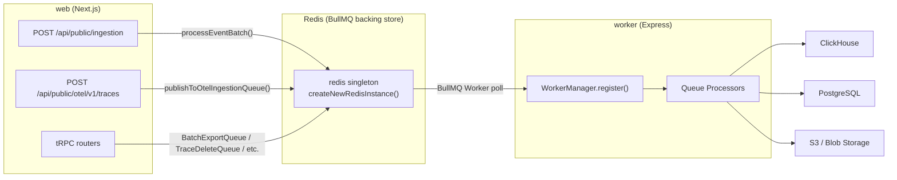

# Queue Architecture

Relevant source files

The following files were used as context for generating this wiki page:

- [.env.dev-redis-cluster.example](.env.dev-redis-cluster.example)
- [.vscode/launch.json](.vscode/launch.json)
- [packages/shared/src/env.ts](packages/shared/src/env.ts)
- [packages/shared/src/server/index.ts](packages/shared/src/server/index.ts)
- [packages/shared/src/server/queues.ts](packages/shared/src/server/queues.ts)
- [packages/shared/src/server/redis/batchExport.ts](packages/shared/src/server/redis/batchExport.ts)
- [packages/shared/src/server/redis/blobStorageIntegrationProcessingQueue.ts](packages/shared/src/server/redis/blobStorageIntegrationProcessingQueue.ts)
- [packages/shared/src/server/redis/createEvalQueue.ts](packages/shared/src/server/redis/createEvalQueue.ts)
- [packages/shared/src/server/redis/datasetRunItemUpsert.ts](packages/shared/src/server/redis/datasetRunItemUpsert.ts)
- [packages/shared/src/server/redis/dlqRetryQueue.ts](packages/shared/src/server/redis/dlqRetryQueue.ts)
- [packages/shared/src/server/redis/getQueue.ts](packages/shared/src/server/redis/getQueue.ts)
- [packages/shared/src/server/redis/ingestionQueue.ts](packages/shared/src/server/redis/ingestionQueue.ts)
- [packages/shared/src/server/redis/redis.ts](packages/shared/src/server/redis/redis.ts)
- [packages/shared/src/server/redis/traceUpsert.ts](packages/shared/src/server/redis/traceUpsert.ts)
- [web/src/pages/api/admin/bullmq/index.ts](web/src/pages/api/admin/bullmq/index.ts)
- [worker/src/__tests__/redisConsumer.test.ts](worker/src/__tests__/redisConsumer.test.ts)
- [worker/src/app.ts](worker/src/app.ts)
- [worker/src/env.ts](worker/src/env.ts)
- [worker/src/features/blobstorage/handleBlobStorageIntegrationSchedule.ts](worker/src/features/blobstorage/handleBlobStorageIntegrationSchedule.ts)
- [worker/src/features/tokenisation/usage.ts](worker/src/features/tokenisation/usage.ts)
- [worker/src/queues/ingestionQueue.ts](worker/src/queues/ingestionQueue.ts)
- [worker/src/queues/workerManager.ts](worker/src/queues/workerManager.ts)
- [worker/src/utils/shutdown.ts](worker/src/utils/shutdown.ts)

This page describes the BullMQ-based queue system: how queues are defined, named, typed, and how they relate to their workers. For the `WorkerManager` class and worker startup sequencing, see [7.2](). For the individual job processors, see [7.3](). For retry and error handling strategies, see [7.4](). For scheduled and repeating jobs, see [7.6]().

---

## BullMQ and Redis Foundation

All asynchronous work in Langfuse is coordinated through BullMQ backed by a Redis instance shared between the web server (producer) and the worker process (consumer).

Redis is configured via environment variables defined in `packages/shared/src/env.ts` [packages/shared/src/env.ts:20-57](). Three connection modes are supported:

| Mode | Env Vars |
|---|---|
| Single-node | `REDIS_HOST`, `REDIS_PORT`, `REDIS_AUTH`, `REDIS_USERNAME` |
| Connection string | `REDIS_CONNECTION_STRING` |
| Cluster | `REDIS_CLUSTER_ENABLED=true`, `REDIS_CLUSTER_NODES` |
| Sentinel | `REDIS_SENTINEL_ENABLED=true`, `REDIS_SENTINEL_NODES`, `REDIS_SENTINEL_MASTER_NAME` |

The `createNewRedisInstance` function handles the initialization of these modes, ensuring that each BullMQ queue or worker receives a dedicated connection with appropriate retry strategies [packages/shared/src/server/redis/redis.ts:183-228]().

### Connection Configuration
Queue connections use `redisQueueRetryOptions` which implement an exponential backoff strategy, waiting at least 1s and at most 20s between retries [packages/shared/src/server/redis/redis.ts:16-24](). Connections are also configured with:
* `enableReadyCheck: true` [packages/shared/src/server/redis/redis.ts:7]()
* `maxRetriesPerRequest: null` (required by BullMQ) [packages/shared/src/server/redis/redis.ts:8]()
* `keepAlive: 10000` (10s) to prevent idle connection termination by middleboxes [packages/shared/src/server/redis/redis.ts:10]()
* `socketTimeout: 30000` (30s) to prevent hung operations from blocking concurrency slots [packages/shared/src/server/redis/redis.ts:11]()

**High-level system diagram: Queue Data Flow**

Title: "System Queue Data Flow"

Sources: [packages/shared/src/server/redis/redis.ts:183-228](), [packages/shared/src/env.ts:20-57](), [worker/src/app.ts:96-105](), [packages/shared/src/server/index.ts:54-54]()

---

## Queue Names and Job Types

All queue names are defined in the `QueueName` enum [worker/src/app.ts:31-46](). Each job payload is validated by a Zod schema defined in `packages/shared/src/server/queues.ts`.

| Schema | Used By |
|---|---|
| `IngestionEvent` | `QueueName.IngestionQueue`, `QueueName.IngestionSecondaryQueue` [packages/shared/src/server/queues.ts:14-28]() |
| `OtelIngestionEvent` | `QueueName.OtelIngestionQueue`, `QueueName.SecondaryOtelIngestionQueue` [packages/shared/src/server/queues.ts:30-47]() |
| `TraceQueueEventSchema` | `QueueName.TraceUpsert`, `QueueName.TraceDelete` [packages/shared/src/server/queues.ts:56-61]() |
| `EvalExecutionEvent` | `QueueName.EvaluationExecution`, `QueueName.SecondaryEvalExecutionQueue` [packages/shared/src/server/queues.ts:96-100]() |
| `CreateEvalQueueEventSchema` | `QueueName.CreateEvalQueue` [packages/shared/src/server/queues.ts:204-217]() |
| `BatchExportJobSchema` | `QueueName.BatchExport` [packages/shared/src/server/queues.ts:49-52]() |
| `BatchActionProcessingEventSchema` | `QueueName.BatchActionQueue` [packages/shared/src/server/queues.ts:127-202]() |
| `ProjectQueueEventSchema` | `QueueName.ProjectDelete` [packages/shared/src/server/queues.ts:85-88]() |
| `DatasetQueueEventSchema` | `QueueName.DatasetDelete` [packages/shared/src/server/queues.ts:70-84]() |
| `ExperimentCreateEventSchema` | `QueueName.ExperimentCreate` [packages/shared/src/server/queues.ts:117-122]() |
| `NotificationEventSchema` | `QueueName.NotificationQueue` [packages/shared/src/server/queues.ts:223-226]() |
| `LLMAsJudgeExecutionEventSchema` | `QueueName.LLMAsJudgeExecution` [packages/shared/src/server/queues.ts:103-107]() |

Sources: [packages/shared/src/server/queues.ts:14-226](), [worker/src/app.ts:25-46]()

---

## Queue Class Pattern

Each queue is wrapped in a static singleton class (e.g., `IngestionQueue`, `TraceUpsertQueue`) that holds BullMQ `Queue` instances. Queue instances are looked up by name via the `getQueue()` factory or through class-specific `getInstance()` methods for sharded queues [packages/shared/src/server/redis/getQueue.ts:33-45]().

**Diagram: Queue Class → Redis Queue Name → Processor mapping (code entity space)**

Title: "Queue Class to Code Entity Mapping"

```mermaid
flowchart TD
    subgraph "packages/shared/src/server/redis/"
        IQ["IngestionQueue\n(sharded)"]
        OIQ["OtelIngestionQueue\n(sharded)"]
        TUQ["TraceUpsertQueue\n(sharded)"]
        CEQ["CreateEvalQueue"]
        EEQ["EvalExecutionQueue\nSecondaryEvalExecutionQueue"]
        LAJ["LLMAsJudgeExecutionQueue"]
        BEQ["BatchExportQueue"]
        BAQ["BatchActionQueue"]
        TDQ["TraceDeleteQueue"]
        PDQ["ProjectDeleteQueue"]
        SDQ["ScoreDeleteQueue"]
        DDQ["DatasetDeleteQueue"]
        EXQ["ExperimentCreateQueue"]
        WQ["WebhookQueue"]
        ECQ["EntityChangeQueue"]
        NQ["NotificationQueue"]
        DLRQ["DeadLetterRetryQueue"]
        EPQ["EventPropagationQueue"]
    end

    subgraph "QueueName enum values (packages/shared/src/server/index.ts)"
        IQN["ingestion-queue"]
        OIQN["otel-ingestion-queue"]
        TUQN["trace-upsert"]
        CEQN["create-eval-queue"]
        EEQN["evaluation-execution-queue"]
        LAJN["llm-as-a-judge-execution-queue"]
        BEQN["batch-export-queue"]
        BAQN["batch-action-queue"]
        TDQN["trace-delete"]
        PDQN["project-delete"]
        SDQN["score-delete"]
        DDQN["dataset-delete-queue"]
        EXQN["experiment-create-queue"]
        WQN["webhook-queue"]
        ECQN["entity-change-queue"]
        NQN["notification-queue"]
    end

    IQ --> IQN
    OIQ --> OIQN
    TUQ --> TUQN
    CEQ --> CEQN
    EEQ --> EEQN
    LAJ --> LAJN
    BEQ --> BEQN
    BAQ --> BAQN
    TDQ --> TDQN
    PDQ --> PDQN
    SDQ --> SDQN
    DDQ --> DDQN
    EXQ --> EXQN
    WQ --> WQN
    ECQ --> ECQN
    NQ --> NQN
```

Sources: [packages/shared/src/server/index.ts:59-92](), [packages/shared/src/server/redis/getQueue.ts:33-106](), [worker/src/app.ts:25-46]()

---

## Sharded Queues

High-throughput queues support horizontal sharding to distribute load across multiple Redis keys and avoid single-key bottlenecks in Redis Cluster environments [packages/shared/src/env.ts:129-158]().

| Queue Class | Base `QueueName` | Shard Count Env Var | Default Shards |
|---|---|---|---|
| `IngestionQueue` | `ingestion-queue` | `LANGFUSE_INGESTION_QUEUE_SHARD_COUNT` | 1 |
| `SecondaryIngestionQueue` | `ingestion-secondary-queue` | `LANGFUSE_INGESTION_SECONDARY_QUEUE_SHARD_COUNT` | 1 |
| `OtelIngestionQueue` | `otel-ingestion-queue` | `LANGFUSE_OTEL_INGESTION_QUEUE_SHARD_COUNT` | 1 |
| `SecondaryOtelIngestionQueue` | `otel-ingestion-secondary-queue` | `LANGFUSE_OTEL_INGESTION_SECONDARY_QUEUE_SHARD_COUNT` | 1 |
| `TraceUpsertQueue` | `trace-upsert` | `LANGFUSE_TRACE_UPSERT_QUEUE_SHARD_COUNT` | 1 |
| `EvalExecutionQueue`| `evaluation-execution-queue` | `LANGFUSE_EVAL_EXECUTION_QUEUE_SHARD_COUNT` | 1 |
| `SecondaryEvalExecutionQueue`| `evaluation-execution-secondary-queue` | `LANGFUSE_EVAL_EXECUTION_SECONDARY_QUEUE_SHARD_COUNT` | 1 |
| `LLMAsJudgeExecutionQueue` | `llm-as-a-judge-execution-queue` | `LANGFUSE_LLM_AS_JUDGE_EXECUTION_QUEUE_SHARD_COUNT` | 1 |

**Worker registration for shards:** The worker process iterates through all shard names for a given queue type and registers a dedicated `Worker` instance for each [worker/src/app.ts:128-137]().

Sources: [packages/shared/src/env.ts:129-158](), [worker/src/app.ts:126-138](), [web/src/pages/api/admin/bullmq/index.ts:70-82]()

---

## Queue-to-Worker Registration

Queue workers are registered in `worker/src/app.ts` using `WorkerManager.register()`. Each registration is typically guarded by a `QUEUE_CONSUMER_*_IS_ENABLED` environment flag [worker/src/app.ts:126-200]().

| `QueueName` | Processor | Default Concurrency | Env Var |
|---|---|---|---|
| `TraceUpsert` (shards) | `evalJobTraceCreatorQueueProcessor` | 25 | `LANGFUSE_TRACE_UPSERT_WORKER_CONCURRENCY` [worker/src/env.ts:119-122]() |
| `CreateEvalQueue` | `evalJobCreatorQueueProcessor` | 2 | `LANGFUSE_EVAL_CREATOR_WORKER_CONCURRENCY` [worker/src/env.ts:115-118]() |
| `TraceDelete` | `traceDeleteProcessor` | 1 | `LANGFUSE_TRACE_DELETE_CONCURRENCY` [worker/src/env.ts:123]() |
| `ScoreDelete` | `scoreDeleteProcessor` | 1 | `LANGFUSE_SCORE_DELETE_CONCURRENCY` [worker/src/env.ts:124]() |
| `IngestionQueue` | `ingestionQueueProcessorBuilder` | 20 | `LANGFUSE_INGESTION_QUEUE_PROCESSING_CONCURRENCY` [worker/src/env.ts:81-84]() |
| `OtelIngestionQueue` | `otelIngestionQueueProcessorBuilder` | 5 | `LANGFUSE_OTEL_INGESTION_QUEUE_PROCESSING_CONCURRENCY` [worker/src/env.ts:70-73]() |

Sources: [worker/src/app.ts:126-200](), [worker/src/env.ts:70-138]()

---

## Rate Limiters

BullMQ limiters are used to control the global rate of job processing across all worker instances [worker/src/app.ts:140-194]().

| Queue | Limiter: max | Limiter: duration | Purpose |
|---|---|---|---|
| `CreateEvalQueue` | Concurrency (2) | 500 ms | Throttle evaluation job creation [worker/src/app.ts:148-149]() |
| `TraceDelete` | Concurrency (1) | `DURATION_MS` | Throttle ClickHouse deletions [worker/src/app.ts:188-192]() |
| `MeteringDataPostgresExportQueue` | 1 | 30 s | Limit frequency of metering exports to PostgreSQL [worker/src/app.ts:173-174]() |

Sources: [worker/src/app.ts:140-194](), [worker/src/env.ts:111-114]()

---

## Secondary Queues

Secondary queues provide isolation for high-volume projects, ensuring that massive ingestion or evaluation spikes do not block processing for other tenants.

*   **Ingestion:** Projects listed in `LANGFUSE_SECONDARY_INGESTION_QUEUE_ENABLED_PROJECT_IDS` are routed to the `SecondaryIngestionQueue` [worker/src/env.ts:85-89]().
*   **OTel Ingestion:** Projects in `LANGFUSE_SECONDARY_OTEL_INGESTION_QUEUE_ENABLED_PROJECT_IDS` use the `SecondaryOtelIngestionQueue` [worker/src/env.ts:74-80]().
*   **Eval Execution:** Projects in `LANGFUSE_SECONDARY_EVAL_EXECUTION_QUEUE_ENABLED_PROJECT_IDS` use the `SecondaryEvalExecutionQueue` [worker/src/env.ts:135-141]().

Sources: [worker/src/env.ts:74-141](), [worker/src/app.ts:36-44]()

---

## Event Propagation Queue

The `EventPropagationQueue` [worker/src/app.ts:42]() manages the asynchronous movement of data from staging tables (where events are first written) to the primary events table in ClickHouse. This is a critical component of the events-first architecture, ensuring that synthetic traces can be derived from raw observation events [worker/src/app.ts:80]().

Sources: [worker/src/app.ts:42](), [worker/src/app.ts:80]()
