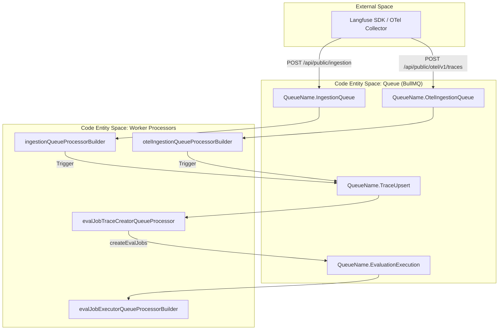
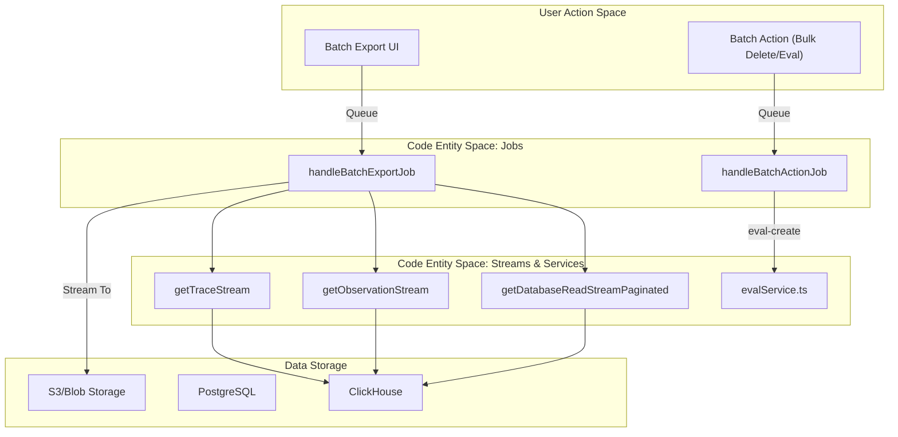

# Queue Processors

Relevant source files

The following files were used as context for generating this wiki page:

- [packages/shared/prisma/migrations/20241029130802_prices_drop_excess_index/migration.sql](packages/shared/prisma/migrations/20241029130802_prices_drop_excess_index/migration.sql)
- [packages/shared/src/features/batchAction/types.ts](packages/shared/src/features/batchAction/types.ts)
- [packages/shared/src/features/batchExport/types.ts](packages/shared/src/features/batchExport/types.ts)
- [packages/shared/src/interfaces/tableNames.ts](packages/shared/src/interfaces/tableNames.ts)
- [packages/shared/src/server/ingestion/processEventBatch.ts](packages/shared/src/server/ingestion/processEventBatch.ts)
- [packages/shared/src/server/otel/ObservationTypeMapper.ts](packages/shared/src/server/otel/ObservationTypeMapper.ts)
- [packages/shared/src/server/otel/OtelIngestionProcessor.ts](packages/shared/src/server/otel/OtelIngestionProcessor.ts)
- [packages/shared/src/server/redis/otelIngestionQueue.ts](packages/shared/src/server/redis/otelIngestionQueue.ts)
- [web/src/__tests__/server/api/otel/otelMapping.servertest.ts](web/src/__tests__/server/api/otel/otelMapping.servertest.ts)
- [web/src/features/evals/components/evaluator-table.tsx](web/src/features/evals/components/evaluator-table.tsx)
- [web/src/features/evals/components/inner-evaluator-form.tsx](web/src/features/evals/components/inner-evaluator-form.tsx)
- [web/src/features/evals/server/router.ts](web/src/features/evals/server/router.ts)
- [web/src/features/models/components/pricing-tiers/TierPrefillButtons.tsx](web/src/features/models/components/pricing-tiers/TierPrefillButtons.tsx)
- [web/src/features/table/components/targetOptionsQueryMap.tsx](web/src/features/table/components/targetOptionsQueryMap.tsx)
- [web/src/pages/api/public/otel/v1/traces/index.ts](web/src/pages/api/public/otel/v1/traces/index.ts)
- [worker/src/__tests__/batchAction.test.ts](worker/src/__tests__/batchAction.test.ts)
- [worker/src/__tests__/batchExport.test.ts](worker/src/__tests__/batchExport.test.ts)
- [worker/src/__tests__/evalService.filtering.test.ts](worker/src/__tests__/evalService.filtering.test.ts)
- [worker/src/__tests__/evalService.test.ts](worker/src/__tests__/evalService.test.ts)
- [worker/src/constants/default-model-prices.json](worker/src/constants/default-model-prices.json)
- [worker/src/ee/cloudUsageMetering/handleCloudUsageMeteringJob.ts](worker/src/ee/cloudUsageMetering/handleCloudUsageMeteringJob.ts)
- [worker/src/features/batchAction/handleBatchActionJob.ts](worker/src/features/batchAction/handleBatchActionJob.ts)
- [worker/src/features/batchAction/processAddToQueue.ts](worker/src/features/batchAction/processAddToQueue.ts)
- [worker/src/features/batchExport/handleBatchExportJob.ts](worker/src/features/batchExport/handleBatchExportJob.ts)
- [worker/src/features/database-read-stream/event-stream.ts](worker/src/features/database-read-stream/event-stream.ts)
- [worker/src/features/database-read-stream/getDatabaseReadStream.ts](worker/src/features/database-read-stream/getDatabaseReadStream.ts)
- [worker/src/features/database-read-stream/observation-stream.ts](worker/src/features/database-read-stream/observation-stream.ts)
- [worker/src/features/database-read-stream/trace-stream.ts](worker/src/features/database-read-stream/trace-stream.ts)
- [worker/src/features/evaluation/evalService.ts](worker/src/features/evaluation/evalService.ts)
- [worker/src/queues/__tests__/otelDirectEventWrite.test.ts](worker/src/queues/__tests__/otelDirectEventWrite.test.ts)
- [worker/src/queues/batchExportQueue.ts](worker/src/queues/batchExportQueue.ts)
- [worker/src/queues/cloudUsageMeteringQueue.ts](worker/src/queues/cloudUsageMeteringQueue.ts)
- [worker/src/queues/evalQueue.ts](worker/src/queues/evalQueue.ts)
- [worker/src/queues/otelIngestionQueue.ts](worker/src/queues/otelIngestionQueue.ts)
- [worker/src/queues/shardedQueueRegistry.ts](worker/src/queues/shardedQueueRegistry.ts)
- [worker/src/scripts/upsertDefaultModelPrices.ts](worker/src/scripts/upsertDefaultModelPrices.ts)

This page details the individual queue processors within the Langfuse worker service. These processors are BullMQ consumers responsible for background tasks including data ingestion, OpenTelemetry (OTel) processing, evaluation execution, large-scale data exports, and cloud usage metering.

For information about the queue architecture and sharding strategy, see **7.1 Queue Architecture**. For details on worker lifecycle management, see **7.2 Worker Manager**.

---

## Core Ingestion Processors

### Ingestion Queue Processor
**Purpose:** Processes standard SDK ingestion events (traces, spans, generations, scores) by downloading event batches from S3 and writing them to ClickHouse.

**Implementation Details:**
- **Registration:** The processor is initialized via `ingestionQueueProcessorBuilder` [worker/src/queues/ingestionQueue.ts:29-31]() and registered with the `WorkerManager` in `worker/src/app.ts`.
- **Deduplication:** Uses a Redis-based cache to skip events that were processed within a short time window [worker/src/queues/ingestionQueue.ts:84-106]().
- **Batch Processing:** Uses `processEventBatch` to validate, deduplicate, and store events [packages/shared/src/server/ingestion/processEventBatch.ts:104-116]().
- **Secondary Queue:** High-volume projects or those experiencing S3 slowdowns are redirected to a `SecondaryIngestionQueue` [worker/src/queues/ingestionQueue.ts:125-133]().

### OTel Ingestion Processor
**Purpose:** Converts OpenTelemetry `ResourceSpans` into Langfuse-native ingestion events.

**Implementation:**
- **Processor:** `otelIngestionQueueProcessorBuilder` handles jobs from the `OtelIngestionQueue` [worker/src/queues/otelIngestionQueue.ts:13-13]().
- **Mapping Logic:** The `OtelIngestionProcessor` class manages the conversion of OTel spans to Langfuse observation types (SPAN, GENERATION, etc.) [packages/shared/src/server/otel/OtelIngestionProcessor.ts:141-168]().
- **Observation Mapping:** Uses the `ObservationTypeMapperRegistry` to determine if a span should be treated as a generation, tool call, or standard span [packages/shared/src/server/otel/OtelIngestionProcessor.ts:114-114]().
- **Storage:** Spans are first uploaded to S3 as JSON before being queued for processing [packages/shared/src/server/otel/OtelIngestionProcessor.ts:182-190]().

**Sources:** [worker/src/queues/ingestionQueue.ts:29-180](), [worker/src/queues/otelIngestionQueue.ts:13-13](), [packages/shared/src/server/ingestion/processEventBatch.ts:104-116](), [packages/shared/src/server/otel/OtelIngestionProcessor.ts:141-220]()

---

## Evaluation Processors

The evaluation system uses a multi-stage pipeline to automate LLM-based scoring.

### Eval Job Creator
**Purpose:** Matches incoming traces or dataset items against `JobConfiguration` filters to determine which evaluations should run.

| Processor Function | Trigger Source | Time Scope |
| :--- | :--- | :--- |
| `evalJobTraceCreatorQueueProcessor` | `TraceUpsert` | `NEW` [worker/src/queues/evalQueue.ts:25-33]() |
| `evalJobDatasetCreatorQueueProcessor` | `DatasetRunItemUpsert` | `NEW` [worker/src/queues/evalQueue.ts:46-54]() |
| `evalJobCreatorQueueProcessor` | `CreateEvalQueue` (Manual/UI) | All [worker/src/queues/evalQueue.ts:98-106]() |

**Logic:** These processors call `createEvalJobs` [worker/src/features/evaluation/evalService.ts:113-113](), which performs validation checks such as `traceExists` [worker/src/features/evaluation/evalService.ts:134-134]() and `observationExists` [worker/src/features/evaluation/evalService.ts:138-140]() before dispatching execution jobs to the `EvalExecutionQueue`.

### Evaluation Execution Processor
**Purpose:** Executes the LLM-as-a-judge logic.

**Implementation Details:**
- **Execution:** Calls `evaluate({ event: job.data.payload })` [worker/src/queues/evalQueue.ts:176-176]().
- **Variable Extraction:** Extracts values from trace data using mappings defined in the job configuration via `extractVariablesFromTracingData` [worker/src/features/evaluation/evalService.test.ts:33-34]().
- **Redirection:** Supports a `SecondaryEvalExecutionQueue` [worker/src/queues/evalQueue.ts:142-142]() for specific project IDs to prevent high-volume projects from blocking the main queue [worker/src/queues/evalQueue.ts:132-157]().
- **Error Handling:** Classifies errors like `LLMCompletionError` [worker/src/queues/evalQueue.ts:14-14]() to decide between BullMQ retries or internal delayed retries using exponential backoff [worker/src/queues/evalQueue.ts:185-201]().

**Sources:** [worker/src/queues/evalQueue.ts:25-201](), [worker/src/features/evaluation/evalService.ts:84-176](), [worker/src/features/evaluation/evalService.test.ts:33-34]()

---

## Batch Export & Batch Action Processors

### Batch Export Processor
**Purpose:** Streams large datasets from ClickHouse or PostgreSQL to external blob storage (S3, Azure).

**Key Function:** `handleBatchExportJob` [worker/src/features/batchExport/handleBatchExportJob.ts:34-36]()
- **Status Management:** Transitions job status from `QUEUED` to `PROCESSING` [worker/src/features/batchExport/handleBatchExportJob.ts:115-123]().
- **Comment Filtering:** Applies comment-based filters via `applyCommentFilters` before streaming [worker/src/features/batchExport/handleBatchExportJob.ts:145-150]().
- **Streaming:** Initializes a `DatabaseReadStream` based on the target table (Traces, Observations, Sessions, or Scores) [worker/src/features/batchExport/handleBatchExportJob.ts:174-202]().
- **Transformation:** Uses `streamTransformations` to convert database rows into CSV or JSONL formats [worker/src/features/batchExport/handleBatchExportJob.ts:220-223]().

### Batch Action Processor
**Purpose:** Executes bulk operations like deletion or adding items to annotation queues.
- **Actions:** Supports `trace-delete`, `score-delete`, `eval-create`, and adding items to annotation queues.
- **Implementation:** Handles bulk operations via `handleBatchActionJob` [worker/src/features/batchAction/handleBatchActionJob.ts:1-10]().

**Sources:** [worker/src/features/batchExport/handleBatchExportJob.ts:34-231](), [worker/src/features/database-read-stream/getDatabaseReadStream.ts:99-114](), [worker/src/features/batchAction/handleBatchActionJob.ts:1-10]()

---

## Cloud Metering & System Processors

### Cloud Usage Metering
**Purpose:** Calculates and records organization-level usage for billing and tier enforcement.
- **Processor:** `handleCloudUsageMeteringJob` aggregates event counts and updates organization metrics [worker/src/ee/cloudUsageMetering/handleCloudUsageMeteringJob.ts:1-10]().
- **Queue:** Managed via `CloudUsageMeteringQueue` [worker/src/queues/cloudUsageMeteringQueue.ts:1-10]().

### Model Pricing Updates
**Purpose:** Periodically updates the default model prices in the database from the system's JSON configuration.
- **Implementation:** `upsertDefaultModelPrices` reads from `default-model-prices.json` and synchronizes the `Model` table in PostgreSQL [worker/src/scripts/upsertDefaultModelPrices.ts:1-20]().
- **Data Source:** Uses a comprehensive list of model patterns and pricing tiers [worker/src/constants/default-model-prices.json:1-159]().

**Sources:** [worker/src/ee/cloudUsageMetering/handleCloudUsageMeteringJob.ts:1-10](), [worker/src/scripts/upsertDefaultModelPrices.ts:1-20](), [worker/src/constants/default-model-prices.json:1-159]()

---

## System Integration Diagrams

### Ingestion to Evaluation Pipeline

This diagram bridges the natural language space of "Ingestion" to the code entities like `IngestionQueue` and `createEvalJobs`.

**Sources:** [worker/src/queues/ingestionQueue.ts:29-36](), [worker/src/queues/evalQueue.ts:25-34](), [packages/shared/src/server/ingestion/processEventBatch.ts:104-116]()

### Export & Batch Action Architecture

This diagram associates system actions like "Batch Export" and "Batch Action" with their underlying stream and processor implementations.

**Sources:** [worker/src/features/batchExport/handleBatchExportJob.ts:174-202](), [worker/src/features/database-read-stream/getDatabaseReadStream.ts:99-114](), [worker/src/features/batchAction/handleBatchActionJob.ts:1-10]()
