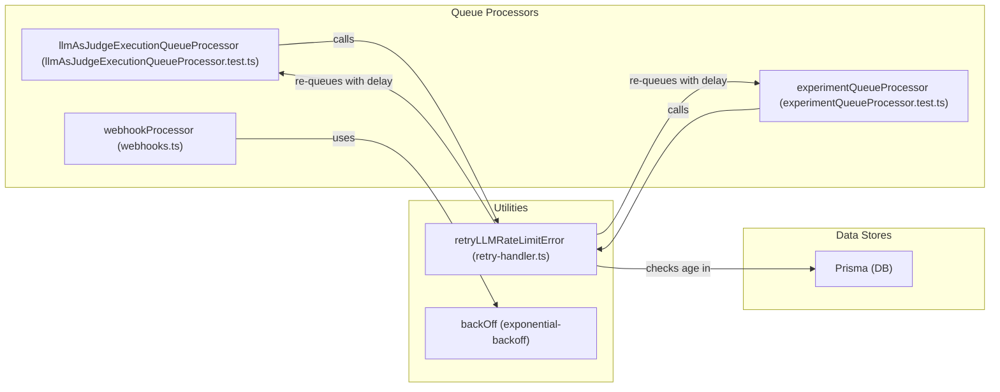
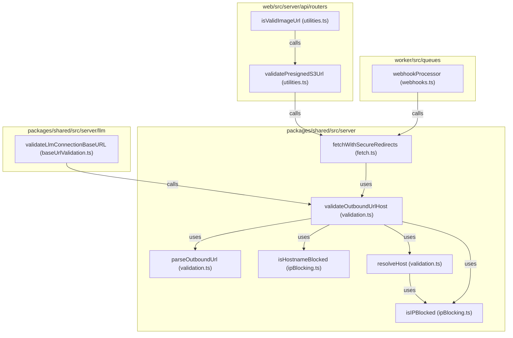

# Error Handling & Retries

<details>
<summary>Relevant source files</summary>

The following files were used as context for generating this wiki page:

- [packages/shared/prisma/migrations/20250122152102_add_llm_api_keys_extra_headers/migration.sql](packages/shared/prisma/migrations/20250122152102_add_llm_api_keys_extra_headers/migration.sql)
- [packages/shared/src/domain/webhooks.ts](packages/shared/src/domain/webhooks.ts)
- [packages/shared/src/server/llm/baseUrlValidation.ts](packages/shared/src/server/llm/baseUrlValidation.ts)
- [packages/shared/src/server/llm/utils.ts](packages/shared/src/server/llm/utils.ts)
- [packages/shared/src/server/outbound-url/fetch.ts](packages/shared/src/server/outbound-url/fetch.ts)
- [packages/shared/src/server/outbound-url/validation.ts](packages/shared/src/server/outbound-url/validation.ts)
- [packages/shared/src/server/redis/evalExecutionQueue.ts](packages/shared/src/server/redis/evalExecutionQueue.ts)
- [packages/shared/src/server/redis/experimentCreateQueue.ts](packages/shared/src/server/redis/experimentCreateQueue.ts)
- [packages/shared/src/server/webhooks/ipBlocking.ts](packages/shared/src/server/webhooks/ipBlocking.ts)
- [packages/shared/src/server/webhooks/validation.ts](packages/shared/src/server/webhooks/validation.ts)
- [web/src/__tests__/server/datasets-trpc.servertest.ts](web/src/__tests__/server/datasets-trpc.servertest.ts)
- [web/src/__tests__/server/llm-api-key.servertest.ts](web/src/__tests__/server/llm-api-key.servertest.ts)
- [web/src/__tests__/server/unit/utilities.servertest.ts](web/src/__tests__/server/unit/utilities.servertest.ts)
- [web/src/server/api/routers/utilities.ts](web/src/server/api/routers/utilities.ts)
- [worker/src/__tests__/fetchLLMCompletionTimeout.test.ts](worker/src/__tests__/fetchLLMCompletionTimeout.test.ts)
- [worker/src/__tests__/ip-blocking.test.ts](worker/src/__tests__/ip-blocking.test.ts)
- [worker/src/__tests__/llm-base-url-validation.test.ts](worker/src/__tests__/llm-base-url-validation.test.ts)
- [worker/src/__tests__/outbound-connection-validation.test.ts](worker/src/__tests__/outbound-connection-validation.test.ts)
- [worker/src/__tests__/url-normalization.test.ts](worker/src/__tests__/url-normalization.test.ts)
- [worker/src/__tests__/webhook-redirect-headers.test.ts](worker/src/__tests__/webhook-redirect-headers.test.ts)
- [worker/src/__tests__/webhook-redirect.test.ts](worker/src/__tests__/webhook-redirect.test.ts)
- [worker/src/__tests__/webhook-validation.test.ts](worker/src/__tests__/webhook-validation.test.ts)
- [worker/src/__tests__/webhooks.test.ts](worker/src/__tests__/webhooks.test.ts)
- [worker/src/features/utils/index.ts](worker/src/features/utils/index.ts)
- [worker/src/features/utils/retry-handler.test.ts](worker/src/features/utils/retry-handler.test.ts)
- [worker/src/features/utils/retry-handler.ts](worker/src/features/utils/retry-handler.ts)
- [worker/src/queues/__tests__/experimentQueueProcessor.test.ts](worker/src/queues/__tests__/experimentQueueProcessor.test.ts)
- [worker/src/queues/__tests__/llmAsJudgeExecutionQueueProcessor.test.ts](worker/src/queues/__tests__/llmAsJudgeExecutionQueueProcessor.test.ts)
- [worker/src/queues/experimentQueue.ts](worker/src/queues/experimentQueue.ts)
- [worker/src/queues/utils/delays.ts](worker/src/queues/utils/delays.ts)
- [worker/src/queues/webhooks.ts](worker/src/queues/webhooks.ts)

</details>


This document describes the error handling and retry mechanisms in Langfuse's queue-based worker system and API layer. It covers retry strategies used across different failure modes, error classification, and the management of failed jobs.

## Overview

Langfuse implements multiple layers of retry logic to handle transient failures while failing fast on unrecoverable errors. The system distinguishes between four main categories of failures:

1.  **Data Availability Issues**: Missing observations or traces due to eventual consistency in ClickHouse when evaluations or trace upserts are triggered.
2.  **External Service Rate Limits**: LLM provider 429/5xx responses during evaluations, playground usage, or experiment generation.
3.  **Validation & Security Errors**: Invalid request data, SSRF protection blocks on webhooks, or incorrect evaluation configurations.
4.  **Infrastructure Errors**: Redis connection loss, ClickHouse connection issues, or S3 timeouts.

Each category uses a distinct retry strategy optimized for its failure characteristics, primarily managed within the `WorkerManager`, specific queue processors, and utility handlers.

Sources: [worker/src/queues/webhooks.ts:147-217](), [packages/shared/src/server/webhooks/validation.ts:28-50]()

## Error Classification and Retry Decision Flow

The system uses a hierarchical decision tree to determine if a failed job should be retried, delayed, or marked as a permanent error.

### Job Failure Decision Logic
The following diagram illustrates how individual processors handle different error types, specifically focusing on the ingestion and webhook execution paths.

Title: "Job Failure Decision Logic"
```mermaid
graph TD
    ["Job Fails in WorkerManager"] --> CheckS3Slowdown{"isS3SlowDownError(e)?"}
    
    CheckS3Slowdown -->|Yes| MarkSlowdown["markProjectS3Slowdown(projectId)"]
    MarkSlowdown --> RethrowS3["Throw e (BullMQ Retry)"]
    
    CheckS3Slowdown -->|No| CheckWebhook{"Is Webhook Action?"}
    CheckWebhook -->|Yes| HttpRetry["backOff (Exponential)"]
    HttpRetry -->|Success| CompleteSuccess["Job Completed"]
    HttpRetry -->|Exhausted| LogError["logger.error & traceException"]
    
    CheckWebhook -->|No| GenericLog["Log Error & traceException(e)"]
    GenericLog --> RethrowGeneric["Throw e (BullMQ Default)"]
```
Sources: [worker/src/queues/webhooks.ts:147-217]()

## Error Type Definitions

The system defines custom error classes and uses standard exceptions to enable fine-grained control:

| Error Type | Retryable | Strategy | Use Case |
| :--- | :--- | :--- | :--- |
| `S3 Slowdown` (503) | Yes | Redirect to Secondary Queue | AWS S3 rate limiting; triggers `markProjectS3Slowdown`. |
| `Webhook Timeout` | Yes | Exponential Backoff | External webhook endpoint is slow or temporarily down. |
| `DNS lookup failed` | No | Validation Error | Webhook URL validation fails during security check. |
| `Blocked IP address` | No | Security Block | SSRF protection prevents webhook delivery to internal IPs. |
| `RedirectValidationError` | No | Security Block | Secure fetch detects an invalid redirect target. |
| `CircularRedirectError` | No | Protocol Error | Infinite redirect loop detected during outbound request. |

Sources: [worker/src/queues/webhooks.ts:218-225](), [packages/shared/src/server/webhooks/validation.ts:28-50]()

## Retry Strategies

### 1. LLM Rate Limit Handling

The `retryLLMRateLimitError` function [worker/src/features/utils/retry-handler.ts:49-173]() handles rate limiting and retry logic for LLM-related queue jobs. It applies an exponential backoff strategy and prevents retries for jobs older than 24 hours.

*   **Detection**: Catches errors indicating rate limits (e.g., 429 Too Many Requests, 5xx server errors from LLM providers).
*   **Age Check**: Before retrying, it checks the `createdAt` timestamp of the associated record (e.g., `dataset_runs` or `job_executions`) [worker/src/features/utils/retry-handler.ts:60-72](). If the record is older than `ONE_DAY_IN_MS` (24 hours), the retry is skipped [worker/src/features/utils/retry-handler.ts:74-83]().
*   **Exponential Backoff**: The delay for the next retry is calculated using a `delayFn` based on the current attempt number [worker/src/features/utils/retry-handler.ts:86-86]().
*   **Retry Baggage**: `RetryBaggage` is used to track the original job timestamp and the current retry attempt [worker/src/features/utils/retry-handler.ts:88-98]().
*   **Queueing**: The job is re-added to the specified queue with the calculated delay [worker/src/features/utils/retry-handler.ts:135-145]().
*   **Metrics**: Records distribution metrics for retry attempts and total retry delay [worker/src/features/utils/retry-handler.ts:111-128]().

### 2. Webhook and HTTP Outbound Retries
Webhooks and automated actions (Slack, GitHub Dispatch) utilize an exponential backoff strategy for network-level failures.

*   **Implementation**: Uses the `backOff` utility wrapping the HTTP request logic [worker/src/queues/webhooks.ts:147-217]().
*   **Timeout**: Requests are governed by `env.LANGFUSE_WEBHOOK_TIMEOUT_MS` using an `AbortController` [worker/src/queues/webhooks.ts:154-157]().
*   **Status Validation**: Only 2xx responses (and 201 for GitLab cases) are considered successful; other statuses trigger a retry [worker/src/queues/webhooks.ts:210-217]().

### 3. Secure Outbound Fetching
Langfuse uses `fetchWithSecureRedirects` to prevent SSRF and handle redirects safely.

*   **Validation at Every Step**: Callers provide a `redirectValidation` object that includes a `validateUrl` function executed for every redirect target [packages/shared/src/server/outbound-url/fetch.ts:87-89]().
*   **Image Validation**: For features like the prompt playground, `isValidImageUrl` performs `HEAD` requests with secure redirects and timeouts to verify image accessibility without downloading large payloads [web/src/server/api/routers/utilities.ts:160-188]().

Sources:
- [worker/src/features/utils/retry-handler.ts:49-173]()
- [worker/src/queues/webhooks.ts:147-217]()
- [packages/shared/src/server/outbound-url/fetch.ts:87-89]()
- [web/src/server/api/routers/utilities.ts:160-188]()

## Security Validation (SSRF Protection)

Before any external connection is made (Webhooks, LLM Base URLs, Image URL validation), the system performs validation.

*   **IP Blocking**: Checks hostnames and resolved IPs against `BLOCKED_CIDRS` including loopback, private networks, and cloud metadata endpoints [packages/shared/src/server/webhooks/ipBlocking.ts:4-35](). The `isIPBlocked` function [packages/shared/src/server/webhooks/ipBlocking.ts:51-89]() performs this check.
*   **Hostname Blocking**: `isHostnameBlocked` [packages/shared/src/server/webhooks/ipBlocking.ts:109-144]() checks for common internal hostnames and cloud metadata endpoints.
*   **Whitelisting**: Supports environment-based whitelists (`LANGFUSE_WEBHOOK_WHITELISTED_HOST`, `LANGFUSE_WEBHOOK_WHITELISTED_IPS`, `LANGFUSE_WEBHOOK_WHITELISTED_IP_SEGMENTS`) to allow specific internal connections in self-hosted environments [packages/shared/src/server/webhooks/validation.ts:14-19]().
*   **URL Parsing**: Uses `parseOutboundUrl` [packages/shared/src/server/outbound-url/validation.ts:61-82]() to ensure protocols are restricted (typically to `https:` or `http:`) and to prevent URL credentials.
*   **LLM Base URL Validation**: `validateLlmConnectionBaseURL` [packages/shared/src/server/llm/baseUrlValidation.ts:26-56]() specifically validates LLM connection base URLs, enforcing HTTPS in Langfuse Cloud and applying whitelisting.

Sources:
- [packages/shared/src/server/webhooks/ipBlocking.ts:4-35]()
- [packages/shared/src/server/webhooks/ipBlocking.ts:51-89]()
- [packages/shared/src/server/webhooks/ipBlocking.ts:109-144]()
- [packages/shared/src/server/webhooks/validation.ts:14-19]()
- [packages/shared/src/server/outbound-url/validation.ts:61-82]()
- [packages/shared/src/server/llm/baseUrlValidation.ts:26-56]()
- [worker/src/__tests__/webhook-validation.test.ts:53-196]()
- [worker/src/__tests__/ip-blocking.test.ts:9-168]()
- [web/src/__tests__/server/llm-api-key.servertest.ts:187-195]()

## Monitoring and Dead Letter Queues (DLQ)

All errors and retries are instrumented for tracking:

*   **Worker Instrumentation**: `WorkerManager` wraps processors to record metrics on `failed` and `error` events.
*   **DLQ Visibility**: The admin API provides visibility into DLQ lengths across all sharded queues (e.g., `IngestionQueue`, `TraceUpsertQueue`).
*   **Manual Retries**: Langfuse Cloud administrators can trigger bulk retries for failed jobs in specific queues via the `/api/admin/bullmq` endpoint.

Title: "Retry Logic and Entity Mapping"

Sources:
- [worker/src/queues/webhooks.ts:147-217]()
- [worker/src/features/utils/retry-handler.ts:49-173]()
- [worker/src/features/utils/retry-handler.test.ts:1-130]()
- [worker/src/queues/__tests__/llmAsJudgeExecutionQueueProcessor.test.ts:1-100]()
- [worker/src/queues/__tests__/experimentQueueProcessor.test.ts:1-100]()

Title: "Secure Fetch Validation Flow"

Sources:
- [packages/shared/src/server/outbound-url/fetch.ts:120-124]()
- [packages/shared/src/server/outbound-url/validation.ts:84-89]()
- [packages/shared/src/server/outbound-url/validation.ts:61-82]()
- [packages/shared/src/server/webhooks/ipBlocking.ts:109-144]()
- [packages/shared/src/server/outbound-url/validation.ts:30-59]()
- [packages/shared/src/server/webhooks/ipBlocking.ts:51-89]()
- [web/src/server/api/routers/utilities.ts:160-188]()
- [web/src/server/api/routers/utilities.ts:101-148]()
- [worker/src/queues/webhooks.ts:147-217]()
- [packages/shared/src/server/llm/baseUrlValidation.ts:26-56]()
