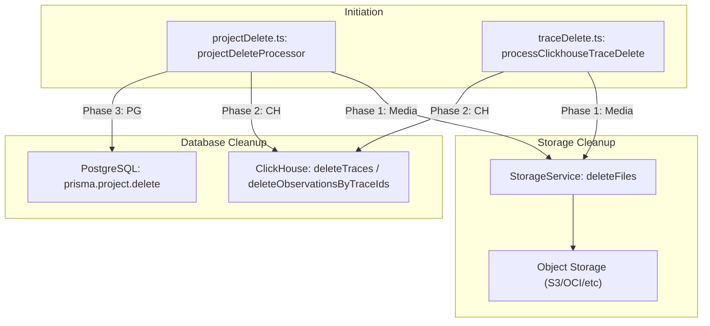
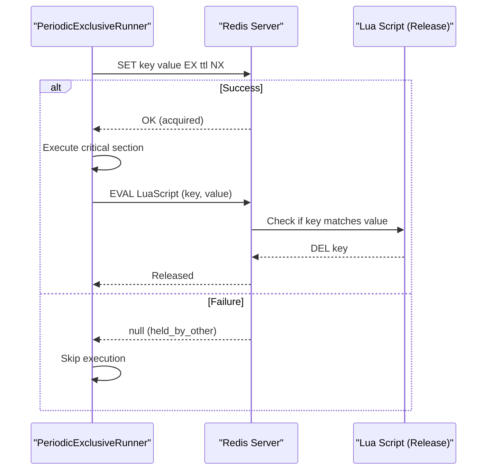

# Background Services

<details>
<summary>Relevant source files</summary>

The following files were used as context for generating this wiki page:

- [packages/shared/src/server/data-deletion/ingestionFileDeletion.ts](packages/shared/src/server/data-deletion/ingestionFileDeletion.ts)
- [packages/shared/src/server/repositories/blobStorageLog.ts](packages/shared/src/server/repositories/blobStorageLog.ts)
- [packages/shared/src/utils/math.ts](packages/shared/src/utils/math.ts)
- [web/src/__e2e__/api.servertest.ts](web/src/__e2e__/api.servertest.ts)
- [web/src/__e2e__/otel-tenant-isolation.servertest.ts](web/src/__e2e__/otel-tenant-isolation.servertest.ts)
- [web/src/features/comments/validateCommentReferenceObject.ts](web/src/features/comments/validateCommentReferenceObject.ts)
- [web/src/server/api/routers/comments.ts](web/src/server/api/routers/comments.ts)
- [worker/src/__tests__/batchDataRetentionCleaner.test.ts](worker/src/__tests__/batchDataRetentionCleaner.test.ts)
- [worker/src/__tests__/batchProjectCleaner.test.ts](worker/src/__tests__/batchProjectCleaner.test.ts)
- [worker/src/__tests__/dataRetentionProcessing.test.ts](worker/src/__tests__/dataRetentionProcessing.test.ts)
- [worker/src/__tests__/inMemoryFilterService.test.ts](worker/src/__tests__/inMemoryFilterService.test.ts)
- [worker/src/__tests__/mediaRetentionCleaner.test.ts](worker/src/__tests__/mediaRetentionCleaner.test.ts)
- [worker/src/__tests__/projectDeletionProcessing.test.ts](worker/src/__tests__/projectDeletionProcessing.test.ts)
- [worker/src/__tests__/scoreDeletion.test.ts](worker/src/__tests__/scoreDeletion.test.ts)
- [worker/src/__tests__/traceDeletion.test.ts](worker/src/__tests__/traceDeletion.test.ts)
- [worker/src/backgroundMigrations/IBackgroundMigration.ts](worker/src/backgroundMigrations/IBackgroundMigration.ts)
- [worker/src/backgroundMigrations/addGenerationsCostBackfill.ts](worker/src/backgroundMigrations/addGenerationsCostBackfill.ts)
- [worker/src/backgroundMigrations/migrateObservationsFromPostgresToClickhouse.ts](worker/src/backgroundMigrations/migrateObservationsFromPostgresToClickhouse.ts)
- [worker/src/backgroundMigrations/migrateScoresFromPostgresToClickhouse.ts](worker/src/backgroundMigrations/migrateScoresFromPostgresToClickhouse.ts)
- [worker/src/backgroundMigrations/migrateTracesFromPostgresToClickhouse.ts](worker/src/backgroundMigrations/migrateTracesFromPostgresToClickhouse.ts)
- [worker/src/ee/cloudUsageMetering/constants.ts](worker/src/ee/cloudUsageMetering/constants.ts)
- [worker/src/ee/dataRetention/handleDataRetentionProcessingJob.ts](worker/src/ee/dataRetention/handleDataRetentionProcessingJob.ts)
- [worker/src/features/batch-data-retention-cleaner/index.ts](worker/src/features/batch-data-retention-cleaner/index.ts)
- [worker/src/features/batch-project-cleaner/index.ts](worker/src/features/batch-project-cleaner/index.ts)
- [worker/src/features/media-retention-cleaner/index.ts](worker/src/features/media-retention-cleaner/index.ts)
- [worker/src/features/scores/processClickhouseScoreDelete.ts](worker/src/features/scores/processClickhouseScoreDelete.ts)
- [worker/src/features/traces/processClickhouseTraceDelete.ts](worker/src/features/traces/processClickhouseTraceDelete.ts)
- [worker/src/queues/projectDelete.ts](worker/src/queues/projectDelete.ts)
- [worker/src/utils/RedisLock.ts](worker/src/utils/RedisLock.ts)

</details>


This page documents the background services that start alongside the worker process at application startup. These are long-running, in-process loops and one-time initializations that run independently of the BullMQ queue system. They operate continuously on timers or as one-shot initialization routines.

For **scheduled and repeating BullMQ jobs** (such as the `CloudUsageMeteringJob`), see [7.6 Scheduled Jobs](). For the queue workers themselves, see [7.1 Queue Architecture]() and [7.2 Worker Manager](). For background database migrations specifically, see [11.5 Database Migrations]().

---

## Startup Sequence

All background services are started from `worker/src/app.ts` immediately after the Express app is configured and before queue workers are registered. Each service starts unconditionally or behind a feature flag.

**Figure: Worker Startup — Background Service Initialization**

```mermaid
flowchart TD
    AppStart["worker/src/app.ts: startup"]

    AppStart --> BMM["BackgroundMigrationManager.run()"]
    AppStart --> CRSC["ClickhouseReadSkipCache.getInstance(prisma).initialize()"]
    AppStart --> QW["Queue workers registered (WorkerManager)"]
    AppStart --> BPC["BatchProjectCleaner.start() (per table)"]
    AppStart --> BDRC["BatchDataRetentionCleaner.start() (per table)"]
    AppStart --> MRC["MediaRetentionCleaner.start()"]
    AppStart --> BTDC["BatchTraceDeletionCleaner.start()"]
    AppStart --> QMR["QueueMetricsRunner.start()"]

    BMM -.->|"LANGFUSE_ENABLE_BACKGROUND_MIGRATIONS=true"| BMMRun["Runs migrations non-blocking"]
    BPC -.->|"QUEUE_CONSUMER_PROJECT_DELETE_QUEUE_IS_ENABLED=true"| BPCRun["Polling loop per ClickHouse table"]
    BDRC -.->|"LANGFUSE_BATCH_DATA_RETENTION_CLEANER_ENABLED=true"| BDRCRun["Polling loop per ClickHouse table"]
    MRC -.->|"LANGFUSE_BATCH_DATA_RETENTION_CLEANER_ENABLED=true"| MRCRun["S3 + PostgreSQL cleanup loop"]
    BTDC -.->|"LANGFUSE_BATCH_TRACE_DELETION_CLEANER_ENABLED=true"| BTDCRun["Trace deletion supplement loop"]
```



Sources: `[worker/src/app.ts:112-124]`(), `[worker/src/app.ts:584-636]`()

---

## Background Migration System

### Purpose

The background migration system allows for large-scale data moves or schema updates (particularly between PostgreSQL and ClickHouse) without blocking application startup or queue processing. It is managed by `BackgroundMigrationManager` and controlled by the `LANGFUSE_ENABLE_BACKGROUND_MIGRATIONS` environment variable.

### Implementation

Migrations implement the `IBackgroundMigration` interface, which defines methods for validation, execution, and abortion.

**Figure: Background Migration Entity Mapping**

```mermaid
flowchart LR
    subgraph "Code Entity Space"
        Interface["IBackgroundMigration"]
        Manager["BackgroundMigrationManager"]
        ObsMig["MigrateObservationsFromPostgresToClickhouse"]
        ScoreMig["MigrateScoresFromPostgresToClickhouse"]
        TraceMig["MigrateTracesFromPostgresToClickhouse"]
        CostMig["AddGenerationsCostBackfill"]
    end

    subgraph "Data Space"
        PG_Table[("PostgreSQL: background_migration")]
        CH_Table[("ClickHouse Tables")]
    end

    Interface <|-- ObsMig
    Interface <|-- ScoreMig
    Interface <|-- TraceMig
    Interface <|-- CostMig

    Manager --> ObsMig
    ObsMig --> PG_Table : "updates 'state' JSON"
    ObsMig --> CH_Table : "INSERT INTO observations"
    ScoreMig --> PG_Table : "persists 'maxDate'"
    ScoreMig --> CH_Table : "INSERT INTO scores"
```

Sources: `[worker/src/backgroundMigrations/IBackgroundMigration.ts:1-8]`(), `[worker/src/backgroundMigrations/migrateObservationsFromPostgresToClickhouse.ts:14-16]`(), `[worker/src/backgroundMigrations/migrateScoresFromPostgresToClickhouse.ts:14-16]`(), `[worker/src/backgroundMigrations/migrateTracesFromPostgresToClickhouse.ts:14-16]`(), `[worker/src/backgroundMigrations/addGenerationsCostBackfill.ts:50-51]`()

### Key Migration Patterns

1.  **State Persistence**: Migrations store their progress in the `background_migration` table's `state` column. For example, `MigrateObservationsFromPostgresToClickhouse` uses `updateMaxDate` to store the timestamp of the last processed record, allowing resume-on-restart `[worker/src/backgroundMigrations/migrateObservationsFromPostgresToClickhouse.ts:18-38]`().
2.  **Batching**: Records are fetched in batches (defaulting to 1000) using `Prisma.sql` raw queries to optimize performance and memory usage `[worker/src/backgroundMigrations/migrateScoresFromPostgresToClickhouse.ts:100-108]`().
3.  **Validation**: Before running, migrations verify prerequisites. `MigrateScoresFromPostgresToClickhouse` checks for ClickHouse credentials and the existence of the destination table `[worker/src/backgroundMigrations/migrateScoresFromPostgresToClickhouse.ts:18-59]`().
4.  **Cost Backfilling**: `AddGenerationsCostBackfill` performs complex calculations in PostgreSQL to update `calculated_input_cost` and `calculated_output_cost` based on model prices and token counts `[worker/src/backgroundMigrations/addGenerationsCostBackfill.ts:121-151]`().

---

## ClickhouseReadSkipCache

### Purpose

`ClickhouseReadSkipCache` is an optimization for the ingestion pipeline. During event ingestion, the system normally reads from ClickHouse to merge updates. For newer projects where data is exclusively handled via the S3-staging path, these reads are unnecessary. This cache tracks which project IDs can safely skip the read operation.

### Configuration

The cache is initialized at startup in `worker/src/app.ts` and considers:
-   **Static IDs**: Provided via `LANGFUSE_SKIP_INGESTION_CLICKHOUSE_READ_PROJECT_IDS` `[worker/src/env.ts:150]`().
-   **Creation Date**: Projects created after the date in `LANGFUSE_SKIP_INGESTION_CLICKHOUSE_READ_MIN_PROJECT_CREATE_DATE` `[worker/src/env.ts:153]`().

Sources: `[worker/src/app.ts:119-124]`(), `[worker/src/env.ts:150-155]`()

---

## Batch Cleaner Services

Langfuse employs several "cleaner" services that inherit from `PeriodicExclusiveRunner`. These services use a `RedisLock` to ensure that only one worker instance processes a specific cleanup task at a time.

### MediaRetentionCleaner

Handles the deletion of media files (S3/PostgreSQL) and blob storage entries based on per-project `retention_days`.

-   **Workflow**:
    1.  Queries PostgreSQL to find the project with the most expired media via `getTopProjectWorkload` `[worker/src/features/media-retention-cleaner/index.ts:116-155]`().
    2.  Calculates a `cutoffDate` using `getRetentionCutoffDate` `[worker/src/features/media-retention-cleaner/index.ts:152]`().
    3.  Deletes files from S3 and removes PostgreSQL metadata via `deleteMediaFiles` `[worker/src/features/media-retention-cleaner/index.ts:177-209]`().
    4.  Cleans up blob storage if `LANGFUSE_ENABLE_BLOB_STORAGE_FILE_LOG` is enabled by calling `removeIngestionEventsFromS3AndDeleteClickhouseRefsForProject` `[worker/src/features/media-retention-cleaner/index.ts:164-169]`().

### BatchDataRetentionCleaner

Bulk deletes expired data from ClickHouse tables (`traces`, `observations`, `scores`, `events_full`, `events_core`).

-   **Implementation**:
    -   It uses hashed project IDs (`toParamKey`) in ClickHouse queries to prevent index mismatch bugs and handle `OR` conditions efficiently `[worker/src/features/batch-data-retention-cleaner/index.ts:53-96]`().
    -   It targets specific timestamp columns per table (e.g., `start_time` for `observations`, `timestamp` for `traces`) defined in `TIMESTAMP_COLUMN_MAP` `[worker/src/features/batch-data-retention-cleaner/index.ts:34-40]`().

### BatchProjectCleaner

Handles data deletion for projects that have been soft-deleted (where `deleted_at` is set in PostgreSQL).

-   **Workflow**:
    1.  Fetches deleted projects from PostgreSQL via `getDeletedProjects`.
    2.  Checks ClickHouse for existing counts to determine if work is needed.
    3.  Executes a `DELETE` command in ClickHouse under a distributed lock.

Sources: `[worker/src/app.ts:83-93]`(), `[worker/src/features/batch-project-cleaner/index.ts:25-30]`()

---

## Data Deletion Logic

When a project or specific traces are deleted, background logic ensures that associated data in ClickHouse and object storage (S3/Azure/GCS/OCI) is also purged.

**Figure: Data Deletion Flow**



Sources: `[worker/src/queues/projectDelete.ts:21-72]`(), `[worker/src/features/traces/processClickhouseTraceDelete.ts:121-154]`(), `[packages/shared/src/server/services/StorageService.ts:120-120]`()

### Trace and Project Deletion Details
- **Project Deletion**: The `projectDeleteProcessor` first deletes media from S3, then clears ClickHouse tables (`traces`, `observations`, `scores`, `events`), and finally deletes the project record from PostgreSQL `[worker/src/queues/projectDelete.ts:41-99]`().
- **Trace Deletion**: `processClickhouseTraceDelete` handles cleaning up media items referenced by specific traces (and orphaned media) before purging records from ClickHouse `[worker/src/features/traces/processClickhouseTraceDelete.ts:15-119]`().
- **Data Retention**: The `handleDataRetentionProcessingJob` re-fetches the current retention setting from the DB to prevent stale jobs from over-deleting data `[worker/src/ee/dataRetention/handleDataRetentionProcessingJob.ts:26-39]`().

---

## Redis Distributed Locking

The `RedisLock` class provides the coordination mechanism for background services.

**Figure: RedisLock Acquisition Flow**



Sources: `[worker/src/utils/RedisLock.ts:54-60]`(), `[worker/src/utils/RedisLock.ts:117-152]`()

### Locking Behaviors

-   **Unique Ownership**: Each lock attempt uses a `randomUUID` as the value to ensure a worker only releases a lock it actually owns `[worker/src/utils/RedisLock.ts:77]`().
-   **Atomic Release**: Uses a Lua script to check the value before deleting, preventing race conditions where a worker might delete a lock that has already expired and been re-acquired by another instance `[worker/src/utils/RedisLock.ts:54-60]`().
-   **Unavailable Behavior**: Configurable via `OnUnavailableBehavior` to either `proceed` (optimistic) or `fail` (pessimistic) if Redis is down `[worker/src/utils/RedisLock.ts:7-11]`().

---

## Summary Table

| Service | Class | Purpose | Data Store |
| :--- | :--- | :--- | :--- |
| **Migration** | `BackgroundMigrationManager` | Resumable data moves | PG & ClickHouse |
| **Read Cache** | `ClickhouseReadSkipCache` | Ingestion performance | In-memory |
| **Media Cleanup** | `MediaRetentionCleaner` | Retention enforcement | S3 & PG |
| **Batch Retention** | `BatchDataRetentionCleaner` | Bulk row expiry | ClickHouse |
| **Project Cleanup** | `BatchProjectCleaner` | Soft-delete cleanup | ClickHouse |

Sources: `[worker/src/app.ts:109-636]`(), `[worker/src/features/batch-data-retention-cleaner/index.ts:18-24]`()
